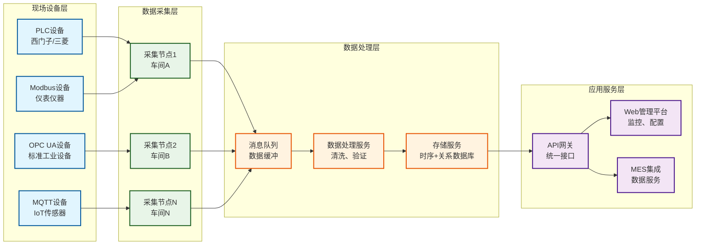
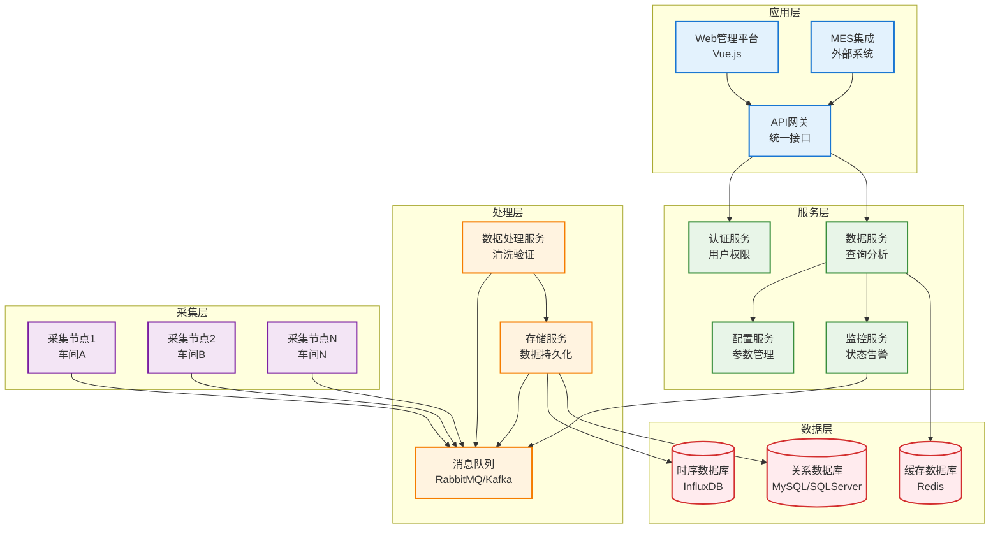
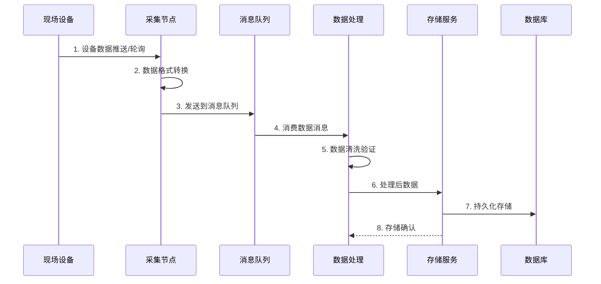
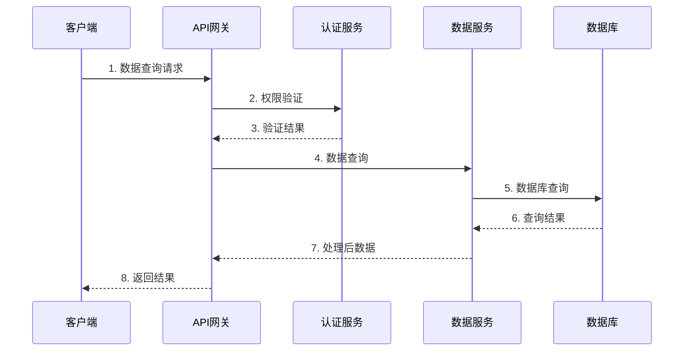
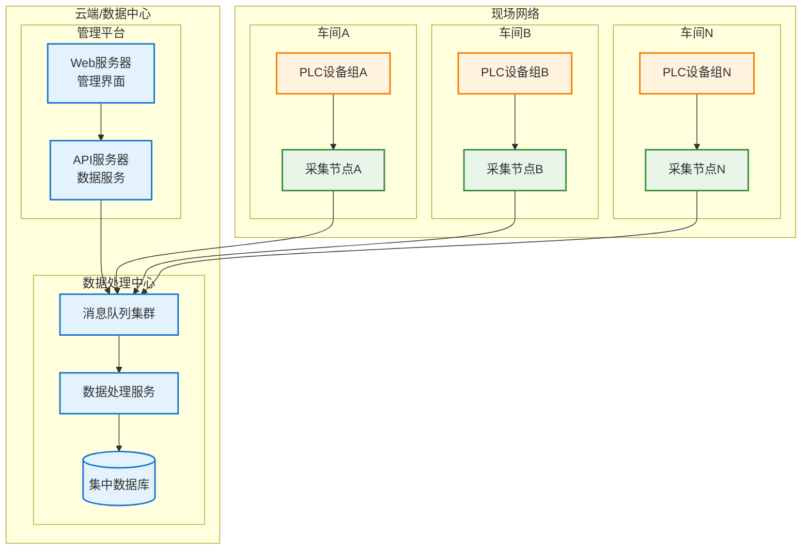
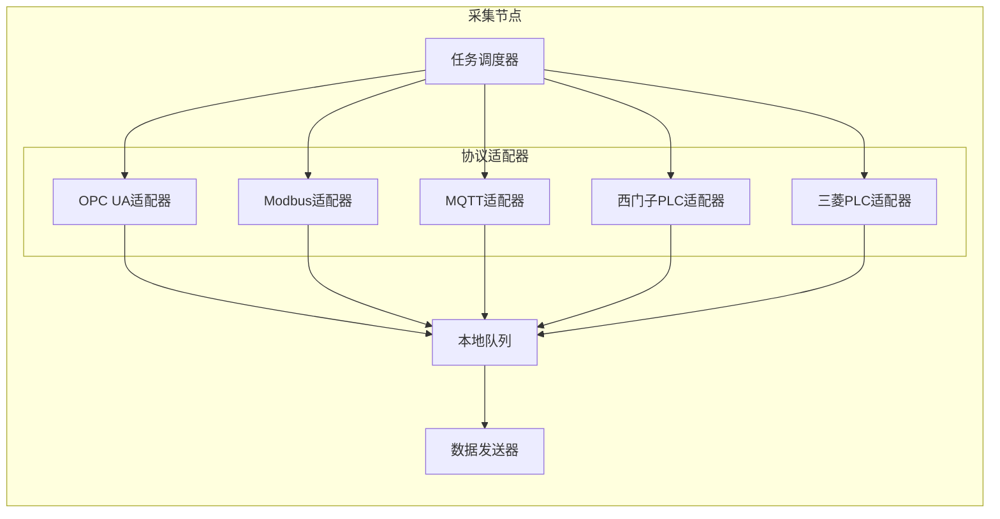
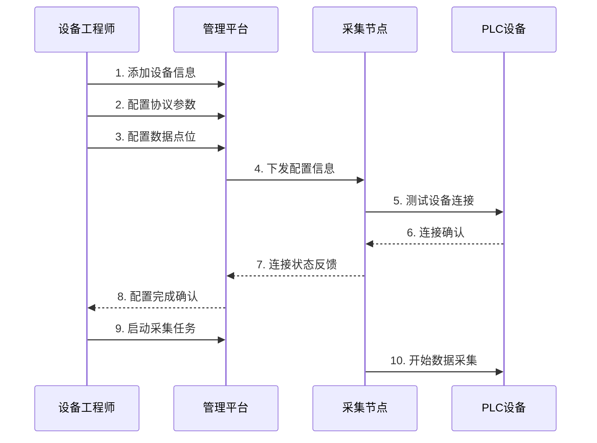
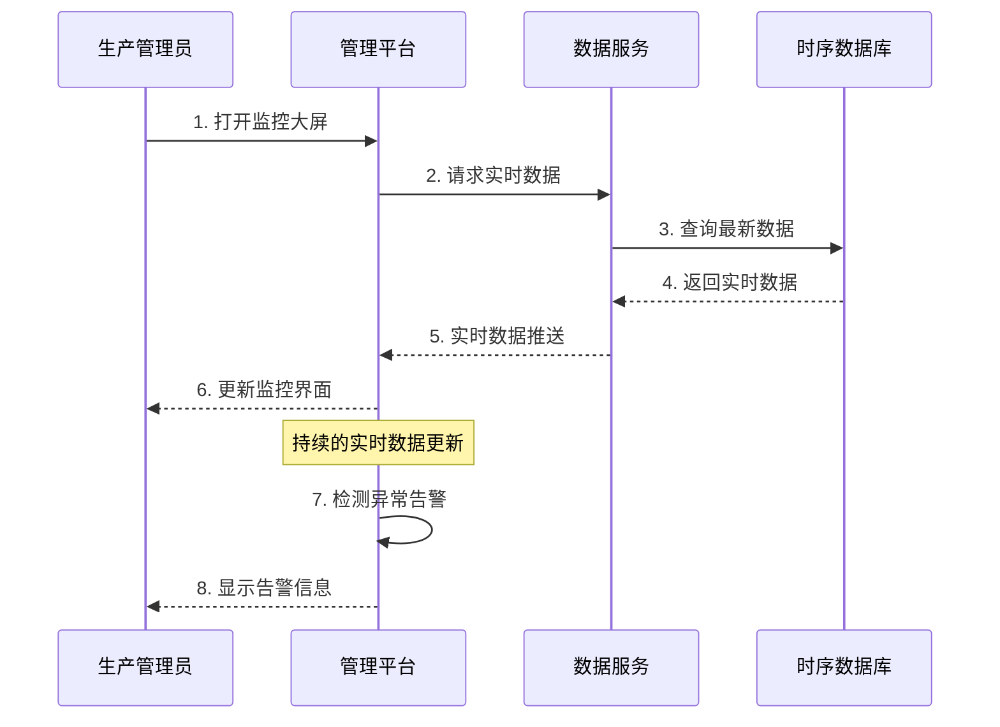
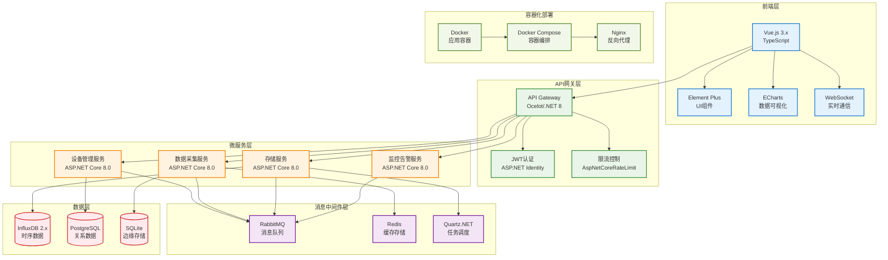
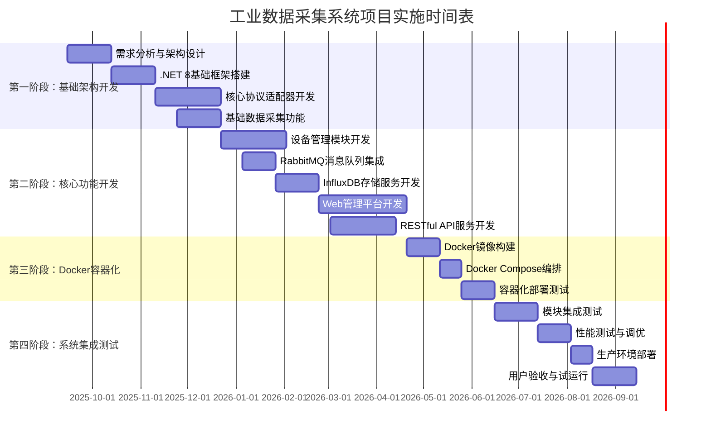

# PRD_工业数据采集系统产品需求文档

**项目名称**: 工业数据采集通用后台系统  
**文档版本**: v1.3  
**创建日期**: 2025-08-28  
**最后更新**: 2025-12-27  
**文档作者**: eatbs0956  

---

## 目录

1. [项目概述](#1-项目概述)
2. [业务需求分析](#2-业务需求分析)
3. [系统架构说明](#3-系统架构说明)
4. [用户需求分析](#4-用户需求分析)
5. [功能需求规格](#5-功能需求规格)
6. [技术方案](#6-技术方案)
7. [项目实施规划](#7-项目实施规划)

---

## 1. 项目概述

### 1.1 项目背景

工业数据采集通用后台系统是面向制造业数字化转型的核心基础设施，旨在解决现场设备数据采集的统一接入、实时处理和标准化服务问题。

当前制造业现场设备数据采集面临协议多样化、数据孤岛、实时性要求高、系统集成复杂等挑战。本系统通过提供统一的数据采集平台和标准化的API服务，实现设备数据的集中管理和高效利用。

### 1.2 项目目标

**核心目标**：
- **建设统一数据采集平台**：支持主流工业协议的即插即用式接入
- **实现分布式数据采集**：适应不同车间、产线的灵活部署需求
- **提供实时数据服务**：秒级数据采集，支持实时监控和历史分析
- **标准化外部集成**：为MES等上层系统提供标准化API接口

**业务价值**：
- **降低集成成本**：统一的协议适配器减少重复开发工作
- **提升数据质量**：集中化的数据验证和质量监控机制
- **增强决策能力**：实时、准确的数据支撑生产管理决策
- **简化运维管理**：可视化的设备状态监控和故障诊断

### 1.3 项目范围

**功能范围：**
- 多协议设备接入和数据采集
- 分布式采集节点管理
- 实时数据处理和存储
- 设备状态监控和告警
- 历史数据查询和分析
- 用户权限管理和系统配置
- 外部系统API集成

**技术范围：**
- 分布式数据采集服务开发（.NET Core）
- Web管理平台开发（Vue.js + .NET Core）
- 时序数据库和关系数据库集成
- 工业协议驱动开发
- API服务和MES系统集成

**不包含范围：**
- 复杂的数据预处理和计算功能
- 自动化运维和部署功能
- 多租户SaaS平台支持
- 移动端应用开发

### 1.4 术语定义

#### 业务术语
- **数据采集节点**：部署在现场的数据采集服务实例
- **设备连接器**：特定协议的设备连接和数据采集组件
- **数据点位**：设备上的具体数据监测点（如温度、压力、状态等）
- **采集任务**：针对特定设备或设备组的数据采集配置
- **实时数据**：当前最新的设备状态数据
- **历史数据**：按时间序列存储的设备历史状态数据

#### 技术术语
- **协议适配器**：实现特定工业协议的软件组件
- **时序数据库**：专门存储时间序列数据的数据库系统
- **API网关**：统一的外部接口访问入口
- **消息队列**：用于异步数据传输的中间件
- **服务注册发现**：微服务架构中的服务管理机制

---

## 2. 业务需求分析

### 2.1 业务现状分析

#### 2.1.1 制造业数据采集痛点

**协议碎片化**：
- 不同厂商设备支持不同的通信协议
- 缺乏统一的数据接入标准
- 协议版本和实现差异导致兼容性问题

**数据孤岛问题**：
- 各设备数据分散在不同系统中
- 数据格式不统一，难以进行横向分析
- 缺乏统一的数据质量管理

**实时性挑战**：
- 生产过程需要秒级的数据响应
- 传统轮询方式效率低下
- 网络延迟和设备响应时间不稳定

**运维复杂性**：
- 设备连接状态难以统一监控
- 故障诊断依赖人工排查
- 缺乏自动化的数据质量检测

#### 2.1.2 用户痛点分析

**现场工程师痛点**：
- 需要掌握多种协议的连接方式
- 设备故障排查时间长，影响生产
- 缺乏统一的设备状态监控工具

**生产管理者痛点**：
- 无法实时了解全产线设备状态
- 生产数据分析依赖人工汇总
- 缺乏数据驱动的决策支持工具

**IT管理员痛点**：
- 系统集成工作量大，重复开发多
- 数据安全和访问控制难以统一管理
- 系统维护和升级复杂度高

### 2.2 目标业务流程

数据采集系统投入使用后，将实现设备数据的统一采集、处理和服务。

**整体业务流程图**：



#### 2.2.1 数据采集流程

**设备连接阶段**：
1. **自动发现**：采集节点自动扫描网络中的设备
2. **协议识别**：根据设备信息选择合适的协议适配器
3. **连接建立**：建立稳定的设备通信连接

**数据采集阶段**：
1. **实时采集**：按配置的采集频率获取设备数据
2. **数据验证**：检查数据格式和有效性
3. **队列缓存**：将数据放入消息队列进行缓冲

**数据处理阶段**：
1. **数据清洗**：过滤异常数据，标准化数据格式
2. **质量检测**：检测数据完整性和连续性
3. **存储分发**：根据数据类型存储到相应数据库

#### 2.2.2 监控和管理

**实时监控**：
- 设备连接状态实时监控
- 数据采集量和质量指标监控
- 系统性能和资源使用监控

**告警管理**：
- 设备离线告警
- 数据异常告警
- 系统故障告警

**配置管理**：
- 设备连接参数配置
- 采集任务配置和调度
- 用户权限和系统参数配置

### 2.3 核心功能需求

#### 2.3.1 设备接入功能

**多协议支持**：
- OPC UA客户端连接，支持订阅和轮询模式
- Modbus TCP/RTU协议支持，兼容标准和扩展功能码
- MQTT发布/订阅，支持QoS和断线重连
- 三菱PLC专用协议（MC协议）
- 西门子PLC专用协议（S7协议）
- NB-IoT窄带物联网协议，支持低功耗长距离通信
- LoRa/LoRaWAN协议，支持远程低功耗设备接入
- Cat.1物联网协议，支持中等带宽移动物联网通信
- 卫星物联网协议，支持偏远地区设备覆盖
- TSN时间敏感网络，支持工业确定性通信

**设备管理**：
- 设备信息管理（IP地址、端口、协议类型、连接参数）
- 设备分组和标签管理
- 设备状态监控和连接测试

#### 2.3.2 数据采集功能

**采集任务管理**：
- 采集任务的创建、编辑、删除
- 采集频率和数据点位配置
- 任务启停和状态监控

**数据处理**：
- 实时数据缓存和批量写入
- 数据格式标准化和类型转换
- 异常数据检测和处理策略

#### 2.3.3 数据存储功能

**时序数据存储**：
- 高效的时间序列数据写入和查询
- 数据压缩和生命周期管理
- 支持InfluxDB、TimescaleDB等时序数据库

**关系数据存储**：
- 设备信息、用户权限等关系数据管理
- 支持PostgreSQL、MySQL、SQLite等关系数据库
- 数据备份和恢复策略

#### 2.3.4 系统管理功能

**用户权限管理**：
- 多角色用户管理（系统管理员、设备工程师、操作员、只读用户）
- 基于角色的功能权限控制
- API访问权限和安全认证

**系统配置**：
- 采集节点管理和配置分发
- 系统参数配置和环境变量管理
- 日志级别和监控阈值配置

#### 2.3.5 API服务功能

**RESTful API**：
- 设备数据查询API（实时数据、历史数据）
- 设备状态查询API
- 数据统计和分析API

**实时推送**：
- WebSocket实时数据推送
- 设备状态变化通知
- 告警信息实时推送

**MES集成**：
- 标准化的数据接口
- 设备OEE数据计算和提供
- 生产数据同步接口

---

## 3. 系统架构说明

### 3.1 整体架构设计

工业数据采集系统采用**分布式微服务架构**，分为采集层、处理层、服务层和应用层。



### 3.2 数据流转架构

**数据采集流**：



**数据查询流**：



### 3.3 部署架构设计

**分布式部署架构**：



**部署说明**：
- **采集节点**：部署在现场网络，就近采集设备数据
- **处理中心**：可部署在云端或本地数据中心，统一处理和存储数据
- **管理平台**：支持云端部署，提供远程访问能力
- **网络要求**：采集节点与处理中心之间需要稳定的网络连接

### 3.4 技术组件架构

#### 3.4.1 采集节点架构



#### 3.4.2 协议适配器接口

**统一适配器接口**：
```csharp
public interface IProtocolAdapter
{
    Task<bool> ConnectAsync(DeviceConfig config);
    Task<bool> DisconnectAsync();
    Task<Dictionary<string, object>> ReadDataAsync(List<DataPoint> points);
    Task<bool> WriteDataAsync(string pointName, object value);
    event EventHandler<DataChangedEventArgs> DataChanged;
    ConnectionStatus Status { get; }
}
```

---

## 4. 用户需求分析

### 4.1 用户角色定义

#### 4.1.1 系统管理员

**角色描述**：负责系统整体管理和维护的技术人员

**主要职责**：
- 用户权限管理和角色配置
- 系统参数配置和环境管理
- 数据备份和系统监控
- 故障诊断和性能优化

**系统使用频率**：日常使用，负责系统运维

#### 4.1.2 设备工程师

**角色描述**：负责设备连接配置和数据采集管理的技术人员

**主要职责**：
- 设备连接配置和协议参数设置
- 数据点位配置和采集任务管理
- 设备状态监控和故障排查
- 数据质量分析和优化

**系统使用频率**：频繁使用，是系统的主要用户

#### 4.1.3 生产管理员

**角色描述**：负责生产监控和数据分析的管理人员

**主要职责**：
- 实时生产数据监控
- 历史数据查询和分析
- 生产报表查看和导出
- 异常情况处理和决策

**系统使用频率**：定期使用，主要用于监控和分析

#### 4.1.4 操作员

**角色描述**：现场操作人员和数据查看用户

**主要职责**：
- 查看实时设备状态
- 接收设备告警信息
- 基础的数据查询操作

**系统使用频率**：按需使用，主要用于状态查看

### 4.2 典型使用场景

#### 4.2.1 设备接入配置场景

**场景描述**：设备工程师配置新设备的数据采集



**用户操作流程**：
1. 登录管理平台，进入设备管理模块
2. 添加新设备，填写基本信息（IP、协议类型等）
3. 配置协议特定参数（站号、寄存器地址等）
4. 定义数据点位和采集频率
5. 测试设备连接，确认通信正常
6. 启动采集任务，开始实时数据采集

#### 4.2.2 实时监控场景

**场景描述**：生产管理员监控设备实时状态



#### 4.2.3 历史数据分析场景

**场景描述**：工程师分析设备历史运行数据

**用户操作流程**：
1. 登录系统，进入数据分析模块
2. 选择要分析的设备和时间范围
3. 选择关注的数据点位
4. 查看数据趋势图表和统计信息
5. 导出分析报告和原始数据

### 4.3 核心用户需求

#### 4.3.1 易用性需求

**界面友好**：
- 直观的设备状态展示（绿色正常、红色故障、黄色警告）
- 简化的设备配置流程，支持模板和批量配置
- 清晰的数据图表和趋势分析

**操作便捷**：
- 一键设备连接测试和状态检查
- 快速的数据点位搜索和过滤
- 便捷的告警确认和处理流程

#### 4.3.2 可靠性需求

**数据准确性**：
- 99.9%的数据采集成功率
- 完整的数据校验和错误检测机制
- 可靠的数据传输和存储保证

**系统稳定性**：
- 7×24小时稳定运行
- 设备离线自动重连机制
- 服务故障自动恢复能力

#### 4.3.3 性能需求

**实时性能**：
- 秒级数据采集和响应
- 毫秒级的数据查询响应
- 支持数百个并发用户访问

**扩展性能**：
- 支持数千个数据点位的并发采集
- 支持多个采集节点的横向扩展
- 支持TB级历史数据的高效存储和查询

---

## 5. 功能需求规格

### 5.1 设备管理模块

#### 5.1.1 设备信息管理

**设备基础信息**：
- 设备名称、编号、描述信息
- 设备类型、厂商、型号信息
- 网络连接信息（IP地址、端口号）
- 协议类型和版本信息

**设备分组管理**：
- 按车间、产线、设备类型进行分组
- 支持多级分组和标签管理
- 分组权限控制和访问限制

**设备状态监控**：
- 实时连接状态显示（在线/离线/故障）
- 设备性能指标监控（响应时间、数据质量）
- 设备历史状态记录和统计

#### 5.1.2 协议配置管理

> **说明**：协议配置作为设备管理表单的组成部分，在添加/编辑设备时，根据所选协议类型动态显示对应的配置字段。系统不设置独立的"协议管理"页面，协议参数配置完全集成在设备表单中。

**通用连接配置**（所有协议共用）：
- 连接超时时间设置
- 重连间隔和重试次数
- 心跳检测间隔

**OPC UA协议配置**：
- 服务器终结点URL配置
- 安全策略（None/Basic128Rsa15/Basic256/Basic256Sha256）
- 安全模式（None/Sign/SignAndEncrypt）
- 用户认证方式（Anonymous/UserName/Certificate）
- 订阅参数和采样间隔设置

**Modbus TCP协议配置**：
- 从站地址（Unit ID: 1-247）
- 功能码设置
- 寄存器起始地址和数量

**Modbus RTU协议配置**：
- 从站地址（Slave ID: 1-247）
- 串口参数（波特率、数据位、停止位、校验位）
- 帧间隔时间

**西门子S7协议配置**：
- CPU类型（S7-200/300/400/1200/1500）
- 机架号（Rack: 0-7）
- 槽号（Slot: 0-31）
- 本地TSAP和远程TSAP

**三菱MC协议配置**：
- 网络号和站号
- CPU类型（Q/L/iQ-R系列）
- 通信格式（ASCII/Binary）

**BACnet协议配置**：
- 设备实例ID
- 网络号
- MAC地址

**其他/自定义协议配置**：
- 自定义JSON参数配置
- 扩展配置字段

#### 5.1.3 数据点位管理

**点位基础信息**：
- 点位名称、地址、数据类型
- 读写权限和访问频率
- 工程单位和数值范围

**点位组织管理**：
- 按功能模块组织点位
- 支持点位模板和批量导入
- 点位标签和描述信息管理

### 5.2 数据采集模块

#### 5.2.1 采集任务管理

**任务配置**：
- 采集频率和触发条件设置
- 数据点位选择和优先级配置
- 异常处理策略和重试机制

**任务调度**：
- 任务启停和暂停功能
- 定时任务和事件触发任务
- 任务执行状态和进度监控

**任务监控**：
- 实时采集量和成功率统计
- 任务执行日志和错误记录
- 性能指标和资源使用监控

#### 5.2.2 实时数据处理

**数据验证**：
- 数据格式和类型验证
- 数值范围和合理性检查
- 重复数据和异常值过滤

**数据转换**：
- 数据类型转换和格式标准化
- 工程单位换算和标度变换
- 时间戳标准化和同步

#### 5.2.3 数据质量管理

**质量指标**：
- 数据完整性和及时性监控
- 采集成功率和错误率统计
- 数据连续性和一致性检查

**质量告警**：
- 数据缺失和延迟告警
- 数据异常和质量下降告警
- 设备通信故障告警

### 5.3 数据存储模块

#### 5.3.1 时序数据存储

**数据写入**：
- 高性能批量数据写入
- 数据压缩和优化存储
- 写入确认和状态反馈

**数据查询**：
- 按时间范围和设备筛选查询
- 聚合函数和统计计算
- 分页查询和结果导出

**数据管理**：
- 数据生命周期管理和自动清理
- 数据备份和恢复策略
- 存储空间监控和告警

#### 5.3.2 关系数据管理

**配置数据**：
- 设备信息和连接配置
- 用户权限和系统配置
- 数据字典和元数据管理

**业务数据**：
- 告警记录和处理历史
- 操作日志和审计记录
- 报表模板和配置信息

### 5.4 监控告警模块

#### 5.4.1 实时监控功能

**设备状态监控**：
- 设备连接状态实时显示
- 通信质量和响应时间监控
- 设备故障和异常状态告警

**数据监控**：
- 实时数据值显示和趋势图
- 数据异常和越限告警
- 数据质量指标监控

**系统监控**：
- 采集节点状态和性能监控
- 系统资源使用情况监控
- 服务健康状态检查

#### 5.4.2 告警管理功能

**告警配置**：
- 告警规则和阈值设置
- 告警级别和优先级定义
- 告警通知方式配置

**告警处理**：
- 实时告警显示和声音提示
- 告警确认和处理记录
- 告警统计和分析报告

#### 5.4.3 报表分析功能

**实时报表**：
- 设备状态汇总报表
- 数据采集统计报表
- 系统性能监控报表

**历史报表**：
- 设备运行时间统计
- 数据质量分析报表
- 故障统计和趋势分析

### 5.5 系统管理模块

#### 5.5.1 用户权限管理

**用户管理**：
- 用户账号创建、编辑、删除
- 用户基本信息和联系方式
- 用户状态管理和密码策略

**角色权限**：
- 角色定义和权限分配
- 功能权限和数据权限控制
- 权限继承和委托机制

#### 5.5.2 系统配置管理

**采集节点配置**：
- 节点注册和状态管理
- 配置信息同步和更新
- 节点性能参数调优

**系统参数配置**：
- 数据库连接和存储配置
- 消息队列和缓存配置
- 日志级别和监控阈值

#### 5.5.3 API服务管理

**接口管理**：
- API接口文档和测试工具
- 接口访问权限和限流控制
- 接口调用统计和性能监控

**外部集成**：
- MES系统接口配置
- 第三方系统认证和授权
- 数据同步和接口调用管理

---

## 6. 技术方案

### 6.1 技术架构选型

**后端技术栈**：
- **.NET 8.0**：最新LTS版本，性能优异，适合工业环境长期运行（中心服务主架构）
- **.NET Framework 4.5+**：兼容老旧设备（Windows 7/i3 3系/4GB内存），提供基础采集功能
- **ASP.NET Core 8.0**：微服务框架，内置容器支持，生产环境稳定
- **Entity Framework Core 8.0**：ORM框架，支持多种数据库，性能优化
- **Serilog**：结构化日志记录框架，支持多种输出目标
- **Quartz.NET**：企业级任务调度框架，支持集群和持久化
- **SignalR**：实时通信框架，支持WebSocket和长轮询降级

**前端技术栈**：
- **Vue.js 3.x + TypeScript**：现代化前端框架，类型安全
- **Element Plus**：企业级UI组件库，适合工业管理界面
- **ECharts**：专业数据可视化库，支持实时图表
- **Vite**：现代化构建工具，开发体验优秀

**消息队列选型**：
- **RabbitMQ**：
  - 成熟稳定，运维简单，适合工业环境
  - 支持多种消息模式，满足不同场景需求
  - 内置管理界面，故障排查方便
  - 相比Kafka更轻量，资源消耗小
  - 支持消息持久化和高可用部署

**容器化部署**：
- **Docker**：应用容器化，简化部署和环境管理
- **Docker Compose**：多容器编排，适合中小规模部署
- **不采用Kubernetes**：考虑到工业现场运维复杂度，避免过度工程化

**中间件技术**：
- **Redis**：缓存、会话存储和分布式锁
- **Nginx**：反向代理、负载均衡和静态文件服务

**数据库技术**：
- **InfluxDB 2.x**：时序数据库，专为IoT和监控数据设计
- **PostgreSQL 14**：关系数据库，存储配置和业务数据。本系统所有PostgreSQL均指PostgreSQL 14版本。
- **MySQL**：关系数据库，兼容选型
- **SQLite**：边缘节点本地存储，支持离线操作

### 6.2 系统架构技术组件



### 6.3 关键技术实现

#### 6.3.1 协议适配器架构（.NET 8.0实现）

**支持的通信协议**：
- **OPC UA**：标准工业通信协议，支持安全认证和实时订阅
- **Modbus TCP/RTU**：经典现场总线协议，广泛应用于工业设备
- **MQTT**：轻量级消息传输协议，适合IoT设备通信
- **西门子S7**：西门子PLC专用通信协议
- **三菱MC**：三菱PLC专用通信协议  
- **NB-IoT**：窄带物联网协议，支持低功耗长距离通信，适合远程传感器
- **LoRa/LoRaWAN**：长距离低功耗通信协议，适合分布式传感器网络
- **Cat.1物联网**：中等带宽移动物联网，适合需要更高数据传输速率的IoT设备
- **卫星物联网**：极远距离通信，适合偏远地区和海上平台设备接入
- **TSN时间敏感网络**：工业确定性通信，支持实时性要求极高的工业应用

```csharp
// 协议适配器基础接口
public interface IProtocolAdapter
{
    string ProtocolName { get; }
    Task<bool> ConnectAsync(DeviceConfig config, CancellationToken cancellationToken = default);
    Task<bool> DisconnectAsync(CancellationToken cancellationToken = default);
    Task<DataResult> ReadDataAsync(List<DataPoint> points, CancellationToken cancellationToken = default);
    Task<bool> WriteDataAsync(string point, object value, CancellationToken cancellationToken = default);
    event EventHandler<DataChangedEventArgs> DataChanged;
    ConnectionStatus Status { get; }
    TimeSpan LastResponseTime { get; }
}

// OPC UA适配器实现示例（使用最新OPC UA库）
public class OpcUaAdapter : IProtocolAdapter, IDisposable
{
    private readonly UaClient _client;
    private readonly ILogger<OpcUaAdapter> _logger;
    private readonly SemaphoreSlim _connectionSemaphore = new(1, 1);
    
    public string ProtocolName => "OPC UA";
    public ConnectionStatus Status { get; private set; } = ConnectionStatus.Disconnected;
    public TimeSpan LastResponseTime { get; private set; }
    
    public async Task<bool> ConnectAsync(DeviceConfig config, CancellationToken cancellationToken = default)
    {
        await _connectionSemaphore.WaitAsync(cancellationToken);
        try
        {
            var stopwatch = Stopwatch.StartNew();
            var endpointUrl = $"opc.tcp://{config.IpAddress}:{config.Port}";
            
            var applicationConfig = new ApplicationConfiguration
            {
                ApplicationName = "Industrial Data Collector",
                ApplicationType = ApplicationType.Client,
                SecurityConfiguration = new SecurityConfiguration
                {
                    ApplicationCertificate = new CertificateIdentifier(),
                    AutoAcceptUntrustedCertificates = config.AcceptUntrustedCertificates
                }
            };
            
            await _client.ConnectAsync(endpointUrl, cancellationToken);
            
            Status = _client.Connected ? ConnectionStatus.Connected : ConnectionStatus.Disconnected;
            LastResponseTime = stopwatch.Elapsed;
            
            _logger.LogInformation("OPC UA连接成功，地址：{EndpointUrl}，耗时：{ResponseTime}ms", 
                endpointUrl, LastResponseTime.TotalMilliseconds);
            
            return _client.Connected;
        }
        catch (Exception ex)
        {
            Status = ConnectionStatus.Error;
            _logger.LogError(ex, "OPC UA连接失败，地址：{IpAddress}:{Port}", config.IpAddress, config.Port);
            return false;
        }
        finally
        {
            _connectionSemaphore.Release();
        }
    }
    
    public async Task<DataResult> ReadDataAsync(List<DataPoint> points, CancellationToken cancellationToken = default)
    {
        if (Status != ConnectionStatus.Connected)
            return DataResult.Failed("设备未连接");
            
        try
        {
            var stopwatch = Stopwatch.StartNew();
            var nodesToRead = points.Select(p => new ReadValueId
            {
                NodeId = NodeId.Parse(p.Address),
                AttributeId = Attributes.Value
            }).ToArray();
            
            var response = await _client.ReadAsync(nodesToRead, cancellationToken);
            LastResponseTime = stopwatch.Elapsed;
            
            return ProcessReadResults(response.Results, points);
        }
        catch (Exception ex)
        {
            _logger.LogError(ex, "OPC UA数据读取失败");
            return DataResult.Failed(ex.Message);
        }
    }
    
    private DataResult ProcessReadResults(DataValueCollection results, List<DataPoint> points)
    {
        var data = new Dictionary<string, object>();
        var timestamp = DateTimeOffset.UtcNow;
        
        for (int i = 0; i < results.Count && i < points.Count; i++)
        {
            var result = results[i];
            var point = points[i];
            
            if (StatusCode.IsGood(result.StatusCode))
            {
                data[point.Name] = ConvertValue(result.Value, point.DataType);
            }
            else
            {
                _logger.LogWarning("点位 {PointName} 读取失败，状态码：{StatusCode}", 
                    point.Name, result.StatusCode);
            }
        }
        
        return DataResult.Success(data, timestamp);
    }
    
    public void Dispose()
    {
        _client?.Dispose();
        _connectionSemaphore?.Dispose();
    }
}

// 数据结果封装
public record DataResult
{
    public bool IsSuccess { get; init; }
    public string? ErrorMessage { get; init; }
    public Dictionary<string, object> Data { get; init; } = new();
    public DateTimeOffset Timestamp { get; init; }
    
    public static DataResult Success(Dictionary<string, object> data, DateTimeOffset timestamp)
        => new() { IsSuccess = true, Data = data, Timestamp = timestamp };
        
    public static DataResult Failed(string errorMessage)
        => new() { IsSuccess = false, ErrorMessage = errorMessage };
}
```

#### 6.3.2 数据采集调度器（基于Quartz.NET）

```csharp
// 数据采集调度服务
public class DataCollectionScheduler : IHostedService
{
    private readonly ISchedulerFactory _schedulerFactory;
    private readonly IServiceProvider _serviceProvider;
    private readonly ILogger<DataCollectionScheduler> _logger;
    private IScheduler _scheduler = null!;
    
    public async Task StartAsync(CancellationToken cancellationToken)
    {
        _scheduler = await _schedulerFactory.GetScheduler(cancellationToken);
        await _scheduler.Start(cancellationToken);
        
        // 启动时加载所有采集任务
        await LoadCollectionTasks(cancellationToken);
    }
    
    public async Task ScheduleCollectionJob(CollectionTask task, CancellationToken cancellationToken = default)
    {
        var jobKey = new JobKey($"job_{task.Id}", "collection");
        var triggerKey = new TriggerKey($"trigger_{task.Id}", "collection");
        
        // 检查是否已存在，存在则先删除
        if (await _scheduler.CheckExists(jobKey, cancellationToken))
        {
            await _scheduler.DeleteJob(jobKey, cancellationToken);
        }
        
        var job = JobBuilder.Create<DataCollectionJob>()
            .WithIdentity(jobKey)
            .UsingJobData("taskId", task.Id.ToString())
            .UsingJobData("deviceId", task.DeviceId.ToString())
            .Build();
            
        var trigger = TriggerBuilder.Create()
            .WithIdentity(triggerKey)
            .WithSimpleSchedule(x => x
                .WithIntervalInSeconds(Math.Max(task.IntervalSeconds, 1)) // 最小1秒间隔
                .RepeatForever())
            .StartNow()
            .Build();
            
        await _scheduler.ScheduleJob(job, trigger, cancellationToken);
        
        _logger.LogInformation("采集任务已调度，任务ID：{TaskId}，采集间隔：{Interval}秒", 
            task.Id, task.IntervalSeconds);
    }
}

// 数据采集作业
[DisallowConcurrentExecution] // 防止同一任务并发执行
public class DataCollectionJob : IJob
{
    private readonly IServiceProvider _serviceProvider;
    private readonly ILogger<DataCollectionJob> _logger;
    
    public async Task Execute(IJobExecutionContext context)
    {
        using var scope = _serviceProvider.CreateScope();
        var collectionService = scope.ServiceProvider.GetRequiredService<IDataCollectionService>();
        var taskId = Guid.Parse(context.JobDetail.JobDataMap.GetString("taskId")!);
        
        try
        {
            await collectionService.ExecuteCollectionAsync(taskId, context.CancellationToken);
        }
        catch (Exception ex)
        {
            _logger.LogError(ex, "采集任务执行失败，任务ID：{TaskId}", taskId);
            // 可以在这里实现重试逻辑或告警通知
        }
    }
}
```

#### 6.3.3 RabbitMQ消息处理

```csharp
// RabbitMQ配置和服务
public class RabbitMQConfig
{
    public string HostName { get; set; } = "localhost";
    public int Port { get; set; } = 5672;
    public string UserName { get; set; } = "guest";
    public string Password { get; set; } = "guest";
    public string VirtualHost { get; set; } = "/";
    public string DataExchange { get; set; } = "industrial.data";
    public string AlarmExchange { get; set; } = "industrial.alarm";
}

// 消息发布服务
public interface IMessagePublisher
{
    Task PublishDataAsync<T>(string routingKey, T message, CancellationToken cancellationToken = default);
    Task PublishAlarmAsync(AlarmMessage alarm, CancellationToken cancellationToken = default);
}

public class RabbitMQPublisher : IMessagePublisher, IDisposable
{
    private readonly IConnection _connection;
    private readonly IModel _channel;
    private readonly RabbitMQConfig _config;
    private readonly ILogger<RabbitMQPublisher> _logger;
    
    public RabbitMQPublisher(RabbitMQConfig config, ILogger<RabbitMQPublisher> logger)
    {
        _config = config;
        _logger = logger;
        
        var factory = new ConnectionFactory
        {
            HostName = config.HostName,
            Port = config.Port,
            UserName = config.UserName,
            Password = config.Password,
            VirtualHost = config.VirtualHost,
            AutomaticRecoveryEnabled = true,
            RequestedHeartbeat = TimeSpan.FromSeconds(60)
        };
        
        _connection = factory.CreateConnection();
        _channel = _connection.CreateModel();
        
        // 声明交换机
        _channel.ExchangeDeclare(_config.DataExchange, ExchangeType.Topic, durable: true);
        _channel.ExchangeDeclare(_config.AlarmExchange, ExchangeType.Topic, durable: true);
    }
    
    public async Task PublishDataAsync<T>(string routingKey, T message, CancellationToken cancellationToken = default)
    {
        try
        {
            var json = JsonSerializer.Serialize(message, new JsonSerializerOptions
            {
                PropertyNamingPolicy = JsonNamingPolicy.CamelCase
            });
            
            var body = Encoding.UTF8.GetBytes(json);
            var properties = _channel.CreateBasicProperties();
            properties.Persistent = true; // 消息持久化
            properties.Timestamp = new AmqpTimestamp(DateTimeOffset.UtcNow.ToUnixTimeSeconds());
            properties.MessageId = Guid.NewGuid().ToString();
            
            _channel.BasicPublish(
                exchange: _config.DataExchange,
                routingKey: routingKey,
                basicProperties: properties,
                body: body);
                
            _logger.LogDebug("消息已发布，路由键：{RoutingKey}，消息ID：{MessageId}", 
                routingKey, properties.MessageId);
        }
        catch (Exception ex)
        {
            _logger.LogError(ex, "消息发布失败，路由键：{RoutingKey}", routingKey);
            throw;
        }
    }
    
    public void Dispose()
    {
        _channel?.Dispose();
        _connection?.Dispose();
    }
}
```

### 6.3 边缘节点兼容性设计

#### 6.3.1 分层兼容架构

**现代设备节点（.NET 8.0）**：
- 适用环境：Windows 10/11、Linux、现代硬件（8GB+内存、多核CPU）
- 功能特性：完整功能支持，高性能采集，容器化部署
- 协议支持：所有协议的完整功能
- 部署方式：Docker容器化，自动化运维

**老旧设备节点（.NET Framework 4.5+）**：
- 适用环境：Windows 7、老旧硬件（4GB内存、i3 3系CPU）
- 功能特性：基础采集功能，简化的协议支持，轻量级运行
- 协议支持：核心协议（OPC UA、Modbus、MQTT），功能简化
- 部署方式：Windows服务，手动部署

#### 6.3.2 功能差异对比

| 功能模块 | .NET 8.0版本 | .NET Framework 4.5+版本 |
|---------|-------------|------------------------|
| **协议支持** | 全协议完整功能 | 核心协议基础功能 |
| **数据采集** | 高并发、实时订阅 | 轮询模式、中等并发 |
| **本地缓存** | 高性能内存+磁盘缓存 | 基础文件缓存 |
| **断线重连** | 智能重连、指数退避 | 简单重连机制 |
| **配置热更新** | 完整支持 | 重启生效 |
| **监控指标** | 详细性能监控 | 基础状态监控 |
| **日志记录** | 结构化日志、链路追踪 | 基础文件日志 |
| **部署运维** | 容器化、自动化 | Windows服务、手动 |

#### 6.3.3 兼容性实现策略

**统一接口设计**：
- 采用.NET Standard 2.0编写核心接口和协议适配器
- 确保.NET 8.0和.NET Framework 4.5+的双重兼容
- 通过条件编译处理平台差异

**渐进式部署**：
- 新建设备优先使用.NET 8.0版本
- 老旧设备使用.NET Framework 4.5+版本
- 支持同一工厂混合部署两种版本

**数据格式统一**：
- 两个版本输出相同格式的数据消息
- 中心处理服务无需区分数据来源
- 保证数据一致性和兼容性

#### 6.4.1 Docker容器化策略（现代设备）

**为什么选择Docker而不是Kubernetes？**
- **运维复杂度**：工业现场IT运维人员技术水平有限，Kubernetes过于复杂
- **资源消耗**：现场服务器资源有限，K8s集群消耗过多资源
- **稳定性优先**：Docker Compose部署更简单稳定，故障排查容易
- **网络环境**：工业内网环境，不需要复杂的容器编排

**Docker Compose部署架构**：

```yaml
# docker-compose.yml
version: '3.8'

services:
  # API网关
  api-gateway:
    build: ./src/Gateway
    ports:
      - "80:80"
      - "443:443"
    environment:
      - ASPNETCORE_ENVIRONMENT=Production
    depends_on:
      - rabbitmq
      - redis
    networks:
      - industrial-net

  # 设备管理服务
  device-service:
    build: ./src/Services/DeviceService
    environment:
      - ASPNETCORE_ENVIRONMENT=Production
      - ConnectionStrings__DefaultConnection=Server=sqlserver;Database=IndustrialData;
    depends_on:
      - sqlserver
      - rabbitmq
    networks:
      - industrial-net

  # 数据采集服务
  collector-service:
    build: ./src/Services/CollectorService
    environment:
      - ASPNETCORE_ENVIRONMENT=Production
    depends_on:
      - rabbitmq
      - redis
      - influxdb
    networks:
      - industrial-net
    volumes:
      - ./data/collector:/app/data

  # 数据存储服务
  storage-service:
    build: ./src/Services/StorageService
    environment:
      - ASPNETCORE_ENVIRONMENT=Production
    depends_on:
      - influxdb
      - sqlserver
      - rabbitmq
    networks:
      - industrial-net

  # 监控告警服务
  monitor-service:
    build: ./src/Services/MonitorService
    environment:
      - ASPNETCORE_ENVIRONMENT=Production
    depends_on:
      - rabbitmq
      - redis
    networks:
      - industrial-net

  # Web前端
  web-frontend:
    build: ./src/WebApp
    ports:
      - "8080:80"
    depends_on:
      - api-gateway
    networks:
      - industrial-net

  # RabbitMQ消息队列
  rabbitmq:
    image: rabbitmq:3.12-management
    environment:
      - RABBITMQ_DEFAULT_USER=admin
      - RABBITMQ_DEFAULT_PASS=industrial123
    ports:
      - "15672:15672"  # 管理界面
    volumes:
      - rabbitmq_data:/var/lib/rabbitmq
    networks:
      - industrial-net

  # Redis缓存
  redis:
    image: redis:7-alpine
    command: redis-server --requirepass redis123
    volumes:
      - redis_data:/data
    networks:
      - industrial-net

  # InfluxDB时序数据库
  influxdb:
    image: influxdb:2.7
    environment:
      - DOCKER_INFLUXDB_INIT_MODE=setup
      - DOCKER_INFLUXDB_INIT_USERNAME=admin
      - DOCKER_INFLUXDB_INIT_PASSWORD=industrial123
      - DOCKER_INFLUXDB_INIT_ORG=industrial
      - DOCKER_INFLUXDB_INIT_BUCKET=data
    ports:
      - "8086:8086"
    volumes:
      - influxdb_data:/var/lib/influxdb2
    networks:
      - industrial-net

  # PostgreSQL关系数据库
  postgresql:
    image: postgres:14
    environment:
      - POSTGRES_DB=industrial_data
      - POSTGRES_USER=postgres
      - POSTGRES_PASSWORD=Industrial123!
    ports:
      - "5432:5432"
    volumes:
      - postgresql_data:/var/lib/postgresql/data
    networks:
      - industrial-net

# Nginx反向代理
nginx:
    image: nginx:alpine
    ports:
        - "80:80"
        - "443:443"
    volumes:
        - ./nginx/nginx.conf:/etc/nginx/nginx.conf
        - ./nginx/ssl:/etc/nginx/ssl
    depends_on:
        - api-gateway
        - web-frontend
    networks:
        - industrial-net

volumes:
  rabbitmq_data:
  redis_data:
  influxdb_data:
  postgresql_data:

networks:
  industrial-net:
    driver: bridge
```

#### 6.4.2 生产环境部署方案

**单机部署（推荐）**：
```bash
# 生产环境一键部署脚本
#!/bin/bash

# 1. 环境检查
echo "检查Docker环境..."
docker --version || { echo "请先安装Docker"; exit 1; }

# 2. 创建数据目录
sudo mkdir -p /opt/industrial-data/{data,logs,backup}
sudo chown -R $USER:$USER /opt/industrial-data

# 3. 复制配置文件
cp -r ./config/* /opt/industrial-data/

# 4. 启动服务
echo "启动工业数据采集系统..."
docker-compose -f docker-compose.prod.yml up -d

# 5. 健康检查
echo "等待服务启动..."
sleep 30
curl -f http://localhost/health || echo "服务启动失败，请检查日志"

echo "部署完成！"
echo "Web管理界面: http://localhost:8080"
echo "RabbitMQ管理: http://localhost:15672"
echo "InfluxDB界面: http://localhost:8086"
```

**分布式部署（多节点）**：
```yaml
# docker-compose.edge.yml - 边缘采集节点(.NET 8.0)
version: '3.8'

services:
  edge-collector:
```

#### 6.4.2 Windows服务部署策略（老旧设备）

**老旧设备部署特点**：
- **操作系统**：Windows 7/8，不支持Docker
- **硬件限制**：4GB内存，i3 3系CPU
- **部署方式**：Windows服务，MSI安装包
- **功能简化**：基础采集，降低资源消耗

**Windows服务部署配置**：
```xml
<!-- app.config - .NET Framework 4.5+配置 -->
<?xml version="1.0" encoding="utf-8"?>
<configuration>
  <appSettings>
    <add key="CollectionInterval" value="5000" />
    <add key="MaxConcurrency" value="5" />
    <add key="EnableLocalCache" value="true" />
    <add key="CacheSize" value="1000" />
    <add key="RabbitMQ.Host" value="192.168.1.100" />
    <add key="RabbitMQ.Port" value="5672" />
  </appSettings>
  <system.serviceModel>
    <!-- WCF配置简化版 -->
  </system.serviceModel>
</configuration>
```

**部署脚本示例**：
```batch
REM install-edge-legacy.bat - 老旧设备部署脚本
@echo off
echo 安装工业数据采集边缘节点(.NET Framework版本)...

REM 检查.NET Framework 4.5
reg query "HKEY_LOCAL_MACHINE\SOFTWARE\Microsoft\NET Framework Setup\NDP\v4\Full" /v Release | find "461808" >nul
if %errorlevel% neq 0 (
    echo 请先安装.NET Framework 4.5或更高版本
    exit /b 1
)

REM 安装Windows服务
sc create "IndustrialDataCollector" binPath="%~dp0IndustrialDataCollector.exe" start=auto
sc description "IndustrialDataCollector" "工业数据采集服务"
sc start "IndustrialDataCollector"

echo 安装完成！
echo 服务状态: sc query IndustrialDataCollector
```
    build: ./src/Services/EdgeCollector
    environment:
      - ASPNETCORE_ENVIRONMENT=Production
      - CentralServer__Url=http://10.0.1.100:80
    volumes:
      - ./data:/app/data
      - ./logs:/app/logs
    network_mode: host  # 直接使用主机网络，方便访问现场设备
    restart: unless-stopped
```

#### 6.4.3 部署优化配置

**Dockerfile优化示例**：
```dockerfile
# 多阶段构建，减小镜像大小
FROM mcr.microsoft.com/dotnet/sdk:8.0 AS build
WORKDIR /src

# 复制项目文件并还原依赖
COPY ["src/Services/CollectorService/CollectorService.csproj", "Services/CollectorService/"]
RUN dotnet restore "Services/CollectorService/CollectorService.csproj"

# 复制源代码并构建
COPY src/ .
RUN dotnet publish "Services/CollectorService/CollectorService.csproj" \
    -c Release -o /app/publish \
    --no-restore --self-contained false

# 运行时镜像
FROM mcr.microsoft.com/dotnet/aspnet:8.0 AS runtime
WORKDIR /app

# 创建非root用户
RUN adduser --disabled-password --gecos '' appuser && chown -R appuser /app
USER appuser

# 复制应用文件
COPY --from=build /app/publish .

# 健康检查
HEALTHCHECK --interval=30s --timeout=10s --start-period=5s --retries=3 \
  CMD curl -f http://localhost:80/health || exit 1

ENTRYPOINT ["dotnet", "CollectorService.dll"]
```

**Nginx配置优化**：
```nginx
# nginx.conf
events {
    worker_connections 1024;
}

http {
    upstream api-backend {
        server api-gateway:80;
    }
    
    upstream web-backend {
        server web-frontend:80;
    }
    
    # Gzip压缩
    gzip on;
    gzip_types text/plain application/json application/javascript text/css;
    
    # API代理
    server {
        listen 80;
        server_name api.industrial.local;
        
        location / {
            proxy_pass http://api-backend;
            proxy_set_header Host $host;
            proxy_set_header X-Real-IP $remote_addr;
            proxy_set_header X-Forwarded-For $proxy_add_x_forwarded_for;
            
            # WebSocket支持
            proxy_http_version 1.1;
            proxy_set_header Upgrade $http_upgrade;
            proxy_set_header Connection "upgrade";
        }
    }
    
    # Web界面代理
    server {
        listen 80;
        server_name web.industrial.local;
        
        location / {
            proxy_pass http://web-backend;
            proxy_set_header Host $host;
            proxy_set_header X-Real-IP $remote_addr;
        }
    }
}
```

---

## 7. 项目实施规划

### 7.1 项目实施策略

**迭代开发策略**：
- 采用敏捷开发模式，2周一个迭代
- 优先开发核心功能，逐步完善边缘功能
- 持续集成和持续部署（CI/CD）

**分模块并行开发**：
- 数据采集模块和管理平台并行开发
- 协议适配器独立开发和测试
- API服务和前端界面同步开发

**分阶段交付**：
- 第一阶段：基础框架和核心协议支持
- 第二阶段：完整功能开发和系统集成
- 第三阶段：性能优化和生产部署
- 第四阶段：功能完善和运维优化

### 7.2 项目实施时间表

**项目总工期**：12个月（2025年9月15日 - 2026年9月15日）



### 7.3 开发里程碑计划

| 里程碑 | 时间 | 主要产出物 | 验收标准 |
|--------|------|------------|----------|
| **M1: 基础架构完成** | **2025年12月15日** | • 微服务基础框架<br/>• OPC UA和Modbus适配器<br/>• 基本数据采集功能 | • 支持OPC UA和Modbus设备连接<br/>• 实现秒级数据采集<br/>• 基础的数据存储功能 |
| **M2: 核心功能完成** | **2026年4月15日** | • 完整的设备管理功能<br/>• Web管理平台<br/>• 所有协议适配器<br/>• API服务接口 | • 支持所有目标协议<br/>• 完整的Web管理界面<br/>• 标准化的API接口<br/>• 基础的监控告警功能 |
| **M3: 系统集成完成** | **2026年8月15日** | • 完整的系统功能<br/>• 性能优化<br/>• 安全加固<br/>• 测试报告 | • 系统稳定运行<br/>• 性能达到设计要求<br/>• 通过安全测试<br/>• 完成用户验收测试 |
| **M4: 项目交付** | **2026年9月15日** | • 生产环境部署<br/>• 用户培训材料<br/>• 运维文档<br/>• 项目验收报告 | • 系统正式上线运行<br/>• 用户培训完成<br/>• 文档交付完整<br/>• 通过最终验收 |

### 7.4 技术风险与对策

#### 7.4.1 主要技术风险

**协议兼容性风险**：
- **风险描述**：不同厂商PLC协议实现差异导致连接失败
- **影响程度**：高
- **应对策略**：
  - 建立设备兼容性测试实验室
  - 与主要设备厂商建立技术合作关系
  - 开发通用协议诊断工具

**性能扩展性风险**：
- **风险描述**：大规模部署时系统性能不达标
- **影响程度**：中
- **应对策略**：
  - 早期进行性能基准测试
  - 采用可水平扩展的架构设计
  - 持续的性能监控和优化

**数据一致性风险**：
- **风险描述**：分布式环境下数据一致性问题
- **影响程度**：中
- **应对策略**：
  - 设计完善的数据同步机制
  - 实现数据校验和修复功能
  - 建立数据质量监控体系

#### 7.4.2 项目管理风险

**技术人员不足**：
- **风险描述**：关键技术人员缺乏或离职
- **应对策略**：
  - 建立技术文档和知识库
  - 实施代码审查和技术分享
  - 制定人员备份计划

**需求变更风险**：
- **风险描述**：项目需求频繁变更影响进度
- **应对策略**：
  - 严格的需求管理流程
  - 预留一定的需求变更缓冲
  - 采用敏捷开发应对变化

### 7.5 质量保障措施

#### 7.5.1 开发质量控制

**代码质量**：
- 制定编码规范和最佳实践
- 强制代码审查和静态分析
- 单元测试覆盖率要求达到80%以上

**文档管理**：
- 完整的技术文档和API文档
- 定期更新和版本控制
- 用户手册和运维指南

#### 7.5.2 测试策略

**分层测试**：
- **单元测试**：每个模块和组件的功能测试
- **集成测试**：模块间接口和数据流测试
- **系统测试**：完整系统的功能和性能测试
- **验收测试**：用户场景和业务流程测试

**自动化测试**：
- 构建自动化测试套件
- 持续集成中的自动化测试
- 性能和压力测试自动化

#### 7.5.3 部署和运维

**部署策略**：
- 蓝绿部署减少停机时间
- 灰度发布控制风险
- 回滚方案和应急预案

**监控运维**：
- 完善的系统监控和告警
- 日志收集和分析
- 性能调优和容量规划

---

## 结语

工业数据采集通用后台系统作为制造业数字化转型的重要基础设施，将为企业提供统一、高效、可靠的设备数据采集和管理平台。通过标准化的协议接入、分布式的采集架构和完善的数据服务，系统将显著提升制造业的数据利用效率和决策能力。

**关键技术亮点**：
- **基于.NET 8.0的高性能架构**：充分利用最新.NET平台的性能优势和长期支持
- **Docker容器化部署**：简化部署流程，避免Kubernetes的过度复杂性
- **RabbitMQ消息队列**：稳定可靠的异步消息处理，适合工业环境
- **InfluxDB时序存储**：专为工业时序数据设计的高性能存储方案
- **PostgreSQL关系数据库**：开源稳定的企业级数据库，支持复杂查询和事务处理

**项目成功要素**：
- **渐进式开发**：从核心协议开始，逐步扩展到完整功能
- **现场验证**：利用您的现场工程师经验，确保系统适应实际工业环境
- **运维友好**：简化的容器化部署，降低现场IT运维难度
- **扩展性设计**：模块化架构支持后续功能扩展和协议增加


---

## AI辅助开发策略说明

为提升开发效率和系统质量，项目将充分利用AI辅助开发工具（如GitHub Copilot、ChatGPT等）进行需求分析、架构设计、代码实现、单元测试、文档编写、性能优化、自动化运维等环节。主要策略包括：
- 利用AI生成协议适配器、数据处理等样板代码，减少重复劳动
- 借助AI进行代码审查、异常处理、边界条件覆盖，提升代码健壮性
- 通过AI辅助生成测试用例、性能分析脚本，提升测试覆盖率和系统性能
- 利用AI工具自动生成配置、部署、运维脚本和技术文档
- 结合人工经验，确保业务逻辑正确性和工业现场适应性

本PRD文档为系统开发提供了全面的需求指导和技术方案，确保项目能够按计划高质量交付，实现预期的业务价值。在12个月的开发周期中，通过分阶段的迭代开发和严格的质量控制，最终交付一个满足制造业实际需求的工业数据采集系统。

---

**附录：技术参考文档**
- .NET 8.0 官方文档和最佳实践
- IEC 62541 (OPC UA) 标准规范
- Modbus Application Protocol Specification V1.1b3
- MQTT Version 5.0 Specification
- 西门子S7通信协议技术手册
- 三菱MC协议通信参考手册
- InfluxDB 2.x 时序数据库最佳实践
- PostgreSQL 14 官方文档和性能优化指南
- RabbitMQ 生产环境部署指南
- Docker 工业应用容器化指南
- RabbitMQ 生产环境部署指南
- Docker 工业应用容器化指南
