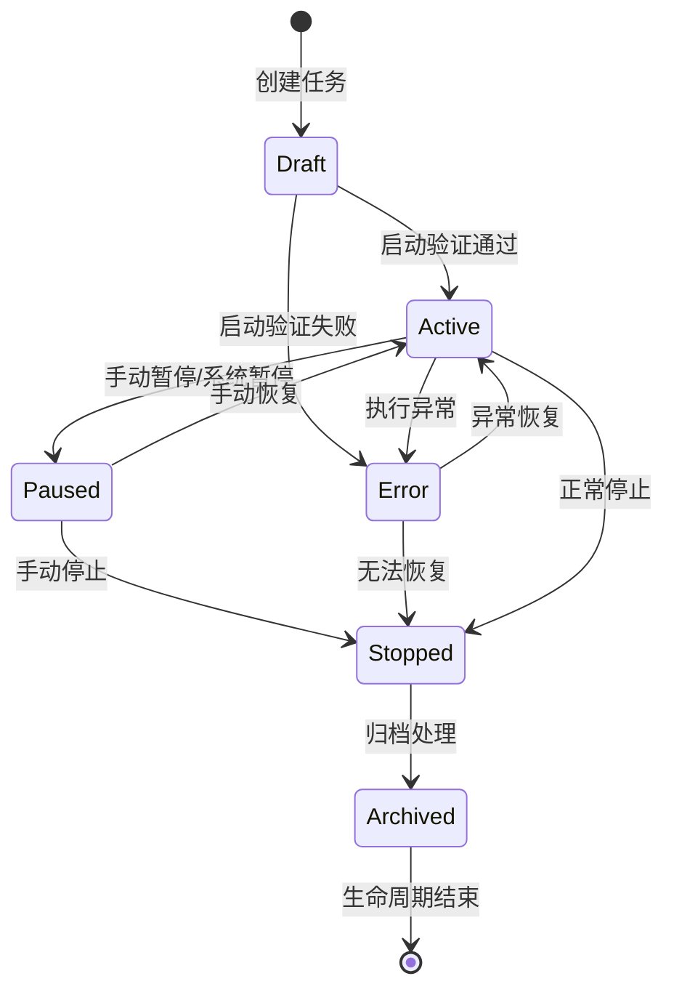
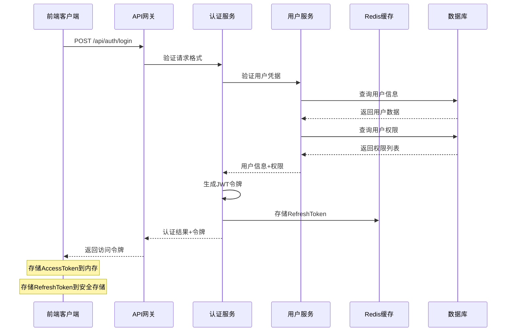
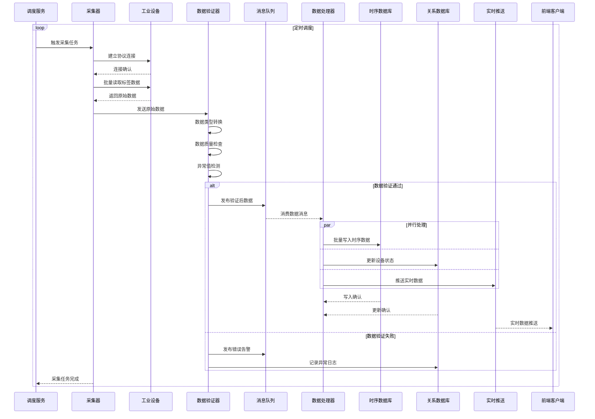
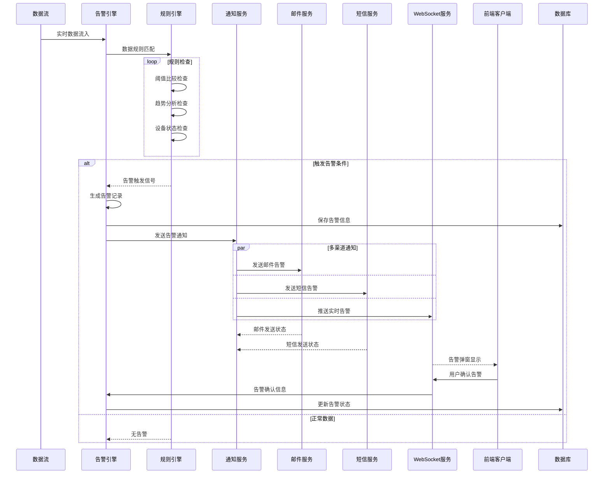
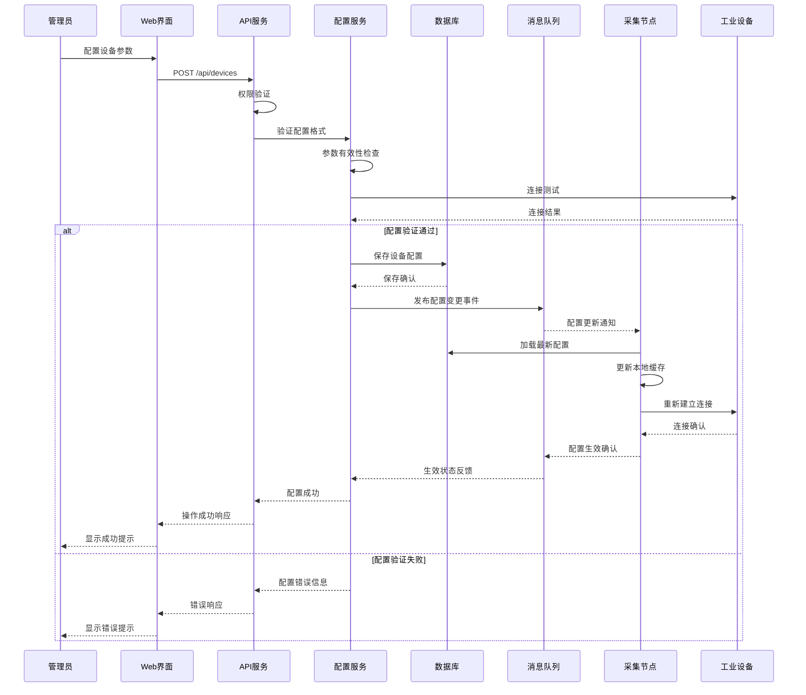
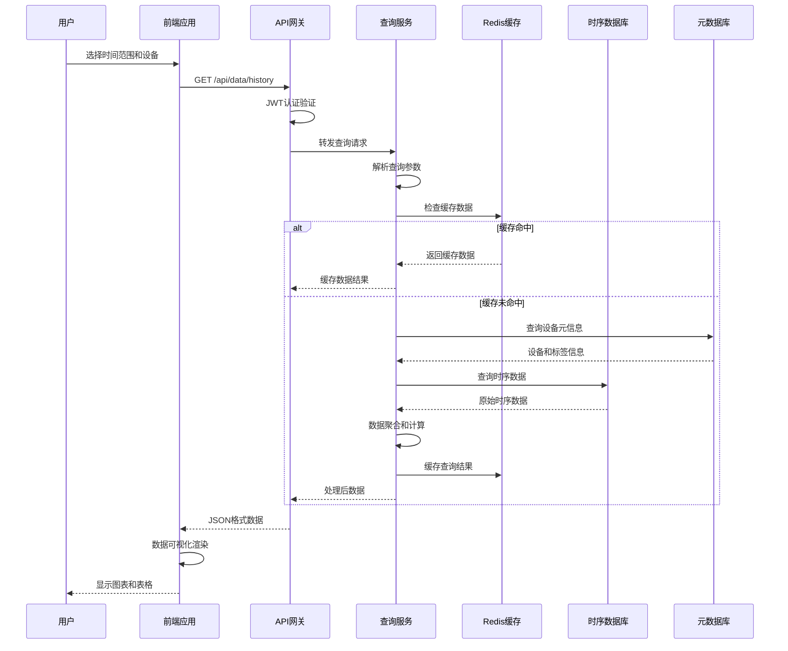
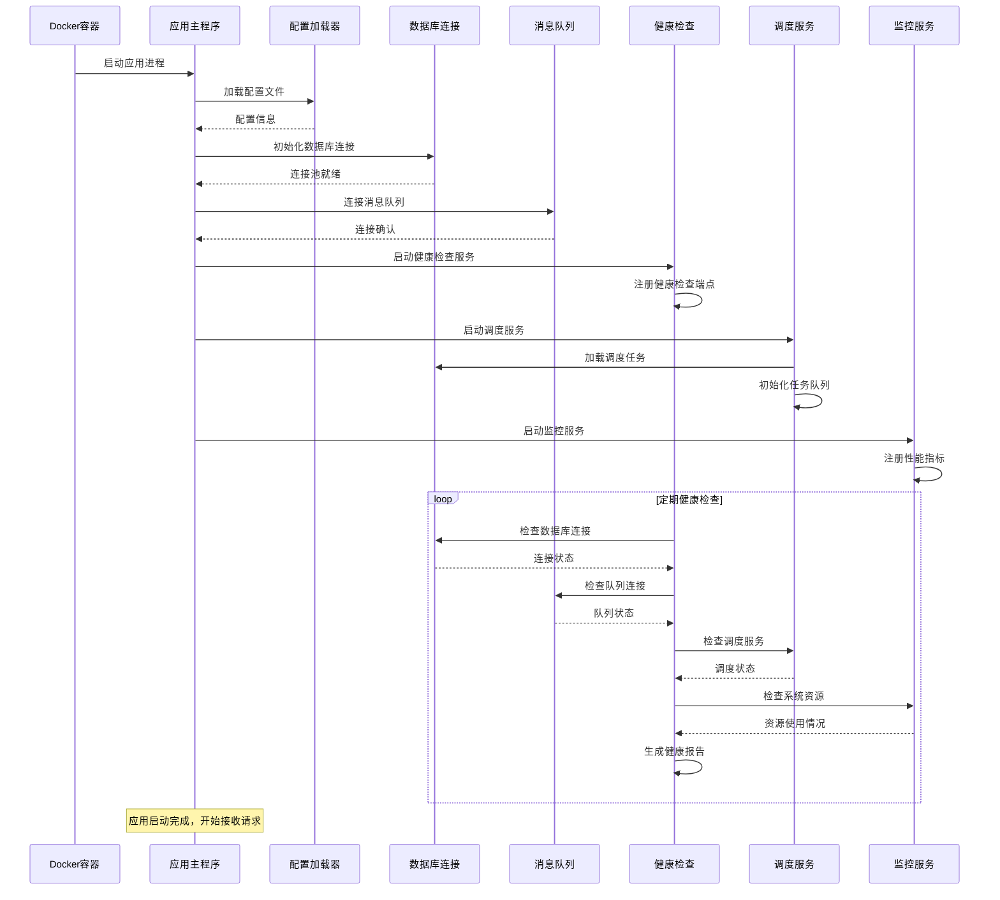
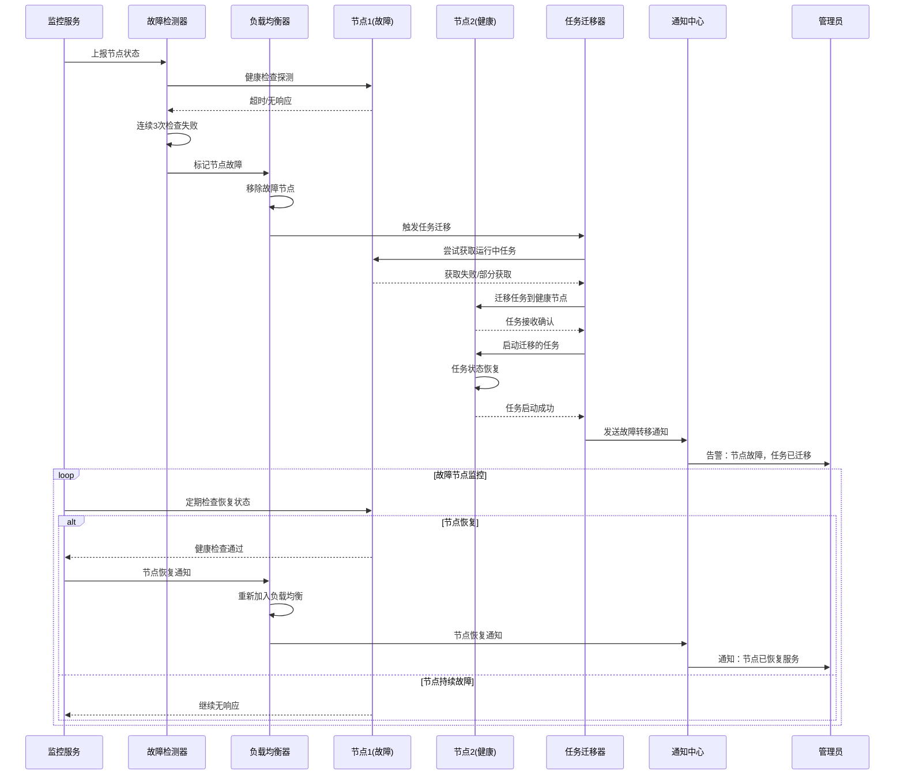
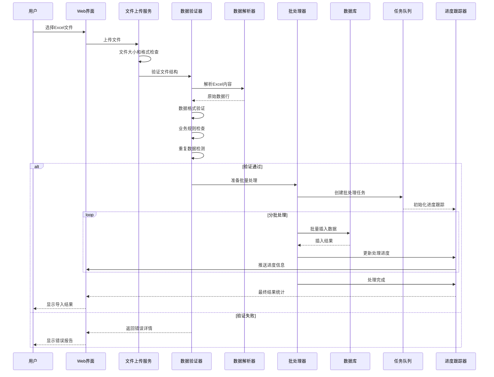

# FSD_工业数据采集系统功能规格说明文档

**项目名称**: 工业数据采集通用后台系统  
**文档版本**: v1.1  
**创建日期**: 2025-08-30  
**最后更新**: 2025-09-11  
**文档作者**: eatbs0956
**依据文档**: 02_PRD_工业数据采集系统产品需求文档.md

---

## 目录

1. [文档概述](#1-文档概述)
2. [设备与协议适配设计](#2-设备与协议适配设计)
3. [采集任务与调度设计](#3-采集任务与调度设计)
4. [数据处理与存储设计](#4-数据处理与存储设计)
5. [外部接口与集成设计](#5-外部接口与集成设计)
6. [用户权限与安全设计](#6-用户权限与安全设计)
7. [监控与告警设计](#7-监控与告警设计)
8. [前端界面设计](#8-前端界面设计)
9. [性能与安全规范](#9-性能与安全规范)
10. [配置与运维设计](#10-配置与运维设计)
11. [关键业务流程](#11-关键业务流程)
12. [扩展性设计](#12-扩展性设计)

---

## 1. 文档概述

### 1.1 文档目的

本功能规格说明（FSD）基于PRD产品需求文档，将业务需求细化为可直接指导开发的技术规格，包括数据模型、接口定义、业务规则、配置参数及运行机制等具体实现细节。

### 1.2 核心技术优势

不同工业协议在寻址方式、数据类型表达、连接安全与传输语义方面存在显著差异。通过统一抽象可以实现：

**技术优势**：
- **降低复杂度**：上层采集任务、监控、告警逻辑与具体协议解耦
- **零侵入扩展**：新协议接入仅需实现统一适配器接口
- **数据一致性**：统一的质量码和数据点定义，便于存储与可视化
- **开发效率**：减少协议相关的重复代码开发，提升系统可维护性

### 1.3 设计原则

**技术设计原则**：
- **统一抽象**：协议、设备、点位采用统一数据模型，降低系统复杂度
- **插件化架构**：协议适配器、存储驱动、告警规则支持插件式扩展
- **可观测性**：全链路数据采集、处理、存储过程可监控可追踪
- **渐进式部署**：支持从小规模单机到大规模分布式的渐进式扩展

**业务设计原则**：
- **用户体验优先**：简化设备接入流程，提供直观的管理界面
- **数据质量保证**：多层次数据验证和异常处理机制
- **系统稳定性**：容错设计和自动恢复机制
- **安全合规**：完整的权限控制和审计追踪

### 1.3 技术架构概览

基于.NET 8.0 + Vue.js 3.x的前后端分离架构，采用Docker容器化部署，使用RabbitMQ作为消息中间件，InfluxDB作为时序数据存储，PostgreSQL作为关系数据存储。

---

## 2. 设备与协议适配设计

### 2.1 协议支持能力详细矩阵

| 协议 | 读取能力 | 写入能力 | 订阅/事件 | 批量操作 | 节点浏览 | 安全机制 | 功能特点与限制 |
|------|----------|----------|-----------|----------|----------|----------|----------------|
| **OPC UA** | **同步/异步读取**<br/>支持所有OPC数据类型<br/>自动类型转换<br/>读取质量码 | **事务性写入**<br/>写入结果验证<br/>支持复杂数据类型<br/>批量写入回滚 | **DataChange订阅**<br/>Event订阅<br/>可配置采样率<br/>死带过滤 | **批量读写**<br/>单次≤1000点<br/>优化网络传输<br/>支持异步批量 | **完整地址空间**<br/>类型信息获取<br/>层次结构遍历<br/>符号表导入 | **X.509证书**<br/>用户名密码<br/>匿名访问<br/>会话加密 | 现代工业标准协议<br/>功能最完整<br/>性能优异<br/>标准化程度高 |
| **Modbus TCP** | **功能码01-04**<br/>离散量/寄存器<br/>16位数据类型<br/>地址范围检查 | **功能码05-06,15-16**<br/>单点/批量写入<br/>写前读验证<br/>异常码处理 | **不支持订阅**<br/>采用轮询模式<br/>可配置轮询间隔 | **批量读写优化**<br/>单次≤125寄存器<br/>连续地址优先<br/>分段读取策略 | **不支持浏览**<br/>需手工配置地址<br/>依赖Modbus映射表 | **TCP连接控制**<br/>超时检测<br/>无加密机制<br/>依赖网络安全 | 轻量级协议<br/>广泛兼容<br/>配置简单<br/>性能稳定 |
| **Modbus RTU** | **串口通信**<br/>与TCP相同功能<br/>CRC16校验<br/>自动波特率检测 | **实时写入**<br/>硬件级同步<br/>写入确认机制 | **轮询模式**<br/>考虑串口延迟<br/>可配置帧间隔 | **优化批量**<br/>单次≤50寄存器<br/>避免超时<br/>自动分包 | **不支持** | **CRC校验**<br/>地址冲突检测<br/>总线仲裁 | 工业现场总线<br/>抗干扰强<br/>实时性好<br/>成本低廉 |
| **西门子S7** | **多区域访问**<br/>DB/M/I/Q/V区域<br/>丰富数据类型<br/>符号地址支持 | **位/字节/字操作**<br/>实时生效<br/>数据类型检查<br/>写保护检测 | **不支持订阅**<br/>高频轮询<br/>变化检测算法 | **PDU优化**<br/>单次≤200字节<br/>数据打包策略<br/>对齐优化 | **符号表读取**<br/>DB块结构<br/>数据类型信息<br/>注释信息 | **PLC用户管理**<br/>密码保护<br/>访问级别控制<br/>连接数限制 | 西门子专用协议<br/>功能强大<br/>性能优异<br/>工业标准 |
| **三菱MC** | **寄存器访问**<br/>D/M/X/Y/B区域<br/>16/32位数据<br/>ASCII/Binary格式 | **位/字操作**<br/>实时响应<br/>状态反馈<br/>错误检测 | **轮询模式**<br/>高速扫描<br/>变化监测 | **帧长优化**<br/>单次≤100点<br/>自动分帧<br/>并发控制 | **设备信息**<br/>程序结构<br/>模块配置<br/>状态监控 | **连接超时**<br/>访问权限<br/>简单认证 | 三菱专用协议<br/>稳定可靠<br/>响应快速<br/>配置灵活 |
| **MQTT** | **主题订阅**<br/>JSON数据解析<br/>通配符支持<br/>QoS保证传输 | **消息发布**<br/>控制主题<br/>JSON格式<br/>确认机制 | **实时订阅**<br/>Retained消息<br/>Will遗嘱机制<br/>Keep-Alive | **JSON数组**<br/>批量发布<br/>单次≤1MB<br/>压缩传输 | **主题树浏览**<br/>动态发现<br/>元数据获取 | **TLS加密**<br/>用户认证<br/>ACL访问控制<br/>证书验证 | 物联网标准<br/>轻量级<br/>发布订阅<br/>云端友好 |
| **NB-IoT** | **上报缓存**<br/>CoAP协议<br/>小数据包<br/>低功耗优化 | **下行控制**<br/>CoAP确认<br/>重传机制<br/>省电考虑 | **设备主动上报**<br/>定时发送<br/>事件触发<br/>缓存策略 | **数据聚合**<br/>批量上报<br/>压缩传输<br/>≤1KB限制 | **不支持** | **SIM卡认证**<br/>APN配置<br/>运营商网络<br/>设备标识 | 窄带物联网<br/>广域覆盖<br/>超低功耗<br/>海量连接 |
| **LoRaWAN** | **上行数据**<br/>应用服务器<br/>载荷解析<br/>Class机制 | **下行数据**<br/>RX窗口发送<br/>确认应答<br/>功率控制 | **实时接收**<br/>Class C模式<br/>即时下行<br/>定时窗口 | **帧聚合**<br/>多点上报<br/>载荷优化<br/>≤242字节 | **网络管理**<br/>设备列表<br/>网关信息<br/>信号质量 | **AES128加密**<br/>网络密钥<br/>应用密钥<br/>设备认证 | 长距离通信<br/>自组网<br/>私有部署<br/>成本可控 |

**说明理由**：
1. **功能完整性对比**：OPC UA功能最全面，支持现代工业4.0要求；传统PLC协议功能基础但稳定可靠；IoT协议针对特定场景优化
2. **性能特点分析**：不同协议在实时性、吞吐量、网络开销方面各有特点，需要根据应用场景选择
3. **安全性评估**：从无安全机制到企业级安全，满足不同安全等级要求
4. **扩展性考虑**：统一适配器接口设计，便于后续协议扩展

### 2.2 统一数据模型设计

#### 2.2.1 设计原理
不同协议的差异主要在寻址方式、数据类型表达、连接安全与传输语义。通过统一抽象可以：
- 降低上层采集任务/监控/告警逻辑复杂度
- 支撑新协议“零侵入”接入（仅实现适配接口）
- 统一质量码、数据点定义，便于存储与可视化

#### 2.2.2 核心实体详细定义

**设备实体 (Device) - 通用设备管理模型**
| 字段 | 类型 | 描述 | 约束 | 业务规则 |
|------|------|------|------|----------|
| Id | UUID | 主键标识 | NOT NULL, PK | 系统自动生成，全局唯一 |
| Name | String(100) | 设备名称 | NOT NULL | 支持中英文，同分组内唯一 |
| Code | String(50) | 业务编码 | UNIQUE, 可选 | 企业内部设备编号，支持条码扫描 |
| Description | String(500) | 设备描述 | 可选 | 设备详细信息、位置、用途说明 |
| GroupId | UUID | 设备分组ID | FK to DeviceGroup | 支持树形结构，最大5层深度 |
| ProtocolType | Enum | 协议类型 | NOT NULL | OPCUA/MODBUS_TCP/MODBUS_RTU/S7/MC/MQTT/NBIOT/LORAWAN |
| Host | String(255) | 主机地址 | NOT NULL | IP地址或域名，支持IPv4/IPv6 |
| Port | Integer | 端口号 | 1-65535 | 协议默认端口，可自定义 |
| Params | JSONB | 协议特定参数 | NOT NULL | 详见协议配置结构 |
| SecurityLevel | Enum | 安全级别 | NOT NULL | None/Basic/Encrypted |
| HeartbeatInterval | Integer | 心跳间隔(秒) | 5-3600 | 默认30秒，影响离线判定 |
| Status | Enum | 设备状态 | NOT NULL | Offline/Online/Error/Maintenance |
| LastSeenAt | DateTime | 最后在线时间 | 可为空 | 自动更新，用于离线判定 |
| TagsCount | Integer | 标签数量 | >=0 | 冗余字段，便于统计查询 |
| Enabled | Boolean | 启用状态 | NOT NULL | 默认true，禁用后停止采集 |
| SortOrder | Integer | 排序权重 | 默认0 | 用于设备列表排序 |
| Metadata | JSONB | 扩展元数据 | 可选 | 厂商信息、型号、安装日期等 |
| CreatedAt | DateTime | 创建时间 | NOT NULL | 自动设置，不可更改 |
| UpdatedAt | DateTime | 更新时间 | NOT NULL | 自动维护 |
| CreatedBy | UUID | 创建用户 | FK to User | 审计追踪 |
| UpdatedBy | UUID | 更新用户 | FK to User | 审计追踪 |

**设计理由**：
1. **统一性**：抽象不同协议的共同特征，提供统一的设备管理模型
2. **扩展性**：JSON字段存储协议特定参数，支持新协议无缝接入  
3. **层次性**：支持设备分组树形结构，便于大型工厂的设备组织管理
4. **审计性**：完整的创建/更新追踪，满足工业环境的合规要求
5. **性能性**：冗余字段减少关联查询，JSONB索引提升查询效率

**设备分组实体 (DeviceGroup) - 层次化设备组织模型**
| 字段 | 类型 | 描述 | 约束 | 业务规则 |
|------|------|------|------|----------|
| Id | UUID | 主键标识 | NOT NULL, PK | 系统自动生成 |
| Name | String(100) | 分组名称 | NOT NULL | 同层级内唯一 |
| Code | String(50) | 分组编码 | UNIQUE, 可选 | 用于API调用和导入导出 |
| ParentId | UUID | 父分组ID | FK to DeviceGroup, 可空 | 支持根分组(ParentId=NULL) |
| Path | String(1000) | 分组路径 | NOT NULL | 格式: /root/level1/level2，便于查询 |
| Level | Integer | 层级深度 | 0-4 | 0为根分组，最大支持5层 |
| SortOrder | Integer | 排序序号 | 默认0 | 同级分组排序 |
| Description | String(500) | 分组描述 | 可选 | 分组用途和管理范围说明 |
| DeviceCount | Integer | 设备数量 | >=0 | 冗余字段，包含子分组设备数 |
| Icon | String(50) | 图标名称 | 可选 | 前端显示用图标标识 |
| Color | String(10) | 主题色 | 默认#409EFF | 前端分组标识色 |
| Enabled | Boolean | 启用状态 | 默认true | 禁用分组会影响其下所有设备 |
| CreatedAt | DateTime | 创建时间 | NOT NULL | 自动设置 |
| UpdatedAt | DateTime | 更新时间 | NOT NULL | 自动维护 |
| CreatedBy | UUID | 创建用户 | FK to User | 审计信息 |

**标签实体 (Tag) - 通用数据点定义模型**
| 字段 | 类型 | 描述 | 约束 | 业务规则 |
|------|------|------|------|----------|
| Id | UUID | 主键标识 | NOT NULL, PK | 系统自动生成 |
| DeviceId | UUID | 所属设备ID | FK to Device, NOT NULL | 设备删除时级联删除标签 |
| Name | String(100) | 标签名称 | NOT NULL | 设备内唯一，支持中英文 |
| Code | String(100) | 标签编码 | 设备内唯一 | 用于API调用和脚本引用 |
| Address | String(200) | 协议地址 | NOT NULL | 具体协议的原生地址格式 |
| DataType | Enum | 数据类型 | NOT NULL | Bool/Int16/Int32/Int64/Float/Double/String/DateTime |
| Unit | String(20) | 工程单位 | 可选 | 如°C、MPa、m/s等 |
| Coefficient | Decimal(10,4) | 转换系数 | 默认1.0 | 原始值 × 系数 + 偏移量 |
| Offset | Decimal(10,4) | 偏移量 | 默认0.0 | 工程值转换 |
| DecimalPlaces | Integer | 小数位数 | 0-6 | 显示精度控制 |
| AccessMode | Enum | 访问模式 | NOT NULL | ReadOnly/WriteOnly/ReadWrite |
| AcquireMode | Enum | 采集模式 | NOT NULL | Polling/Subscription/Event/OnDemand |
| PollingInterval | Integer | 轮询间隔(ms) | 100-3600000 | Polling模式专用，默认1000ms |
| Deadband | Decimal(10,4) | 死区值 | >=0 | 变化检测阈值，减少无效更新 |
| MinValue | Decimal(18,4) | 最小值 | 可选 | 用于数据验证和告警判断 |
| MaxValue | Decimal(18,4) | 最大值 | 可选 | 用于数据验证和告警判断 |
| DefaultValue | String(100) | 默认值 | 可选 | 设备离线或读取失败时使用 |
| Description | String(500) | 标签描述 | 可选 | 标签用途和工程意义说明 |
| Category | String(50) | 标签分类 | 可选 | 如Temperature/Pressure/Flow等 |
| IsArchive | Boolean | 是否归档 | 默认true | 控制是否存储历史数据 |
| IsAlarm | Boolean | 是否告警 | 默认false | 是否启用阈值告警 |
| AlarmConfig | JSONB | 告警配置 | 可选 | 告警阈值、延时等参数 |
| Metadata | JSONB | 扩展元数据 | 可选 | 量程、精度、厂商信息等 |
| SortOrder | Integer | 排序权重 | 默认0 | 标签列表排序 |
| Enabled | Boolean | 启用状态 | 默认true | 禁用后停止采集该标签 |
| CreatedAt | DateTime | 创建时间 | NOT NULL | 自动设置 |
| UpdatedAt | DateTime | 更新时间 | NOT NULL | 自动维护 |
| CreatedBy | UUID | 创建用户 | FK to User | 审计信息 |

**点位配置实体 (DataPoint) - 运行时数据点状态**
| 字段 | 类型 | 描述 | 约束 | 业务规则 |
|------|------|------|------|----------|
| TagId | UUID | 标签ID | FK to Tag, PK | 与Tag一对一关系 |
| CurrentValue | String(500) | 当前值 | 可选 | 最新采集的原始值 |
| EngineeringValue | Decimal(18,4) | 工程值 | 可选 | 经过系数转换后的值 |
| Quality | Integer | 数据质量 | NOT NULL | 0=Good, 非0=Bad/Uncertain |
| Timestamp | DateTime | 采集时间戳 | 可选 | 数据产生的实际时间 |
| LastUpdateAt | DateTime | 最后更新时间 | NOT NULL | 系统记录的更新时间 |
| ErrorCount | Integer | 错误次数 | >=0 | 连续采集失败次数 |
| ErrorMessage | String(500) | 错误信息 | 可选 | 最后一次错误的详细描述 |
| ReadCount | Long | 读取次数 | >=0 | 统计信息 |
| WriteCount | Long | 写入次数 | >=0 | 统计信息 |
| LastReadAt | DateTime | 最后读取时间 | 可选 | 性能监控 |
| LastWriteAt | DateTime | 最后写入时间 | 可选 | 性能监控 |

**设计理由说明**：
1. **分层管理**：设备分组支持树形结构，便于大型工厂按车间、产线、设备分级管理
2. **协议抽象**：标签地址字段存储协议原生地址，通过适配器统一处理不同协议差异
3. **工程转换**：支持线性转换(y=ax+b)，满足传感器数据工程化需求
4. **性能优化**：点位状态独立存储，避免频繁更新影响配置表性能
5. **数据质量**：完整的质量码和时间戳管理，保证数据可追溯性
6. **扩展性**：JSONB字段支持灵活扩展，适应不同行业特殊需求
| Id | UUID | 主键标识 | NOT NULL, PK |
| DeviceId | UUID | 所属设备ID | FK to Device |
| Name | String(100) | 标签名称 | NOT NULL |
| Address | String(255) | 协议地址 | OPC NodeId/Modbus寄存器等 |
| DataType | Enum | 数据类型 | Bool/Int16/Int32/Float/Double/String等 |
| AccessMode | Enum | 访问模式 | ReadOnly/WriteOnly/ReadWrite |
| AcquireMode | Enum | 采集模式 | Polling/Subscription/Event |
| PollingInterval | Integer | 轮询间隔(ms) | 用于Polling模式 |
| Deadband | Decimal | 数值死区 | 减少无效变化 |
| Scale | Decimal | 缩放系数 | 工程换算 |
| Offset | Decimal | 偏移量 | 工程换算 |
| Unit | String(20) | 工程单位 | 可选 |
| MinValue | Decimal | 最小值 | 范围验证 |
| MaxValue | Decimal | 最大值 | 范围验证 |
| Quality | Enum | 数据质量 | Good/Bad/Uncertain |
| LastValue | String | 最后值 | JSON序列化存储 |
| LastValueAt | DateTime | 最后更新时间 | 可为空 |
| Description | String(500) | 标签描述 | 可选 |
| Enabled | Boolean | 启用状态 | 默认true |

标签模板 TagTemplate（用于批量导入）
- Id / ProtocolType / NamePattern / AddressPattern / DataType / DefaultPollingInterval / DefaultDeadband / Version

协议适配器能力 AdapterCapability
- ProtocolType
- SupportsRead / Write / Subscription / Batch / Browse / QualityMapping / SecurityModes[]

### 2.3 设备接入方式详细对比分析

#### 2.3.1 接入方式对比矩阵
| 接入方式 | 技术复杂度 | 配置效率 | 准确性 | 维护成本 | 适用协议 | 推荐场景 | 实施优先级 |
|----------|-----------|----------|--------|----------|----------|----------|-------------|
| **手动逐一添加** | 低 | 低 | 高 | 高 | 全协议 | 少量设备、特殊配置 | ⭐⭐⭐⭐⭐ |
| **批量导入(Excel/CSV)** | 中 | 高 | 中 | 中 | 全协议 | 新产线上线、成批部署 | ⭐⭐⭐⭐⭐ |
| **设备模板克隆** | 中 | 高 | 高 | 低 | 全协议 | 同型号设备批量部署 | ⭐⭐⭐⭐⭐ |
| **OPC UA节点浏览** | 低 | 高 | 高 | 低 | 仅OPC UA | 现代化工厂、标准设备 | ⭐⭐⭐⭐ |
| **自动网络发现** | 高 | 高 | 中 | 中 | 部分协议 | 标准网络设备发现 | ⭐⭐⭐ |
| **API自动注册** | 高 | 高 | 中 | 低 | 全协议 | DevOps集成、边缘网关 | ⭐⭐⭐ |
| **二维码/NFC扫码** | 中 | 高 | 高 | 低 | 全协议 | 移动端配置、现场运维 | ⭐⭐ |

#### 2.3.2 详细功能特性分析

**A. 手动逐一添加**
- **优势**：
  - 配置精准可控，可处理复杂场景
  - 支持所有协议类型和参数配置
  - 无需额外工具和模板准备
  - 适合学习和理解系统机制
- **劣势**：
  - 配置效率低，大量设备时耗时巨大
  - 人工输入易出错，地址配置复杂
  - 无法快速复制相似配置
- **适用场景**：测试环境、少量设备(<10台)、特殊参数配置
- **技术实现**：Web表单 + 实时连接测试 + 参数验证

**B. 批量导入(Excel/CSV)**
- **优势**：
  - 大批量设备快速导入(>100台)
  - 可离线准备和审核配置数据
  - 支持版本管理和变更跟踪
  - 便于与ERP/资产管理系统集成
- **劣势**：
  - 需要标准化模板和培训
  - 模板维护成本，版本兼容性
  - 批量错误影响面大
  - 复杂嵌套配置支持有限
- **适用场景**：新产线上线、设备搬迁、批量配置变更
- **技术实现**：Excel解析 + 数据验证 + 预览确认 + 批量入库

**C. 设备模板克隆**
- **优势**：
  - 同型号设备配置一致性最佳
  - 配置复用，减少重复工作
  - 便于设备标准化管理
  - 支持模板版本演进
- **劣势**：
  - 需要建立和维护模板库
  - 个性化参数仍需手动调整
  - 模板变更影响已部署设备
- **适用场景**：标准化产线、同型号设备批量部署
- **技术实现**：模板管理 + 参数覆盖 + 批量克隆

**D. OPC UA节点浏览**
- **优势**：
  - 自动发现设备地址空间
  - 获取完整类型信息和描述
  - 减少地址配置错误
  - 支持层级结构导入
- **劣势**：
  - 仅限OPC UA协议
  - 需要设备支持浏览功能
  - 大地址空间浏览性能问题
  - 网络权限和安全配置复杂
- **适用场景**：现代化工厂、OPC UA设备集中部署
- **技术实现**：OPC UA Client + 地址空间遍历 + 选择性导入

**E. 自动网络发现**
- **优势**：
  - 零配置发现网络设备
  - 自动识别协议和端口
  - 适合初始环境快速扫描
  - 支持设备变更自动感知
- **劣势**：
  - 协议支持有限(主要为标准网络协议)
  - 需要网络扫描权限
  - 误报和漏报风险
  - 安全策略可能阻止扫描
- **适用场景**：网络设备发现、环境初始化扫描
- **技术实现**：网络扫描 + 协议探测 + 设备指纹识别

**F. API自动注册**
- **优势**：
  - 与DevOps流程集成
  - 支持自动化部署
  - 适合边缘网关自注册
  - 可编程化管理
- **劣势**：
  - 需要开发集成代码
  - API调用权限管理
  - 错误处理和回滚复杂
- **适用场景**：CI/CD集成、边缘计算、第三方系统集成
- **技术实现**：RESTful API + 认证鉴权 + 异步处理

#### 2.3.3 实施策略与优先级

**首期实施(MVP)**：
1. **手动添加** - 基础功能，必须支持
2. **Excel批量导入** - 效率工具，高优先级
3. **设备模板** - 标准化基础，中等优先级
4. **OPC UA浏览** - 现代协议支持，中等优先级

**二期扩展**：
1. **网络自动发现** - 智能化功能
2. **API自动注册** - 集成功能
3. **移动端扫码** - 便民功能

**选择策略建议**：
- **小规模部署(<50台)**：手动添加 + 模板克隆
- **中等规模(50-200台)**：批量导入 + 模板克隆 + OPC UA浏览
- **大规模部署(>200台)**：批量导入 + 自动发现 + API集成

### 2.4 新增协议特性设计

#### 2.4.1 NB-IoT协议适配

**技术特点**：
- **低功耗**：设备可休眠，按需唤醒上报数据
- **广覆盖**：支持地下室、偏远地区的信号覆盖
- **大连接**：单基站支持数万设备接入
- **低成本**：模组成本低，适合大规模部署

**实现方案**：
```csharp
public class NBIoTAdapter : IProtocolAdapter
{
    private readonly NBIoTClient _client;
    
    public async Task<DataResult> ReadDataAsync(List<DataPoint> points, CancellationToken cancellationToken)
    {
        // NB-IoT通常是设备主动上报，这里实现为查询最新缓存数据
        var cachedData = await _dataCache.GetLatestDataAsync(points.Select(p => p.DeviceId));
        return ProcessCachedResults(cachedData, points);
    }
    
    public async Task<bool> WriteDataAsync(string point, object value, CancellationToken cancellationToken)
    {
        // 通过NB-IoT下行消息发送控制指令
        var message = new NBIoTDownlinkMessage
        {
            DeviceId = GetDeviceIdFromPoint(point),
            Payload = SerializeCommand(point, value)
        };
        return await _client.SendDownlinkAsync(message, cancellationToken);
    }
}
```

#### 2.4.2 LoRa/LoRaWAN协议适配

**技术特点**：
- **长距离**：开阔环境可达15公里通信距离
- **低功耗**：电池供电可使用数年
- **私有部署**：可建设私有LoRaWAN网络
- **灵活拓扑**：支持星型和网格拓扑

**实现方案**：
```csharp
public class LoRaWANAdapter : IProtocolAdapter
{
    private readonly LoRaWANClient _client;
    
    public async Task<bool> ConnectAsync(DeviceConfig config, CancellationToken cancellationToken)
    {
        var loraConfig = JsonSerializer.Deserialize<LoRaConfig>(config.Params);
        
        _client.Configure(new LoRaClientConfig
        {
            NetworkServerUrl = loraConfig.NetworkServerUrl,
            ApplicationId = loraConfig.ApplicationId,
            DevEUI = loraConfig.DevEUI,
            AppKey = loraConfig.AppKey,
            Class = loraConfig.DeviceClass // A, B, or C
        });
        
        return await _client.JoinNetworkAsync(cancellationToken);
    }
    
    // LoRaWAN设备主动上报数据，适配器监听消息
    private void OnUplinkReceived(object sender, UplinkMessageEventArgs e)
    {
        var dataPoints = ParseLoRaPayload(e.Payload, e.DevEUI);
        DataChanged?.Invoke(this, new DataChangedEventArgs(dataPoints));
    }
}
```

#### 2.4.3 IoT协议配置数据结构

为支持NB-IoT和LoRaWAN协议，需在设备配置的`Params`字段中定义专用配置结构：

```csharp
// NB-IoT设备配置
public class NBIoTDeviceConfig
{
    public string IMEI { get; set; }           // 设备唯一标识
    public string IMSI { get; set; }           // SIM卡标识  
    public string NetworkOperator { get; set; } // 运营商（移动/联通/电信）
    public string CoAPEndpoint { get; set; }   // CoAP服务器地址
    public int ReportInterval { get; set; }    // 上报间隔（秒）
    public NBIoTQoS QoSLevel { get; set; }     // 服务质量等级
    public bool EnablePSM { get; set; }        // 省电模式
    public int TAU { get; set; }               // 跟踪区域更新定时器(秒)
    public int ActiveTime { get; set; }        // 活跃时间(秒)
}

// LoRaWAN设备配置  
public class LoRaWANDeviceConfig
{
    public string DevEUI { get; set; }         // 设备EUI
    public string AppEUI { get; set; }         // 应用EUI
    public string AppKey { get; set; }         // 应用密钥
    public string NetworkServerUrl { get; set; } // 网络服务器地址
    public string ApplicationId { get; set; }  // 应用ID
    public LoRaDeviceClass DeviceClass { get; set; } // 设备类型
    public int DataRate { get; set; }          // 数据速率 (SF7-SF12)
    public int TxPower { get; set; }           // 发射功率 (dBm)
    public int RX1Delay { get; set; }          // 接收窗口1延时(秒)
    public int RX2DataRate { get; set; }       // 接收窗口2数据速率
    public uint RX2Frequency { get; set; }     // 接收窗口2频率(Hz)
    public bool ADREnabled { get; set; }       // 自适应数据速率
}

public enum NBIoTQoS
{
    BestEffort = 0,    // 尽力而为传输
    Guaranteed = 1     // 保证传输质量
}

public enum LoRaDeviceClass  
{
    ClassA = 0,        // 最低功耗，双向通信
    ClassB = 1,        // 定时接收窗口
    ClassC = 2         // 持续接收，最高功耗
}
```

**配置示例**：

NB-IoT设备Params JSON：
```json
{
  "IMEI": "863703048685693",
  "IMSI": "460110123456789", 
  "NetworkOperator": "移动",
  "CoAPEndpoint": "coap://iot.10086.cn:5683",
  "ReportInterval": 300,
  "QoSLevel": 1,
  "EnablePSM": true,
  "TAU": 3600,
  "ActiveTime": 10
}
```

LoRaWAN设备Params JSON：
```json
{
  "DevEUI": "0004A30B001C0530",
  "AppEUI": "8000000000000001", 
  "AppKey": "2B7E151628AED2A6ABF7158809CF4F3C",
  "NetworkServerUrl": "https://lorawan.example.com",
  "ApplicationId": "app-001",
  "DeviceClass": 0,
  "DataRate": 5,
  "TxPower": 14,
  "ADREnabled": true
}
```

### 2.5 协议适配接口规范

见PRD扩展：统一接口 + 质量码映射策略（内部统一为 Good=0, Bad!=0）。

**物联网协议特殊处理**：
- **数据上报模式**：NB-IoT/LoRa设备主动上报，适配器实现数据接收和缓存
- **下行控制**：支持远程参数配置和控制指令下发
- **电源管理**：考虑设备休眠周期，合理设置数据更新频率
- **网络质量**：监控信号强度、丢包率等网络质量指标

---

## 3. 采集任务与调度设计

### 3.1 采集任务详细模型

**采集任务实体 (CollectionTask) - Web管理系统配置，存储于数据库**
| 字段 | 类型 | 描述 | 约束 | 业务规则 |
|------|------|------|------|----------|
| Id | UUID | 主键标识 | NOT NULL, PK | 系统自动生成 |
| Name | String(100) | 任务名称 | NOT NULL | 全局唯一，支持中英文 |
| Code | String(50) | 任务编码 | UNIQUE | 用于API调用和脚本引用 |
| Description | String(1000) | 任务描述 | 可选 | 任务用途、业务背景说明 |
| Category | String(50) | 任务分类 | 可选 | 如生产监控、质量检测、设备状态等 |
| Status | Enum | 任务状态 | NOT NULL | Draft/Active/Paused/Stopped/Archived |
| TaskType | Enum | 任务类型 | NOT NULL | Periodic/EventDriven/Mixed/OnDemand |
| ScheduleConfig | JSONB | 调度配置 | NOT NULL | Cron表达式或固定间隔配置 |
| DefaultInterval | Integer | 默认采集间隔(ms) | 100-3600000 | 最小100ms，默认1000ms |
| MaxRetries | Integer | 最大重试次数 | 0-10 | 默认3次，0表示不重试 |
| RetryInterval | Integer | 重试间隔(ms) | 100-60000 | 默认1000ms，指数退避 |
| Timeout | Integer | 单次执行超时(ms) | 1000-300000 | 默认30秒 |
| BatchSize | Integer | 批处理大小 | 1-1000 | 默认50，影响内存和性能 |
| Priority | Integer | 优先级 | 0-9 | 数值越大优先级越高，默认5 |
| ConcurrencyLevel | Integer | 并发级别 | 1-32 | 同时执行的工作线程数 |
| LoadBalanceMode | Enum | 负载均衡模式 | RoundRobin/Random/Weighted | 多节点部署时的任务分配策略 |
| EffectiveFrom | DateTime | 生效开始时间 | 可为空 | 支持定时启动任务 |
| EffectiveTo | DateTime | 生效结束时间 | 可为空 | 支持任务自动停止 |
| FailureThreshold | Integer | 失败阈值 | 1-100 | 连续失败次数超过后暂停任务 |
| SuccessRate | Decimal(5,2) | 成功率要求(%) | 0-100 | 低于阈值时触发告警 |
| DataRetention | Integer | 数据保留天数 | 1-3650 | 该任务产生数据的保留策略 |
| Enabled | Boolean | 启用状态 | NOT NULL | 默认true |
| Tags | String(500) | 标签列表 | 可选 | 逗号分隔的标签，便于分类管理 |
| Metadata | JSONB | 扩展元数据 | 可选 | 业务相关的扩展信息 |
| LastExecutedAt | DateTime | 最后执行时间 | 可为空 | 运行时状态信息 |
| NextExecuteAt | DateTime | 下次执行时间 | 可为空 | 调度器计算得出 |
| ExecutionCount | Long | 执行次数 | >=0 | 统计信息 |
| FailureCount | Long | 失败次数 | >=0 | 统计信息 |
| CreatedAt | DateTime | 创建时间 | NOT NULL | 自动设置 |
| UpdatedAt | DateTime | 更新时间 | NOT NULL | 自动维护 |
| CreatedBy | UUID | 创建用户 | FK to User | 审计信息 |
| UpdatedBy | UUID | 更新用户 | FK to User | 审计信息 |

### 3.2 任务生命周期详细流程

#### 3.2.1 状态流转图
```
[Draft] --创建--> [Active] --暂停--> [Paused] --恢复--> [Active]
   |                |                    |                   |
   |                |                    |                   |
 删除              停止                 删除                停止
   |                |                    |                   |
   v                v                    v                   v
[Deleted]      [Stopped] --------归档--------> [Archived]
```

#### 3.2.2 Web管理系统配置流程
1. **创建阶段**：
   - 用户在Web界面填写任务基本信息
   - 选择关联的设备和标签(多对多关系)
   - 配置调度策略和执行参数
   - 系统验证配置有效性
   - 保存到数据库，状态为Draft

2. **启动阶段**：
   - 用户点击启动按钮
   - 系统检查关联设备是否在线
   - 验证标签配置有效性
   - 状态变更为Active
   - 调度器开始执行任务

3. **运行阶段**：
   - 调度器按配置间隔执行任务
   - 采集引擎读取标签数据
   - 数据处理和存储
   - 更新执行统计信息

4. **管理阶段**：
   - 支持运行时参数调整(间隔、重试次数等)
   - 支持暂停/恢复操作
   - 支持标签动态增删
   - 配置变更立即生效

5. **停止阶段**：
   - 用户主动停止或系统异常停止
   - 完成当前执行轮次
   - 状态变更为Stopped
   - 可选择归档或删除

### 3.3 任务与设备、标签关联关系对比分析

#### 3.3.1 关联模式对比
| 关联模式 | 灵活性 | 性能 | 复杂度 | 管理成本 | 适用场景 | 推荐度 |
|----------|--------|------|--------|----------|----------|--------|
| **多对多(推荐)** | ⭐⭐⭐⭐⭐ | ⭐⭐⭐ | ⭐⭐⭐⭐ | ⭐⭐⭐ | 复杂业务场景 | ⭐⭐⭐⭐⭐ |
| **一对多** | ⭐⭐ | ⭐⭐⭐⭐⭐ | ⭐⭐ | ⭐⭐⭐⭐⭐ | 简单采集场景 | ⭐⭐⭐ |
| **层次化分组** | ⭐⭐⭐⭐ | ⭐⭐⭐⭐ | ⭐⭐⭐ | ⭐⭐⭐⭐ | 大规模设备 | ⭐⭐⭐⭐ |

#### 3.3.2 多对多模式详细分析(推荐方案)
**优势**：
- **业务灵活性**：同一个设备可参与多个任务(如实时监控+历史记录)
- **任务复用性**：同一个任务可采集多个设备的相同类型标签
- **配置独立性**：任务参数可针对不同设备/标签个性化配置
- **扩展性强**：支持复杂的采集策略和业务规则

**劣势**：
- **数据库复杂**：需要中间表管理多对多关系
- **查询性能**：关联查询比单表查询稍慢
- **配置复杂**：界面需要支持复杂的关联关系管理

**技术实现**：
```sql
-- 任务设备关联表
CREATE TABLE task_devices (
    task_id UUID NOT NULL,
    device_id UUID NOT NULL,
    device_priority INTEGER DEFAULT 0,
    device_config JSONB,
    created_at TIMESTAMP DEFAULT NOW(),
    PRIMARY KEY (task_id, device_id)
);

-- 任务标签关联表
CREATE TABLE task_tags (
    task_id UUID NOT NULL,
    tag_id UUID NOT NULL,
    tag_priority INTEGER DEFAULT 0,
    custom_interval INTEGER,
    custom_deadband DECIMAL(10,4),
    enabled BOOLEAN DEFAULT TRUE,
    created_at TIMESTAMP DEFAULT NOW(),
    PRIMARY KEY (task_id, tag_id)
);
```

#### 3.3.3 一对多模式分析
**优势**：
- **模型简单**：直接在设备/标签表中添加task_id字段
- **查询高效**：避免关联查询，性能最佳
- **配置简单**：界面逻辑简单直观

**劣势**：
- **重复配置**：同一设备参与多个任务需要重复添加
- **维护困难**：设备变更影响多个任务
- **扩展受限**：难以支持复杂的采集策略

**适用场景**：设备与任务一对一映射的简单场景

### 3.4 采集调度策略详细配置

#### 3.4.1 调度类型与配置方式(Web管理系统配置)

**A. 固定间隔调度 (Periodic)**
```json
{
  "type": "FixedRate",
  "intervalMs": 1000,
  "initialDelayMs": 0,
  "jitterMs": 100,
  "description": "每1秒执行一次，支持100ms随机抖动"
}
```

**B. Cron表达式调度 (EventDriven)**  
```json
{
  "type": "Cron", 
  "expression": "0/30 * * * * ?",
  "timezone": "Asia/Shanghai",
  "description": "每30秒执行一次"
}
```

**C. 事件触发调度 (EventDriven)**
```json
{
  "type": "EventBased",
  "triggerCondition": "device_online OR tag_value_changed", 
  "maxExecutionRate": 10,
  "description": "设备上线或标签值变化时触发"
}
```

**D. 混合调度 (Mixed)**
```json
{
  "type": "Hybrid",
  "periodicConfig": {"intervalMs": 5000},
  "eventConfig": {"triggerCondition": "alarm_raised"},
  "description": "5秒周期 + 告警触发"
}
```

#### 3.4.2 异常重试机制配置

**重试策略类型**：
1. **固定间隔重试**：每次重试间隔相同
2. **指数退避重试**：重试间隔逐次增加(1s, 2s, 4s, 8s...)
3. **线性递增重试**：重试间隔线性增长(1s, 2s, 3s, 4s...)
4. **自适应重试**：根据错误类型调整重试策略

**配置示例**：
```json
{
  "maxRetries": 3,
  "retryPolicy": "ExponentialBackoff",
  "baseIntervalMs": 1000,
  "maxIntervalMs": 30000,
  "multiplier": 2.0,
  "randomizationFactor": 0.1,
  "retryableErrors": [
    "CONNECTION_TIMEOUT",
    "DEVICE_OFFLINE", 
    "NETWORK_ERROR"
  ],
  "nonRetryableErrors": [
    "INVALID_ADDRESS",
    "PERMISSION_DENIED",
    "TAG_NOT_FOUND"
  ]
}
```

#### 3.4.3 采集频率优化策略

**频率自适应算法**：
- **变化检测**：标签值稳定时降低采集频率，变化时提高频率
- **负载均衡**：根据系统负载动态调整采集间隔
- **网络优化**：批量采集减少网络开销
- **设备保护**：避免过频采集影响设备性能

**配置参数**：
```json
{
  "adaptiveFrequency": {
    "enabled": true,
    "minIntervalMs": 500,
    "maxIntervalMs": 10000,
    "changeThreshold": 0.01,
    "stableCountThreshold": 10,
    "burstModeEnabled": true
  }
}
```

#### 3.4.4 批量操作优化

**批量策略**：
- **地址连续性优化**：连续地址合并读取
- **协议特性优化**：利用协议批量读写能力
- **内存管理**：控制批量大小避免内存溢出
- **超时控制**：批量操作超时分割处理

**配置示例**：
```json
{
  "batchConfig": {
    "enabled": true,
    "maxBatchSize": 50,
    "maxBatchTimeoutMs": 5000,
    "addressOptimization": true,
    "protocolOptimization": true,
    "memoryThresholdMB": 100
  }
}
```

**设计理由说明**：
1. **Web配置存储**：所有配置通过Web管理界面设置，存储在数据库中，便于集中管理和版本控制
2. **灵活调度策略**：支持多种调度类型，满足不同业务场景的采集需求
3. **智能重试机制**：根据错误类型采用不同重试策略，提高采集成功率
4. **性能优化**：通过批量操作和频率自适应，平衡实时性和系统性能
5. **运维友好**：丰富的配置参数和监控指标，便于系统调优和故障排查
| 模式 | 描述 | 优点 | 缺点 | 适用 | 结论 |
|------|------|------|------|------|------|
| 一对多(任务->设备或标签集合固定) | 一个任务仅绑定一个设备的全部或部分点 | 简单 | 重复配置多设备点 | 小规模单设备 | 不推荐为主模式 |
| 多对多(Task-Device / Task-Tag) | 任务可跨设备选点 | 复用、灵活 | 关联表多 | 中大型异构场景 | 首选 |

选择多对多：支持“跨设备逻辑组”采集、不同策略叠加。

### 3.3 生命周期流程

#### 3.3.1 采集任务生命周期状态机


#### 3.3.2 状态转换详细说明

| 状态 | 描述 | 触发条件 | 系统行为 | 可执行操作 |
|------|------|----------|----------|------------|
| **Draft** | 草稿状态 | 新建任务 | 不参与调度，仅保存配置 | 编辑、删除、启动验证 |
| **Active** | 活跃状态 | 启动验证通过 | 正常执行数据采集 | 暂停、停止、编辑参数 |
| **Paused** | 暂停状态 | 手动/自动暂停 | 停止采集，保持配置 | 恢复、停止、查看状态 |
| **Error** | 错误状态 | 连续失败超阈值 | 停止采集，记录错误 | 重试、停止、查看日志 |
| **Stopped** | 停止状态 | 主动停止 | 清理资源，保留历史 | 重新启动、归档、删除 |
| **Archived** | 归档状态 | 长期不用任务 | 移至历史库，释放空间 | 查看、恢复、永久删除 |

#### 3.3.3 启动验证流程
```yaml
启动验证步骤:
  1. 配置完整性检查:
     - 设备连接参数有效性
     - 标签地址格式正确性
     - 采集频率合理性(>100ms)
     - 数据类型映射正确性
  
  2. 设备连通性验证:
     - 网络连接测试(Ping/Telnet)
     - 协议握手验证
     - 权限认证检查
     - 设备状态确认
  
  3. 标签读取测试:
     - 批量读取测试(最多10个标签)
     - 数据类型转换验证
     - 响应时间评估
     - 错误率计算
  
  4. 资源分配检查:
     - 调度器负载评估
     - 内存使用预估
     - 并发连接数限制
     - 消息队列容量
```

#### 3.3.4 状态监控与告警
- **实时状态监控**: WebSocket推送状态变更事件
- **健康度评分**: 基于成功率、响应时间、错误频率计算
- **自动恢复机制**: Error状态下自动重试，超过阈值人工介入
- **告警规则配置**: 状态异常、性能下降、连续失败触发告警
- **状态变更日志**: 完整记录状态转换历史，支持审计追溯

### 3.4 调度参数配置

#### 3.4.1 核心调度参数详细说明

##### 基础时间参数
```yaml
采集频率配置:
  最小间隔: 100ms        # 防止设备过载
  最大间隔: 24小时       # 避免数据过期
  默认值: 1000ms         # 1秒采集一次
  精度: 毫秒级           # 支持高频采集需求
  
超时参数:
  连接超时: 5000ms       # TCP连接建立超时
  读取超时: 3000ms       # 单次读取操作超时
  写入超时: 2000ms       # 单次写入操作超时
  心跳间隔: 30000ms      # 连接保活心跳
```

##### 批量处理参数
```yaml
批量采集配置:
  最大批量大小: 50个标签  # 单次读取标签数上限
  批量超时: 5000ms       # 批量操作总超时
  分批策略: 智能分组      # 按地址连续性分组
  并发度: 3个批次         # 同时进行的批次数
  
缓冲区配置:
  本地缓冲: 1000条记录    # 本地内存缓冲大小
  落盘缓冲: 10000条记录   # 持久化缓冲大小
  刷盘间隔: 5000ms       # 强制刷盘间隔
  压缩比例: 0.3          # 历史数据压缩比
```

#### 3.4.2 动态调度策略

##### 自适应频率调整
```csharp
// 智能频率调整算法
public class AdaptiveScheduler
{
    public class FrequencyConfig
    {
        public int BaseInterval { get; set; } = 1000;      // 基础间隔(ms)
        public double VarianceThreshold { get; set; } = 0.1; // 变化阈值
        public int MaxInterval { get; set; } = 10000;      // 最大间隔
        public int MinInterval { get; set; } = 100;        // 最小间隔
        public double AdjustmentFactor { get; set; } = 1.5; // 调整因子
    }
    
    public int CalculateNextInterval(double variance, int currentInterval)
    {
        if (variance < VarianceThreshold)
            return Math.Min(currentInterval * AdjustmentFactor, MaxInterval);
        else
            return Math.Max(BaseInterval, MinInterval);
    }
}
```

##### 负载均衡配置
```yaml
调度器负载均衡:
  最大并发任务: 200个      # 单个调度器最大任务数
  CPU使用率上限: 80%      # 触发负载转移的CPU阈值
  内存使用率上限: 75%     # 触发负载转移的内存阈值
  任务分配策略: 轮询+负载  # 新任务分配算法
  
故障转移配置:
  健康检查间隔: 10000ms   # 调度器健康检查频率
  故障判定阈值: 3次连续失败 # 判定调度器故障的条件
  任务迁移时间: 30000ms   # 故障转移的最大时间
  数据一致性: 最终一致性   # 迁移过程数据一致性要求
```

#### 3.4.3 配置管理与热更新

##### 配置存储结构
```sql
-- 调度配置表
CREATE TABLE ScheduleConfigs (
    TaskId BIGINT PRIMARY KEY,
    Interval INT NOT NULL,                    -- 采集间隔(ms)
    BatchSize INT DEFAULT 20,                -- 批量大小
    MaxRetries INT DEFAULT 3,                -- 最大重试次数
    TimeoutMs INT DEFAULT 3000,              -- 超时时间
    Priority INT DEFAULT 5,                  -- 优先级(1-10)
    LoadBalanceGroup VARCHAR(50),            -- 负载均衡组
    IsAdaptive BOOLEAN DEFAULT false,        -- 是否启用自适应
    ConfigVersion INT DEFAULT 1,             -- 配置版本号
    UpdatedAt TIMESTAMP DEFAULT CURRENT_TIMESTAMP,
    UpdatedBy VARCHAR(100)
);
```

##### 热更新机制
```yaml
配置变更流程:
  1. Web界面配置变更
  2. 数据库事务更新
  3. 发布配置变更事件到RabbitMQ
  4. 各调度节点订阅事件
  5. 节点本地缓存刷新
  6. 生效确认反馈
  
变更类型处理:
  - 频率调整: 下个周期生效
  - 超时修改: 立即生效
  - 批量参数: 下个批次生效
  - 负载配置: 重新分配任务
  
回滚机制:
  - 配置版本管理
  - 变更前自动备份
  - 一键回滚功能
  - 变更影响评估
```

#### 3.4.4 性能优化参数

##### 系统级优化
```yaml
系统性能调优:
  线程池配置:
    核心线程数: CPU核心数 * 2
    最大线程数: CPU核心数 * 4
    队列长度: 1000
    空闲超时: 60秒
  
  内存管理:
    对象池大小: 1000个连接对象
    GC调优: G1GC, 堆大小4GB
    缓存策略: LRU, 最大1GB
    内存监控: 使用率>90%告警
  
  网络优化:
    连接池大小: 每设备5个连接
    Keep-Alive: 启用
    TCP_NODELAY: 启用
    SO_REUSEADDR: 启用
```

##### 数据库连接优化
```yaml
数据库性能配置:
  连接池参数:
    最小连接数: 10
    最大连接数: 50
    连接超时: 30秒
    空闲检测: 60秒
  
  批量写入优化:
    批次大小: 1000条记录
    写入间隔: 5000ms
    事务策略: 批量提交
    死锁重试: 3次
  
  查询优化:
    索引策略: 时间+设备ID复合索引
    分区表: 按月分区
    查询缓存: 启用查询结果缓存
    慢查询: >1秒记录日志
```

### 3.5 异常与重试策略

#### 3.5.1 异常分类与处理矩阵

| 异常类型 | 严重级别 | 捕获点 | 处理策略 | 重试次数 | 退避算法 | 告警级别 |
|----------|----------|--------|----------|----------|----------|----------|
| **网络连接异常** | 高 | 连接层 | 立即重试 | 3次 | 指数退避 | 警告 |
| **设备离线** | 高 | 协议适配器 | 标记离线+定时重连 | 持续 | 固定间隔30s | 错误 |
| **读取超时** | 中 | 数据读取 | 重试+降级 | 3次 | 线性退避 | 警告 |
| **写入失败** | 中 | 数据写入 | 缓存+重试 | 5次 | 指数退避 | 警告 |
| **数据解析错误** | 中 | 数据处理 | 跳过+记录 | 1次 | 无 | 信息 |
| **队列阻塞** | 高 | 消息队列 | 限流+降级 | 无限 | 自适应 | 错误 |
| **数据库连接失败** | 高 | 数据存储 | 连接池重建 | 3次 | 指数退避 | 严重 |
| **内存溢出** | 严重 | 系统级 | 清理+重启 | 1次 | 无 | 严重 |

#### 3.5.2 重试策略详细实现

##### 退避算法实现
```csharp
public class RetryPolicyManager
{
    // 指数退避算法
    public class ExponentialBackoff : IRetryPolicy
    {
        public int BaseDelayMs { get; set; } = 1000;     // 基础延迟
        public double Multiplier { get; set; } = 2.0;    // 退避倍数
        public int MaxDelayMs { get; set; } = 30000;     // 最大延迟
        public double Jitter { get; set; } = 0.1;        // 抖动因子
        
        public int GetDelay(int attemptNumber)
        {
            var delay = BaseDelayMs * Math.Pow(Multiplier, attemptNumber - 1);
            delay = Math.Min(delay, MaxDelayMs);
            
            // 添加随机抖动避免雷群效应
            var jitterRange = delay * Jitter;
            var random = new Random().NextDouble() * jitterRange;
            return (int)(delay + random - jitterRange / 2);
        }
    }
    
    // 线性退避算法
    public class LinearBackoff : IRetryPolicy
    {
        public int BaseDelayMs { get; set; } = 1000;
        public int IncrementMs { get; set; } = 1000;
        public int MaxDelayMs { get; set; } = 10000;
        
        public int GetDelay(int attemptNumber)
        {
            var delay = BaseDelayMs + (attemptNumber - 1) * IncrementMs;
            return Math.Min(delay, MaxDelayMs);
        }
    }
}
```

##### 熔断器模式实现
```csharp
public class CircuitBreaker
{
    public enum CircuitState { Closed, Open, HalfOpen }
    
    public class CircuitBreakerConfig
    {
        public int FailureThreshold { get; set; } = 5;      // 失败阈值
        public TimeSpan OpenTimeout { get; set; } = TimeSpan.FromMinutes(1); // 熔断超时
        public int SuccessThreshold { get; set; } = 3;      // 恢复成功阈值
        public double FailureRateThreshold { get; set; } = 0.5; // 失败率阈值
    }
    
    public async Task<T> ExecuteAsync<T>(Func<Task<T>> operation)
    {
        switch (State)
        {
            case CircuitState.Closed:
                return await ExecuteWithMonitoring(operation);
            case CircuitState.Open:
                if (DateTime.UtcNow > NextAttemptTime)
                {
                    State = CircuitState.HalfOpen;
                    return await ExecuteWithRecoveryCheck(operation);
                }
                throw new CircuitBreakerOpenException();
            case CircuitState.HalfOpen:
                return await ExecuteWithRecoveryCheck(operation);
        }
    }
}
```

#### 3.5.3 异常监控与诊断

##### 异常指标收集
```yaml
异常监控指标:
  基础指标:
    - 异常总数 (Counter)
    - 异常类型分布 (Histogram)
    - 异常发生频率 (Rate)
    - 恢复时间 (Duration)
  
  业务指标:
    - 设备在线率 (Gauge)
    - 数据丢失率 (Ratio)
    - 重试成功率 (Percentage)
    - 平均故障恢复时间 (MTTR)
  
  系统指标:
    - CPU/内存使用率
    - 网络延迟和丢包率
    - 数据库连接池状态
    - 消息队列积压情况
```

##### 异常诊断工具
```yaml
自动诊断流程:
  1. 异常检测:
     - 实时异常捕获
     - 模式识别分析
     - 异常聚合统计
     - 趋势预测分析
  
  2. 根因分析:
     - 调用链跟踪
     - 依赖关系分析
     - 时间序列分析
     - 关联事件查找
  
  3. 影响评估:
     - 受影响设备数量
     - 数据丢失估算
     - 业务影响范围
     - 预计恢复时间
  
  4. 修复建议:
     - 自动修复尝试
     - 手动修复步骤
     - 预防措施建议
     - 监控加强建议
```

#### 3.5.4 降级与容错机制

##### 分级降级策略
```yaml
降级策略配置:
  Level 1 - 性能降级:
    触发条件: CPU > 80% 或 内存 > 75%
    降级措施:
      - 采集频率降低50%
      - 批量大小减半
      - 暂停非关键任务
      - 启用数据压缩
  
  Level 2 - 功能降级:
    触发条件: 错误率 > 10% 或 队列积压 > 10000
    降级措施:
      - 停止历史数据查询
      - 禁用实时告警
      - 仅保留核心设备采集
      - 启用本地缓存模式
  
  Level 3 - 服务降级:
    触发条件: 系统不可用 或 数据库连接失败
    降级措施:
      - 启用离线模式
      - 本地文件存储
      - 停止所有非必要服务
      - 保持最小运行状态
```

##### 数据一致性保障
```yaml
一致性策略:
  本地缓存:
    - WAL(Write-Ahead Logging)
    - 定期检查点
    - 故障恢复重放
    - 数据完整性校验
  
  分布式一致性:
    - 最终一致性模型
    - 冲突检测与解决
    - 数据版本管理
    - 分布式锁机制
  
  数据恢复:
    - 自动故障检测
    - 数据修复工具
    - 备份数据还原
    - 增量数据同步
```

#### 3.5.5 告警与通知机制

##### 告警规则配置
```yaml
告警级别定义:
  INFO (信息):
    - 任务状态变更
    - 配置更新完成
    - 定期健康检查
    - 性能统计报告
  
  WARNING (警告):
    - 响应时间超过阈值
    - 错误率轻微上升
    - 资源使用率较高
    - 设备偶发异常
  
  ERROR (错误):
    - 设备持续离线
    - 数据写入失败
    - 服务重启频繁
    - 队列严重积压
  
  CRITICAL (严重):
    - 系统服务停止
    - 数据库连接失败
    - 内存溢出错误
    - 安全相关异常
```

##### 通知渠道配置
```yaml
通知方式:
  邮件通知:
    - SMTP服务器配置
    - 收件人分组管理
    - 邮件模板定制
    - 发送频率限制
  
  短信通知:
    - SMS服务商接入
    - 紧急联系人配置
    - 发送时间窗口
    - 内容长度限制
  
  企业微信/钉钉:
    - Webhook机器人
    - @指定人员功能
    - 消息格式化
    - 群组权限管理
  
  系统推送:
    - WebSocket实时推送
    - 浏览器通知API
    - 移动端APP推送
    - 桌面客户端通知
```

---
## 4. 数据处理与存储设计

### 4.1 数据清洗与验证详细规则(根据PRD生成)

#### 4.1.1 数据质量控制规则
| 类别 | 规则名称 | 检测逻辑 | 处理策略 | 可配置参数 | 默认值 | 业务理由 |
|------|----------|----------|----------|------------|--------|----------|
| **基础校验** | 数据类型校验 | 原始值与Tag.DataType匹配检查 | 失败→Quality=Bad | 无 | - | 保证数据类型一致性，避免存储错误 |
| **基础校验** | 非空值校验 | 检查必填字段是否为空 | 空值→填充DefaultValue或丢弃 | fillNull:bool | true | 处理设备通信中断导致的空值 |
| **范围校验** | 数值边界检查 | value ∈ [MinValue, MaxValue] | 超界→Quality=Uncertain+告警 | action:WARN/DROP/CLAMP | WARN | 检测传感器故障或配置错误 |
| **范围校验** | 变化率检查 | abs(dV/dt) < RateLimit | 超速→Quality=Uncertain | rateLimit:float | 设备相关 | 检测传感器跳变或干扰 |
| **时序校验** | 时间戳合理性 | 时间戳在合理范围内 | 异常→使用服务器时间 | driftThresholdMs:int | 30000 | 处理设备时钟不准问题 |
| **时序校验** | 数据时序性 | 时间戳不能倒流 | 倒流→丢弃或调整时间戳 | allowBackward:bool | false | 保证时序数据的时间顺序性 |
| **死区过滤** | 数值死区 | abs(newValue - lastValue) < Deadband | 变化小→跳过存储 | deadband:decimal | 0.01 | 减少无效数据存储，提升性能 |
| **死区过滤** | 时间死区 | 距离上次存储时间 < MinInterval | 间隔短→缓存合并 | minIntervalMs:int | 100 | 避免高频无用数据冲击存储 |
| **重复抑制** | 连续重复检测 | 连续N次相同值 | N次后暂停存储直到变化 | suppressCount:int | 5 | 大幅减少静态数据存储空间 |
| **异常检测** | 统计异常检测 | 3σ原则或Z-Score检测 | 异常→Quality=Uncertain+告警 | sigmaThreshold:float | 3.0 | 自动识别设备异常或测量错误 |
| **缺失填补** | 数据插补 | 通信中断后数据恢复 | 线性插值/前值保持/后值填充 | fillMode:enum | HOLD | 保证数据连续性，支持历史分析 |
| **工程转换** | 单位换算 | value = rawValue * coefficient + offset | 转换后存储工程值 | coefficient,offset | 1.0,0.0 | 将原始信号转换为有意义的工程量 |

#### 4.1.2 可配置项详细说明

**标签级配置**：存储在Tag表的ValidationConfig(JSONB)字段
```json
{
  "rangeCheck": {
    "enabled": true,
    "minValue": 0.0,
    "maxValue": 100.0, 
    "action": "WARN"
  },
  "deadband": {
    "enabled": true,
    "absoluteDeadband": 0.1,
    "percentageDeadband": 0.5
  },
  "rateLimit": {
    "enabled": true,
    "maxChangePerSecond": 10.0,
    "windowSizeMs": 1000
  },
  "suppress": {
    "enabled": true,
    "maxIdenticalCount": 5,
    "timeWindowMs": 60000
  },
  "anomalyDetection": {
    "enabled": false,
    "method": "ZSCORE",
    "threshold": 3.0,
    "samplesCount": 100
  }
}
```

**全局配置**：存储在ConfigItems表
```json
{
  "dataValidation": {
    "enableGlobalValidation": true,
    "timeSync": {
      "maxDriftMs": 30000,
      "useServerTime": true
    },
    "performance": {
      "batchSize": 1000,
      "maxMemoryMB": 512,
      "flushIntervalMs": 5000
    }
  }
}
```

**设计理由**：
1. **质量保证**：多层级数据验证确保存储数据的准确性和可靠性
2. **性能优化**：死区过滤和重复抑制大幅减少不必要的存储操作
3. **灵活配置**：支持标签级和全局配置，满足不同设备的特殊需求
4. **异常处理**：自动检测和标记异常数据，保证数据质量可追溯
5. **工程实用**：支持常见的工程转换和数据修复场景

### 4.2 数据处理管线设计

#### 4.2.1 五阶段处理流程
```
[采集原始数据] → [数据验证清洗] → [数据富化转换] → [缓存聚合] → [批量存储]
     Raw            Validated         Enriched        Buffered      Stored
```

**各阶段详细说明**：
1. **Raw(原始)**：设备采集的原始数据，未经任何处理
2. **Validated(验证)**：通过数据质量校验，标记Quality状态  
3. **Enriched(富化)**：添加元数据、工程转换、计算派生值
4. **Buffered(缓存)**：内存缓存聚合，准备批量写入
5. **Stored(存储)**：持久化到时序数据库和关系数据库

#### 4.2.2 数据富化处理
- **元数据添加**：设备信息、标签属性、工程单位
- **工程转换**：原始值转工程值(y=ax+b)
- **质量码统一**：不同协议质量码映射到统一标准
- **时间戳标准化**：统一时区和精度
- **派生计算**：差值、累积值、平均值等

### 4.3 多数据库存储策略(优先免费开源方案)

#### 4.3.1 数据库选型对比分析

| 数据库 | 类型 | 成本 | 写性能 | 查询性能 | 生态 | 运维难度 | SQL支持 | 推荐场景 | 评分 |
|--------|------|------|--------|----------|------|----------|---------|----------|------|
| **InfluxDB 2.x** | 时序 | 免费 | ⭐⭐⭐⭐⭐ | ⭐⭐⭐⭐ | ⭐⭐⭐ | ⭐⭐⭐⭐ | Flux语法 | 高频写入场景 | ⭐⭐⭐⭐⭐ |
| **TimescaleDB** | 时序+关系 | 免费 | ⭐⭐⭐⭐ | ⭐⭐⭐⭐⭐ | ⭐⭐⭐⭐⭐ | ⭐⭐⭐ | 标准SQL | 复杂查询场景 | ⭐⭐⭐⭐⭐ |
| **ClickHouse** | 列式分析 | 免费 | ⭐⭐⭐⭐⭐ | ⭐⭐⭐⭐⭐ | ⭐⭐⭐⭐ | ⭐⭐ | SQL方言 | 大数据分析 | ⭐⭐⭐⭐ |
| **QuestDB** | 时序 | 免费 | ⭐⭐⭐⭐⭐ | ⭐⭐⭐⭐ | ⭐⭐ | ⭐⭐⭐⭐ | PostgreSQL兼容 | 高性能需求 | ⭐⭐⭐⭐ |
| **PostgreSQL** | 关系 | 免费 | ⭐⭐⭐⭐ | ⭐⭐⭐⭐ | ⭐⭐⭐⭐⭐ | ⭐⭐⭐⭐ | 标准SQL | 配置管理 | ⭐⭐⭐⭐⭐ |

#### 4.3.2 推荐架构组合

**方案A：InfluxDB + PostgreSQL (默认推荐)**
- **时序数据**：InfluxDB 2.x (免费版)
- **配置数据**：PostgreSQL 14+
- **优势**：写入性能最佳，运维简单
- **适用**：中小规模(≤1000万点/天)

**方案B：TimescaleDB 单库方案**
- **所有数据**：TimescaleDB (PostgreSQL扩展)
- **优势**：统一SQL查询，生态最佳
- **适用**：复杂查询需求，开发团队熟悉SQL

**方案C：ClickHouse + PostgreSQL**
- **时序数据**：ClickHouse
- **配置数据**：PostgreSQL  
- **优势**：超大规模数据分析性能
- **适用**：大规模部署(>1亿点/天)

**设计理由说明**：
1. **成本控制**：全部采用免费开源数据库，避免许可证成本
2. **PostgreSQL优势**：
   - 完全免费开源，无使用限制
   - 跨平台支持(Windows/Linux/MacOS)
   - 强大的JSON支持，适合配置参数存储
   - 丰富的扩展生态(TimescaleDB、PostGIS等)
   - 企业级特性：ACID事务、并发控制、备份恢复
3. **性能平衡**：时序数据库处理高频写入，关系数据库处理复杂查询
4. **技术成熟度**：选择成熟稳定的开源产品，降低技术风险
5. **运维友好**：PostgreSQL文档完善，社区支持强大
6. **扩展灵活**：支持根据实际需求切换不同数据库组合

### 4.4 数据生命周期管理详细策略(根据PRD生成)

#### 4.4.1 冷热数据分层策略

| 数据层级 | 保留期 | 存储介质 | 访问频率 | 查询性能 | 存储成本 | 适用场景 |
|----------|--------|----------|----------|----------|----------|----------|
| **热数据(Hot)** | 7-30天 | SSD/内存 | 高频访问 | 毫秒级 | 高 | 实时监控、告警分析 |
| **温数据(Warm)** | 30天-1年 | SSD | 中频访问 | 秒级 | 中 | 历史查询、报表统计 |
| **冷数据(Cold)** | 1-7年 | HDD/对象存储 | 低频访问 | 分钟级 | 低 | 长期存档、合规审计 |
| **归档数据(Archive)** | >7年 | 磁带/云存储 | 很少访问 | 小时级 | 极低 | 法规要求、历史备份 |

#### 4.4.2 自动分层转换规则

**配置示例**：
```json
{
  "dataLifecycle": {
    "hotToWarm": {
      "enabled": true,
      "ageDays": 30,
      "compressionRatio": 0.3,
      "downsampleInterval": "5m"
    },
    "warmToCold": {
      "enabled": true, 
      "ageDays": 365,
      "compressionRatio": 0.1,
      "downsampleInterval": "1h"
    },
    "coldToArchive": {
      "enabled": true,
      "ageDays": 2555,
      "exportFormat": "parquet",
      "compressionType": "snappy"
    },
    "autoDelete": {
      "enabled": false,
      "maxAgeDays": 3650,
      "requireApproval": true
    }
  }
}
```

#### 4.4.3 数据降采样策略

**降采样规则**：
- **5分钟聚合**：原始数据→5分钟均值/最大/最小值
- **1小时聚合**：5分钟数据→1小时统计值
- **1天聚合**：1小时数据→日统计值
- **1月聚合**：日数据→月度报表

**聚合函数配置**：
```json
{
  "aggregationRules": [
    {
      "sourceInterval": "raw",
      "targetInterval": "5m", 
      "functions": ["mean", "max", "min", "count"],
      "whereCondition": "quality = 0"
    },
    {
      "sourceInterval": "5m",
      "targetInterval": "1h",
      "functions": ["mean", "max", "min", "stddev"],
      "retention": "2y"
    }
  ]
}
```

#### 4.4.4 自动清理机制

**清理策略类型**：
1. **基于时间**：超过保留期自动删除
2. **基于容量**：磁盘使用率超阈值时清理最老数据
3. **基于价值**：根据访问频率和业务价值智能清理
4. **基于质量**：优先清理质量差的数据

**清理配置**：
```json
{
  "autoCleanup": {
    "schedule": "0 2 * * *",
    "strategies": [
      {
        "type": "TIME_BASED",
        "retentionDays": 2555,
        "batchSize": 10000
      },
      {
        "type": "DISK_USAGE", 
        "maxDiskUsage": 80,
        "cleanupPercent": 10
      },
      {
        "type": "DATA_QUALITY",
        "minQualityScore": 60,
        "ageDays": 90
      }
    ],
    "notifications": {
      "beforeCleanup": true,
      "afterCleanup": true,
      "approvalRequired": true
    }
  }
}
```

#### 4.4.5 数据备份与恢复策略

**备份策略**：
- **增量备份**：每日增量，保留30天
- **全量备份**：每周全量，保留12周  
- **长期归档**：每月归档，保留7年
- **异地备份**：关键数据云端备份

**恢复场景**：
- **单点恢复**：恢复特定标签的历史数据
- **时间段恢复**：恢复指定时间范围的数据
- **全库恢复**：灾难恢复场景
- **选择性恢复**：按设备、分组恢复

**设计理由**：
1. **存储成本优化**：通过分层存储和压缩大幅降低长期存储成本
2. **查询性能保证**：热数据高性能存储，满足实时查询需求
3. **合规性要求**：工业数据通常需要长期保存，满足审计要求
4. **运维自动化**：自动化的生命周期管理，减少人工干预
5. **灵活配置**：支持不同业务场景的个性化配置需求

#### 4.4.6 具体实施方案

**InfluxDB生命周期管理**：
```sql
-- 创建保留策略
CREATE RETENTION POLICY "rp_hot" ON "industrial_data" DURATION 30d REPLICATION 1 DEFAULT
CREATE RETENTION POLICY "rp_warm" ON "industrial_data" DURATION 365d REPLICATION 1
CREATE RETENTION POLICY "rp_cold" ON "industrial_data" DURATION 2555d REPLICATION 1

-- 创建连续查询实现降采样
CREATE CONTINUOUS QUERY "cq_5m_agg" ON "industrial_data"
BEGIN
  SELECT mean("value") as "mean_value", max("value") as "max_value", min("value") as "min_value"
  INTO "rp_warm"."data_5m" 
  FROM "rp_hot"."device_points"
  GROUP BY time(5m), "device_id", "tag_id"
END
```

**TimescaleDB分区管理**：
```sql
-- 创建分区表
SELECT create_hypertable('device_data', 'timestamp', chunk_time_interval => INTERVAL '1 day');

-- 设置数据保留策略
SELECT add_retention_policy('device_data', INTERVAL '7 years');

-- 创建压缩策略
SELECT add_compression_policy('device_data', INTERVAL '30 days');
```

#### 4.5.1 InfluxDB Measurement 设计
Measurement: device_points
- Tags: deviceId, tagId, protocol, group, unit
- Fields: value_[dynamic type], quality(int), latency_ms(float), statusCode(int)
- Timestamp: 采集时间 (纳秒/毫秒精度)
Retention Policies:
- rp_hot: 90d (高精度)
- rp_warm: 365d (降采样后写入)
- rp_cold: >365d 可选导出 Parquet
Continuous Queries / Tasks:
- 每5分钟/1小时聚合写入 device_points_agg(measurement)

#### 4.3.2 TimescaleDB 表结构（示例）
```sql
CREATE TABLE ts_point_raw (
  time TIMESTAMPTZ NOT NULL,
  device_id UUID NOT NULL,
  tag_id UUID NOT NULL,
  value_double DOUBLE PRECISION NULL,
  value_text TEXT NULL,
  quality SMALLINT NOT NULL,
  latency_ms INT NULL,
  status_code INT NULL,
  PRIMARY KEY (time, device_id, tag_id)
);
SELECT create_hypertable('ts_point_raw', 'time');
CREATE INDEX ON ts_point_raw (device_id, tag_id, time DESC);
```
聚合表: ts_point_agg_5m / ts_point_agg_1h。

#### 4.3.3 关系数据库（配置/元数据）
典型表：devices, device_groups, tags, collection_tasks, task_device, task_tag, alarms, alarm_events, users, roles, permissions, audit_logs, config_items。

### 4.4 数据生命周期
| 层级 | 范围 | 分辨率 | 存储 | 操作 |
|------|------|--------|------|------|
| 实时缓存 | 最近15分钟 | 原始 | Redis/内存 | WebSocket推送 |
| 热数据 | 0~90天 | 原始秒级 | InfluxDB rp_hot | 查询主来源 |
| 温数据 | 90~365天 | 降采样(5m/1h) | rp_warm / agg表 | 趋势分析 |
| 冷数据 | >365天 | 归档(天级) | 压缩文件(Parquet) | 需导入后查询 |
| 过期 | >3年(可配) | - | 删除 | 节省成本 |

---
## 5. 外部接口与集成设计
### 5.1 API 认证与权限

#### 5.1.1 认证架构设计

##### JWT Token 双令牌机制
```yaml
令牌体系:
  Access Token:
    有效期: 15分钟
    用途: API访问凭证
    存储: 内存/SessionStorage
    刷新: 自动/手动
  
  Refresh Token:
    有效期: 7天  
    用途: 刷新访问令牌
    存储: HttpOnly Cookie/安全存储
    轮换: 每次刷新更新
    
  Token 载荷结构:
    {
      "sub": "user_id",           // 用户标识
      "username": "admin",        // 用户名
      "roles": ["Admin", "Operator"], // 角色列表
      "permissions": ["Device.Read", "Tag.Write"], // 权限列表
      "scope": "workspace_1",     // 数据范围
      "iat": 1609459200,          // 签发时间
      "exp": 1609459200,          // 过期时间
      "jti": "uuid"               // 令牌唯一标识
    }
```

##### 认证流程实现
```csharp
// JWT认证服务实现
public class JwtAuthenticationService
{
    public class AuthenticationResult
    {
        public string AccessToken { get; set; }
        public string RefreshToken { get; set; }
        public DateTime ExpiresAt { get; set; }
        public UserInfo UserInfo { get; set; }
    }
    
    public async Task<AuthenticationResult> AuthenticateAsync(string username, string password)
    {
        // 1. 验证用户凭据
        var user = await _userService.ValidateCredentialsAsync(username, password);
        if (user == null) throw new UnauthorizedException("Invalid credentials");
        
        // 2. 检查用户状态
        if (!user.IsActive) throw new UnauthorizedException("Account disabled");
        
        // 3. 加载用户权限
        var permissions = await _permissionService.GetUserPermissionsAsync(user.Id);
        
        // 4. 生成令牌
        var accessToken = GenerateAccessToken(user, permissions);
        var refreshToken = GenerateRefreshToken(user.Id);
        
        // 5. 记录登录日志
        await _auditService.LogLoginAsync(user.Id, Request.GetClientIP());
        
        return new AuthenticationResult
        {
            AccessToken = accessToken,
            RefreshToken = refreshToken,
            ExpiresAt = DateTime.UtcNow.AddMinutes(15),
            UserInfo = MapToUserInfo(user, permissions)
        };
    }
}
```

#### 5.1.2 权限模型设计

##### RBAC+ 权限模型
```yaml
权限模型结构:
  用户(User):
    - 基本信息: id, username, email, status
    - 关联角色: 多角色支持
    - 数据范围: 可访问的工作空间/设备组
    
  角色(Role):
    - 角色信息: id, name, description, level
    - 权限集合: 包含的权限列表
    - 角色层级: 支持角色继承
    
  权限(Permission):
    - 资源权限: Device.Read, Tag.Write, Task.Execute
    - 操作权限: Create, Read, Update, Delete, Execute
    - 数据权限: 基于组织架构的数据访问范围
    
  数据范围(DataScope):
    - 全局权限: 访问所有数据
    - 工作空间: 限定工作空间内数据
    - 设备组: 限定设备组内数据  
    - 个人: 仅访问个人创建的数据
```

##### 权限检查中间件
```csharp
// API权限检查中间件
[AttributeUsage(AttributeTargets.Method | AttributeTargets.Class)]
public class RequirePermissionAttribute : Attribute, IAsyncActionFilter
{
    public string Permission { get; }
    public DataScopeType ScopeType { get; }
    
    public RequirePermissionAttribute(string permission, DataScopeType scopeType = DataScopeType.Default)
    {
        Permission = permission;
        ScopeType = scopeType;
    }
    
    public async Task OnActionExecutionAsync(ActionExecutingContext context, ActionExecutionDelegate next)
    {
        var user = context.HttpContext.User;
        
        // 1. 检查用户是否已认证
        if (!user.Identity.IsAuthenticated)
        {
            context.Result = new UnauthorizedResult();
            return;
        }
        
        // 2. 检查功能权限
        if (!await _permissionService.HasPermissionAsync(user.GetUserId(), Permission))
        {
            context.Result = new ForbidResult("Insufficient permissions");
            return;
        }
        
        // 3. 检查数据范围权限
        if (ScopeType != DataScopeType.Default)
        {
            var resourceId = ExtractResourceId(context);
            if (!await _dataScopeService.HasAccessAsync(user.GetUserId(), resourceId, ScopeType))
            {
                context.Result = new ForbidResult("Data access denied");
                return;
            }
        }
        
        await next();
    }
}
```

#### 5.1.3 API安全策略

##### 请求头安全配置
```yaml
安全Headers:
  认证Headers:
    Authorization: "Bearer {access_token}"
    X-API-Version: "v1"                    # API版本控制
    X-Request-ID: "uuid"                   # 请求追踪ID
    X-Client-Info: "Web/1.0.0"           # 客户端信息
    
  安全Headers:
    X-Content-Type-Options: "nosniff"     # 防止MIME类型嗅探
    X-Frame-Options: "DENY"               # 防止点击劫持
    X-XSS-Protection: "1; mode=block"     # XSS保护
    Strict-Transport-Security: "max-age=31536000" # HSTS强制HTTPS
    Content-Security-Policy: "default-src 'self'" # CSP策略
```

##### API限流与防护
```csharp
// API限流配置
public class RateLimitingConfig
{
    public class RateLimitRule
    {
        public string Endpoint { get; set; }           // API端点
        public int RequestsPerMinute { get; set; }     // 每分钟请求数
        public int RequestsPerHour { get; set; }       // 每小时请求数  
        public int BurstLimit { get; set; }            // 突发限制
        public TimeSpan WindowSize { get; set; }       // 时间窗口
    }
    
    public Dictionary<string, RateLimitRule> Rules = new()
    {
        // 认证相关API - 严格限制
        ["/api/auth/login"] = new() { RequestsPerMinute = 5, RequestsPerHour = 20, BurstLimit = 3 },
        ["/api/auth/refresh"] = new() { RequestsPerMinute = 10, RequestsPerHour = 100, BurstLimit = 5 },
        
        // 查询API - 中等限制
        ["/api/devices"] = new() { RequestsPerMinute = 60, RequestsPerHour = 1000, BurstLimit = 10 },
        ["/api/tags"] = new() { RequestsPerMinute = 100, RequestsPerHour = 2000, BurstLimit = 20 },
        
        // 数据写入API - 宽松限制
        ["/api/data/realtime"] = new() { RequestsPerMinute = 1000, RequestsPerHour = 10000, BurstLimit = 100 },
        
        // 默认限制
        ["*"] = new() { RequestsPerMinute = 30, RequestsPerHour = 500, BurstLimit = 10 }
    };
}
```

#### 5.1.4 权限预设方案

##### 内置角色定义
```yaml
系统预设角色:
  SuperAdmin (超级管理员):
    权限范围: 所有权限
    数据范围: 全局访问
    主要职责: 系统配置、用户管理、安全管理
    权限列表:
      - System.* (所有系统权限)
      - User.* (所有用户管理权限)
      - Device.* (所有设备权限)
      - Data.* (所有数据权限)
  
  Admin (系统管理员):
    权限范围: 业务管理权限
    数据范围: 工作空间级别
    主要职责: 设备管理、任务配置、用户管理
    权限列表:
      - Device.Create, Device.Read, Device.Update, Device.Delete
      - Tag.Create, Tag.Read, Tag.Update, Tag.Delete
      - Task.Create, Task.Read, Task.Update, Task.Delete, Task.Execute
      - User.Read, User.Create, User.Update (不包含删除)
      - Dashboard.Read, Report.Generate
  
  Operator (操作员):
    权限范围: 日常操作权限
    数据范围: 设备组级别
    主要职责: 设备监控、任务执行、数据查看
    权限列表:
      - Device.Read, Device.Test
      - Tag.Read
      - Task.Read, Task.Execute
      - Data.Read
      - Dashboard.Read
      - Alarm.Read, Alarm.Acknowledge
  
  Viewer (只读用户):
    权限范围: 查看权限
    数据范围: 个人或指定设备组
    主要职责: 数据查看、报表查看
    权限列表:
      - Device.Read (仅查看)
      - Tag.Read (仅查看)
      - Data.Read (仅查看)
      - Dashboard.Read (仅查看)
      - Report.Read (仅查看)
```

##### 权限分级明细
```yaml
权限分级体系:
  系统级权限 (System.*):
    - System.Config: 系统配置管理
    - System.Monitor: 系统监控查看
    - System.Backup: 备份恢复操作
    - System.Security: 安全策略配置
    
  用户级权限 (User.*):
    - User.Create: 创建用户
    - User.Read: 查看用户信息
    - User.Update: 更新用户信息
    - User.Delete: 删除用户
    - User.ResetPassword: 重置密码
    - User.ManageRoles: 角色分配
    
  设备级权限 (Device.*):
    - Device.Create: 创建设备
    - Device.Read: 查看设备信息
    - Device.Update: 更新设备配置
    - Device.Delete: 删除设备
    - Device.Test: 设备连接测试
    - Device.Import: 批量导入设备
    - Device.Export: 设备配置导出
    
  数据级权限 (Data.*):
    - Data.Read: 读取历史数据
    - Data.Export: 数据导出
    - Data.Delete: 数据删除
    - Data.Realtime: 实时数据访问
    - Data.Statistical: 统计分析数据
```

#### 5.1.5 安全审计与监控

##### 审计日志记录
```csharp
// 安全审计服务
public class SecurityAuditService
{
    public class AuditLog
    {
        public string UserId { get; set; }
        public string Action { get; set; }              // 操作类型
        public string Resource { get; set; }            // 资源标识
        public string IpAddress { get; set; }           // 客户端IP
        public string UserAgent { get; set; }           // 用户代理
        public Dictionary<string, object> Details { get; set; } // 详细信息
        public bool Success { get; set; }               // 是否成功
        public string ErrorMessage { get; set; }        // 错误信息
        public DateTime Timestamp { get; set; }         // 时间戳
    }
    
    // 记录关键操作
    public async Task LogActionAsync(string action, string resource, bool success = true, string error = null)
    {
        var log = new AuditLog
        {
            UserId = _httpContext.User.GetUserId(),
            Action = action,
            Resource = resource,
            IpAddress = _httpContext.Connection.RemoteIpAddress?.ToString(),
            UserAgent = _httpContext.Request.Headers["User-Agent"],
            Success = success,
            ErrorMessage = error,
            Timestamp = DateTime.UtcNow
        };
        
        await _auditRepository.SaveAsync(log);
        
        // 异步发送到审计中心
        await _messagePublisher.PublishAsync("audit.log", log);
    }
}
```

##### 异常行为检测
```yaml
安全监控规则:
  登录异常检测:
    - 短时间内多次失败登录 (5分钟内超过5次)
    - 异地登录检测 (IP地理位置变化)
    - 非工作时间登录 (22:00-06:00)
    - 异常用户代理 (非常见浏览器/工具)
    
  权限滥用检测:
    - 频繁权限检查失败 (1分钟内超过10次)
    - 访问敏感资源 (系统配置、用户信息)
    - 批量操作异常 (短时间内大量增删改)
    - 跨权限尝试 (尝试超出权限范围的操作)
    
  API滥用检测:
    - 超过速率限制 (触发限流规则)
    - 异常请求模式 (爬虫、扫描器行为)
    - 大数据量请求 (单次请求返回数据过大)
    - 恶意参数注入 (SQL注入、XSS尝试)
```

### 5.2 REST API 接口详细清单(根据PRD生成)

#### 5.2.1 认证授权相关
| API | 方法 | 描述 | 请求参数 | 响应格式 | 权限要求 |
|-----|------|------|----------|----------|----------|
| `/api/auth/login` | POST | 用户登录 | `{username,password}` | `{accessToken,refreshToken,userInfo}` | Public |
| `/api/auth/refresh` | POST | 刷新令牌 | `{refreshToken}` | `{accessToken,refreshToken}` | Public |
| `/api/auth/logout` | POST | 用户登出 | `{}` | `{success:true}` | Authenticated |
| `/api/auth/profile` | GET | 获取用户信息 | 无 | `{user,permissions}` | Authenticated |

#### 5.2.2 设备管理相关  
| API | 方法 | 描述 | 请求参数 | 响应格式 | 权限要求 |
|-----|------|------|----------|----------|----------|
| `/api/devices` | GET | 查询设备列表 | `?groupId&status&protocol&page&size` | `{items[],total,page}` | Device.Read |
| `/api/devices` | POST | 创建设备 | `{name,protocol,host,port,params...}` | `{device}` | Device.Write |
| `/api/devices/{id}` | PUT | 更新设备 | `{name,params,enabled...}` | `{device}` | Device.Write |
| `/api/devices/{id}` | DELETE | 删除设备 | 无 | `{success:true}` | Device.Delete |
| `/api/devices/{id}/test` | POST | 连接测试 | `{}` | `{connected:bool,latency,error}` | Device.Test |
| `/api/devices/{id}/tags` | GET | 获取设备标签 | `?enabled&category` | `{tags[]}` | Tag.Read |
| `/api/devices/batch-import` | POST | 批量导入设备 | `FormData(excel)` | `{imported,failed,errors[]}` | Device.Write |
| `/api/devices/groups` | GET | 设备分组树 | 无 | `{tree}` | Device.Read |

#### 5.2.3 标签管理相关
| API | 方法 | 描述 | 请求参数 | 响应格式 | 权限要求 |
|-----|------|------|----------|----------|----------|
| `/api/tags` | GET | 查询标签 | `?deviceId&category&dataType` | `{tags[]}` | Tag.Read |
| `/api/tags` | POST | 创建标签 | `{deviceId,name,address,dataType...}` | `{tag}` | Tag.Write |
| `/api/tags/{id}` | PUT | 更新标签 | `{name,address,enabled...}` | `{tag}` | Tag.Write |
| `/api/tags/batch` | POST | 批量操作标签 | `{action,tagIds,params}` | `{success,failed}` | Tag.Write |
| `/api/tags/{id}/write` | POST | 写入标签值 | `{value}` | `{success,quality,timestamp}` | Tag.Write |

#### 5.2.4 采集任务相关
| API | 方法 | 描述 | 请求参数 | 响应格式 | 权限要求 |
|-----|------|------|----------|----------|----------|
| `/api/tasks` | GET | 查询任务列表 | `?status&type&page` | `{tasks[]}` | Task.Read |
| `/api/tasks` | POST | 创建任务 | `{name,type,devices[],tags[],schedule}` | `{task}` | Task.Write |
| `/api/tasks/{id}/start` | POST | 启动任务 | `{}` | `{success}` | Task.Execute |
| `/api/tasks/{id}/stop` | POST | 停止任务 | `{}` | `{success}` | Task.Execute |
| `/api/tasks/{id}/logs` | GET | 任务执行日志 | `?startTime&level` | `{logs[]}` | Task.Read |

#### 5.2.5 数据查询相关
| API | 方法 | 描述 | 请求参数 | 响应格式 | 权限要求 |
|-----|------|------|----------|----------|----------|
| `/api/data/realtime` | GET | 实时数据 | `?deviceIds&tagIds` | `{dataPoints[]}` | Data.Read |
| `/api/data/history` | GET | 历史数据 | `?tagIds&start&end&agg&limit` | `{series[]}` | Data.Read |
| `/api/data/export` | POST | 数据导出 | `{tagIds,timeRange,format}` | `{downloadUrl}` | Data.Export |
| `/api/data/statistics` | GET | 数据统计 | `?deviceId&period` | `{statistics}` | Data.Read |

#### 5.2.6 告警管理相关
| API | 方法 | 描述 | 请求参数 | 响应格式 | 权限要求 |
|-----|------|------|----------|----------|----------|
| `/api/alarms` | GET | 告警列表 | `?status&severity&deviceId` | `{alarms[]}` | Alarm.Read |
| `/api/alarms/{id}/ack` | POST | 确认告警 | `{comment}` | `{success}` | Alarm.Ack |
| `/api/alarms/rules` | GET | 告警规则 | 无 | `{rules[]}` | Alarm.Read |
| `/api/alarms/rules` | POST | 创建规则 | `{name,condition,actions}` | `{rule}` | Alarm.Write |

#### 5.2.7 系统管理相关
| API | 方法 | 描述 | 请求参数 | 响应格式 | 权限要求 |
|-----|------|------|----------|----------|----------|
| `/api/system/health` | GET | 健康检查 | 无 | `{status,components}` | Public |
| `/api/system/metrics` | GET | 系统指标 | `?type&period` | `{metrics}` | Monitor.Read |
| `/api/system/logs` | GET | 系统日志 | `?level&module&start&end` | `{logs[]}` | System.Read |
| `/api/system/config` | GET | 系统配置 | `?category` | `{configs}` | Config.Read |
| `/api/system/backup` | POST | 数据备份 | `{type,scope}` | `{taskId}` | System.Backup |

**设计理由**：
1. **RESTful规范**：遵循REST API设计原则，资源明确、动词标准化
2. **权限细化**：每个接口都明确权限要求，支持细粒度访问控制
3. **响应统一**：标准化的响应格式，便于前端处理和错误处理
4. **分页支持**：大数据量查询支持分页，避免性能问题
5. **批量操作**：支持批量导入和批量操作，提升工作效率
| /api/config | GET | 系统配置 | key | Config.Read |

### 5.3 MES 集成模式
Pull模式：MES调用 /api/data/history /api/data/realtime 获取。
Push模式（可选二期）：Webhook回调 (POST JSON) -> 由MES提供URL，系统在任务完成/告警触发时推送。

示例推送JSON：
```json
{
  "eventType": "AlarmRaised",
  "eventId": "a1b2c3",
  "deviceId": "...",
  "tagId": "...",
  "severity": "P2",
  "value": 123.4,
  "threshold": 120,
  "occurredAt": "2025-09-10T10:12:33Z"
}
```
认证：Webhook携带 HMAC-SHA256(Signature: base64(hmac(body, secret)))。

### 5.4 SignalR 实时推送
Hub: /hubs/device
频道分组：device_{deviceId}, tag_{tagId}, alarms, metrics
消息格式(统一Envelope)：
```json
{
  "type": "tag.update", 
  "timestamp": "2025-09-10T10:00:00Z",
  "payload": {
    "deviceId": "...",
    "tagId": "...",
    "value": 45.6,
    "quality": "Good",
    "latencyMs": 12
  }
}
```
类型：device.status / tag.update / alarm.raise / alarm.clear / task.progress / system.metric

---
## 6. 用户、角色与权限模型
### 6.1 实体
User(Id, Username, PasswordHash, Email, Mobile, Status, CreatedAt, LastLoginAt, ForcePwdChange)
Role(Id, Name, Code, Description, BuiltIn)
Permission(Id, Code, Category(Menu|API|Data), Description)
RolePermission(RoleId, PermissionId)
UserRole(UserId, RoleId)
AuditLog(Id, UserId, Action, ResourceType, ResourceId, Ip, UserAgent, CreatedAt, DiffJson)
Session(Id, UserId, IssuedAt, ExpiresAt, RefreshTokenHash, Revoked)

### 6.2 权限层级
- 菜单权限：前端路由展示
- API权限：后端接口校验
- 数据权限(DataScope)：All / Group / DeviceList / Self

### 6.3 会话与变更
- 登录：生成Access + Refresh
- 刷新：校验Refresh后续发新Access
- 注销：Session标记Revoked
- 密码修改：更新Version，踢出旧Token

### 6.4 审计范围
- 登录/失败
- 设备/标签/任务 CRUD
- 写操作(tag写入/配置修改)
- 权限变更 (Role, Permission, User状态)

---
## 7. 监控与告警设计
### 7.1 指标定义
| 指标 | 描述 | 采集方式 | 频率 |
|------|------|----------|------|
| device_online_rate | 在线设备/总数 | 心跳 | 1m |
| collection_success_rate | 成功点采集/总采集 | 调度统计 | 1m |
| point_latency_ms | 采集->入库耗时P95 | 事件打点 | 1m聚合 |
| mq_backlog | 队列堆积消息数 | RabbitMQ API | 30s |
| write_errors | 入库失败计数 | 处理层 | 1m |
| api_p95_ms | API响应P95 | 中间件 | 1m |
| sys_cpu/sys_mem | 系统资源 | Node Exporter/自采集 | 30s |
| disk_usage | 磁盘占用 | Agent | 5m |
| iot_signal_strength | IoT设备信号强度(dBm) | 设备上报 | 5m |
| iot_battery_level | IoT设备电池电量(%) | 设备上报 | 30m |
| iot_packet_loss_rate | IoT数据包丢失率 | 统计计算 | 10m |
| lorawan_join_success_rate | LoRaWAN入网成功率 | 网络服务器 | 1h |
| nbiot_psm_efficiency | NB-IoT省电模式效率 | 设备统计 | 1h |

### 7.2 告警规则分类
| 类型 | 示例规则 | 严重级别建议 |
|------|----------|--------------|
| 连接 | 单设备离线>5m | P3 |
| 连接 | 关键设备离线>1m | P2 |
| 性能 | mq_backlog > 10k | P2 |
| 性能 | api_p95_ms > 500ms持续3m | P3 |
| 数据 | collection_success_rate < 98% | P2 |
| 数据 | 某点值越上限/下限 | P3 |
| 安全 | 登录失败连续>10 | P2 |
| 安全 | 异常IP访问接口 | P1 |
| IoT设备 | 信号强度< -120dBm持续10m | P3 |
| IoT设备 | 电池电量< 10% | P2 |
| IoT设备 | 数据包丢失率> 20%持续30m | P2 |
| IoT设备 | LoRaWAN设备入网失败 | P3 |
| IoT设备 | NB-IoT设备离线超过设定休眠周期 | P2 |

### 7.3 告警处理流程
New -> Acknowledged(确认) -> Resolved(自动/手动恢复) -> Closed(归档)
字段：Id/RuleId/Severity/Status/FirstSeen/LastSeen/AckUser/AckAt/ResolvedAt/CloseAt/Count

### 7.4 通知渠道
- 系统内消息 (首期)
- Email (首期)
- WebSocket实时
- 短信/钉钉/企业微信（二期预留）

---
## 8. 前端界面设计(基于Element Plus框架)

### 8.1 主要功能模块与页面结构

#### 8.1.1 核心功能模块
| 模块 | 主要页面 | Element Plus组件 | 业务功能 | 权限要求 |
|------|----------|------------------|----------|----------|
| **仪表盘** | 总览大屏 | el-card, el-row, el-col | 设备状态、实时指标、告警概览 | Dashboard.View |
| **设备管理** | 设备列表、设备详情、批量导入 | el-tree, el-table, el-drawer | 设备CRUD、分组管理、连接测试 | Device.* |
| **标签管理** | 标签列表、标签配置 | el-table, el-form, el-cascader | 标签CRUD、批量操作、地址配置 | Tag.* |
| **采集任务** | 任务配置、执行监控 | el-form, el-steps, el-timeline | 任务生命周期管理、调度配置 | Task.* |
| **实时监控** | 实时数据、趋势图表 | el-card, echart组件 | 实时数据展示、曲线监控 | Data.Read |
| **历史查询** | 数据查询、报表导出 | el-date-picker, el-table | 历史数据检索、统计分析 | Data.Read |
| **告警中心** | 告警列表、规则配置 | el-alert, el-badge, el-form | 告警处理、规则管理 | Alarm.* |
| **系统管理** | 用户管理、系统配置 | el-form, el-tree, el-transfer | 用户权限、系统参数配置 | System.* |

#### 8.1.2 整体布局结构(基于element-starter模板)
```
┌─────────────────────────────────────────────────────┐
│                 顶部导航栏 (el-header)                 │
│  [Logo] [用户信息] [通知] [全屏] [设置] [退出]           │
├─────────────────────────────────────────────────────┤
│          │                                         │
│   侧边   │              主内容区域                    │
│   导航   │            (el-main)                     │
│ (el-aside│                                         │
│          │         [动态路由内容]                    │
│          │                                         │
│          │                                         │
├─────────────────────────────────────────────────────┤
│              底部状态栏 (el-footer)                   │
│    [连接状态] [数据采集率] [系统负载] [版本信息]         │
└─────────────────────────────────────────────────────┘
```

### 8.2 关键页面UI设计草图(根据PRD生成)

#### 8.2.1 设备管理页面布局
```
┌─────────────────────────────────────────────────────┐
│  设备管理                              [+ 新增设备]    │
├─────────┬───────────────────────────────────────────┤
│ 设备分组 │  搜索栏: [设备名称] [协议类型] [状态] [搜索] │
│ (el-tree│ ─────────────────────────────────────────│
│         │  设备列表 (el-table):                    │
│ □ 产线1  │  ☑ │名称│协议│状态│标签数│最后在线│操作    │
│   □ 车间A │  ☑ │PLC1│OPC│●在线│45│5分钟前│详情 测试 │
│   □ 车间B │  ☑ │PLC2│S7 │●在线│32│2分钟前│详情 测试 │
│ □ 产线2  │  ☐ │PLC3│TCP│○离线│28│1小时前│详情 测试 │
│ □ IoT设备│  ☑ │NB01│IOT│●在线│8 │10分钟│详情 测试  │
│         │                                         │
│         │  [批量操作] [导入Excel] [导出] [刷新]      │
└─────────┴───────────────────────────────────────────┘
```

**设计说明**：
- **左侧树**：el-tree组件，支持拖拽分组、右键菜单
- **搜索区**：el-form-inline，实时过滤和条件查询
- **表格区**：el-table，支持排序、选择、分页
- **操作区**：el-button-group，批量操作和工具按钮

#### 8.2.2 实时监控大屏页面布局  
```
┌─────────────────────────────────────────────────────┐
│ 实时监控大屏              [大屏模式] [设置] [导出]    │
├─────────────────────┬───────────────────────────────┤
│  设备选择区           │        状态卡片区              │
│ ┌─────────────────┐  │ ┌───────┐┌───────┐┌───────┐  │
│ │ 选择设备/标签    │  │ │温度   ││压力   ││流量   │  │
│ │ (el-cascader)  │  │ │25.6°C ││1.2MPa ││15L/min│  │
│ │                │  │ │ ●正常  ││ ●正常  ││ ⚠异常 │  │
│ │ □ 全选 已选:15  │  │ └───────┘└───────┘└───────┘  │
│ │ ☑ PLC1-温度     │  ├───────────────────────────────┤
│ │ ☑ PLC1-压力     │  │           实时趋势图            │
│ │ ☐ PLC2-流量     │  │ ┌─────────────────────────────┐ │
│ │ ...            │  │ │                             │ │
│ └─────────────────┘  │ │    ECharts多线趋势图         │ │
├─────────────────────┤ │                             │ │
│  时间控制区           │ │    (温度、压力、流量曲线)     │ │
│ [最近1小时] ▼       │ │                             │ │
│ [自动刷新:5s] ▼     │ └─────────────────────────────┘ │
│ [暂停] [导出]       ├───────────────────────────────┤
│                   │          告警 & 质量监控          │
│  图表控制区         │ ┌─────────────┐┌─────────────┐  │
│ □ 显示数据点        │ │   活动告警   ││   数据质量   │  │
│ □ 显示质量码        │ │ ⚠高温告警   ││ 优秀: 95.6%  │  │  
│ □ 网格线           │ │ 📍PLC1温度   ││ 良好: 3.2%   │  │
│ [重置缩放]         │ │ 2分钟前     ││ 异常: 1.2%   │  │
└─────────────────────┴─────────────┘└─────────────┘──┘
```

**设计说明**：
- **设备选择**：el-cascader级联选择器，支持多选和全选
- **状态卡片**：el-card + 自定义样式，实时数值显示
- **趋势图表**：ECharts折线图，支持缩放和数据点显示
- **告警区域**：el-alert组件，颜色区分告警等级
- **时间控制**：el-select + el-switch，灵活的时间范围控制

#### 8.2.3 采集任务配置页面布局
```
┌─────────────────────────────────────────────────────┐
│ 创建采集任务                          [保存] [取消]   │
├─────────────────────────────────────────────────────┤
│                步骤导航 (el-steps)                   │
│  ● 基本信息 ─── ● 设备选择 ─── ● 调度配置 ─── ○ 完成  │
├─────────────────────────────────────────────────────┤
│  当前步骤: 设备选择                                  │
├─────────┬───────────────────────────────────────────┤
│ 已选设备 │              可选设备列表                  │
│(已选3台) │  [协议筛选] [状态筛选] [搜索框]            │
│         │ ─────────────────────────────────────────│
│ PLC1 ✕  │  设备表格:                              │
│ PLC2 ✕  │  ☐│设备名│协议│状态│标签数│最后在线│选择   │
│ NB01 ✕  │  ☐│PLC3 │S7 │在线│28   │2分钟  │[选择]│ │
│         │  ☐│PLC4 │TCP│在线│35   │1分钟  │[选择]│ │
│ 标签配置: │  ☑│NB02 │IOT│在线│6    │5分钟  │[移除]│ │
│ ☑批量读取 │                                       │
│ ☑质量监控 │                                       │
│ ☐异常告警 │  [批量选择设备] [预览配置]              │
└─────────┴───────────────────────────────────────────┘
│              [上一步] [下一步:调度配置]             │
└─────────────────────────────────────────────────────┘
```

**设计说明**：
- **步骤导航**：el-steps组件，清晰的配置流程
- **左右分栏**：已选和可选设备，支持拖拽添加
- **配置选项**：el-checkbox，灵活的采集参数配置
- **导航按钮**：el-button，步骤间流畅切换

### 8.3 多端适配策略

#### 8.3.1 响应式设计
```css
/* PC端 (>1200px) */
.main-layout { 
  grid-template-columns: 240px 1fr; 
}

/* 平板端 (768px-1200px) */
@media (max-width: 1200px) {
  .main-layout { 
    grid-template-columns: 180px 1fr; 
  }
  .aside { width: 180px; }
}

/* 移动端 (<768px) */
@media (max-width: 768px) {
  .aside { 
    transform: translateX(-100%); 
    position: fixed; 
  }
  .main-layout { 
    grid-template-columns: 1fr; 
  }
}
```

#### 8.3.2 大屏显示适配
- **全屏模式**：隐藏导航栏，最大化图表显示区域
- **字体缩放**：根据屏幕尺寸自动调整字体大小
- **布局优化**：大屏专用的网格布局和卡片排列
- **颜色方案**：深色主题适配，降低眼部疲劳

**设计理由说明**：
1. **Element Plus框架**：成熟的Vue3组件库，开发效率高，样式统一
2. **响应式布局**：支持PC、平板、手机多端访问
3. **工业风格**：深色主题为主，突出数据展示，符合工业监控习惯
4. **操作流程化**：复杂配置采用步骤导航，降低用户学习成本
5. **实时性强调**：通过颜色、动画强调实时状态变化

采集任务：
[列表] + [新建向导步骤：基础信息 -> 选择设备 -> 选择点位 -> 策略参数 -> 预览 & 保存]

### 8.3 UI 组件选型依据
- Element Plus：成熟稳定、表格/表单/树控件丰富，适合工业后台
- ECharts：高性能折线/面积图、数据量大可降采样

### 8.4 多端适配
- PC：主导航侧边栏 + 内容区
- 大屏：切换为全屏仪表盘（响应式隐藏次要操作）
- 移动端：保留只读视图（设备状态/告警）— 次阶段

---
## 9. 性能与安全设计
### 9.1 关键性能指标(KPI)
| 指标 | 目标 | 说明 |
|------|------|------|
| 单节点采集吞吐 | ≥10,000 点/秒 | 批量+异步；可水平扩展 |
| 单点读延迟 | P95 ≤ 150ms | OPC订阅更低延迟 |
| IoT数据缓存命中率 | ≥ 90% | NB-IoT/LoRa数据主动上报缓存策略 |
| 下行控制响应时间 | ≤ 30s | IoT设备休眠模式考虑 |
| API请求延迟 | P95 ≤ 300ms | 正常负载下 |
| 入库延迟(采集->持久化) | P95 ≤ 2s | 批量写策略 |
| 在线率 | ≥ 99.5% | 不含计划停机 |
| 告警投递延迟 | ≤ 5s | 事件生成->推送 |

### 9.2 安全机制
| 领域 | 措施 | 理由 |
|------|------|------|
| 认证 | JWT + Refresh + 强密码策略 | 标准化 & 可撤销 |
| 授权 | RBAC + 数据范围(DataScope) | 精细控制 |
| 传输安全 | HTTPS/TLS（可选内网关闭） | 防窃听 |
| 数据加密 | 敏感字段(密码、令牌)加密存储 | 合规与安全 |
| 输入校验 | 参数白名单 + 长度/格式校验 | 防SQL/注入 |
| Rate Limit | IP & Token 限流 | 防暴力与滥用 |
| 审计 | 全量审计关键操作 | 追踪溯源 |
| 防重放 | 时间戳+Nonce(外部Webhook) | 防伪造请求 |
| 日志保护 | 追加写+定期备份 | 防篡改 |

---
## 10. 配置项与运维支持设计
### 10.1 配置分类
| 分类 | 示例 | 说明 |
|------|------|------|
| 系统 | timezone=UTC+8 | 全局统一时间 |
| 节点 | heartbeatInterval=30s | 设备在线判定 |
| 协议 | modbus.timeout=1500ms | 通信健壮性 |
| IoT协议 | nbiot.cache.ttl=1800s | NB-IoT数据缓存时长 |
| IoT协议 | lora.join.timeout=60s | LoRaWAN入网超时 |
| IoT协议 | iot.downlink.retry=3 | 下行消息重试次数 |
| 存储 | retention.hot=90d | 生命周期 |
| 缓存 | redis.expire.realtime=900s | 实时缓存策略 |
| 调度 | scheduler.maxParallel=32 | 控制资源 |
| MQ | rabbitmq.prefetch=200 | 消费速率优化 |
| 安全 | auth.accessTokenTTL=15m | 登录策略 |
| 限流 | api.ratelimit.default=100/min | 防滥用 |
| 日志 | log.level=Info; retention=30d | 问题定位 |
| 备份 | backup.daily=02:00 | 数据安全 |

### 10.2 运维功能
| 功能 | 说明 | 工具/方式 |
|------|------|-----------|
| 健康检查 | /health(liveness/readiness) | ASP.NET HealthChecks |
| 指标采集 | Prometheus格式 /metrics | 内置中间件 |
| 日志 | 结构化JSON + Rolling | Serilog |
| 备份 | 定时SQL导出+时序归档 | 脚本/任务调度 |
| 恢复 | 执行恢复脚本/导入 | Runbook |
| 升级 | 滚动/蓝绿(Compose Override) | 版本目录策略 |
| 配置变更 | 数据库存储 + 热加载 | 配置监听 Channel |
| 容量规划 | 指标仪表盘 | Grafana(可选) |

---
## 11. 关键流程时序图

### 11.1 用户认证登录流程



### 11.2 设备数据采集完整流程



### 11.3 实时告警触发与处理流程



### 11.4 设备配置管理流程



### 11.5 数据查询与展示流程



### 11.6 系统启动与健康检查流程



### 11.7 异常恢复与故障转移流程



### 11.8 批量数据导入处理流程



---
## 12. 后续扩展与留白
| 方向 | 说明 | 预留点 |
|------|------|-------|
| 边缘计算 | 本地推理/预处理 | 适配器处理链插入点 |
| 规则引擎 | DSL/可视化编排 | AlarmEngine接口 |
| AI异常检测 | 时序模型检测异常 | 数据读取抽象层 |
| 多租户 | SaaS化 | 所有表增加 tenant_id |
| 移动端 | 巡检/只读 | 轻量API过滤设计 |
| 5G工业模组 | 高带宽低延迟物联网 | 统一IoT设备管理接口 |
| Cat.1物联网 | 中等带宽移动物联网 | 协议适配器框架扩展 |
| 卫星物联网 | 偏远地区覆盖 | 长延迟通信适配策略 |
| TSN时间敏感网络 | 工业确定性通信 | 时间同步和优先级队列 |

---

## 结语

本功能规格说明文档(FSD)基于PRD产品需求文档，将业务需求转换为详细的技术实现规格。文档涵盖了从设备协议适配、数据采集调度、存储处理到前端界面的完整技术设计方案。

**关键设计亮点**：
- **统一数据模型**：抽象化协议差异，提供一致的设备和标签管理模型
- **全协议覆盖**：支持传统工业协议(OPC UA/Modbus/S7/MC)和新兴IoT协议(NB-IoT/LoRaWAN)
- **灵活任务调度**：支持多种采集模式和任务关联关系，满足不同业务场景
- **多层数据处理**：从原始数据验证到智能存储策略的完整处理链路
- **标准化接口**：RESTful API和实时推送的统一外部集成方案
- **企业级安全**：完整的RBAC权限模型和审计追踪机制
- **IoT设备管理**：专门针对低功耗、长距离、间歇上报的IoT设备特性优化

**实施指导价值**：
- 为开发团队提供明确的技术实现路径
- 为测试团队提供详细的功能验证标准  
- 为运维团队提供完整的系统配置和监控方案
- 为项目管理提供精确的工作量评估依据

本FSD将作为后续详细设计(LLD)和代码实现的重要输入，确保系统开发严格按照需求规格执行，最终交付高质量的工业数据采集系统。

---

**附录：技术规范**

**命名规范**：
- 数据库表名：采用snake_case命名
- .NET类名：采用PascalCase命名  
- API路由：/api/{资源复数}格式
- 常量定义：采用UPPER_CASE命名

**数据规范**：
- 时间统一使用UTC存储，前端本地化显示
- 货币金额使用Decimal类型，避免精度丢失
- 枚举类型使用整数值，便于数据库存储和比较

**开发规范**：
- 所有异步操作必须支持CancellationToken
- 关键业务操作必须记录审计日志
- 外部调用必须实现重试和降级机制
- API响应必须包含标准的错误码和消息
