# 工业数据采集系统架构设计说明（Architecture）

**项目名称**: 工业数据采集通用后台系统  
**文档版本**: v1.3  
**创建日期**: 2025-09-12  
**最后更新**: 2025-12-27  
**文档作者**: eatbs0956
**面向读者**: 技术架构师、开发团队、运维团队  
**依据文档**: 02_PRD_工业数据采集系统产品需求文档.md、03_FSD_工业数据采集系统功能规格说明文档.md

## 📋 目录导航

- [0. 说明与范围](#0-说明与范围)
- [1. 分层架构视角（概念）](#1-分层架构视角概念)
- [2. 功能模块视角（概念）](#2-功能模块视角概念)  
- [3. 技术栈视角（详细组件）](#3-技术栈视角详细组件)
- [4. 重点领域架构](#4-重点领域架构)
  - [4.1 协议适配架构（统一接入）](#41-协议适配架构统一接入)
  - [4.2 分布式采集架构（边缘-中心协同）](#42-分布式采集架构边缘-中心协同)
  - [4.3 实时数据处理架构（高频与一致性）](#43-实时数据处理架构高频与一致性)
- [5. 安全与治理（高层）](#5-安全与治理高层)
- [6. 开发架构 vs 生产部署](#6-开发架构-vs-生产部署)
- [7. 非功能性目标（基线）](#7-非功能性目标基线)
- [8. 接口与边界（概要）](#8-接口与边界概要)
- [9. 实施挑战与解决方案](#9-实施挑战与解决方案) 🆕
- [10. 风险提示与预留](#10-风险提示与预留)
- [11. 架构演进路径](#11-架构演进路径)
- [12. 附录](#12-附录)

---

## 0. 说明与范围
- 目标: 给出系统的整体与关键领域架构设计，指导设计评审与工程落地。
- 深度: 聚焦架构设计原理和组件边界，不包含具体代码实现（代码在概要/详细设计体现）。
- 视角: 按分层架构视角、功能模块视角、技术栈视角分别阐述。
- 重点: 协议适配架构、分布式采集架构、实时数据处理架构。
- 覆盖: 开发环境架构与生产部署架构均给出。

---

## 1. 分层架构视角（概念）
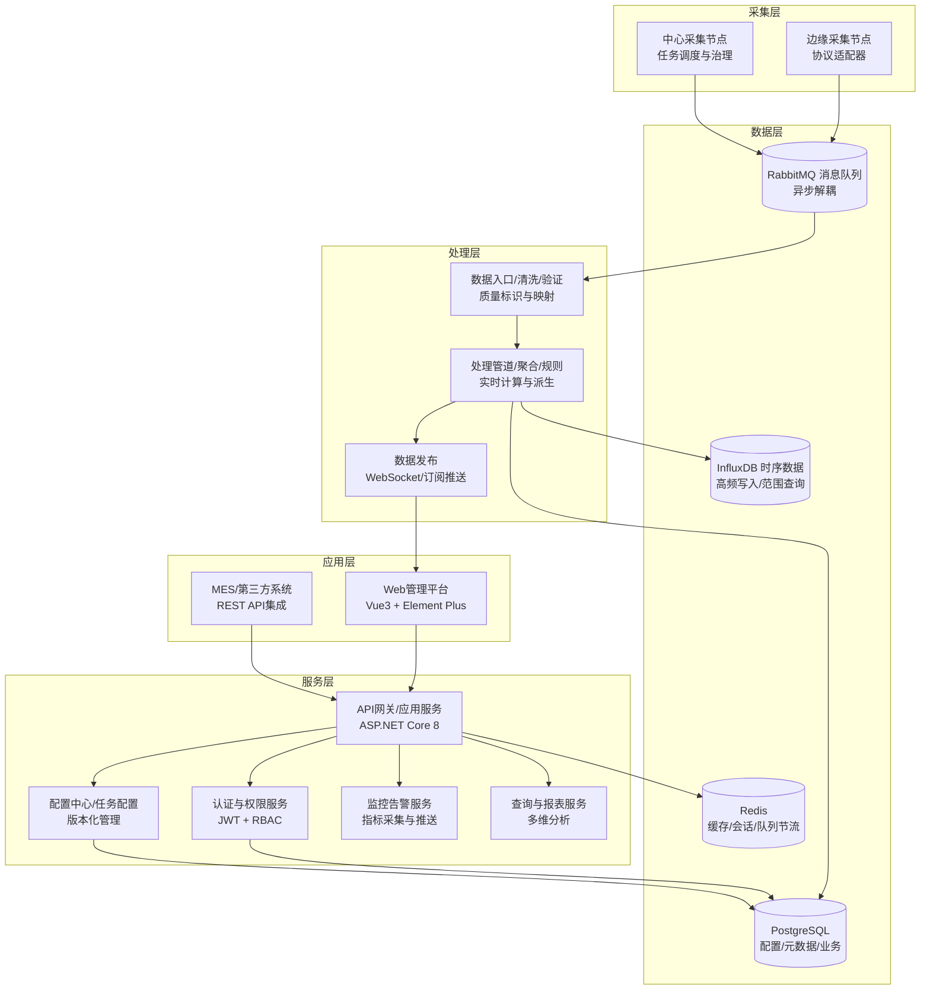

---

## 2. 功能模块视角（概念）
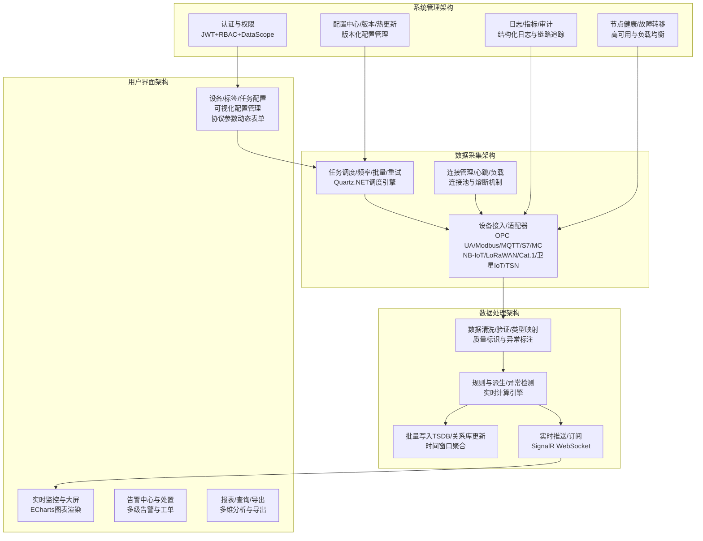

---

## 3. 技术栈视角（详细组件）
```mermaid
graph TB
  subgraph "前端层"
    FE[Vue3 + TypeScript<br/>Element Plus UI<br/>ECharts图表<br/>Axios HTTP客户端]
  end

  subgraph "网关层"
    GW[ASP.NET Core 8<br/>API网关/反向代理<br/>认证中间件<br/>限流与熔断]
  end

  subgraph "应用服务层"
    Svc1[设备/配置/任务服务<br/>业务逻辑与API]
    Svc2[查询/报表服务<br/>多维分析与聚合]
    Svc3[监控告警服务<br/>实时推送与通知]
  end

  subgraph "消息队列"
    MQ[RabbitMQ<br/>Exchange/Queue<br/>持久化/镜像]
  end

  subgraph "缓存层"
    Redis[Redis Cluster<br/>会话存储<br/>缓存/限流<br/>队列节流]
  end

  subgraph "数据存储"
  TSDB[InfluxDB 2.x<br/>时间序列数据库<br/>Flux查询语言<br/>数据保留策略]
  PG[PostgreSQL 14+<br/>关系数据库<br/>JSONB支持<br/>分区表]

%%
> **注意：本系统所有PostgreSQL均指PostgreSQL 14版本。**
  end

  subgraph "实时通信"
    WS[SignalR Hub<br/>WebSocket连接<br/>组播与广播]
  end

  subgraph "边缘采集"
    Edge[.NET 8 Worker Service<br/>协议适配器插件<br/>本地缓存与重放<br/>健康检查]
    EdgeLegacy[.NET Framework 4.5+ Service<br/>简化协议适配<br/>基础缓存<br/>老旧设备支持]
  end

  FE -->|HTTPS/WSS| GW
  GW -->|内部HTTP| Svc1
  GW -->|内部HTTP| Svc2
  GW -->|内部HTTP| Svc3
  Edge -->|AMQP| MQ
  EdgeLegacy -->|AMQP| MQ
  MQ -->|消费| Svc1
  Svc1 -->|批量写入| TSDB
  Svc1 -->|元数据操作| PG
  Svc2 -->|数据查询| TSDB
  Svc2 -->|配置查询| PG
  GW -->|缓存/限流| Redis
  Svc3 -->|实时推送| WS
  WS -->|通知| FE
```

---

## 4. 重点领域架构

### 4.1 协议适配架构（统一接入）
---
### 4.x 设备采集方式区分说明

工业数据采集系统支持两类设备采集方式，需在需求、功能、架构、系统设计中明确区分：

#### 1. 主动采集型设备（系统主动连接设备，拉取数据）
- **定义**：由中心或边缘采集服务主动发起连接，定时或轮询拉取设备数据。
- **典型协议**：OPC UA、Modbus TCP/RTU、Siemens S7、三菱MC等工业协议。
- **数据流向**：采集服务 → 设备，发起连接/读请求，设备响应数据。
- **系统设计特点**：
  - 需维护设备连接池、轮询调度、断线重连、批量优化。
  - 采集任务由平台统一下发，支持频率/窗口/优先级动态调整。
  - 适用于传统PLC、仪表、工业控制器等场景。

#### 2. 主动上报型设备（设备主动连接平台，推送数据）
- **定义**：设备自身主动连接平台，定时或事件触发推送数据。
- **典型协议**：MQTT、NB-IoT、LoRaWAN、Cat.1、卫星IoT等物联网协议。
- **数据流向**：设备 → 采集服务，设备发起连接/推送，平台被动接收。
- **系统设计特点**：
  - 需支持高并发接入、消息订阅、主题管理、设备认证。
  - 设备侧需预置凭证/配置，支持断点续传、缓存重发。
  - 适用于无线传感器、智能终端、远程监控等场景。

#### 3. 架构与功能差异
- 协议适配层需同时支持主动采集与主动上报两类抽象接口。
- 采集调度模块对主动采集型设备负责任务分发与连接管理，对主动上报型设备负责接入认证与消息路由。
- 数据流设计需兼容拉取/推送两种模式，统一数据格式与处理流程。
- 设备管理、配置、监控、告警等功能均需支持两类设备的差异化需求。

> **补充说明**：后续详细设计、接口定义、数据库建模、前端页面均需体现设备采集方式的区分，便于扩展和运维。
- 目标: 在多协议、多厂家设备场景下，提供一致的接入模型与运行时治理。
- 核心原则:
  - 统一抽象: 连接/读写/订阅/状态 的一致接口；面向“设备/标签/任务”的抽象。
  - 插件化装配: 适配器以插件形式装配，支持热升级/灰度发布（停损/回滚）。
  - 连接治理: 连接池/心跳/Keep-Alive/超时/重试/熔断/限流。
  - 数据治理: 类型映射、质量标识(QoD)、时间戳统一、批量与地址连续性优化。

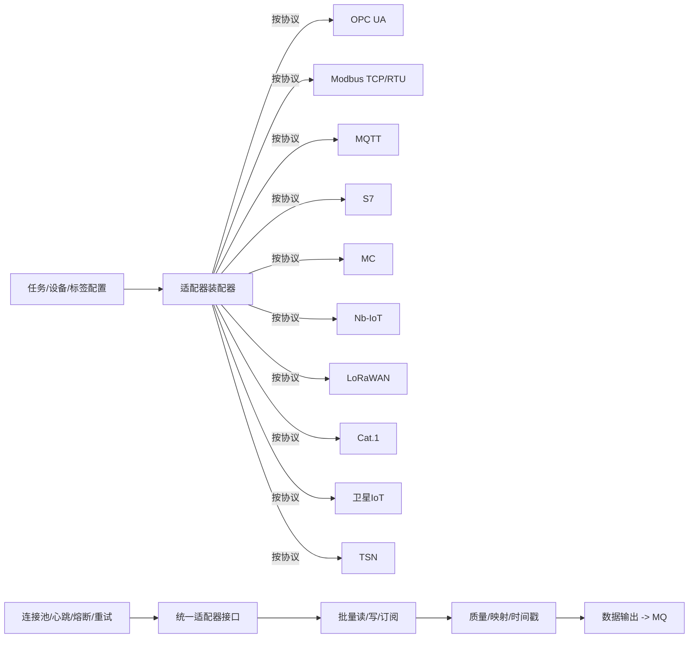

- 状态/异常策略（概述）: 指数退避、线性退避、熔断半开、离线判定、本地缓冲/落盘回放（在FSD 3.5详述）。

#### 协议能力矩阵
| 协议类型 | 连接方式 | 数据模式 | 批量支持 | 订阅支持 | 时延特性 | 适用场景 |
|---------|---------|---------|---------|---------|---------|---------|
| **OPC UA** | TCP/SSL | 订阅/轮询 | ✓ | ✓ | 低(50-200ms) | 现代工业设备 |
| **Modbus TCP** | TCP | 轮询 | ✓ | ✗ | 中(100-500ms) | 传统PLC/仪表 |
| **Modbus RTU** | 串口/网关 | 轮询 | ✓ | ✗ | 高(500-2000ms) | 串口设备 |
| **MQTT** | TCP/TLS | 订阅 | ✓ | ✓ | 低(10-100ms) | IoT设备/传感器 |
| **Siemens S7** | TCP | 轮询 | ✓ | ✗ | 中(50-300ms) | 西门子PLC |
| **Mitsubishi MC** | TCP/串口 | 轮询 | ✓ | ✗ | 中(100-400ms) | 三菱PLC |
| **NB-IoT** | CoAP/UDP | 上报 | ✗ | ✓ | 高(1-10s) | 远程监控 |
| **LoRaWAN** | 网关 | 上报 | ✗ | ✓ | 高(1-30s) | 低功耗广域 |
| **Cat.1** | TCP/UDP | 轮询/上报 | ✓ | ✓ | 中(200-1000ms) | 移动通信 |
| **卫星IoT** | 卫星链路 | 上报 | ✗ | ✓ | 极高(10-60s) | 偏远地区 |
| **TSN** | 以太网 | 订阅 | ✓ | ✓ | 极低(<1ms) | 精密控制 |

#### 适配数据读取时序（示意）
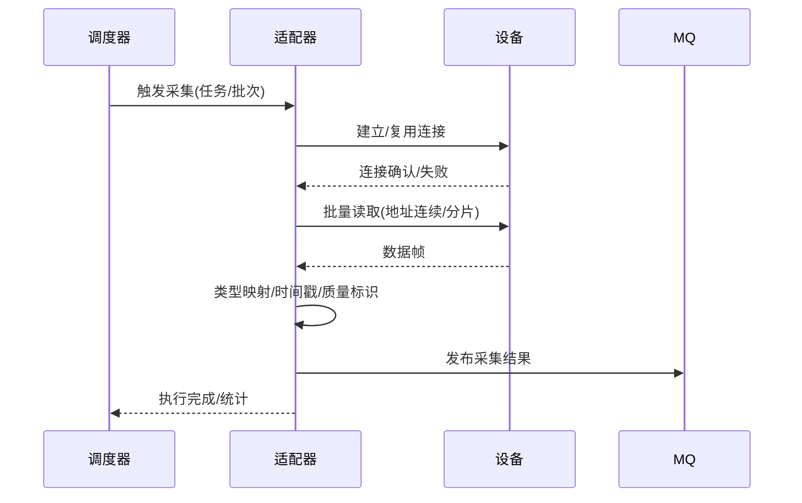

---

### 4.2 分布式采集架构（边缘-中心协同）
- 目标: 多车间/多节点规模化部署；配置集中管理与热更新；节点自治与故障转移。
- 核心机制:
  - 配置下发: Web配置 -> RDB版本化 -> 配置事件(MQ) -> 节点拉取/校验/生效 -> 回执。
  - 负载治理: 任务分片、频率自适应、节点健康度/水位、滚动迁移。
  - 容灾: 节点故障判定(心跳/观测) -> 任务接管 -> 最终一致性保证。

#### 4.2.1 节点注册与同步机制

采集节点（Edge Node）支持两种注册方式，适应不同的部署场景：

| 注册方式 | 说明 | 数据来源 | 适用场景 |
|---------|------|---------|---------|
| **自动注册 (auto)** | 采集器启动时自动向中心注册 | 采集器上报 | 标准化部署，即插即用 |
| **手动注册 (manual)** | 运维人员在管理平台预创建节点 | 运维手动配置 | 预规划部署、离线配置 |

**节点同步流程**：
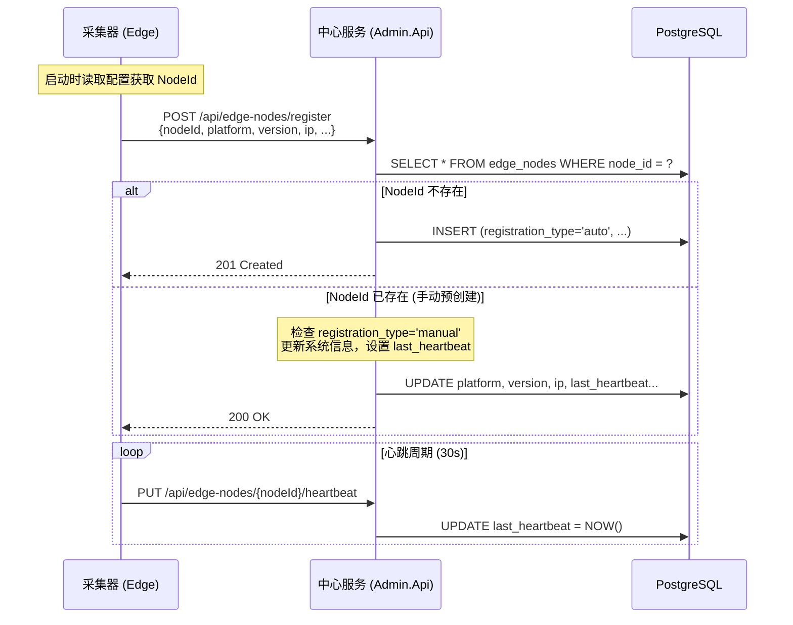

**连接状态判定**：
- `last_heartbeat = NULL` → 未连接（手动创建后采集器未启动）
- `last_heartbeat` 在 2 个心跳周期内 → 在线
- `last_heartbeat` 超过 2 个心跳周期 → 离线

**字段更新策略**：
- **基本信息**（nodeName, location, resourceLimits）：始终允许运维手动编辑
- **系统信息**（platform, version, ip, port, osInfo, hardwareInfo）：
  - 自动注册节点：只读，由采集器上报维护
  - 手动节点（未连接）：可编辑，支持预填写
  - 手动节点（已连接）：只读，由采集器覆盖更新

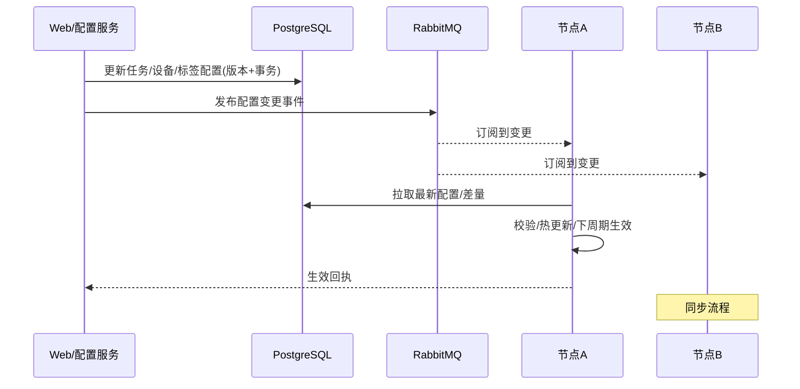

#### 故障转移（示意）
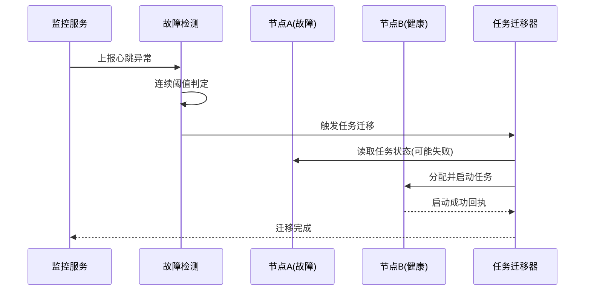

---

### 4.3 实时数据处理架构（高频与一致性）
- 目标: 高吞吐/低时延数据通道，兼顾批量写入与实时可视化推送。
- 核心路径: 入口 -> 校验/清洗 -> 聚合/规则 -> 批量写入TSDB -> 关系库状态更新 -> 实时推送。

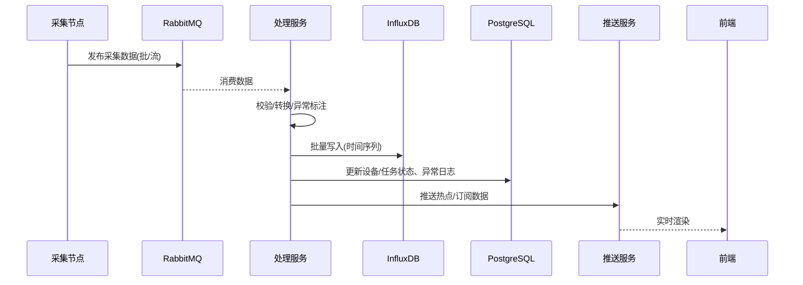

- 关键策略（摘录）:
  - 批处理: 时间/数量窗口（如1000条/5s），控制写放大。
  - 索引: 设备ID+时间范围复合索引（TSDB/关系库各自最佳实践）。
  - 回压与限流: 队列水位/消费者速率自适应；降级优先核心流。
  - 一致性: 最终一致，WAL与重放，失败重试+幂等键。

#### 数据流架构图（端到端）
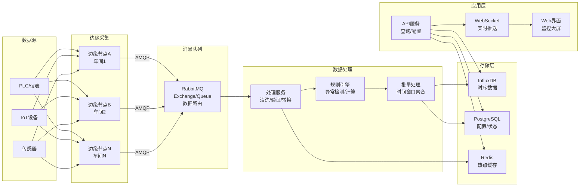

---

## 5. 安全与治理（高层）
- 认证与权限: JWT双令牌 + RBAC + 数据范围(DataScope)；敏感接口限流/审计。
- 配置治理: 版本化/差量下发/一键回滚；变更影响评估与灰度。
- 可观测性: 指标(成功率/时延/积压)、结构化日志、调用链；审计日志中心。
- 多租户预留: 表tenant_id与资源作用域隔离（暂不启用）。

---

## 6. 开发架构 vs 生产部署

### 6.1 开发环境架构
- 单机Docker Compose，包含: API、处理服务、RabbitMQ、InfluxDB、PostgreSQL、Redis、Web前端、1~N个采集节点。
- 便捷性: 本地伪设备/模拟器、种子配置、最小化安全策略、自动热加载。
- 数据: 开发库与测试数据集隔离；可一键初始化/清理。

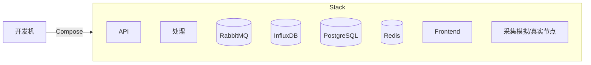

### 6.2 生产部署架构
- **多节点**: 中心服务(应用/处理/查询) + 多个边缘采集节点；RabbitMQ与数据库持久化存储卷。
- **边缘节点分层**: 现代设备(.NET 8.0容器化) + 老旧设备(.NET Framework 4.5+ Windows服务)。
- **老旧设备适配**: 兼容Windows 7、i3 3系CPU、4GB内存等工业现场典型老旧硬件环境。
- **高可用要点**: 队列镜像或仲裁队列、数据库备份策略、服务健康检查与故障转移。
- **网络**: 工业内网优先，严格入站策略；边缘到中心仅必要端口开放。
- **安全**: 证书管理、网络隔离、访问控制、审计日志。

#### 生产部署拓扑图
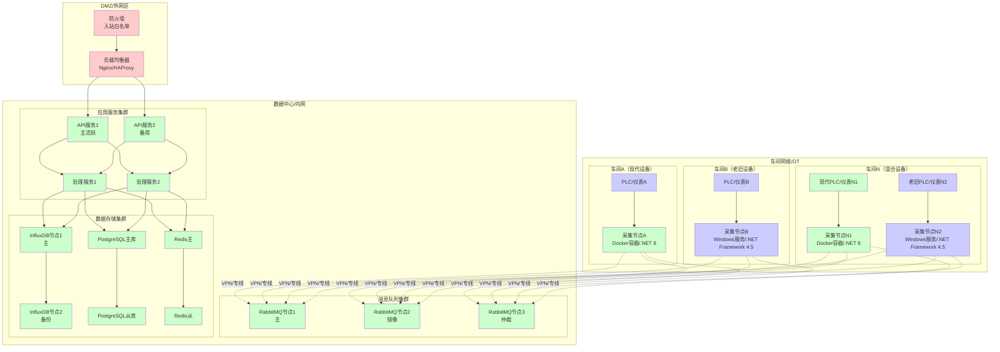

#### 网络安全策略
| 源网络段 | 目标网络段 | 协议/端口 | 访问控制 | 说明 |
|---------|----------|---------|---------|------|
| **外网** | **DMZ** | HTTPS/443 | 白名单IP | Web访问入口 |
| **DMZ** | **数据中心** | HTTP/8080 | 内部转发 | API服务调用 |
| **车间网络** | **数据中心** | AMQP/5672 | VPN/证书 | 数据上报通道 |
| **车间网络** | **数据中心** | HTTPS/443 | VPN/证书 | 配置拉取 |
| **数据中心** | **存储** | TCP/专用端口 | 内网隔离 | 数据库访问 |
| **管理网** | **全网** | SSH/3389 | 堡垒机 | 运维管理 |

#### 容器编排示例
```yaml
# docker-compose.prod.yml 生产环境配置示例
version: '3.8'
services:
  api:
    image: datacollection/api:v1.0
    replicas: 2
    environment:
      - ASPNETCORE_ENVIRONMENT=Production
      - ConnectionStrings__PostgreSQL=Host=pg-cluster;Database=datacollection
      - RabbitMQ__Host=rabbitmq-cluster
    networks:
      - app-network
    deploy:
      resources:
        limits:
          cpus: '2.0'
          memory: 4G
        reservations:
          cpus: '1.0'
          memory: 2G
      restart_policy:
        condition: on-failure
        delay: 10s
        max_attempts: 3
        
  rabbitmq:
    image: rabbitmq:3-management-alpine
    environment:
      - RABBITMQ_DEFAULT_USER=datacollection
      - RABBITMQ_DEFAULT_PASS=${RABBITMQ_PASSWORD}
      - RABBITMQ_CLUSTER_NAME=datacollection-cluster
    volumes:
      - rabbitmq_data:/var/lib/rabbitmq
    networks:
      - app-network
      
  postgresql:
    image: postgres:14-alpine
    environment:
      - POSTGRES_DB=datacollection
      - POSTGRES_USER=datacollection
      - POSTGRES_PASSWORD=${POSTGRES_PASSWORD}
    volumes:
      - postgresql_data:/var/lib/postgresql/data
    networks:
      - app-network

networks:
  app-network:
    driver: overlay
    encrypted: true

volumes:
  rabbitmq_data:
    driver: local
  postgresql_data:
    driver: local
```

---

## 7. 非功能性目标（基线）
- 可用性: 7×24稳定运行；关键链路SLO可用性≥99.5%。
- 性能: 单节点采集≥5k点/秒（视协议而定）；处理写入延迟P95 ≤ 2s。
- 扩展性: 采集节点水平扩展；任务与设备线性扩容。
- 安全性: 鉴权覆盖100%受保护接口；关键操作全审计。

---

## 8. 接口与边界（概要）
- 采集节点 -> 队列: 工业数据消息（标准化点位、时间戳、质量标记）。
- 处理服务 -> TSDB/RDB: 批量写入/状态更新；故障审计。
- API -> 前端/MES: REST与WebSocket；分页/查询/导出。
- 配置变更 -> 节点: MQ事件 + 拉取最新版本；热更新确认回执。

---

## 9. 实施挑战与解决方案

### 9.1 技术难点分析

#### 9.1.1 协议适配复杂性 🔴 高难度
**难点描述**:
- 工业协议标准不统一，厂商实现差异大（如Modbus变种、OPC UA配置复杂）
- 协议时序要求严格，错误处理机制各异
- 设备固件版本兼容性问题，连接稳定性挑战

**技术挑战**:
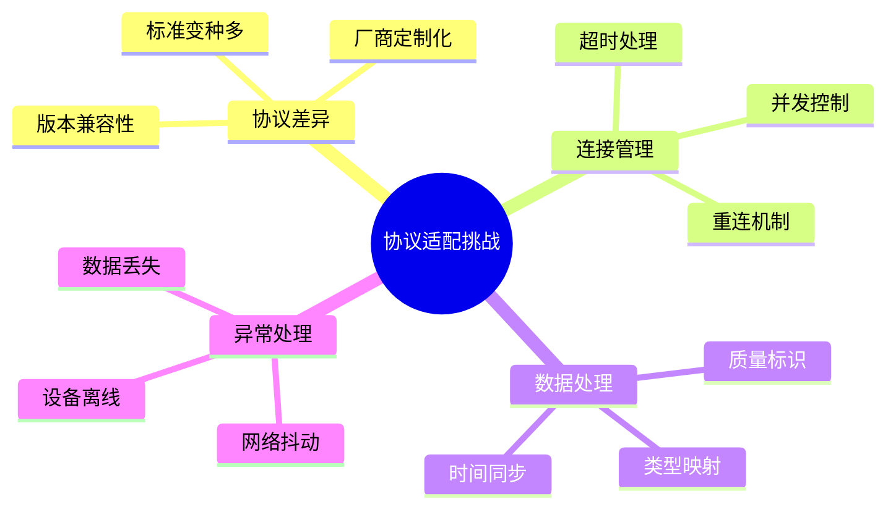

**AI辅助解决方案**:
- **GitHub Copilot**: 快速生成协议解析代码模板，减少70%样板代码编写
- **ChatGPT/Claude**: 协议文档理解与实现指导，异常场景处理策略
- **代码生成**: 基于协议规范自动生成适配器骨架代码

#### 9.1.2 实时性与一致性平衡 🟡 中等难度
**难点描述**:
- 高频数据采集(>5k点/秒)与批量写入的平衡
- 分布式环境下数据一致性保证
- 内存使用与GC压力优化

**AI辅助解决方案**:
- **性能分析**: AI辅助识别性能瓶颈，优化算法实现
- **并发编程**: 智能生成异步处理代码，减少线程安全问题
- **内存优化**: AI建议最佳的对象池和缓存策略

#### 9.1.3 分布式系统复杂性 🟡 中等难度
**难点描述**:
- 配置热更新的一致性传播
- 节点故障检测与任务迁移
- 网络分区恢复策略

**AI辅助解决方案**:
- **分布式模式**: AI生成常用分布式模式代码(Circuit Breaker, Saga等)
- **测试用例**: 自动生成分布式场景测试代码
- **监控代码**: AI辅助生成健康检查和指标采集代码

### 9.2 部署难点分析

#### 9.2.1 工业环境适配 🔴 高难度
**难点描述**:
- 工业现场网络环境复杂(防火墙、NAT、VLAN隔离)
- 硬件资源限制(边缘设备CPU/内存不足)
- 安全合规要求(等保、行业标准)

**部署挑战矩阵**:
| 挑战领域 | 具体问题 | 影响程度 | 解决复杂度 | AI辅助程度 |
|---------|---------|---------|-----------|-----------|
| **网络配置** | 防火墙规则、端口映射 | 高 | 中 | 🤖 配置生成 |
| **资源约束** | 边缘设备性能限制 | 高 | 高 | 🤖 性能优化建议 |
| **安全合规** | 加密、认证、审计 | 高 | 中 | 🤖 安全代码模板 |
| **版本管理** | 多环境配置差异 | 中 | 低 | 🤖 配置模板生成 |

**AI辅助解决方案**:
- **配置管理**: AI生成不同环境的Docker Compose和Kubernetes配置
- **脚本自动化**: 智能生成部署脚本和健康检查脚本
- **文档生成**: 自动生成部署手册和故障排查指南

#### 9.2.2 多环境一致性 🟡 中等难度
**难点描述**:
- 开发/测试/生产环境配置差异管理
- 数据库schema演进与迁移
- 服务依赖版本兼容性

**AI辅助解决方案**:
- **配置验证**: AI校验不同环境配置的一致性
- **迁移脚本**: 自动生成数据库迁移脚本
- **依赖分析**: AI分析服务依赖关系，预警兼容性问题

### 9.3 运维难点分析

#### 9.3.1 故障诊断与恢复 🔴 高难度
**难点描述**:
- 分布式系统故障定位困难
- 工业现场故障响应时间要求严格(7×24小时)
- 多层次监控数据关联分析复杂

**运维挑战**:
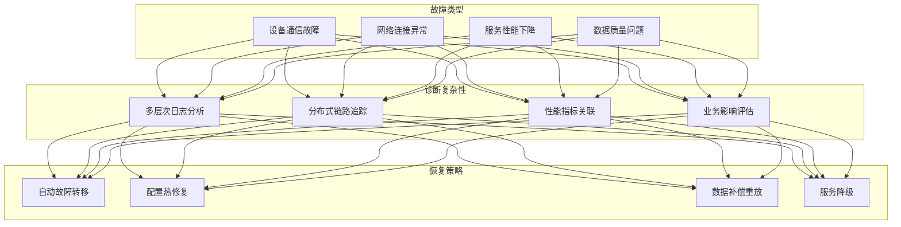

**AI辅助解决方案**:
- **智能运维**: AI分析日志模式，自动识别异常和根因
- **预测性维护**: 基于历史数据预测设备故障
- **自动化脚本**: AI生成故障恢复和数据修复脚本
- **知识库**: AI构建故障处理知识库，提供解决方案建议

#### 9.3.2 性能调优与扩容 🟡 中等难度
**难点描述**:
- 系统性能瓶颈识别与优化
- 水平扩容策略制定
- 资源使用率优化

**AI辅助解决方案**:
- **性能分析**: AI分析性能指标，识别瓶颈组件
- **容量规划**: 基于历史数据预测资源需求
- **调优建议**: AI提供JVM、数据库、缓存等调优参数建议

### 9.4 AI辅助编程实现可能性评估

#### 9.4.1 开发效率提升评估
| 开发阶段 | 传统开发工时 | AI辅助工时 | 效率提升 | 质量提升 |
|---------|-------------|-----------|---------|---------|
| **需求分析** | 40h | 24h | 40% ⬆️ | 需求理解更准确 |
| **架构设计** | 80h | 56h | 30% ⬆️ | 设计模式更标准 |
| **代码实现** | 400h | 240h | 40% ⬆️ | 样板代码自动化 |
| **单元测试** | 120h | 60h | 50% ⬆️ | 测试覆盖率更高 |
| **文档编写** | 60h | 24h | 60% ⬆️ | 文档质量更一致 |
| **调试优化** | 100h | 70h | 30% ⬆️ | 问题定位更快 |
| **总计** | **800h** | **474h** | **41% ⬆️** | **整体质量提升** |

#### 9.4.2 关键技术点AI辅助策略
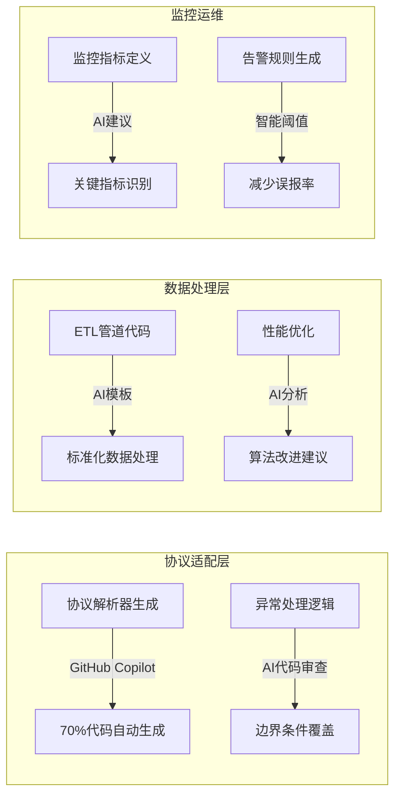

#### 9.4.3 风险控制与质量保证
**AI辅助质量控制**:
- **代码审查**: AI自动识别潜在bug和安全漏洞
- **测试生成**: 自动生成边界条件和异常场景测试
- **性能测试**: AI生成压力测试脚本和性能基准
- **安全扫描**: 智能识别安全漏洞和合规性问题

**人工把控要点**:
- 业务逻辑正确性需人工验证
- 工业现场特殊需求需经验判断  
- 安全合规要求需专业评估
- 性能调优需结合实际环境

### 9.5 实施建议

#### 9.5.1 分阶段实施策略
1. **第一阶段(MVP)**:  
   - 重点：核心协议适配 + 基础数据处理
   - AI辅助：代码生成、单元测试、文档编写
   - 风险控制：小范围试点，快速迭代

2. **第二阶段(扩展)**:
   - 重点：分布式部署 + 高可用改造  
   - AI辅助：配置管理、监控代码、故障诊断
   - 风险控制：灰度发布，性能基准测试

3. **第三阶段(优化)**:
   - 重点：智能运维 + 性能优化
   - AI辅助：预测性维护、自动化运维、持续优化
   - 风险控制：A/B测试，回滚机制完善

#### 9.5.2 团队能力建设
- **AI工具培训**: GitHub Copilot、ChatGPT等工具使用技巧
- **代码质量**: AI辅助下的代码审查流程和质量标准
- **运维自动化**: AI驱动的监控告警和故障处理流程

---

## 10. 风险提示与预留
- 协议异构深度与厂商差异：需建立适配器兼容性清单与回归集。
- 高频/突发流量：需容量规划与压测基线持续更新。
- 工业现场网络抖动：离线缓存/重放机制务必实测验证。

## 10. 风险提示与预留

### 10.1 技术风险
- **协议异构深度与厂商差异**：需建立适配器兼容性清单与回归集。
- **高频/突发流量冲击**：需容量规划与压测基线持续更新。
- **工业现场网络抖动**：离线缓存/重放机制务必实测验证。
- **AI辅助代码质量**：需建立人工审查机制，避免AI生成代码的潜在缺陷。

### 10.2 部署风险  
- **工业环境复杂性**：网络配置、安全策略需提前踩坑验证。
- **版本兼容性管理**：多环境配置差异需严格版本控制。
- **数据迁移风险**：需完整的备份恢复和回滚策略。

### 10.3 运维风险
- **人员技能要求**：需培养既懂工业协议又懂现代架构的复合型人才。
- **7×24运维压力**：需建立完善的值班制度和应急响应机制。
- **AI依赖风险**：避免过度依赖AI工具，保持核心技术能力。

### 10.4 预留扩展
- **协议扩展预留**：插件化架构支持未来新协议快速接入。
- **云原生演进**：为Kubernetes、Service Mesh等技术预留接口。
- **边缘计算增强**：为边缘AI推理、本地决策等功能预留架构空间。

---

## 11. 架构演进路径

### 11.1 分阶段演进策略
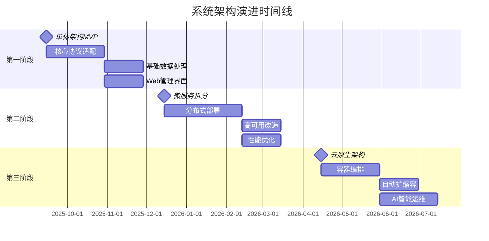

### 11.2 技术债务管理
- **遗留系统集成**: 通过适配器模式平滑过渡，避免大爆炸式改造。
- **数据迁移策略**: 支持增量同步，双写验证，灰度切换。
- **向后兼容性**: API版本管理，配置格式兼容，协议向下支持。

### 11.3 扩展点设计
- **协议扩展**: 插件化适配器，支持自定义协议接入。
- **规则引擎**: 可视化规则配置，支持JavaScript/Python脚本。
- **通知渠道**: 企业微信、钉钉、邮件、短信多渠道集成。
- **第三方集成**: MES、ERP、数据中台等外部系统API集成。

---

## 12. 附录
- 术语与缩写: TSDB(InfluxDB)、RDB(PostgreSQL)、MQ(RabbitMQ)。
- 参考: 详见PRD/FSD相关章节（协议矩阵、调度策略、异常与重试、认证与权限、关键时序）。

（完）
