# 工业数据采集系统低级设计说明（LLD）

**项目名称**：工业数据采集通用后台系统  
**文档版本**：v1.3  
**创建日期**：2025-09-15  
**最后更新**：2025-12-27  
**文档作者**：eatbs0956  
**依据文档**：02_PRD_工业数据采集系统产品需求文档、03_FSD_工业数据采集系统功能规格说明文档、04_SSA_工业数据采集系统架构设计说明
---


## 目录
1. [概述与范围、约束与假设](#1-概述与范围约束与假设)
  1.1 [设计目标](#11-设计目标)
  1.2 [约束与假设](#12-约束与假设)
    1.2.1 [技术约束](#121-技术约束)
    1.2.2 [性能约束](#122-性能约束)
    1.2.3 [兼容性假设](#123-兼容性假设)
    1.2.4 [AI辅助开发假设](#124-ai辅助开发假设)
  1.3 [业务规则与审计要求](#13-业务规则与审计要求)
    1.3.1 [数据生命周期管理](#131-数据生命周期管理)
    1.3.2 [审计追踪规范](#132-审计追踪规范)
    1.3.3 [数据完整性约束](#133-数据完整性约束)
    1.3.4 [命名规范与编码标准](#134-命名规范与编码标准)
    1.3.5 [多租户数据隔离](#135-多租户数据隔离)
    1.3.6 [合规性要求](#136-合规性要求)
2. [系统上下文与模块边界](#2-系统上下文与模块边界)
  2.1 [分层架构视角（概念）](#21-分层架构视角概念)
  2.2 [详细系统架构图](#22-详细系统架构图)
  2.3 [模块边界与职责](#23-模块边界与职责)
    2.3.1 [边缘采集层](#231-边缘采集层)
    2.3.2 [中心服务层](#232-中心服务层)
    2.3.3 [数据存储层](#233-数据存储层)
    2.3.4 [外部集成](#234-外部集成)
3. [领域模型与关键实体](#3-领域模型与关键实体)
  3.1 [领域模型图](#31-领域模型图)
  3.2 [关键实体说明](#32-关键实体说明)
4. [协议适配层](#4-协议适配层)
  4.1 [设计目标](#41-设计目标)
  4.2 [协议适配层类图设计](#42-协议适配层类图设计)
  4.3 [双平台架构设计](#43-双平台架构设计)
    4.3.1 [核心接口层 (.NET Standard 2.0)](#431-核心接口层-net-standard-20)
5. [采集调度](#5-采集调度)
  5.1 [设计目标](#51-设计目标)
  5.2 [类图与接口](#52-类图与接口)
  5.3 [关键接口签名（C#示例）](#53-关键接口签名c示例)
  5.4 [任务状态机](#54-任务状态机)
  5.5 [调度策略与伪代码](#55-调度策略与伪代码)
  5.6 [兼容性与迁移说明](#56-兼容性与迁移说明)
6. [实时处理](#6-实时处理)
  6.1 [设计目标](#61-设计目标)
  6.2 [类图与接口](#62-类图与接口)
  6.3 [关键接口签名（C#示例）](#63-关键接口签名c示例)
  6.4 [处理流程与伪代码](#64-处理流程与伪代码)
  6.5 [治理与一致性策略](#65-治理与一致性策略)
  6.6 [兼容性与迁移说明](#66-兼容性与迁移说明)
7. [消息通道](#7-消息通道)
  7.1 [设计目标](#71-设计目标)
  7.2 [类图与接口](#72-类图与接口)
  7.3 [关键接口签名（C#示例）](#73-关键接口签名c示例)
  7.4 [消息命名与契约](#74-消息命名与契约)
  7.5 [伪代码示例](#75-伪代码示例)
  7.6 [异常与重试、DLX策略](#76-异常与重试dlx策略)
  7.7 [兼容性与迁移说明](#77-兼容性与迁移说明)
8. [查询与推送](#8-查询与推送)
  8.1 [设计目标](#81-设计目标)
  8.2 [类图与接口](#82-类图与接口)
  8.3 [关键接口签名（C#示例）](#83-关键接口签名c示例)
  8.4 [查询策略与索引优化](#84-查询策略与索引优化)
  8.5 [WebSocket推送与订阅](#85-websocket推送与订阅)
  8.6 [伪代码示例](#86-伪代码示例)
  8.7 [兼容性与迁移说明](#87-兼容性与迁移说明)
9. [安全与权限](#9-安全与权限)
  9.1 [设计目标](#91-设计目标)
  9.2 [类图与接口设计](#92-类图与接口设计)
  9.3 [主要接口定义（C#）](#93-主要接口定义c)
  9.4 [认证与鉴权流程](#94-认证与鉴权流程)
  9.5 [伪代码示例](#95-伪代码示例)
  9.6 [兼容性与扩展性说明](#96-兼容性与扩展性说明)
10. [边缘节点兼容性设计](#10-边缘节点兼容性设计)
  10.1 [双平台架构概述](#101-双平台架构概述)
  10.2 [老旧设备环境特征与约束](#102-老旧设备环境特征与约束)
    10.2.1 [硬件环境限制](#1021-硬件环境限制)
    10.2.2 [软件环境约束](#1022-软件环境约束)
  10.3 [双平台功能差异对比](#103-双平台功能差异对比)
  10.4 [Windows服务实现详解](#104-windows服务实现详解)
    10.4.1 [Windows服务架构](#1041-windows服务架构)
    10.4.2 [MSI安装包配置](#1042-msi安装包配置)
    10.4.3 [部署脚本](#1043-部署脚本)
  10.5 [资源优化与性能调优](#105-资源优化与性能调优)
    10.5.1 [内存管理策略](#1051-内存管理策略)
  10.6 [统一数据格式与兼容性](#106-统一数据格式与兼容性)
    10.6.1 [统一消息格式](#1061-统一消息格式)
    10.6.2 [版本识别与监控](#1062-版本识别与监控)
  10.7 [兼容性测试与验证](#107-兼容性测试与验证)
    10.7.1 [双平台兼容性验证](#1071-双平台兼容性验证)
    10.7.2 [硬件环境兼容性测试](#1072-硬件环境兼容性测试)
    10.7.3 [集成测试与回归验证](#1073-集成测试与回归验证)
11. [数据模型与存储设计](#11-数据模型与存储设计)
  11.1 [关系型数据模型（PostgreSQL 14）](#111-关系型数据模型postgresql-14)
    11.1.1 [核心数据模型](#1111-核心数据模型)
    11.1.2 [双平台数据访问层](#1112-双平台数据访问层)
  11.2 [时序数据模型（InfluxDB）](#112-时序数据模型influxdb)
    11.2.1 [数据存储结构](#1121-数据存储结构)
    11.2.2 [查询性能优化](#1122-查询性能优化)
  11.3 [数据一致性与归档](#113-数据一致性与归档)
    11.3.1 [跨存储一致性](#1131-跨存储一致性)
    11.3.2 [数据归档策略](#1132-数据归档策略)
  11.4 [兼容性与扩展性说明](#114-兼容性与扩展性说明)
    11.4.1 [数据库兼容性](#1141-数据库兼容性)
    11.4.2 [扩展性设计](#1142-扩展性设计)
12. [接口与契约](#12-接口与契约)
  12.1 [REST OpenAPI 摘要](#121-rest-openapi-摘要)
  12.2 [gRPC 协议（proto 示例）](#122-grpc-协议proto-示例)
  12.3 [消息模型（RabbitMQ JSON Schema）](#123-消息模型rabbitmq-json-schema)
  12.4 [配置文件示例](#124-配置文件示例)
  12.5 [错误码与响应规范](#125-错误码与响应规范)
  12.6 [监控与指标（Prometheus Metrics 示例）](#126-监控与指标prometheus-metrics-示例)
  12.7 [兼容性与扩展性说明](#127-兼容性与扩展性说明)
13. [错误处理与异常管理](#13-错误处理与异常管理)
  13.1 [设计原则](#131-设计原则)
  13.2 [异常分类与处理流程](#132-异常分类与处理流程)
  13.3 [统一异常处理中间件（C# 伪代码）](#133-统一异常处理中间件c-伪代码)
  13.4 [错误日志与追踪](#134-错误日志与追踪)
  13.5 [兼容性与扩展性说明](#135-兼容性与扩展性说明)
14. [可观测性与运维](#14-可观测性与运维)
  14.1 [监控与告警](#141-监控与告警)
  14.2 [日志采集与分析](#142-日志采集与分析)
  14.3 [链路追踪与APM](#143-链路追踪与apm)
  14.4 [运维工具与自愈](#144-运维工具与自愈)
  14.5 [兼容性与扩展性说明](#145-兼容性与扩展性说明)
15. [双平台部署策略设计](#15-双平台部署策略设计)
  15.1 [部署架构概述](#151-部署架构概述)
  15.2 [生产部署架构（参考SSA设计）](#152-生产部署架构参考ssa设计)
    15.2.1 [生产部署拓扑](#1521-生产部署拓扑)
    15.2.2 [网络安全策略](#1522-网络安全策略)
    15.2.3 [高可用要点](#1523-高可用要点)
  15.3 [开发环境容器化部署](#153-开发环境容器化部署)
    15.3.1 [Docker Compose配置](#1531-docker-compose配置)
    15.3.2 [一键部署脚本](#1532-一键部署脚本)
  15.4 [老旧设备Windows服务部署](#154-老旧设备windows服务部署)
    15.4.1 [MSI安装包生成](#1541-msi安装包生成)
  15.5 [统一配置管理](#155-统一配置管理)
  15.6 [部署监控与运维](#156-部署监控与运维)
16. [性能与容量基线](#16-性能与容量基线)
  16.1 [设计目标](#161-设计目标)
  16.2 [性能基线](#162-性能基线)
  16.3 [容量基线](#163-容量基线)
  16.4 [性能测试与调优建议](#164-性能测试与调优建议)
  16.5 [兼容性与扩展性说明](#165-兼容性与扩展性说明)
17. [AI开发工具集成指南](#17-ai开发工具集成指南)
  17.1 [AI驱动的双平台开发策略](#171-ai驱动的双平台开发策略)
  17.2 [GitHub Copilot在双平台开发中的应用](#172-github-copilot在双平台开发中的应用)
  17.3 [ChatGPT在架构设计中的应用](#173-chatgpt在架构设计中的应用)
  17.4 [AI辅助测试与质量保证](#174-ai辅助测试与质量保证)
  17.5 [AI工具配置与工作流](#175-ai工具配置与工作流)
  17.6 [AI开发效率指标](#176-ai开发效率指标)
  17.7 [AI工具进阶应用](#177-ai工具进阶应用)
18. [数据迁移与升级方案](#18-数据迁移与升级方案)
  18.1 [设计原则](#181-设计原则)
  18.2 [迁移流程](#182-迁移流程)
  18.3 [迁移脚本与工具](#183-迁移脚本与工具)
  18.4 [升级兼容性](#184-升级兼容性)
  18.5 [兼容性与扩展性说明](#185-兼容性与扩展性说明)
19. [附录](#19-附录)
  19.1 [术语表](#191-术语表)
  19.2 [参考文献与外部链接](#192-参考文献与外部链接)

---

## 1. 概述与范围、约束与假设

### 1.1 设计目标
基于PRD v1.1、FSD v1.1、SSA v1.1文档要求，本LLD文档旨在：
- **明确各模块的详细实现方案**，指导开发团队进行精确的代码实现
- **约定所有关键契约**（API、消息、数据、配置、错误码、日志、指标），确保系统各组件间的无缝协作
- **兼容双平台架构**：.NET 8.0主线架构 + .NET Framework 4.5+老旧设备支持
- **边缘节点适配策略**：支持Windows 7/i3 3系/4GB内存等工业现场典型老旧硬件环境
- **AI辅助开发指导**：提供GitHub Copilot、ChatGPT等AI工具在各开发阶段的具体使用策略

### 1.2 约束与假设

#### 1.2.1 技术约束
- **双平台支持**：
  - **.NET 8.0**：中心服务主架构，现代边缘节点（Windows 10+/Linux）
  - **.NET Framework 4.5+**：老旧设备兼容版本（Windows 7/8）
- **设备协议适配器以插件方式装配**，支持热插拔与版本升级
- **采集节点运行环境**：
  - **Windows（主推荐）**：完整工业协议支持，现场总线驱动丰富
  - **Linux/amd64、arm64（特定场景）**：边缘计算、资源受限环境
  - **优先级说明**：Windows环境可获得最佳的工业协议兼容性和驱动支持
- **时间戳统一采用UTC+ISO8601格式**，确保全球时区兼容
- **PostgreSQL均指PostgreSQL 14版本**，充分利用其企业级特性
- **Docker Compose为主要部署方案**，Windows Server支持Windows容器
- **JWT算法支持HS256/RS256**，设备侧证书接口预留

#### 1.2.2 性能约束
- **单节点采集并发**：≥5k点/秒（.NET 8.0），≥1k点/秒（.NET Framework 4.5+）
- **API响应时间**：P95≤2s（中心服务），P95≤5s（边缘节点）  
  > **说明**：P95（第95百分位）是性能统计中的一个常用指标，表示95%的API请求响应时间低于该值，仅有5%的请求超过此时间。用于衡量系统在高负载下的响应能力和用户体验。
- **消息延迟**：端到端≤500ms（现代），≤2s（老旧设备）
- **内存限制**：现代设备≥8GB，老旧设备≤4GB RAM

#### 1.2.3 兼容性假设
- **老旧设备环境**：Windows 7 SP1、i3 3系CPU、4GB内存、基础网络
- **现代设备环境**：Windows 10+/Linux、多核CPU、8GB+内存、千兆网络
- **协议支持差异**：老旧设备仅支持核心协议基础功能，现代设备支持完整协议特性
- **数据格式统一**：两个版本输出相同格式的数据消息，确保中心处理系统兼容

#### 1.2.4 AI辅助开发假设
- **开发团队具备GitHub Copilot等AI工具使用经验**
- **关键业务逻辑仍需人工验证**，AI主要用于样板代码生成和优化建议
- **代码质量控制**：AI生成代码必须通过人工审查和测试验证

### 1.3 业务规则与审计要求

#### 1.3.1 数据生命周期管理
- **原始数据保留**：采集原始数据保留30天，支持快速查询和分析
- **聚合数据保留**：按小时/天聚合的数据保留1年，用于历史趋势分析
- **配置数据保留**：设备配置、用户配置、系统配置永久保留，支持版本管理
- **日志数据保留**：系统日志保留90天，审计日志保留3年
- **备份策略**：关键数据定期备份，支持增量备份和全量备份

#### 1.3.2 审计追踪规范
- **强制审计字段**：所有业务表必须包含以下字段：
  - `created_by VARCHAR(64) NOT NULL` - 创建用户
  - `created_at TIMESTAMP WITH TIME ZONE DEFAULT now()` - 创建时间
  - `updated_by VARCHAR(64)` - 最后更新用户
  - `updated_at TIMESTAMP WITH TIME ZONE` - 最后更新时间
  - `deleted_flag BOOLEAN DEFAULT FALSE` - 软删除标记
- **操作日志记录**：所有CRUD操作必须记录到审计日志表
- **敏感操作追踪**：配置变更、权限修改、数据导出等操作详细记录
- **数据变更历史**：关键业务数据支持变更历史查询和回滚

#### 1.3.3 数据完整性约束
- **软删除策略**：业务数据采用软删除（deleted_flag），物理数据保持完整
- **外键约束**：所有关联关系使用外键约束，确保数据一致性
- **数据校验规则**：
  - 设备ID、标签ID等关键标识符必须唯一
  - 数值型数据必须在合理范围内
  - 时间戳必须符合ISO8601格式
  - 枚举值必须在预定义范围内

#### 1.3.4 命名规范与编码标准
- **数据库命名**：
  - 表名：`snake_case`（如：`device_configurations`）
  - 字段名：`snake_case`（如：`created_at`）
  - 索引名：`idx_表名_字段名`（如：`idx_devices_tenant_id`）
- **API接口命名**：
  - 接口路径：`kebab-case`（如：`/api/device-configs`）
  - JSON字段：`camelCase`（如：`deviceId`、`createdAt`）
- **消息字段命名**：`camelCase`（如：`messageId`、`timestamp`）

#### 1.3.5 多租户数据隔离
- **租户标识**：所有业务数据必须包含`tenant_id UUID NOT NULL`字段
- **数据访问控制**：API查询默认带租户过滤条件，防止数据泄露
- **资源配额管理**：按租户设置设备数量、数据量、API调用次数等配额
- **数据导出限制**：租户只能导出自己的数据，管理员可跨租户操作

#### 1.3.6 合规性要求
- **数据脱敏**：敏感数据在日志中自动脱敏显示
- **访问权限控制**：基于RBAC模型，最小权限原则
- **数据加密**：传输过程TLS加密，敏感数据存储加密
- **审计报告**：支持生成合规性审计报告，满足行业监管要求

---

## 2. 系统上下文与模块边界

### 2.1 分层架构视角（概念）
从概念层面，系统采用分层架构设计，各层职责清晰，便于模块化开发和维护：

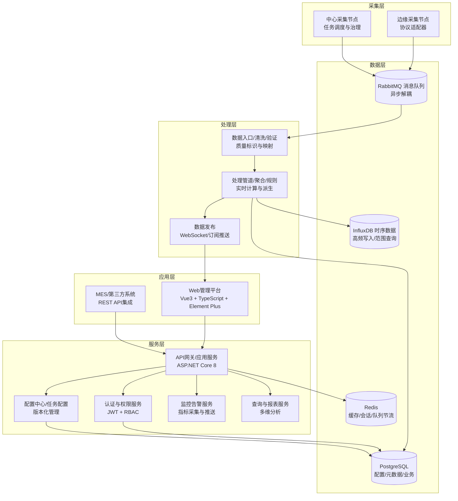

### 2.2 详细系统架构图
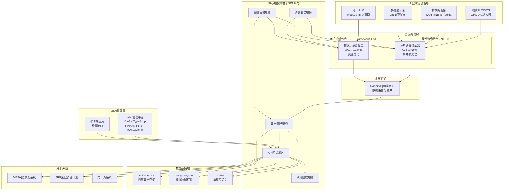

### 2.3 模块边界与职责

#### 2.3.1 边缘采集层
**现代边缘节点 (.NET 8.0)**：
- **协议适配器**：全协议完整功能，支持订阅、批量、异步处理
- **本地缓存**：高性能内存+磁盘缓存，断线续传
- **数据处理**：实时清洗、规则验证、格式转换
- **智能重连**：指数退避、健康检查、故障转移
- **配置热更新**：动态配置加载，无需重启

**老旧边缘节点 (.NET Framework 4.5+)**：
- **简化协议**：核心协议基础功能，主要轮询模式
- **基础缓存**：文件缓存，资源优化
- **基础处理**：简单数据验证和格式化
- **简单重连**：固定间隔重试
- **配置重启生效**：配置变更需重启服务

#### 2.3.2 中心服务层
- **API网关服务**：统一入口、路由、认证、限流、监控
- **数据处理服务**：实时数据清洗、规则引擎、批量写入、异常检测
- **调度管理服务**：采集任务调度、节点管理、配置分发
- **认证授权服务**：用户认证、权限控制、令牌管理、审计日志
- **监控告警服务**：系统监控、故障检测、告警通知、性能分析

#### 2.3.3 数据存储层
- **InfluxDB 2.x**：时序数据存储，高性能写入和查询
- **PostgreSQL 14**：关系数据存储，事务支持，复杂查询
- **Redis**：缓存存储，会话管理，实时计数

#### 2.3.4 外部集成
- **RESTful API**：标准化接口，支持OpenAPI规范
- **WebSocket推送**：实时数据推送，设备状态通知
- **消息队列集成**：异步消息通信，系统解耦

---

## 3. 领域模型与关键实体

### 3.1 领域模型图
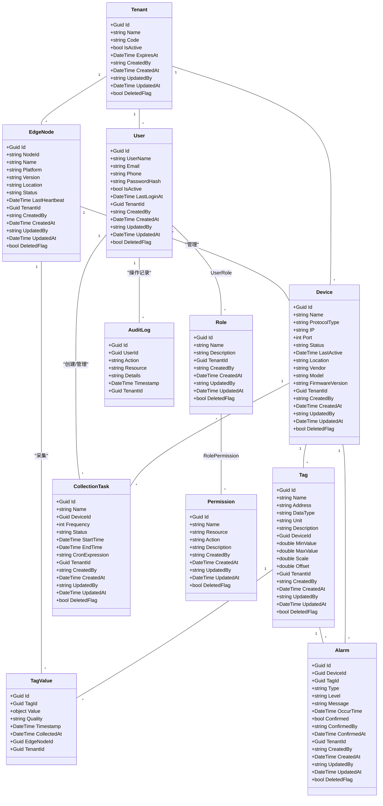

### 3.2 关键实体说明
- **Device**：采集设备，包含协议类型、厂商、型号、状态、审计字段。
- **Tag**：设备点位，包含地址、数据类型、单位、描述、审计字段。
- **Task**：采集任务，关联设备与点位，包含频率、状态、时间、审计字段。
- **Alarm**：告警事件，关联设备，包含类型、级别、消息、时间、确认状态、审计字段。
- **User**：系统用户，包含角色、联系方式、审计字段。
- **AuditFields**：所有表通用字段（created_by, created_at, updated_by, updated_at, deleted_flag）。

---

## 4. 协议适配层
---
### 4.x 设备采集方式区分说明

工业数据采集系统详细设计需明确两类设备采集方式，指导协议适配、采集调度、数据流、接口实现：

#### 1. 主动采集型设备（系统主动连接设备，拉取数据）
- **定义**：采集服务主动连接设备，定时/轮询拉取数据。
- **典型协议**：OPC UA、Modbus TCP/RTU、S7、MC等。
- **数据流向**：采集服务 → 设备，发起连接/读请求，设备响应。
- **实现要点**：
  - 连接池管理、断线重连、采集任务调度、批量优化。
  - 设备配置需包含连接参数、采集频率、点位映射。
  - 适用于PLC、仪表、工业控制器等。

#### 2. 主动上报型设备（设备主动连接平台，推送数据）
- **定义**：设备主动连接平台，定时或事件触发推送数据。
- **典型协议**：MQTT、NB-IoT、LoRaWAN、Cat.1等。
- **数据流向**：设备 → 采集服务，设备发起连接/推送，平台被动接收。
- **实现要点**：
  - 高并发接入、消息订阅、主题管理、设备认证。
  - 设备侧需预置凭证/配置，支持断点续传、缓存重发。
  - 适用于无线传感器、智能终端、远程监控等。

#### 3. 详细设计差异
- 协议适配层需分别实现主动采集与主动上报的抽象接口。
- 采集调度模块对主动采集型设备负责任务分发与连接管理，对主动上报型设备负责接入认证与消息路由。
- 数据流、接口、数据库模型需兼容两种采集模式，统一数据格式。
- 设备管理、配置、监控、告警等功能需支持两类设备的差异化需求。

> **补充说明**：后续各章节详细设计、接口定义、数据库建模、前端页面均需体现设备采集方式的区分。

### 4.1 设计目标
协议适配层是系统的核心模块，负责统一抽象各种工业协议的差异，提供标准化的数据采集接口。设计目标包括：

- **全协议支持**：OPC UA、Modbus TCP/RTU、MQTT、西门子S7、三菱MC、NB-IoT、LoRaWAN、Cat.1、卫星IoT、TSN等主流工业协议
- **双平台兼容**：现代设备(.NET 8.0)完整功能，老旧设备(.NET Framework 4.5+)简化功能
- **插件化架构**：支持热插拔、版本升级、动态加载
- **统一抽象接口**：屏蔽协议差异，便于上层业务逻辑开发
- **治理能力内置**：连接池、心跳检测、重试机制、熔断降级、限流控制

### 4.2 协议适配层类图设计

为满足4.1中的“插件化/热插拔、治理能力、能力模型、连接池与双平台兼容”目标，对类图进行增强如下：

```mermaid
classDiagram
  %% 抽象与能力
  class IProtocolAdapter {
    <<interface>>
    +string ProtocolType
    +string Version
    +ConnectionStatus Status
    +DateTime LastActivity
    +event StatusChanged
    +event DataReceived
    +ConnectAsync(config: DeviceConfiguration) Task~bool~
    +DisconnectAsync() Task
    +ReadAsync(tag: TagConfiguration) Task~DataReadResult~
    +WriteAsync(tag: TagConfiguration, value: object) Task~DataWriteResult~
    +SubscribeAsync(tag: TagConfiguration) Task~bool~
    +UnsubscribeAsync(tag: TagConfiguration) Task~bool~
    +GetCapabilities(): IAdapterCapabilities
  }

  class IAdapterCapabilities {
    <<interface>>
    +bool SupportsRead()
    +bool SupportsWrite()
    +bool SupportsSubscribe()
    +bool SupportsBatchRead()
    +bool SupportsBrowse()
    +string[] SecurityModes()  %% 如: None, TLS, Cert
  }

  %% 插件化与注册
  class IAdapterPlugin {
    <<interface>>
    +IAdapterDescriptor Descriptor
    +CreateAdapter(): IProtocolAdapter
  }

  class IAdapterDescriptor {
    +string ProtocolType
    +string[] Aliases
    +string AdapterVersion
    +string MinPlatform   %% NET8.0|NET45
    +string[] Features
  }

  class PluginLoader {
    +LoadFrom(path: string): IAdapterPlugin[]
    +LoadFromAssembly(asm: string): IAdapterPlugin[]
  }

  class AdapterRegistry {
    +Register(plugin: IAdapterPlugin)
    +GetAdapter(protocolType: string): IProtocolAdapter
    +ListProtocols(): string[]
  }

  %% 治理策略与健康
  class IRetryPolicy { <<interface>> +ExecuteAsync(Func~Task~): Task }
  class IReconnectPolicy { <<interface>> +OnDisconnected(): Task }
  class IRateLimiter { <<interface>> +ShouldPass(): bool }
  class ICircuitBreaker { <<interface>> +IsOpen(): bool +OnSuccess() +OnFailure(Exception) }
  class IHealthCheck { <<interface>> +CheckAsync(): Task~HealthStatus~ }
  class IAdapterMetrics { <<interface>> +IncCounter(name) +ObserveLatency(name,ms) }

  %% 连接与连接池
  class IConnection { <<interface>> +OpenAsync(): Task +CloseAsync(): Task +IsOpen: bool }
  class IConnectionPool {
    <<interface>>
    +AcquireAsync(): Task~IConnection~
    +Release(conn: IConnection): void
    +WarmupAsync(): Task
  }

  %% 典型适配器（示例，更多通过插件扩展）
  class OpcUaAdapter
  class ModbusAdapter
  class MqttAdapter
  class S7Adapter
  class McAdapter

  %% 配置与结果
  class DeviceConfiguration
  class TagConfiguration
  class DataReadResult
  class DataWriteResult
  class ConnectionStatus
  class HealthStatus

  %% 关系
  IProtocolAdapter ..> IAdapterCapabilities
  IProtocolAdapter ..> IConnectionPool
  IProtocolAdapter ..> IRetryPolicy
  IProtocolAdapter ..> IReconnectPolicy
  IProtocolAdapter ..> IRateLimiter
  IProtocolAdapter ..> ICircuitBreaker
  IProtocolAdapter ..> IHealthCheck
  IProtocolAdapter ..> IAdapterMetrics
  IProtocolAdapter ..> DeviceConfiguration
  IProtocolAdapter ..> TagConfiguration
  IProtocolAdapter ..> DataReadResult
  IProtocolAdapter ..> DataWriteResult

  IAdapterPlugin ..> IProtocolAdapter
  IAdapterPlugin ..> IAdapterDescriptor
  PluginLoader ..> IAdapterPlugin
  AdapterRegistry o-- IAdapterPlugin
  AdapterRegistry ..> IProtocolAdapter

  IProtocolAdapter <|.. OpcUaAdapter
  IProtocolAdapter <|.. ModbusAdapter
  IProtocolAdapter <|.. MqttAdapter
  IProtocolAdapter <|.. S7Adapter
  IProtocolAdapter <|.. McAdapter
```

```csharp
namespace IndustrialDataCollection.Protocols.Abstractions
{
    public interface IAdapterCapabilities
    {
        bool SupportsRead { get; }
        bool SupportsWrite { get; }
        bool SupportsSubscribe { get; }
        bool SupportsBatchRead { get; }
        bool SupportsBrowse { get; }
        string[] SecurityModes { get; } // e.g. None, TLS, Cert
    }

    public interface IRetryPolicy { Task ExecuteAsync(Func<Task> action, CancellationToken ct = default); }
    public interface IReconnectPolicy { Task OnDisconnectedAsync(Func<Task> reconnect, CancellationToken ct = default); }
    public interface IRateLimiter { bool TryPass(); }
    public interface ICircuitBreaker
    {
        bool IsOpen { get; }
        void OnSuccess();
        void OnFailure(Exception ex);
    }
    public interface IHealthCheck { Task<HealthStatus> CheckAsync(CancellationToken ct = default); }
    public enum HealthStatus { Healthy, Degraded, Unhealthy }

    public interface IConnection
    {
        bool IsOpen { get; }
        Task OpenAsync(CancellationToken ct = default);
        Task CloseAsync(CancellationToken ct = default);
    }

    public interface IConnectionPool
    {
        Task<IConnection> AcquireAsync(CancellationToken ct = default);
        void Release(IConnection connection);
        Task WarmupAsync(CancellationToken ct = default);
    }

    public interface IAdapterDescriptor
    {
        string ProtocolType { get; }
        string[] Aliases { get; }
        string AdapterVersion { get; }
        string MinPlatform { get; } // NET8.0 | NET45
        string[] Features { get; }
    }

    public interface IAdapterPlugin
    {
        IAdapterDescriptor Descriptor { get; }
        IProtocolAdapter CreateAdapter();
    }

    public interface IPluginLoader
    {
        IEnumerable<IAdapterPlugin> LoadFrom(string path);
        IEnumerable<IAdapterPlugin> LoadFromAssembly(string assemblyPath);
    }

    public interface IAdapterRegistry
    {
        void Register(IAdapterPlugin plugin);
        IProtocolAdapter GetAdapter(string protocolType);
        IEnumerable<string> ListProtocols();
    }
}
```

### 4.3 双平台架构设计

#### 4.3.1 核心接口层 (.NET Standard 2.0)
```csharp
// 核心协议适配器接口 - 跨平台兼容
namespace IndustrialDataCollection.Protocols.Abstractions
{
    /// <summary>
    /// 协议适配器基础接口，支持.NET 8.0和.NET Framework 4.5+
    /// </summary>
    public interface IProtocolAdapter : IDisposable
    {
        string ProtocolType { get; }
        string Version { get; }
        ConnectionStatus Status { get; }
        DateTime LastActivity { get; }
        
        event EventHandler<AdapterStatusChangedEventArgs> StatusChanged;
        event EventHandler<DataReceivedEventArgs> DataReceived;
        
        Task<bool> ConnectAsync(DeviceConfiguration config, CancellationToken cancellationToken = default);
        Task DisconnectAsync(CancellationToken cancellationToken = default);
        Task<DataReadResult> ReadAsync(TagConfiguration tag, CancellationToken cancellationToken = default);
        Task<DataWriteResult> WriteAsync(TagConfiguration tag, object value, CancellationToken cancellationToken = default);
        Task<bool> SubscribeAsync(TagConfiguration tag, CancellationToken cancellationToken = default);
        Task<bool> UnsubscribeAsync(TagConfiguration tag, CancellationToken cancellationToken = default);
    }

    /// <summary>
    /// 协议适配器工厂接口
    /// </summary>
    public interface IProtocolAdapterFactory
    {
        IProtocolAdapter CreateAdapter(string protocolType);
        IEnumerable<string> GetSupportedProtocols();
        bool IsProtocolSupported(string protocolType);
    }

    /// <summary>
    /// 设备配置信息
    /// </summary>
    public class DeviceConfiguration
    {
        public string DeviceId { get; set; }
        public string Name { get; set; }
        public string ProtocolType { get; set; }
        public string ConnectionString { get; set; }
        public Dictionary<string, object> Parameters { get; set; } = new();
        public int ConnectionTimeout { get; set; } = 5000;
        public int ReadTimeout { get; set; } = 3000;
        public int WriteTimeout { get; set; } = 3000;
        public int MaxRetryCount { get; set; } = 3;
        public bool EnableSubscription { get; set; } = true;
    }

    /// <summary>
    /// 标签配置信息
    /// </summary>
    public class TagConfiguration
    {
        public string TagId { get; set; }
        public string Name { get; set; }
        public string Address { get; set; }
        public DataType DataType { get; set; }
        public AccessMode AccessMode { get; set; }
        public int PollingInterval { get; set; } = 1000;
        public double Deadband { get; set; } = 0.0;
        public double Scale { get; set; } = 1.0;
        public double Offset { get; set; } = 0.0;
        public string Unit { get; set; }
        public object MinValue { get; set; }
        public object MaxValue { get; set; }
    }

    /// <summary>
    /// 数据读取结果
    /// </summary>
    public class DataReadResult
    {
        public bool IsSuccess { get; set; }
        public object Value { get; set; }
        public QualityCode Quality { get; set; }
        public DateTime Timestamp { get; set; }
        public string ErrorMessage { get; set; }
        public string TagId { get; set; }
        public TimeSpan ResponseTime { get; set; }
    }

    /// <summary>
    /// 数据写入结果
    /// </summary>
    public class DataWriteResult
    {
        public bool IsSuccess { get; set; }
        public string ErrorMessage { get; set; }
        public string TagId { get; set; }
        public TimeSpan ResponseTime { get; set; }
    }

    /// <summary>
    /// 连接状态枚举
    /// </summary>
    public enum ConnectionStatus
    {
        Disconnected,
        Connecting,
        Connected,
        Reconnecting,
        Faulted,
        Disposed
    }

    /// <summary>
    /// 数据类型枚举
    /// </summary>
    public enum DataType
    {
        Boolean,
        Int16,
        UInt16,
        Int32,
        UInt32,
        Int64,
        UInt64,
        Float,
        Double,
        String,
        DateTime,
        ByteArray
    }

    /// <summary>
    /// 访问模式枚举
    /// </summary>
    public enum AccessMode
    {
        ReadOnly,
        WriteOnly,
        ReadWrite
    }

    /// <summary>
    /// 质量码枚举
    /// </summary>
    public enum QualityCode
    {
        Good = 0,
        Bad = 1,
        Uncertain = 2,
        Timeout = 3,
        CommunicationError = 4,
        DeviceError = 5,
        ConfigurationError = 6
    }
}
```

##### 现代设备实现 (.NET 8.0)
```csharp
// OPC UA适配器 - .NET 8.0完整实现
namespace IndustrialDataCollection.Protocols.OpcUa
{
    /// <summary>
    /// OPC UA协议适配器 - .NET 8.0版本
    /// 支持完整的OPC UA功能：订阅、批量操作、安全认证、节点浏览等
    /// </summary>
    public class OpcUaAdapter : IProtocolAdapter
    {
        private readonly ILogger<OpcUaAdapter> _logger;
        private readonly ApplicationConfiguration _appConfig;
        private Session _session;
        private Subscription _subscription;
        private readonly ConcurrentDictionary<string, MonitoredItem> _monitoredItems = new();
        private readonly CancellationTokenSource _cancellationTokenSource = new();
        private readonly SemaphoreSlim _connectionSemaphore = new(1, 1);
        
        // 性能优化：批量操作缓存
        private readonly ConcurrentQueue<ReadRequest> _readQueue = new();
        private readonly Timer _batchReadTimer;
        private const int BATCH_SIZE = 100;
        private const int BATCH_INTERVAL_MS = 50;

        public string ProtocolType => "OPC_UA";
        public string Version => "1.0.0";
        public ConnectionStatus Status { get; private set; } = ConnectionStatus.Disconnected;
        public DateTime LastActivity { get; private set; } = DateTime.UtcNow;

        public event EventHandler<AdapterStatusChangedEventArgs> StatusChanged;
        public event EventHandler<DataReceivedEventArgs> DataReceived;

        public OpcUaAdapter(ILogger<OpcUaAdapter> logger)
        {
            _logger = logger;
            _appConfig = CreateApplicationConfiguration();
            
            // 批量读取定时器
            _batchReadTimer = new Timer(ProcessBatchReads, null, 
                TimeSpan.FromMilliseconds(BATCH_INTERVAL_MS), 
                TimeSpan.FromMilliseconds(BATCH_INTERVAL_MS));
        }

        public async Task<bool> ConnectAsync(DeviceConfiguration config, CancellationToken cancellationToken = default)
        {
            await _connectionSemaphore.WaitAsync(cancellationToken);
            try
            {
                if (Status == ConnectionStatus.Connected)
                    return true;

                Status = ConnectionStatus.Connecting;
                OnStatusChanged();

                var endpointUrl = config.ConnectionString;
                var endpoints = await DiscoverEndpointsAsync(endpointUrl);
                var selectedEndpoint = SelectBestEndpoint(endpoints, config);

                // AI辅助代码生成提示：
                // 使用GitHub Copilot生成OPC UA连接建立代码
                // 包括证书验证、用户认证、会话创建等标准流程
                
                var endpointConfiguration = EndpointConfiguration.Create(_appConfig);
                var endpoint = new ConfiguredEndpoint(null, selectedEndpoint, endpointConfiguration);

                _session = await Session.Create(
                    _appConfig,
                    endpoint,
                    false,
                    false,
                    _appConfig.ApplicationName,
                    (uint)config.ConnectionTimeout,
                    new UserIdentity(new AnonymousIdentityToken()),
                    null
                );

                _session.SessionClosing += OnSessionClosing;
                _session.SubscriptionStatusChanged += OnSubscriptionStatusChanged;

                // 创建订阅
                if (config.EnableSubscription)
                {
                    await CreateSubscriptionAsync();
                }

                Status = ConnectionStatus.Connected;
                LastActivity = DateTime.UtcNow;
                OnStatusChanged();

                _logger.LogInformation("OPC UA adapter connected to {EndpointUrl}", endpointUrl);
                return true;
            }
            catch (Exception ex)
            {
                Status = ConnectionStatus.Faulted;
                OnStatusChanged();
                _logger.LogError(ex, "Failed to connect OPC UA adapter");
                return false;
            }
            finally
            {
                _connectionSemaphore.Release();
            }
        }

        public async Task<DataReadResult> ReadAsync(TagConfiguration tag, CancellationToken cancellationToken = default)
        {
            if (Status != ConnectionStatus.Connected)
            {
                return new DataReadResult
                {
                    IsSuccess = false,
                    ErrorMessage = "Adapter not connected",
                    TagId = tag.TagId,
                    Quality = QualityCode.CommunicationError
                };
            }

            var stopwatch = Stopwatch.StartNew();
            try
            {
                var nodeId = new NodeId(tag.Address);
                var readValue = new ReadValueId
                {
                    NodeId = nodeId,
                    AttributeId = Attributes.Value
                };

                var readRequest = new ReadRequest
                {
                    NodesToRead = new ReadValueIdCollection { readValue },
                    MaxAge = 0,
                    TimestampsToReturn = TimestampsToReturn.Both
                };

                var response = await _session.ReadAsync(readRequest, cancellationToken);
                var result = response.Results[0];

                LastActivity = DateTime.UtcNow;

                return new DataReadResult
                {
                    IsSuccess = StatusCode.IsGood(result.StatusCode),
                    Value = ConvertValue(result.Value, tag.DataType),
                    Quality = ConvertQuality(result.StatusCode),
                    Timestamp = result.ServerTimestamp,
                    TagId = tag.TagId,
                    ResponseTime = stopwatch.Elapsed,
                    ErrorMessage = StatusCode.IsGood(result.StatusCode) ? null : result.StatusCode.ToString()
                };
            }
            catch (Exception ex)
            {
                _logger.LogError(ex, "Failed to read tag {TagId}", tag.TagId);
                return new DataReadResult
                {
                    IsSuccess = false,
                    ErrorMessage = ex.Message,
                    TagId = tag.TagId,
                    Quality = QualityCode.DeviceError,
                    ResponseTime = stopwatch.Elapsed
                };
            }
        }

        public async Task<bool> SubscribeAsync(TagConfiguration tag, CancellationToken cancellationToken = default)
        {
            if (_subscription == null || Status != ConnectionStatus.Connected)
                return false;

            try
            {
                var nodeId = new NodeId(tag.Address);
                var monitoredItem = new MonitoredItem(_subscription.DefaultItem)
                {
                    DisplayName = tag.Name,
                    StartNodeId = nodeId,
                    AttributeId = Attributes.Value,
                    SamplingInterval = tag.PollingInterval,
                    QueueSize = 10,
                    DiscardOldest = true
                };

                monitoredItem.Notification += (sender, e) =>
                {
                    if (e.NotificationValue is MonitoredItemNotification notification)
                    {
                        var dataValue = notification.Value;
                        OnDataReceived(new DataReceivedEventArgs
                        {
                            TagId = tag.TagId,
                            Value = ConvertValue(dataValue.Value, tag.DataType),
                            Quality = ConvertQuality(dataValue.StatusCode),
                            Timestamp = dataValue.ServerTimestamp,
                            SourceTimestamp = dataValue.SourceTimestamp
                        });
                    }
                };

                _subscription.AddItem(monitoredItem);
                _subscription.ApplyChanges();

                _monitoredItems[tag.TagId] = monitoredItem;
                
                _logger.LogDebug("Subscribed to tag {TagId} at {Address}", tag.TagId, tag.Address);
                return true;
            }
            catch (Exception ex)
            {
                _logger.LogError(ex, "Failed to subscribe to tag {TagId}", tag.TagId);
                return false;
            }
        }

        // AI辅助实现建议：
        // 使用ChatGPT生成批量读取优化代码、重连机制、资源清理等复杂逻辑
        // 重点关注异常处理、内存泄漏防护、线程安全等方面

        private async void ProcessBatchReads(object state)
        {
            if (_readQueue.IsEmpty || Status != ConnectionStatus.Connected)
                return;

            var requests = new List<ReadRequest>();
            var maxBatch = Math.Min(BATCH_SIZE, _readQueue.Count);
            
            for (int i = 0; i < maxBatch && _readQueue.TryDequeue(out var request); i++)
            {
                requests.Add(request);
            }

            if (requests.Count == 0) return;

            try
            {
                // 批量读取实现
                await ProcessBatchReadRequests(requests);
            }
            catch (Exception ex)
            {
                _logger.LogError(ex, "Batch read processing failed");
            }
        }

        private ApplicationConfiguration CreateApplicationConfiguration()
        {
            // AI生成提示：创建标准的OPC UA应用配置
            var config = new ApplicationConfiguration
            {
                ApplicationName = "Industrial Data Collector",
                ApplicationType = ApplicationType.Client,
                ApplicationUri = Utils.Format("urn:{0}:DataCollector", System.Net.Dns.GetHostName()),
                ProductUri = "https://github.com/industrial-data-collector",
                
                // 安全配置
                SecurityConfiguration = new SecurityConfiguration
                {
                    ApplicationCertificate = new CertificateIdentifier
                    {
                        StoreType = "Directory",
                        StorePath = "%CommonApplicationData%/OPC Foundation/CertificateStores/MachineDefault",
                        SubjectName = "CN=DataCollector, O=Industrial, C=US"
                    },
                    TrustedIssuerCertificates = new CertificateTrustList
                    {
                        StoreType = "Directory",
                        StorePath = "%CommonApplicationData%/OPC Foundation/CertificateStores/UA Certificate Authorities"
                    },
                    TrustedPeerCertificates = new CertificateTrustList
                    {
                        StoreType = "Directory", 
                        StorePath = "%CommonApplicationData%/OPC Foundation/CertificateStores/UA Applications"
                    }
                }
            };

            return config;
        }

        // 其他辅助方法...
        private object ConvertValue(object value, DataType targetType) { /* 实现类型转换 */ }
        private QualityCode ConvertQuality(StatusCode statusCode) { /* 实现质量码转换 */ }
        private void OnStatusChanged() { /* 触发状态变更事件 */ }
        private void OnDataReceived(DataReceivedEventArgs e) { /* 触发数据接收事件 */ }

        public void Dispose()
        {
            _cancellationTokenSource?.Cancel();
            _batchReadTimer?.Dispose();
            _subscription?.Dispose();
            _session?.Dispose();
            _connectionSemaphore?.Dispose();
        }
    }
}
```

##### 老旧设备实现 (.NET Framework 4.5+)
```csharp
// OPC UA适配器 - .NET Framework 4.5+简化实现
namespace IndustrialDataCollection.Protocols.OpcUa.Legacy
{
    /// <summary>
    /// OPC UA协议适配器 - .NET Framework 4.5+简化版本
    /// 针对老旧设备优化：资源限制、功能简化、稳定性优先
    /// </summary>
    public class LegacyOpcUaAdapter : IProtocolAdapter
    {
        private static readonly ILog _logger = LogManager.GetLogger(typeof(LegacyOpcUaAdapter));
        
        private Session _session;
        private readonly object _lockObject = new object();
        private readonly Dictionary<string, TagConfiguration> _subscribedTags = new Dictionary<string, TagConfiguration>();
        private Timer _pollingTimer;
        private volatile bool _disposed = false;
        
        // 资源限制配置 - 针对4GB内存环境优化
        private const int MAX_CONCURRENT_READS = 10;
        private const int POLLING_INTERVAL_MS = 5000; // 默认5秒，减少CPU压力
        private const int CONNECTION_TIMEOUT_MS = 10000;
        private const int READ_TIMEOUT_MS = 5000;

        public string ProtocolType => "OPC_UA_LEGACY";
        public string Version => "1.0.0";
        public ConnectionStatus Status { get; private set; } = ConnectionStatus.Disconnected;
        public DateTime LastActivity { get; private set; } = DateTime.UtcNow;

        public event EventHandler<AdapterStatusChangedEventArgs> StatusChanged;
        public event EventHandler<DataReceivedEventArgs> DataReceived;

        public async Task<bool> ConnectAsync(DeviceConfiguration config, CancellationToken cancellationToken = default)
        {
            // .NET Framework 4.5+ 异步实现 - 使用Task.Run包装同步操作
            return await Task.Run(() => ConnectSync(config), cancellationToken);
        }

        private bool ConnectSync(DeviceConfiguration config)
        {
            lock (_lockObject)
            {
                try
                {
                    if (Status == ConnectionStatus.Connected)
                        return true;

                    Status = ConnectionStatus.Connecting;
                    OnStatusChanged();

                    // 简化的连接逻辑 - 减少内存占用
                    var endpointUrl = config.ConnectionString;
                    
                    // AI辅助代码生成提示：
                    // 针对.NET Framework 4.5+生成简化的OPC UA连接代码
                    // 注意内存管理和资源释放，避免内存泄漏
                    
                    var appConfig = CreateSimpleApplicationConfiguration();
                    var endpoint = CoreClientUtils.SelectEndpoint(endpointUrl, useSecurity: false);
                    
                    _session = Session.Create(
                        appConfig,
                        new ConfiguredEndpoint(null, endpoint),
                        false,
                        appConfig.ApplicationName,
                        (uint)CONNECTION_TIMEOUT_MS,
                        new UserIdentity(new AnonymousIdentityToken()),
                        null
                    );

                    // 启动轮询定时器 - 不使用订阅模式以降低复杂度
                    _pollingTimer = new Timer(PollingCallback, null, 
                        TimeSpan.FromMilliseconds(POLLING_INTERVAL_MS),
                        TimeSpan.FromMilliseconds(POLLING_INTERVAL_MS));

                    Status = ConnectionStatus.Connected;
                    LastActivity = DateTime.UtcNow;
                    OnStatusChanged();

                    _logger.InfoFormat("Legacy OPC UA adapter connected to {0}", endpointUrl);
                    return true;
                }
                catch (Exception ex)
                {
                    Status = ConnectionStatus.Faulted;
                    OnStatusChanged();
                    _logger.Error("Failed to connect legacy OPC UA adapter", ex);
                    return false;
                }
            }
        }

        public async Task<DataReadResult> ReadAsync(TagConfiguration tag, CancellationToken cancellationToken = default)
        {
            // 简化的异步实现
            return await Task.Run(() => ReadSync(tag), cancellationToken);
        }

        private DataReadResult ReadSync(TagConfiguration tag)
        {
            var stopwatch = Stopwatch.StartNew();
            
            try
            {
                if (Status != ConnectionStatus.Connected)
                {
                    return new DataReadResult
                    {
                        IsSuccess = false,
                        ErrorMessage = "Adapter not connected",
                        TagId = tag.TagId,
                        Quality = QualityCode.CommunicationError
                    };
                }

                lock (_lockObject)
                {
                    var nodeId = new NodeId(tag.Address);
                    var readValue = new ReadValueId
                    {
                        NodeId = nodeId,
                        AttributeId = Attributes.Value
                    };

                    // 同步读取 - 简化错误处理
                    var results = _session.Read(
                        null,
                        0,
                        TimestampsToReturn.Both,
                        new ReadValueIdCollection { readValue }
                    );

                    var result = results.Results[0];
                    LastActivity = DateTime.UtcNow;

                    return new DataReadResult
                    {
                        IsSuccess = StatusCode.IsGood(result.StatusCode),
                        Value = ConvertValueSafe(result.Value, tag.DataType),
                        Quality = ConvertQualitySafe(result.StatusCode),
                        Timestamp = result.ServerTimestamp,
                        TagId = tag.TagId,
                        ResponseTime = stopwatch.Elapsed,
                        ErrorMessage = StatusCode.IsGood(result.StatusCode) ? null : result.StatusCode.ToString()
                    };
                }
            }
            catch (Exception ex)
            {
                _logger.ErrorFormat("Failed to read tag {0}: {1}", tag.TagId, ex.Message);
                return new DataReadResult
                {
                    IsSuccess = false,
                    ErrorMessage = ex.Message,
                    TagId = tag.TagId,
                    Quality = QualityCode.DeviceError,
                    ResponseTime = stopwatch.Elapsed
                };
            }
        }

        public async Task<bool> SubscribeAsync(TagConfiguration tag, CancellationToken cancellationToken = default)
        {
            // 简化实现：添加到轮询列表而不是真正的订阅
            return await Task.Run(() =>
            {
                lock (_lockObject)
                {
                    _subscribedTags[tag.TagId] = tag;
                    _logger.DebugFormat("Added tag {0} to polling list", tag.TagId);
                    return true;
                }
            }, cancellationToken);
        }

        private void PollingCallback(object state)
        {
            if (_disposed || Status != ConnectionStatus.Connected)
                return;

            try
            {
                // 批量轮询所有订阅的标签 - 限制并发数
                var tagsToRead = new List<TagConfiguration>();
                
                lock (_lockObject)
                {
                    tagsToRead.AddRange(_subscribedTags.Values.Take(MAX_CONCURRENT_READS));
                }

                foreach (var tag in tagsToRead)
                {
                    try
                    {
                        var result = ReadSync(tag);
                        if (result.IsSuccess)
                        {
                            OnDataReceived(new DataReceivedEventArgs
                            {
                                TagId = result.TagId,
                                Value = result.Value,
                                Quality = result.Quality,
                                Timestamp = result.Timestamp,
                                SourceTimestamp = result.Timestamp
                            });
                        }
                    }
                    catch (Exception ex)
                    {
                        _logger.ErrorFormat("Polling error for tag {0}: {1}", tag.TagId, ex.Message);
                    }
                }

                // 强制垃圾回收 - 老旧设备内存管理
                if (DateTime.UtcNow.Minute % 5 == 0) // 每5分钟一次
                {
                    GC.Collect();
                    GC.WaitForPendingFinalizers();
                }
            }
            catch (Exception ex)
            {
                _logger.Error("Polling callback error", ex);
            }
        }

        private ApplicationConfiguration CreateSimpleApplicationConfiguration()
        {
            // 简化的应用配置 - 最小化内存占用
            return new ApplicationConfiguration
            {
                ApplicationName = "Industrial Data Collector Legacy",
                ApplicationType = ApplicationType.Client,
                ApplicationUri = string.Format("urn:{0}:DataCollectorLegacy", Environment.MachineName),
                
                // 简化安全配置
                SecurityConfiguration = new SecurityConfiguration
                {
                    AutoAcceptUntrustedCertificates = true // 简化证书处理
                },
                
                // 优化传输配置
                TransportConfigurations = new TransportConfigurationCollection(),
                TransportQuotas = new TransportQuotas
                {
                    OperationTimeout = READ_TIMEOUT_MS,
                    MaxStringLength = 1048576,
                    MaxByteStringLength = 1048576,
                    MaxArrayLength = 65535,
                    MaxMessageSize = 4194304,
                    MaxBufferSize = 65535,
                    ChannelLifetime = 300000,
                    SecurityTokenLifetime = 3600000
                }
            };
        }

        // 安全的类型转换 - 防止异常
        private object ConvertValueSafe(object value, DataType targetType)
        {
            try
            {
                if (value == null) return null;
                
                switch (targetType)
                {
                    case DataType.Boolean:
                        return Convert.ToBoolean(value);
                    case DataType.Int16:
                        return Convert.ToInt16(value);
                    case DataType.Int32:
                        return Convert.ToInt32(value);
                    case DataType.Float:
                        return Convert.ToSingle(value);
                    case DataType.Double:
                        return Convert.ToDouble(value);
                    case DataType.String:
                        return Convert.ToString(value);
                    default:
                        return value;
                }
            }
            catch
            {
                return value; // 转换失败返回原值
            }
        }

        private QualityCode ConvertQualitySafe(StatusCode statusCode)
        {
            if (StatusCode.IsGood(statusCode)) return QualityCode.Good;
            if (StatusCode.IsBad(statusCode)) return QualityCode.Bad;
            return QualityCode.Uncertain;
        }

        private void OnStatusChanged()
        {
            try
            {
                StatusChanged?.Invoke(this, new AdapterStatusChangedEventArgs { Status = Status });
            }
            catch (Exception ex)
            {
                _logger.Error("Error in status changed event", ex);
            }
        }

        private void OnDataReceived(DataReceivedEventArgs e)
        {
            try
            {
                DataReceived?.Invoke(this, e);
            }
            catch (Exception ex)
            {
                _logger.ErrorFormat("Error in data received event for tag {0}", e.TagId, ex);
            }
        }

        public void Dispose()
        {
            if (_disposed) return;
            
            _disposed = true;
            
            try
            {
                _pollingTimer?.Dispose();
                
                lock (_lockObject)
                {
                    _session?.Dispose();
                    _subscribedTags.Clear();
                }
            }
            catch (Exception ex)
            {
                _logger.Error("Error disposing legacy OPC UA adapter", ex);
            }
        }

        // 简化的接口实现
        public Task DisconnectAsync(CancellationToken cancellationToken = default)
        {
            return Task.Run(() =>
            {
                lock (_lockObject)
                {
                    Status = ConnectionStatus.Disconnected;
                    _session?.Dispose();
                    _session = null;
                    OnStatusChanged();
                }
            }, cancellationToken);
        }

        public Task<DataWriteResult> WriteAsync(TagConfiguration tag, object value, CancellationToken cancellationToken = default)
        {
            // 简化实现 - 老旧设备通常只需要读取功能
            return Task.FromResult(new DataWriteResult
            {
                IsSuccess = false,
                ErrorMessage = "Write operation not supported in legacy mode",
                TagId = tag.TagId
            });
        }

        public Task<bool> UnsubscribeAsync(TagConfiguration tag, CancellationToken cancellationToken = default)
        {
            return Task.Run(() =>
            {
                lock (_lockObject)
                {
                    return _subscribedTags.Remove(tag.TagId);
                }
            }, cancellationToken);
        }
    }
}
```

---

## 5. 采集调度

### 5.1 设计目标
- 支持周期性、定时、事件触发等多种采集调度方式。
- 动态调整采集频率、批量窗口、并发度。
- 支持任务启停、暂停、重试、优先级、负载均衡。
- 任务状态机与调度治理（重试、熔断、降级）。

### 5.2 类图与接口
```mermaid
classDiagram
  %% 策略与触发
  class IScheduleStrategy {
    <<interface>>
    +Name: string
    +GetNextInterval(task: TaskConfig): TimeSpan
  }
  class FixedIntervalStrategy
  class CronStrategy
  class EventDrivenStrategy

  class ITrigger {
    <<interface>>
    +Name: string
    +StartAsync(): Task
    +StopAsync(): Task
    +OnTriggered: event(TaskTriggerContext)
  }
  class TimeTrigger
  class CronTrigger
  class EventTrigger

  %% 任务、调度与分发
  class TaskScheduler {
    +StartAsync(): Task
    +StopAsync(): Task
    +AddTask(task: TaskConfig): Task
    +RemoveTask(taskId: Guid): Task
    +PauseTask(taskId: Guid): Task
    +ResumeTask(taskId: Guid): Task
    +UpdateTask(task: TaskConfig): Task
    +GetAll(): IEnumerable~ScheduledTask~
  }
  class ScheduledTask {
    +Id: Guid
    +Config: TaskConfig
    +Status: TaskStatus
    +NextRun: DateTime
    +RetryCount: int
    +LastRun: DateTime
    +LastSuccess: DateTime
    +LastFail: DateTime
  }
  class TaskConfig {
    +TaskId: Guid
    +DeviceId: string
    +TenantId: string
    +Priority: int
    +NodeAffinity: string
    +FrequencyMs: int
    +BatchSize: int
    +WindowMs: int
    +MaxConcurrency: int
    +Strategy: string  %% fixed|cron|event
    +Cron: string
    +Enabled: bool
  }

  class ITaskDispatcher {
    <<interface>>
    +DispatchAsync(task: ScheduledTask): Task
  }
  class IWorker {
    <<interface>>
    +ExecuteAsync(task: ScheduledTask): Task
    +CanAccept(): bool
    +Capacity: int
  }
  class IPriorityQueue~ScheduledTask~ {
    <<interface>>
    +Enqueue(task: ScheduledTask): void
    +TryDequeue(): ScheduledTask
    +Count: int
  }

  %% 治理与自适应
  class IRetryPolicy { <<interface>> +ExecuteAsync(Func~Task~): Task }
  class ICircuitBreaker { <<interface>> +IsOpen(): bool +OnSuccess() +OnFailure(Exception) }
  class IRateLimiter { <<interface>> +ShouldPass(): bool }
  class IAdaptiveController {
    <<interface>>
    +Observe(metrics: ScheduleMetrics): void
    +Adjust(task: TaskConfig): TaskConfig
  }
  class ScheduleMetrics {
    +LagMs: double
    +SuccessRate: double
    +Backlog: int
    +AvgExecMs: double
    +NodeLoad: double
  }

  %% 分布式与持久化
  class ITaskStore {
    <<interface>>
    +SaveAsync(task: TaskConfig): Task
    +LoadAsync(taskId: Guid): TaskConfig
    +ListAsync(filter): IEnumerable~TaskConfig~
    +UpdateStateAsync(taskId: Guid, state: TaskStatus): Task
  }
  class IDistributedLock { <<interface>> +Acquire(key: string): IDisposable }
  class ILeaderElector { <<interface>> +IsLeader(): bool +OnChanged: event(bool) }

  %% 关系
  IScheduleStrategy <|.. FixedIntervalStrategy
  IScheduleStrategy <|.. CronStrategy
  IScheduleStrategy <|.. EventDrivenStrategy

  ITrigger <|.. TimeTrigger
  ITrigger <|.. CronTrigger
  ITrigger <|.. EventTrigger

  TaskScheduler o-- IScheduleStrategy
  TaskScheduler o-- ITrigger
  TaskScheduler o-- IPriorityQueue~ScheduledTask~
  TaskScheduler ..> ITaskDispatcher
  TaskScheduler ..> IRetryPolicy
  TaskScheduler ..> ICircuitBreaker
  TaskScheduler ..> IRateLimiter
  TaskScheduler ..> IAdaptiveController
  TaskScheduler ..> ITaskStore
  TaskScheduler ..> IDistributedLock
  TaskScheduler ..> ILeaderElector

  ITaskDispatcher o-- IWorker
```

### 5.3 关键接口签名（C#示例）
```csharp
public interface IScheduleStrategy
{
    string Name { get; }
    TimeSpan GetNextInterval(TaskConfig task);
}

public class TaskScheduler
{
    public Task StartAsync(CancellationToken ct = default);
    public Task StopAsync(CancellationToken ct = default);
    public Task AddTask(TaskConfig task, CancellationToken ct = default);
    public Task RemoveTask(Guid taskId, CancellationToken ct = default);
    public Task PauseTask(Guid taskId, CancellationToken ct = default);
    public Task ResumeTask(Guid taskId, CancellationToken ct = default);
    public Task UpdateTask(TaskConfig task, CancellationToken ct = default);
    public IEnumerable<ScheduledTask> GetAll();
}

public class ScheduledTask
{
    public Guid Id { get; set; }
    public TaskConfig Config { get; set; }
    public TaskStatus Status { get; set; }
    public DateTime NextRun { get; set; }
    public int RetryCount { get; set; }
    public DateTime LastRun { get; set; }
    public DateTime LastSuccess { get; set; }
    public DateTime LastFail { get; set; }
}

public interface ITrigger
{
    string Name { get; }
    event Action<TaskTriggerContext> OnTriggered;
    Task StartAsync(CancellationToken ct = default);
    Task StopAsync(CancellationToken ct = default);
}

public sealed class TaskTriggerContext
{
    public Guid TaskId { get; set; }
    public DateTime TriggeredAt { get; set; }
    public string Reason { get; set; } // cron|fixed|event:xxx
}

public interface ITaskDispatcher
{
    Task DispatchAsync(ScheduledTask task, CancellationToken ct = default);
}

public interface IWorker
{
    int Capacity { get; }
    bool CanAccept();
    Task ExecuteAsync(ScheduledTask task, CancellationToken ct = default);
}

public interface IPriorityQueue<T>
{
    void Enqueue(T item, int priority);
    bool TryDequeue(out T item);
    int Count { get; }
}

public interface ITaskStore
{
    Task SaveAsync(TaskConfig task, CancellationToken ct = default);
    Task<TaskConfig> LoadAsync(Guid taskId, CancellationToken ct = default);
    Task<IEnumerable<TaskConfig>> ListAsync(TaskQuery query, CancellationToken ct = default);
    Task UpdateStateAsync(Guid taskId, TaskStatus state, CancellationToken ct = default);
}

public interface IDistributedLock : IDisposable
{
    IDisposable Acquire(string key, TimeSpan ttl);
}

public interface ILeaderElector
{
    bool IsLeader();
    event Action<bool> OnChanged;
}

public sealed class ScheduleMetrics
{
    public double LagMs { get; set; }
    public double SuccessRate { get; set; }
    public int Backlog { get; set; }
    public double AvgExecMs { get; set; }
    public double NodeLoad { get; set; }
}

public interface IAdaptiveController
{
    void Observe(ScheduleMetrics m);
    TaskConfig Adjust(TaskConfig input);
}

```

### 5.4 任务状态机
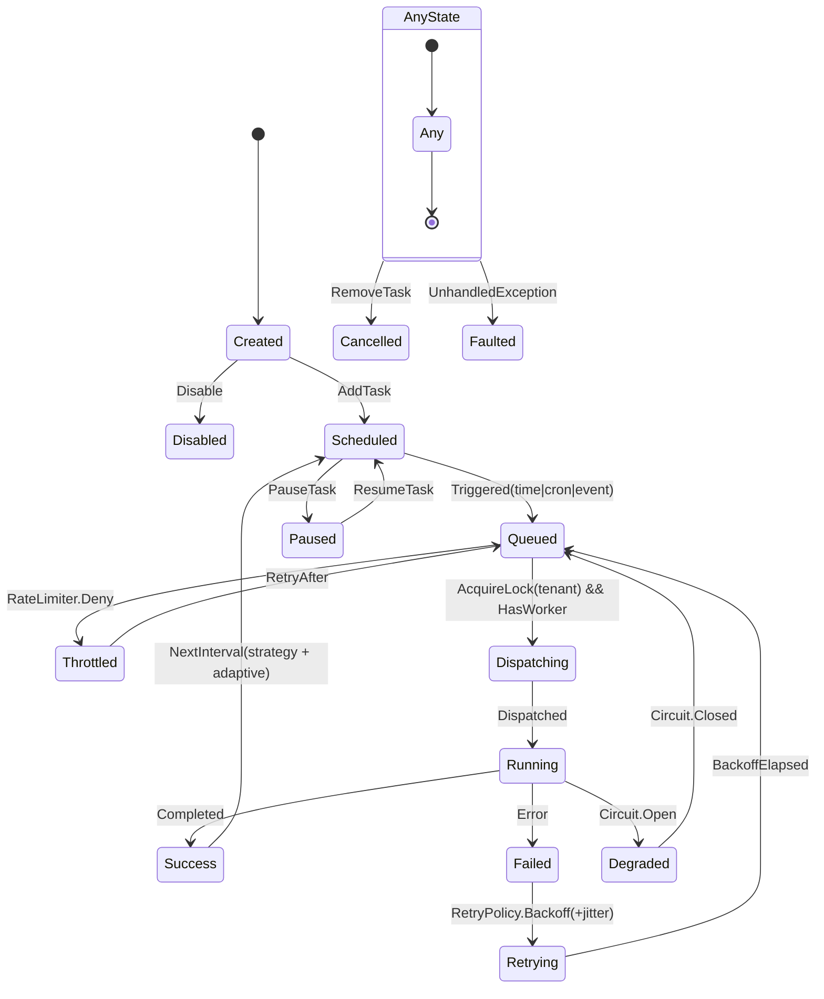

### 5.5 调度策略与伪代码
为满足5.1设计目标（周期/定时/事件触发、优先级与负载均衡、治理与自适应、分布式防重与持久化），提供现代平台与老旧平台两套实现示例，并引入限流、熔断、退避重试、自适应调参与分布式锁/选主。

- 触发策略：FixedInterval、Cron、Event
- 优先级与队列：基于优先队列进行调度
- 分布式协同：Leader选举 + 分布式锁防重复执行
- 治理策略：限流、熔断、退避重试（含抖动）
- 自适应：根据滞后、执行耗时、节点负载调整频率/并发/窗口
- 持久化：任务状态、下次时间持久化至TaskStore
- 多租户：按租户键加锁，保证隔离

```csharp
// .NET 8 版本（推荐）：Channel + PriorityQueue + PeriodicTimer + 分布式锁/熔断/限流/自适应
public sealed class ModernScheduler
{
    private readonly Channel<ScheduledTask> _inbox = Channel.CreateUnbounded<ScheduledTask>();
    private readonly PriorityQueue<ScheduledTask, int> _pq = new();
    private readonly IScheduleStrategy _strategy;
    private readonly IEnumerable<ITrigger> _triggers;
    private readonly ITaskDispatcher _dispatcher;
    private readonly IRateLimiter _rateLimiter;
    private readonly ICircuitBreaker _circuit;
    private readonly IRetryPolicy _retry;
    private readonly IAdaptiveController _adaptive;
    private readonly ITaskStore _store;
    private readonly IDistributedLock _dlock;
    private readonly ILeaderElector _leader;
    private readonly CancellationToken _ct;

    public ModernScheduler(
        IScheduleStrategy strategy,
        IEnumerable<ITrigger> triggers,
        ITaskDispatcher dispatcher,
        IRateLimiter rateLimiter,
        ICircuitBreaker circuit,
        IRetryPolicy retry,
        IAdaptiveController adaptive,
        ITaskStore store,
        IDistributedLock dlock,
        ILeaderElector leader,
        CancellationToken ct)
    {
        _strategy = strategy;
        _triggers = triggers;
        _dispatcher = dispatcher;
        _rateLimiter = rateLimiter;
        _circuit = circuit;
        _retry = retry;
        _adaptive = adaptive;
        _store = store;
        _dlock = dlock;
        _leader = leader;
        _ct = ct;
    }

    public async Task RunAsync()
    {
        foreach (var t in _triggers)
            _ = Task.Run(async () => {
                t.OnTriggered += async ctx => {
                    var task = await _store.LoadAsync(ctx.TaskId, _ct);
                    if (task != null) _inbox.Writer.TryWrite(new ScheduledTask { Id = task.TaskId, Config = task, Status = TaskStatus.Scheduled });
                };
                await t.StartAsync(_ct);
            }, _ct);

        using var tick = new PeriodicTimer(TimeSpan.FromSeconds(1));
        while (await tick.WaitForNextTickAsync(_ct))
        {
            if (!_leader.IsLeader()) continue;

            while (_inbox.Reader.TryRead(out var task))
            {
                if (task.Config.Enabled && task.Status != TaskStatus.Paused)
                    _pq.Enqueue(task, task.Config.Priority);
            }

            if (!_rateLimiter.TryPass()) continue;
            if (_circuit.IsOpen) continue;

            while (_pq.Count > 0)
            {
                var next = _pq.Peek();
                if (DateTime.UtcNow < next.NextRun) break;

                using var lease = _dlock.Acquire($"tenant:{next.Config.TenantId}:task:{next.Id}", TimeSpan.FromSeconds(5));
                if (lease == null) { _pq.Dequeue(); continue; }

                _pq.Dequeue();
                _ = DispatchOneAsync(next);
            }
        }
    }

    private async Task DispatchOneAsync(ScheduledTask task)
    {
        try
        {
            await _dispatcher.DispatchAsync(task, _ct);
            task.Status = TaskStatus.Success;
            task.LastSuccess = DateTime.UtcNow;
            var tuned = _adaptive.Adjust(task.Config);
            task.NextRun = DateTime.UtcNow + _strategy.GetNextInterval(tuned);
            await _store.UpdateStateAsync(task.Id, task.Status, _ct);
            _circuit.OnSuccess();
        }
        catch (Exception ex)
        {
            task.Status = TaskStatus.Failed;
            task.RetryCount++;
            var backoff = TimeSpan.FromSeconds(Math.Min(60, Math.Pow(2, task.RetryCount))) + TimeSpan.FromMilliseconds(Random.Shared.Next(0, 250));
            task.NextRun = DateTime.UtcNow + backoff;
            await _store.UpdateStateAsync(task.Id, task.Status, _ct);
            _circuit.OnFailure(ex);
            _inbox.Writer.TryWrite(task);
        }
    }
}
```

```csharp
// .NET Framework 4.5+ 版本（简化）：Timer + BlockingCollection，降级实现，控制资源占用
public sealed class LegacyScheduler
{
    private readonly System.Threading.Timer _timer;
    private readonly BlockingCollection<ScheduledTask> _queue = new(new ConcurrentQueue<ScheduledTask>());
    private readonly IScheduleStrategy _strategy;
    private readonly ITaskDispatcher _dispatcher;
    private readonly IRateLimiter _rateLimiter;
    private readonly ITaskStore _store;
    private volatile bool _running = false;

    public LegacyScheduler(IScheduleStrategy strategy, ITaskDispatcher dispatcher, IRateLimiter rateLimiter, ITaskStore store)
    {
        _strategy = strategy;
        _dispatcher = dispatcher;
        _rateLimiter = rateLimiter;
        _store = store;
        _timer = new System.Threading.Timer(Tick, null, 1000, 1000);
        _running = true;
        var worker = new Thread(Worker) { IsBackground = true };
        worker.Start();
    }

    private void Tick(object state)
    {
        if (!_running) return;
        foreach (var task in LoadDueTasks())
        {
            if (task.Config.Enabled && _rateLimiter.ShouldPass())
                _queue.Add(task);
        }
    }

    private IEnumerable<ScheduledTask> LoadDueTasks()
    {
        // 简化：从持久化中查询到期任务
        // 伪代码：return _store.ListDueTasks(DateTime.UtcNow);
        return Enumerable.Empty<ScheduledTask>();
    }

    private void Worker()
    {
        foreach (var task in _queue.GetConsumingEnumerable())
        {
            try
            {
                _dispatcher.DispatchAsync(task, CancellationToken.None).Wait();
                task.Status = TaskStatus.Success;
                task.LastSuccess = DateTime.UtcNow;
                task.NextRun = DateTime.UtcNow + _strategy.GetNextInterval(task.Config);
                _store.UpdateStateAsync(task.Id, task.Status, CancellationToken.None).Wait();
            }
            catch
            {
                task.Status = TaskStatus.Failed;
                task.RetryCount++;
                task.NextRun = DateTime.UtcNow + TimeSpan.FromSeconds(Math.Min(60, 2 * task.RetryCount));
                _store.UpdateStateAsync(task.Id, task.Status, CancellationToken.None).Wait();
            }
        }
    }
}
```

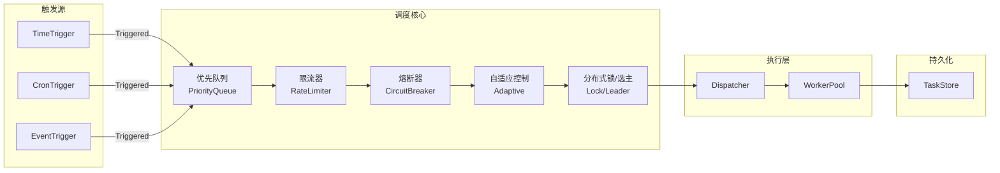

### 5.6 兼容性与迁移说明
- 推荐使用Quartz.NET 4.x（.NET 8），如需兼容.NET Framework可用Quartz 3.x。
- 任务配置与状态持久化建议用PostgreSQL，支持分布式调度。
- 采集任务与协议适配解耦，便于后续扩展。

---

## 6. 实时处理

### 6.1 设计目标
- 支持高吞吐、低延迟的数据清洗、规则处理、批量写入。
- 处理链可插拔，支持多级数据校验、异常检测、聚合与派生。
- 兼容批量与流式处理，保障数据一致性与幂等性。
- 处理结果分发到TSDB、RDB、消息推送等多目标。

### 6.2 类图与接口
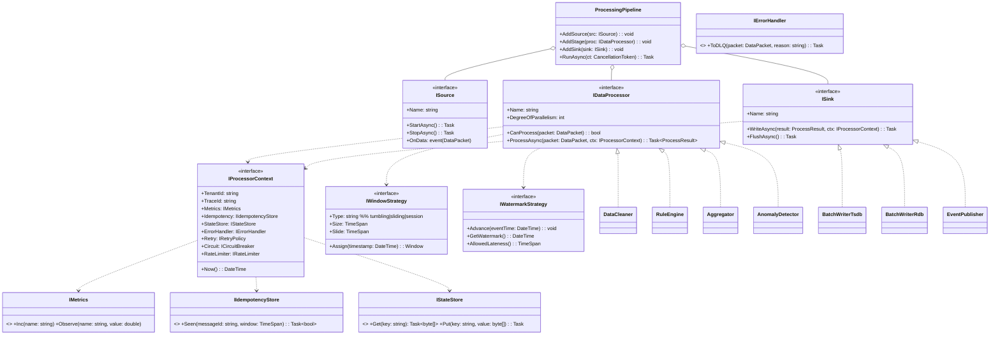

### 6.3 关键接口签名（C#示例）
```csharp
public interface IDataProcessor
{
    string Name { get; }
    Task<DataResult> ProcessAsync(DataPacket input, CancellationToken ct = default);
}

public class ProcessingPipeline
{
    public void AddStage(IDataProcessor stage);
    public IEnumerable<IDataProcessor> GetStages();
    public Task<DataResult> HandleAsync(DataPacket input, CancellationToken ct = default);
}

public interface ISource
{
    string Name { get; }
    event Action<DataPacket> OnData;
    Task StartAsync(CancellationToken ct = default);
    Task StopAsync(CancellationToken ct = default);
}

public interface IDataProcessor
{
    string Name { get; }
    int DegreeOfParallelism { get; }
    bool CanProcess(DataPacket packet);
    Task<ProcessResult> ProcessAsync(DataPacket packet, IProcessorContext ctx, CancellationToken ct = default);
}

public interface ISink
{
    string Name { get; }
    Task WriteAsync(ProcessResult result, IProcessorContext ctx, CancellationToken ct = default);
    Task FlushAsync(CancellationToken ct = default);
}

public sealed class DataPacket
{
    public string MessageId { get; set; }          // 幂等键
    public string TenantId { get; set; }
    public string Source { get; set; }             // edge node
    public DateTime EventTime { get; set; }        // 事件时间
    public DateTime ReceivedAt { get; set; }       // 摄取时间
    public List<DataPoint> DataPoints { get; set; }
    public Dictionary<string, object> Meta { get; set; } = new();
}

public sealed class ProcessResult
{
    public bool IsSuccess { get; set; }
    public List<DataPoint> CleanPoints { get; set; } = new();
    public List<DataPoint> Aggregates { get; set; } = new();
    public List<DataPoint> Anomalies { get; set; } = new();  // 侧输出
    public string ErrorMessage { get; set; }
    public Dictionary<string, object> Metrics { get; set; } = new();
}

public interface IProcessorContext
{
    string TenantId { get; }
    string TraceId { get; }
    DateTime Now();
    IMetrics Metrics { get; }
    IIdempotencyStore Idempotency { get; }
    IStateStore StateStore { get; }
    IErrorHandler ErrorHandler { get; }
    IRetryPolicy Retry { get; }
    ICircuitBreaker Circuit { get; }
    IRateLimiter RateLimiter { get; }
}

public interface IWindowStrategy
{
    string Type { get; }              // tumbling|sliding|session
    TimeSpan Size { get; }
    TimeSpan Slide { get; }
    Window Assign(DateTime eventTime);
}

public interface IWatermarkStrategy
{
    void Advance(DateTime eventTime);
    DateTime GetWatermark();
    TimeSpan AllowedLateness { get; }
}

public interface IIdempotencyStore
{
    // 返回true表示已处理（重复），false表示首次
    Task<bool> SeenAsync(string messageId, TimeSpan window, CancellationToken ct = default);
}

public interface IStateStore
{
    Task<byte[]> GetAsync(string key, CancellationToken ct = default);
    Task PutAsync(string key, byte[] value, CancellationToken ct = default);
}

// 典型Sink
public interface ITsdbSink : ISink { }
public interface IRdbSink : ISink { }
public interface IEventSink : ISink { }

// 典型处理器实现
public class DataCleaner : IDataProcessor { /* ... */ }
public class RuleEngine : IDataProcessor { /* ... */ }
public class Aggregator : IDataProcessor { /* ... */ }
public class AnomalyDetector : IDataProcessor { /* ... */ }
public class BatchWriter : IDataProcessor { /* ... */ }
```

### 6.4 处理流程与伪代码
// .NET 8：Channel + 并行处理 + 幂等 + 多Sink + 水位/窗口 + 治理策略
```csharp
public sealed class RealtimeEngine
{
    private readonly Channel<DataPacket> _inbox = Channel.CreateBounded<DataPacket>(
        new BoundedChannelOptions(10_000) { SingleReader = false, SingleWriter = false, FullMode = BoundedChannelFullMode.Wait });

    private readonly IEnumerable<IDataProcessor> _stages;
    private readonly IEnumerable<ISink> _sinks;
    private readonly IProcessorContext _ctx;
    private readonly IWatermarkStrategy _watermark;
    private readonly IWindowStrategy _window;

    public RealtimeEngine(IEnumerable<IDataProcessor> stages, IEnumerable<ISink> sinks,
                          IProcessorContext ctx, IWatermarkStrategy watermark, IWindowStrategy window)
    {
        _stages = stages;
        _sinks = sinks;
        _ctx = ctx;
        _watermark = watermark;
        _window = window;
    }

    // Source（RabbitMQ/HTTP）消费协程
    public Task StartSourceAsync(IMessageConsumer mq, CancellationToken ct)
        => Task.Run(async () =>
        {
            await mq.SubscribeAsync("dcp.data.raw.*", async env =>
            {
                var packet = ConvertToPacket(env);
                await _inbox.Writer.WriteAsync(packet, ct);
            }, ct);
        }, ct);

    // 主处理循环（并行度 = CPU * k）
    public async Task RunAsync(CancellationToken ct)
    {
        var parallelism = Math.Max(1, Environment.ProcessorCount - 1);
        var workers = Enumerable.Range(0, parallelism).Select(_ => Worker(ct)).ToArray();
        await Task.WhenAll(workers);
    }

    private async Task Worker(CancellationToken ct)
    {
        while (await _inbox.Reader.WaitToReadAsync(ct))
        {
            if (!_inbox.Reader.TryRead(out var packet)) continue;

            // 幂等检查（at-least-once -> 去重）
            if (await _ctx.Idempotency.SeenAsync(packet.MessageId, TimeSpan.FromMinutes(10), ct))
                continue;

            _watermark.Advance(packet.EventTime);

            // 顺序执行管道阶段，每阶段内可内部并行（DegreeOfParallelism）
            ProcessResult result = new() { IsSuccess = true };
            foreach (var stage in _stages.Where(s => s.CanProcess(packet)))
            {
                // 限流/熔断检查
                if (!_ctx.RateLimiter.TryPass() || _ctx.Circuit.IsOpen) { result.IsSuccess = false; result.ErrorMessage = "Throttled/Break"; break; }

                result = await _ctx.Retry.ExecuteAsync(() => stage.ProcessAsync(packet, _ctx), ct)
                    .ContinueWith(t =>
                    {
                        if (t.IsFaulted)
                        {
                            _ctx.Circuit.OnFailure(t.Exception);
                            return new ProcessResult { IsSuccess = false, ErrorMessage = t.Exception!.GetBaseException().Message };
                        }
                        _ctx.Circuit.OnSuccess();
                        return t.Result;
                    }, ct);

                if (!result.IsSuccess) break;
            }

            // 成功 -> 多Sink并发落地；失败 -> DLQ
            if (result.IsSuccess)
            {
                await Parallel.ForEachAsync(_sinks, ct, async (sink, token) =>
                    await sink.WriteAsync(result, _ctx, token));
            }
            else
            {
                await _ctx.ErrorHandler.ToDLQ(packet, result.ErrorMessage ?? "unknown");
            }
        }
    }

    private static DataPacket ConvertToPacket(MessageEnvelope env)
    {
        return new DataPacket
        {
            MessageId = env.MessageId,
            TenantId = env.TenantId,
            Source = env.Source,
            EventTime = env.Timestamp,
            ReceivedAt = DateTime.UtcNow,
            DataPoints = /* map payload -> datapoints */
                new List<DataPoint>()
        };
    }
}
```

```csharp
// .NET Framework 4.5+：BlockingCollection + 有限并发 + 简化治理与窗口
public sealed class LegacyRealtimeEngine
{
    private readonly BlockingCollection<DataPacket> _queue = new(new ConcurrentQueue<DataPacket>(), 5000);
    private readonly IList<IDataProcessor> _stages;
    private readonly IList<ISink> _sinks;
    private readonly IProcessorContext _ctx;

    public LegacyRealtimeEngine(IList<IDataProcessor> stages, IList<ISink> sinks, IProcessorContext ctx)
    { _stages = stages; _sinks = sinks; _ctx = ctx; }

    public void Enqueue(DataPacket p) { _queue.Add(p); }

    public void Start(int workers = 2, CancellationToken ct = default(CancellationToken))
    {
        for (int i = 0; i < workers; i++)
        {
            var t = new Thread(() => Worker(ct)) { IsBackground = true };
            t.Start();
        }
    }

    private void Worker(CancellationToken ct)
    {
        foreach (var packet in _queue.GetConsumingEnumerable())
        {
            if (_ctx.Idempotency.SeenAsync(packet.MessageId, TimeSpan.FromMinutes(10), ct).Result) continue;

            var result = new ProcessResult { IsSuccess = true };
            foreach (var stage in _stages)
            {
                try
                {
                    if (!stage.CanProcess(packet)) continue;
                    result = stage.ProcessAsync(packet, _ctx, ct).Result;
                    if (!result.IsSuccess) break;
                }
                catch (Exception ex)
                {
                    result = new ProcessResult { IsSuccess = false, ErrorMessage = ex.Message };
                    break;
                }
            }

            if (result.IsSuccess)
            {
                foreach (var sink in _sinks)
                    sink.WriteAsync(result, _ctx, ct).Wait();
            }
            else
            {
                _ctx.ErrorHandler.ToDLQ(packet, result.ErrorMessage ?? "unknown").Wait();
            }
        }
    }
}
```

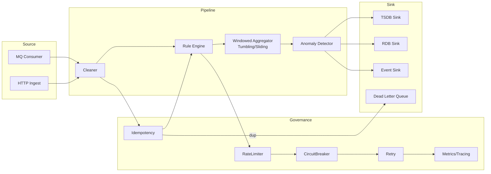

### 6.5 治理与一致性策略
- 幂等性：每条数据带唯一ID，重复写入自动去重。
- 批量写入：TSDB按时间/数量窗口聚合，RDB按事务批量提交。
- 回压与限流：队列水位监控，处理速率自适应。
- 异常分流：异常数据单独入库，触发告警。
- 数据一致性：TSDB写入成功后再更新RDB状态，保证最终一致。

### 6.6 兼容性与迁移说明
- 推荐.NET 8，处理链各阶段可用DI注入，支持AOP拦截。
- 兼容.NET Framework时，需简化异步与批量处理能力。
- 处理链配置支持热加载与灰度发布。

---

## 7. 消息通道

### 7.1 设计目标
- 基于RabbitMQ实现采集与处理的异步解耦，支持高可用、持久化、死信与重试。
- 统一命名规范，支持多租户/多车间隔离。
- 消息幂等性、顺序性、异常处理与监控。

### 7.2 类图与接口
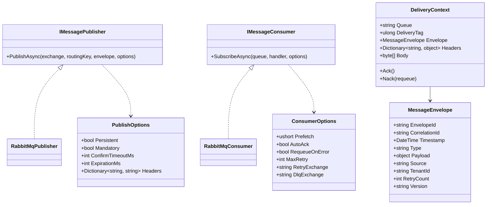

### 7.3 关键接口签名（C#示例）
```csharp
public sealed record PublishResult(bool Confirmed, string? Reason = null);

public sealed class PublishOptions
{
    public bool Persistent { get; init; } = true;           // 投递模式 2（持久化）
    public bool Mandatory  { get; init; } = true;           // 强制路由，未路由则返回
    public int? ExpirationMs { get; init; }                 // 单条消息过期时间（可用于延迟/重试）
    public IDictionary<string, object>? Headers { get; init; }
    public int ConfirmTimeoutMs { get; init; } = 5000;      // 发布确认超时
}

public sealed class ConsumerOptions
{
    public ushort Prefetch { get; init; } = 200;            // 限流，防止单消费者抢占过多
    public bool AutoAck { get; init; } = false;             // 统一采用手动Ack
    public bool RequeueOnError { get; init; } = false;      // 业务异常是否直接重回队列
    public int MaxRetry { get; init; } = 5;                 // 最大重试次数
    public string? RetryExchange { get; init; }             // 重试交换机
    public string? DlqExchange { get; init; }               // 死信交换机
}

public sealed class MessageEnvelope
{
    public string EnvelopeId { get; init; } = Guid.NewGuid().ToString("N");
    public string? CorrelationId { get; init; }
    public DateTimeOffset Timestamp { get; init; } = DateTimeOffset.UtcNow;
    public string Type { get; init; } = "DataPointBatch";  // 统一类型命名
    public string? TenantId { get; init; }
    public string? Source { get; init; }                    // edge-01 / ingestion-01
    public int RetryCount { get; init; } = 0;
    public string Version { get; init; } = "1.0";          // 契约版本
    public object Payload { get; init; } = default!;        // 建议批量点位
}

public sealed class DeliveryContext
{
    public string Queue { get; init; } = default!;
    public ulong DeliveryTag { get; init; }
    public MessageEnvelope Envelope { get; init; } = default!;
    public IReadOnlyDictionary<string, object> Headers { get; init; } = new Dictionary<string, object>();
    public ReadOnlyMemory<byte> Body { get; init; } = ReadOnlyMemory<byte>.Empty;

    public Func<ulong, Task>? AckAsyncDelegate { get; init; }
    public Func<ulong, bool, Task>? NackAsyncDelegate { get; init; }

    public Task AckAsync() => AckAsyncDelegate?.Invoke(DeliveryTag) ?? Task.CompletedTask;
    public Task NackAsync(bool requeue) => NackAsyncDelegate?.Invoke(DeliveryTag, requeue) ?? Task.CompletedTask;
}

public interface IMessagePublisher
{
    Task<PublishResult> PublishAsync(
        string exchange,
        string routingKey,
        MessageEnvelope envelope,
        PublishOptions? options = null,
        CancellationToken ct = default);
}

public interface IMessageConsumer
{
    Task SubscribeAsync(
        string queue,
        Func<DeliveryContext, Task> handler,
        ConsumerOptions? options = null,
        CancellationToken ct = default);
}
```

### 7.4 消息命名与契约
- Exchange：`dcp.{env}.data.raw`、`dcp.{env}.data.clean`、`dcp.{env}.alarm`、`dcp.{env}.config`
- Queue：`dcp.{env}.{tenant}.{site}.{service}.{purpose}`，如 `dcp.prod.t1.suzhou.ingestion.clean`
  - purpose：ingest | clean | enrich | export | alarm
- RoutingKey：`{tenant}.{site}.{line}.{device}.{tag}`，如 `t1.sz.l01.presser01.speed`
- DLX/Retry：统一定义 `dcp.{env}.retry` 与 `dcp.{env}.dlx`，便于跨队列复用
  - 业务队列参数：
    - `x-dead-letter-exchange = dcp.{env}.retry`
    - `x-dead-letter-routing-key = {original-queue}`
  - 重试队列参数：
    - `x-message-ttl = 5_000 | 30_000 | ...`（分级退避）
    - `x-dead-letter-exchange = {业务原始exchange}` 或直接指向 `dcp.{env}.dlx`
- 幂等键：`EnvelopeId`。如需加强，可叠加 `{tenant,site,line,device,tag,timestamp}` 计算复合Key
- 契约字段：`Version/EnvelopeId/Tenant/Source/Timestamp/Payload/Headers`

#### 7.4.1 消息Schema示例（批量采集数据）
```json
{
  "ver": "1.0",
  "env": "prod",
  "tz": "Asia/Shanghai",
  "enc": "json", 
  "envelopeId": "a1b2c3d4e5f6",
  "correlationId": "task-20250912-001",
  "ts": "2025-09-12T12:00:00+08:00",
  "type": "DataPointBatch",
  "tenant": "t1",
  "source": "edge-01",
  "route": {
    "site": "sz",
    "line": "l01",
    "device": "presser01"
  },
  "points": [
    { "tag": "speed",   "v": 123.45, "q": "Good", "t": "2025-09-12T12:00:00+08:00" },
    { "tag": "temp",    "v": 36.7,   "q": "Good", "t": "2025-09-12T12:00:00+08:00" }
  ],
  "headers": { "schema": "v1", "compress": false }
}
```

### 7.5 伪代码示例
```csharp
// 发布：开启发布确认、强制路由与持久化
var model = channel; // RabbitMQ IModel
model.ConfirmSelect();

var props = model.CreateBasicProperties();
props.Persistent = options?.Persistent ?? true; // true => delivery mode 2 (persistent)
props.MessageId = envelope.EnvelopeId;
props.CorrelationId = envelope.CorrelationId;
props.Timestamp = new AmqpTimestamp(envelope.Timestamp.ToUnixTimeSeconds());
props.Type = envelope.Type;
props.ContentType = "application/json";
props.Headers = options?.Headers as IDictionary<string, object>;
if (options?.ExpirationMs is int ttl) props.Expiration = ttl.ToString();

var body = Encoding.UTF8.GetBytes(JsonSerializer.Serialize(envelope));
model.BasicPublish(exchange, routingKey, mandatory: options?.Mandatory ?? true, basicProperties: props, body: body);
model.WaitForConfirmsOrDie(TimeSpan.FromMilliseconds(options?.ConfirmTimeoutMs ?? 5000));

// 订阅：设置Prefetch与手动Ack；失败走Retry/DLX
var consumer = new EventingBasicConsumer(model);
var consumeOptions = new ConsumerOptions { Prefetch = 200 };
model.BasicQos(0, consumeOptions.Prefetch, global: false);

consumer.Received += async (ch, ea) =>
{
    var ctx = new DeliveryContext
    {
        Queue = queue,
        DeliveryTag = ea.DeliveryTag,
        Headers = ea.BasicProperties.Headers?.ToDictionary(kv => kv.Key, kv => kv.Value) ?? new Dictionary<string, object>(),
        Body = ea.Body.ToArray(),
        Envelope = DeserializeEnvelope(ea.Body),
        AckAsyncDelegate = dt => Task.Run(() => model.BasicAck(dt, multiple: false)),
        NackAsyncDelegate = (dt, requeue) => Task.Run(() => model.BasicNack(dt, multiple: false, requeue: requeue))
    };

    // 幂等去重（建议TTL 24h+，按EnvelopeId记录）
    if (await idempotencyStore.ExistsAsync(ctx.Envelope.EnvelopeId))
    {
        await ctx.AckAsync();
        return;
    }

    try
    {
        await handler(ctx); // 业务处理
        await idempotencyStore.RecordAsync(ctx.Envelope.EnvelopeId, TimeSpan.FromHours(24));
        await ctx.AckAsync();
    }
    catch (TransientException)
    {
        // 进入重试队列（通过DLX/TTL回流），避免热重试抖动
        await ctx.NackAsync(requeue: false);
    }
    catch (Exception ex)
    {
        LogError(ex, ctx);
        await ctx.NackAsync(requeue: false); // 入DLX，后续人工/脚本处理
    }
};

model.BasicConsume(queue, autoAck: false, consumer: consumer);
```

### 7.6 异常与重试、DLX策略
- 消费失败自动Nack，消息进入DLX，支持最大重试次数与告警。
- 消息持久化，防止丢失。
- 消息体建议压缩（如Gzip）以提升吞吐。

### 7.7 兼容性与迁移说明
- 推荐RabbitMQ 3.12+，.NET 8用官方客户端，.NET Framework用EasyNetQ等。
- 消息契约JSON Schema，兼容历史版本。
- 命名规范与幂等策略全局统一。

---

## 8. 查询与推送

### 8.1 设计目标
- 支持高效的实时/历史数据查询，灵活的多维过滤与聚合。
- 提供RESTful API与WebSocket实时推送，支持订阅/取消订阅。
- 查询结果分页、索引优化，保障大数据量下的性能。
- 支持多租户/权限过滤，数据范围隔离。

### 8.2 类图与接口
```mermaid
classDiagram
  class IDataQueryService {
    +QueryRealtimeAsync(req)
    +QueryHistoryAsync(req)
    +AggregateAsync(req)
  }
  class IRealtimePushService {
    +SubscribeAsync(req, onData)
    +UnsubscribeAsync(subscriptionId)
  }
  class QueryRequest {
    +QueryContext Context
    +Filter Filter
    +TimeWindow Window
    +Paging Paging
    +Sort Sort
  }
  class AggregateRequest {
    +QueryContext Context
    +Filter Filter
    +TimeWindow Window
    +AggregateSpec Aggregate
  }
  class QueryContext {
    +string TenantId
    +string PrincipalId
    +string Timezone
    +DataScope Scope
    +int TimeoutMs
  }
  class Filter {
    +string[] DeviceIds
    +string[] TagIds
    +string Expr
  }
  class TimeWindow {
    +DateTimeOffset Start
    +DateTimeOffset End
    +string Align
    +string Bucket
    +string Fill
  }
  class Paging {
    +int PageSize
    +string ContinuationToken
  }
  class Sort {
    +string Order
    +string TieBreaker
  }
  class AggregateSpec {
    +string[] Functions
    +string Bucket
    +string Align
    +string Fill
    +string Timezone
  }
  class PageResult {
    +List~DataPoint~ Items
    +string NextToken
    +Stats Stats
  }
  class Stats {
    +string Source
    +long Scanned
    +long ElapsedMs
  }
  class SubscribeRequest {
    +string TenantId
    +Filter Filter
    +int LastSeconds
    +int ThrottleMs
    +AggregateSpec Aggregate
    +string StartAfterToken
  }
  IDataQueryService <|.. DataQueryService
  IRealtimePushService <|.. SignalRPushService
  PageResult --> DataPoint
```

### 8.3 关键接口签名（C#示例）
```csharp
// 统一查询上下文与请求模型
public sealed record DataScope(string[]? Sites = null, string[]? Lines = null, string[]? Devices = null);
public sealed record QueryContext(string TenantId, string PrincipalId, DataScope Scope, string Timezone = "Asia/Shanghai", TimeSpan? Timeout = null);
public sealed record Paging(int PageSize = 200, string? ContinuationToken = null);
public enum FillPolicy { None, Previous, Linear, Zero }
public sealed record TimeWindow(DateTimeOffset Start, DateTimeOffset End, string? Align = null, string? Bucket = null, FillPolicy Fill = FillPolicy.None);
public sealed record Sort(string Order = "asc", string TieBreaker = "seq");
public sealed record Filter(string[]? DeviceIds = null, string[]? TagIds = null, string? Expr = null);

public sealed record QueryRequest(QueryContext Context, Filter Filter, TimeWindow Window, Paging Paging, Sort? Sort = null);
public sealed record AggregateSpec(string[] Functions, string Bucket, string? Align = null, FillPolicy Fill = FillPolicy.None, string? Timezone = null);
public sealed record AggregateRequest(QueryContext Context, Filter Filter, TimeWindow Window, AggregateSpec Aggregate);

public sealed record Stats(string Source, long Scanned, long ElapsedMs);
public sealed record Page<T>(IReadOnlyList<T> Items, string? NextToken, Stats Stats);

public sealed record DataPoint(string TenantId, string DeviceId, string TagId, double Value, string Quality, DateTimeOffset Time, int Seq = 0);
public sealed record AggregateBucket(DateTimeOffset WindowStart, DateTimeOffset WindowEnd, IDictionary<string,double> Values);

public interface IDataQueryService
{
  Task<Page<DataPoint>> QueryRealtimeAsync(QueryRequest req, CancellationToken ct = default);
  Task<Page<DataPoint>> QueryHistoryAsync(QueryRequest req, CancellationToken ct = default);
  Task<IReadOnlyList<AggregateBucket>> AggregateAsync(AggregateRequest req, CancellationToken ct = default);
}

// WebSocket 推送：结构化订阅请求与推送信封（与7.x命名契约对齐）
public sealed record SubscribeRequest(
  string TenantId,
  Filter Filter,
  int LastSeconds = 60,
  int ThrottleMs = 500,
  AggregateSpec? Aggregate = null,
  string? StartAfterToken = null
);

public sealed class Route { public string Site { get; init; } = ""; public string Line { get; init; } = ""; public string Device { get; init; } = ""; }
public sealed class DataPushEnvelope
{
  public string Ver { get; init; } = "1.0";
  public string EnvelopeId { get; init; } = Guid.NewGuid().ToString("N");
  public string Tz { get; init; } = "Asia/Shanghai";
  public string Type { get; init; } = "RealtimeDataPoint"; // 或 RealtimeAggBucket
  public string Tenant { get; init; } = default!;
  public Route Route { get; init; } = new();
  public IReadOnlyList<DataPoint> Points { get; init; } = Array.Empty<DataPoint>();
  public IReadOnlyList<AggregateBucket>? Buckets { get; init; }
  public string? NextToken { get; init; }
}

public interface IRealtimePushService
{
  Task<string> SubscribeAsync(SubscribeRequest req, Func<DataPushEnvelope, Task> onData, CancellationToken ct = default);
  Task UnsubscribeAsync(string subscriptionId, CancellationToken ct = default);
}
```

### 8.4 查询策略与索引优化
- 冷热分层与路由：
  - t ∈ [now-LastSeconds, now] → Redis（ZSET，key: `ts:{tenant}:{device}:{tag}`，score=time）
  - t ∈ (now-coldThreshold, now-LastSeconds) → InfluxDB（热分区/retention）
  - t ≤ now-coldThreshold → PostgreSQL 归档分区表
- 批量拉取：按 Window.Bucket 切片分段查询并合并，去重键 `(tenant,device,tag,time,seq)`，按 time asc 输出
- 分页：优先使用 Keyset（after={time,seq}），NextToken base64({lastTime,lastSeq,sourceIndex})；必要时退回 offset 仅限小页
- 预聚合与下采样：写入或定时计算 `agg_{1m,5m,1h}`，Aggregate 优先命中预聚合，缺口回补原始表
- InfluxDB：measurement 分离 raw/clean/agg，tag：tenant/site/device/tag；合理控制高基数标签
- PostgreSQL：
  - 按日/月 + tenant/site 分区；主键 `(tenant,site,device,tag,time,seq)`
  - 覆盖索引 on `(tenant,site,device,tag,time DESC)` INCLUDE (value, quality)
- Redis：TTL=LastSeconds 或策略阈值，避免缓存膨胀；批量 MGET/ZRANGEBYSCORE 减少往返

### 8.5 WebSocket推送与订阅
- 基于 SignalR，使用结构化订阅请求 `SubscribeRequest`；服务端按 DataScope/权限校验
- 可靠性：维护 per-connection 的 `lastToken`；断线后客户端带 `StartAfterToken` 重连回放
- 流控与背压：`ThrottleMs` 节流，合并同一 bucket 内多条为一条聚合推送；限制最大订阅数与并发
- 心跳与超时：定期 ping-pong，回收空闲订阅
- 推送消息示例（对齐 7.x 命名/契约）：
```json
{
  "ver": "1.0",
  "envelopeId": "b7c9a1...",
  "tz": "Asia/Shanghai",
  "type": "RealtimeDataPoint",
  "tenant": "t1",
  "route": { "site": "sz", "line": "l01", "device": "presser01" },
  "points": [
    { "tenant": "t1", "deviceId": "presser01", "tagId": "speed", "value": 123.45, "quality": "Good", "time": "2025-09-12T12:00:00+08:00", "seq": 0 }
  ],
  "nextToken": "eyJsYXN0VGltZSI6IjIwMjUtMDktMTJUMTI6MDA6MDArMDg6MDAiLCJzZXEiOjB9"
}
```

### 8.6 伪代码示例
```csharp
// 查询（带冷热路由与游标分页）
var req = new QueryRequest(
  Context: new QueryContext("t1", principalId, new DataScope(Devices: new[]{"presser01"}), "Asia/Shanghai"),
  Filter: new Filter(TagIds: new[]{"speed"}),
  Window: new TimeWindow(DateTimeOffset.UtcNow.AddHours(-1), DateTimeOffset.UtcNow, Align: "00:00", Bucket: "1m", Fill: FillPolicy.Previous),
  Paging: new Paging(PageSize: 500),
  Sort: new Sort("asc", "seq")
);

var page1 = await queryService.QueryHistoryAsync(req, ct);
var next = page1.NextToken;
if (next != null)
{
  var page2 = await queryService.QueryHistoryAsync(req with { Paging = new Paging(500, next) }, ct);
}

// WebSocket 订阅（结构化、可回放、带节流）
var subReq = new SubscribeRequest(
  TenantId: "t1",
  Filter: new Filter(Devices: new[]{"presser%"}, TagIds: new[]{"speed"}),
  LastSeconds: 60,
  ThrottleMs: 500,
  Aggregate: null,
  StartAfterToken: lastToken
);

string subId = await pushService.SubscribeAsync(subReq, async envelope =>
{
  foreach (var p in envelope.Points)
  {
    // 处理实时点位
  }
  // 记录 nextToken 用于断线回放
  lastToken = envelope.NextToken ?? lastToken;
}, ct);

// ... 需要时取消订阅
await pushService.UnsubscribeAsync(subId, ct);
```

### 8.7 兼容性与迁移说明
- 推荐.NET 8 + SignalR，.NET Framework可用WebSocketSharp等兼容库。
- 查询接口与推送协议保持向后兼容。
- 索引策略与分页方式可根据数据量动态调整。

---

## 9. 安全与权限

### 9.1 设计目标
- 保障系统各层级数据与操作的安全性，防止未授权访问和数据泄露。
- 支持多租户、细粒度权限控制（RBAC）、数据范围（DataScope）隔离。
- 兼容边缘节点与中心节点的不同安全需求。
- 支持统一认证（JWT，HS256/RS256）、接口鉴权、操作审计。

### 9.2 类图与接口设计（增强）
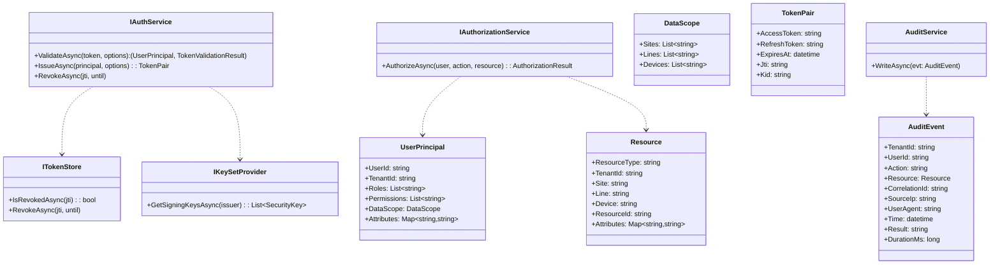

### 9.3 主要接口定义（C#，增强）
```csharp
public sealed record DataScope(string[]? Sites = null, string[]? Lines = null, string[]? Devices = null);
public sealed record UserPrincipal(string UserId, string TenantId,
  IReadOnlyList<string> Roles, IReadOnlyList<string> Permissions,
  DataScope Scope, IReadOnlyDictionary<string,string>? Attributes = null);

public sealed record Resource(string ResourceType, string? TenantId = null,
  string? Site = null, string? Line = null, string? Device = null,
  string? ResourceId = null, IReadOnlyDictionary<string,string>? Attributes = null);

public sealed record TokenPair(string AccessToken, string RefreshToken,
  DateTimeOffset ExpiresAt, string Jti, string Kid);

public sealed record TokenIssueOptions(string TenantId, string Audience,
  TimeSpan AccessTtl, TimeSpan RefreshTtl, string[] Scopes,
  IDictionary<string,string>? ExtraClaims = null);

public sealed record TokenValidationOptions(string Audience, string Issuer,
  TimeSpan ClockSkew, bool RequireSigned = true, bool ValidateLifetime = true);

public sealed record AuthorizationResult(bool Allowed, string? DenyReason = null);

public sealed record AuditEvent(string TenantId, string UserId, string Action, Resource Resource,
  string CorrelationId, string SourceIp, string? UserAgent, DateTimeOffset Time,
  string Result, long DurationMs, IDictionary<string,string>? Extra = null);

public interface IAuthService {
  Task<(UserPrincipal Principal, TokenValidationResult Result)> ValidateAsync(
    string token, TokenValidationOptions opts, CancellationToken ct = default);
  Task<TokenPair> IssueAsync(UserPrincipal principal, TokenIssueOptions opts, CancellationToken ct = default);
  Task RevokeAsync(string jti, DateTimeOffset? until = null, CancellationToken ct = default);
}

public interface IAuthorizationService {
  Task<AuthorizationResult> AuthorizeAsync(UserPrincipal user, string action, Resource resource, CancellationToken ct = default);
}

public interface ITokenStore {
  Task<bool> IsRevokedAsync(string jti, CancellationToken ct = default);
  Task RevokeAsync(string jti, DateTimeOffset? until = null, CancellationToken ct = default);
}

public interface IKeySetProvider {
  Task<IReadOnlyList<SecurityKey>> GetSigningKeysAsync(string issuer, CancellationToken ct = default);
}

public interface IAuditService {
  Task WriteAsync(AuditEvent evt, CancellationToken ct = default);
}
```

### 9.4 认证与鉴权流程（增强）
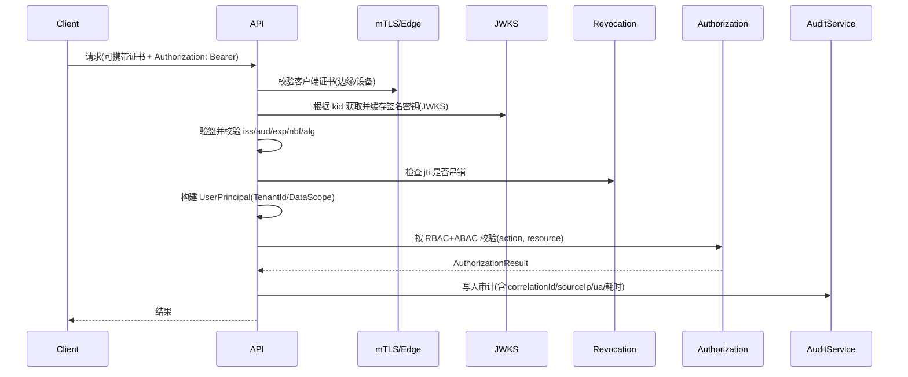

### 9.5 伪代码示例（增强）
```csharp
public async Task<IResult> DoAction(HttpContext ctx, string action, Resource resource) {
  var sw = Stopwatch.StartNew();
  var correlationId = ctx.Request.Headers["x-correlation-id"].FirstOrDefault()
            ?? Guid.NewGuid().ToString("N");
  try {
    // 可选：mTLS 验证（边缘/设备调用）
    if (RequireMtls && ctx.Connection.ClientCertificate is null)
      return Results.Unauthorized();

    var authzHeader = ctx.Request.Headers.Authorization.ToString();
    if (!authzHeader.StartsWith("Bearer ")) return Results.Unauthorized();
    var token = authzHeader.Substring("Bearer ".Length);

    var (principal, result) = await authService.ValidateAsync(
      token,
      new TokenValidationOptions(Audience: "dcp-api", Issuer: "https://idp/",
                     ClockSkew: TimeSpan.FromMinutes(2)),
      ctx.RequestAborted);

    if (principal.TenantId != (resource.TenantId ?? principal.TenantId))
      return Results.Forbid(); // 租户一致性校验

    var ar = await authorizationService.AuthorizeAsync(principal, action, resource, ctx.RequestAborted);
    if (!ar.Allowed) return Results.Forbid();

    // ...执行业务逻辑...
    return Results.Ok();
  }
  catch (SecurityTokenException) {
    return Results.Unauthorized();
  }
  finally {
    sw.Stop();
    await auditService.WriteAsync(new AuditEvent(
      resource.TenantId ?? "-",
      /* user */ ctx.User?.Identity?.Name ?? "-",
      action, resource, correlationId,
      ctx.Connection.RemoteIpAddress?.ToString() ?? "-",
      ctx.Request.Headers["User-Agent"].ToString(),
      DateTimeOffset.UtcNow, "Completed", sw.ElapsedMilliseconds
    ));
  }
}
```

### 9.6 兼容性与扩展性说明
- 支持HS256（对称密钥）与RS256（非对称密钥）两种JWT签名算法，便于中心与边缘节点灵活部署。
- 权限模型支持RBAC（角色-权限）与DataScope（数据范围）双重控制，适应多租户与分级管理需求。
- 审计服务可扩展为异步批量写入，支持合规性与安全追溯。
- 可与主流身份认证系统（如LDAP、OAuth2）对接。
- 兼容.NET Framework（边缘节点）与.NET 8（中心节点）实现。

---

## 10. 边缘节点兼容性设计

### 10.1 双平台架构概述

为适应工业现场的多样化硬件环境，系统采用分层兼容架构，同时支持现代设备和老旧设备：

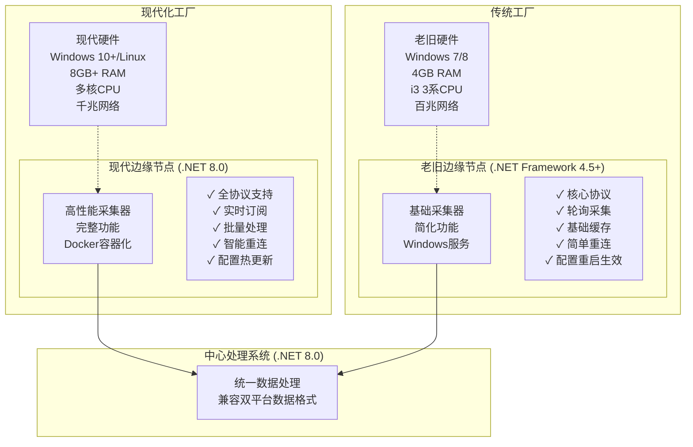

### 10.2 老旧设备环境特征与约束

#### 10.2.1 硬件环境限制
- **操作系统**：Windows 7 SP1、Windows 8.1（不支持Windows 10特性）
- **处理器**：Intel i3 3系列（双核，主频2.5-3.3GHz）
- **内存容量**：4GB DDR3（可用内存约3GB）
- **存储空间**：机械硬盘，读写速度受限
- **网络连接**：百兆以太网，延迟相对较高

#### 10.2.2 软件环境约束
- **.NET Framework 4.5+**：最高支持4.8版本
- **Windows服务模式**：不支持容器化部署
- **内存管理**：需要主动进行垃圾回收优化
- **异步编程**：支持Task-based异步模式，但功能受限
- **第三方库**：需要选择兼容版本

### 10.3 双平台功能差异对比

| 功能模块 | .NET 8.0版本 | .NET Framework 4.5+版本 | 说明 |
|---------|-------------|------------------------|------|
| **协议支持** | 全协议完整功能 | 核心协议基础功能 | 老旧版本去除复杂特性 |
| **数据采集模式** | 轮询+订阅+事件 | 仅轮询模式 | 简化降低复杂度 |
| **并发处理** | 高并发异步处理 | 限制并发数量 | 避免内存溢出 |
| **本地缓存** | 内存+磁盘混合缓存 | 简单文件缓存 | 减少内存占用 |
| **断线重连** | 智能重连+指数退避 | 固定间隔重试 | 简化重连逻辑 |
| **配置管理** | 热更新+动态加载 | 重启生效 | 避免复杂状态管理 |
| **日志记录** | 结构化日志+链路追踪 | 基础文件日志 | 减少性能开销 |
| **监控指标** | 详细性能监控 | 基础状态监控 | 关注核心指标 |
| **部署方式** | Docker容器化 | Windows服务+MSI | 适应环境特点 |
| **资源消耗** | 优化后正常使用 | 严格控制资源使用 | 内存<512MB，CPU<50% |

### 10.4 Windows服务实现详解

#### 10.4.1 Windows服务架构
```csharp
// Windows服务主程序 - .NET Framework 4.5+
namespace IndustrialDataCollection.EdgeService.Legacy
{
    /// <summary>
    /// 老旧设备边缘采集Windows服务
    /// 优化内存使用，简化功能实现，提高稳定性
    /// </summary>
    public partial class EdgeCollectorService : ServiceBase
    {
        private static readonly ILog _logger = LogManager.GetLogger(typeof(EdgeCollectorService));
        private Timer _mainTimer;
        private Timer _gcTimer; // 定期垃圾回收
        private readonly CollectionManager _collectionManager;
        private readonly ConfigurationManager _configManager;
        private readonly MessagePublisher _messagePublisher;
        private volatile bool _isRunning = false;

        // 资源限制配置
        private const int MAX_MEMORY_MB = 512;          // 最大内存使用512MB
        private const int MAX_CONCURRENT_TASKS = 5;     // 最大并发任务数
        private const int COLLECTION_INTERVAL_MS = 5000; // 默认采集间隔5秒
        private const int GC_INTERVAL_MS = 300000;      // 5分钟强制GC一次

        public EdgeCollectorService()
        {
            InitializeComponent();
            
            // 初始化组件
            _configManager = new ConfigurationManager();
            _collectionManager = new CollectionManager(_configManager);
            _messagePublisher = new MessagePublisher(_configManager);
            
            // 设置服务属性
            ServiceName = "IndustrialDataCollector";
            CanStop = true;
            CanPauseAndContinue = true;
            AutoLog = true;
        }

        protected override void OnStart(string[] args)
        {
            try
            {
                _logger.Info("启动工业数据采集边缘服务 (Legacy版本)");
                
                // 加载配置
                var config = _configManager.LoadConfiguration();
                _logger.InfoFormat("已加载配置，设备数量: {0}", config.Devices?.Count ?? 0);
                
                // 初始化采集管理器
                _collectionManager.Initialize(config);
                
                // 初始化消息发布器
                _messagePublisher.Initialize(config.MessageQueue);
                
                // 启动主工作定时器
                _mainTimer = new Timer(MainTimerCallback, null, 
                    TimeSpan.FromMilliseconds(COLLECTION_INTERVAL_MS),
                    TimeSpan.FromMilliseconds(COLLECTION_INTERVAL_MS));
                
                // 启动GC定时器 - 老旧设备内存管理关键
                _gcTimer = new Timer(GarbageCollectionCallback, null,
                    TimeSpan.FromMilliseconds(GC_INTERVAL_MS),
                    TimeSpan.FromMilliseconds(GC_INTERVAL_MS));
                
                _isRunning = true;
                _logger.Info("边缘采集服务已成功启动");
            }
            catch (Exception ex)
            {
                _logger.Fatal("启动边缘采集服务失败", ex);
                throw;
            }
        }

        protected override void OnStop()
        {
            try
            {
                _logger.Info("正在停止边缘采集服务...");
                _isRunning = false;
                
                // 停止定时器
                _mainTimer?.Dispose();
                _gcTimer?.Dispose();
                
                // 清理资源
                _collectionManager?.Dispose();
                _messagePublisher?.Dispose();
                
                _logger.Info("边缘采集服务已停止");
            }
            catch (Exception ex)
            {
                _logger.Error("停止服务时出错", ex);
            }
        }

        private void MainTimerCallback(object state)
        {
            if (!_isRunning) return;

            try
            {
                // 检查内存使用情况
                var memoryUsage = GC.GetTotalMemory(false) / 1024 / 1024; // MB
                if (memoryUsage > MAX_MEMORY_MB * 0.8) // 超过80%阈值
                {
                    _logger.WarnFormat("内存使用过高: {0}MB, 触发垃圾回收", memoryUsage);
                    ForceGarbageCollection();
                }

                // 执行数据采集
                var tasks = _collectionManager.GetActiveTasks()
                    .Take(MAX_CONCURRENT_TASKS) // 限制并发数
                    .ToList();

                foreach (var task in tasks)
                {
                    try
                    {
                        ExecuteCollectionTask(task);
                    }
                    catch (Exception ex)
                    {
                        _logger.ErrorFormat("执行采集任务 {0} 失败: {1}", task.TaskId, ex.Message);
                    }
                }

                // 发送心跳
                SendHeartbeat();
            }
            catch (Exception ex)
            {
                _logger.Error("主定时器回调异常", ex);
            }
        }

        private void ExecuteCollectionTask(CollectionTask task)
        {
            var stopwatch = Stopwatch.StartNew();
            
            try
            {
                // 获取设备适配器
                var adapter = _collectionManager.GetAdapter(task.DeviceId);
                if (adapter == null)
                {
                    _logger.WarnFormat("设备 {0} 的适配器未找到", task.DeviceId);
                    return;
                }

                // 检查连接状态
                if (adapter.Status != ConnectionStatus.Connected)
                {
                    _logger.DebugFormat("设备 {0} 未连接，尝试重新连接", task.DeviceId);
                    var connected = adapter.ConnectSync(task.DeviceConfig);
                    if (!connected)
                    {
                        _logger.WarnFormat("设备 {0} 连接失败", task.DeviceId);
                        return;
                    }
                }

                // 批量读取标签
                var results = new List<DataReadResult>();
                foreach (var tag in task.Tags.Take(20)) // 限制单次读取数量
                {
                    var result = adapter.ReadSync(tag);
                    if (result.IsSuccess)
                    {
                        results.Add(result);
                    }
                }

                // 发送数据
                if (results.Any())
                {
                    var message = CreateDataMessage(task.DeviceId, results);
                    _messagePublisher.PublishAsync(message);
                    
                    _logger.DebugFormat("设备 {0} 采集完成，数据点数: {1}, 耗时: {2}ms", 
                        task.DeviceId, results.Count, stopwatch.ElapsedMilliseconds);
                }
            }
            catch (Exception ex)
            {
                _logger.ErrorFormat("采集任务执行异常，设备: {0}, 错误: {1}", task.DeviceId, ex.Message);
            }
        }

        private void GarbageCollectionCallback(object state)
        {
            try
            {
                ForceGarbageCollection();
                
                var memoryAfterGC = GC.GetTotalMemory(true) / 1024 / 1024;
                _logger.InfoFormat("定期垃圾回收完成，当前内存使用: {0}MB", memoryAfterGC);
            }
            catch (Exception ex)
            {
                _logger.Error("垃圾回收回调异常", ex);
            }
        }

        private void ForceGarbageCollection()
        {
            // 强制垃圾回收 - 老旧设备内存管理关键
            GC.Collect();
            GC.WaitForPendingFinalizers();
            GC.Collect();
        }

        private void SendHeartbeat()
        {
            try
            {
                var heartbeat = new HeartbeatMessage
                {
                    NodeId = Environment.MachineName,
                    Platform = "NET45",
                    Version = "1.0.0",
                    Timestamp = DateTime.UtcNow,
                    MemoryUsage = GC.GetTotalMemory(false) / 1024 / 1024,
                    ActiveTasks = _collectionManager.GetActiveTaskCount(),
                    Status = _isRunning ? "Running" : "Stopped"
                };

                _messagePublisher.PublishHeartbeat(heartbeat);
            }
            catch (Exception ex)
            {
                _logger.Error("发送心跳失败", ex);
            }
        }

        private DataMessage CreateDataMessage(string deviceId, List<DataReadResult> results)
        {
            return new DataMessage
            {
                MessageId = Guid.NewGuid().ToString(),
                DeviceId = deviceId,
                Platform = "NET45",
                Timestamp = DateTime.UtcNow,
                DataPoints = results.Select(r => new DataPoint
                {
                    TagId = r.TagId,
                    Value = r.Value,
                    Quality = r.Quality.ToString(),
                    Timestamp = r.Timestamp
                }).ToList()
            };
        }
    }
}
```

#### 10.4.2 MSI安装包配置
```xml
<!-- Product.wxs - WiX安装包配置 -->
<?xml version="1.0" encoding="UTF-8"?>
<Wix xmlns="http://schemas.microsoft.com/wix/2006/wi">
  <Product Id="*" Name="工业数据采集边缘节点" Language="1033" Version="1.0.0.0" 
           Manufacturer="Industrial Data Systems" UpgradeCode="{12345678-1234-1234-1234-123456789012}">
    
    <!-- 系统要求 -->
    <Condition Message="此产品需要Windows 7 SP1或更高版本。">
      <![CDATA[Installed OR (VersionNT >= 601)]]>
    </Condition>
    
    <!-- .NET Framework 4.5检查 -->
    <PropertyRef Id="NETFRAMEWORK45"/>
    <Condition Message="此产品需要.NET Framework 4.5或更高版本。请访问 http://go.microsoft.com/fwlink/?LinkId=257868 下载。">
      <![CDATA[Installed OR NETFRAMEWORK45]]>
    </Condition>
    
    <!-- 安装包配置 -->
    <Package InstallerVersion="200" Compressed="yes" InstallScope="perMachine" />
    
    <!-- 媒体定义 -->
    <MediaTemplate EmbedCab="yes"/>
    
    <!-- 安装目录 -->
    <Directory Id="TARGETDIR" Name="SourceDir">
      <Directory Id="ProgramFilesFolder">
        <Directory Id="INSTALLFOLDER" Name="IndustrialDataCollector" />
      </Directory>
    </Directory>
    
    <!-- 程序文件组件 -->
    <ComponentGroup Id="ProductComponents" Directory="INSTALLFOLDER">
      <!-- 主程序 -->
      <Component Id="MainExecutable" Guid="{87654321-4321-4321-4321-210987654321}">
        <File Id="EdgeCollectorExe" Name="EdgeCollector.exe" Source="$(var.EdgeCollector.TargetPath)" KeyPath="yes">
          <!-- Windows服务安装 -->
          <ServiceInstall Id="EdgeCollectorService" 
                         Name="IndustrialDataCollector" 
                         DisplayName="工业数据采集边缘服务"
                         Description="工业现场设备数据采集服务"
                         Type="ownProcess" 
                         Start="auto" 
                         Account="LocalSystem" 
                         ErrorControl="normal" />
          <ServiceControl Id="EdgeCollectorServiceControl" 
                         Name="IndustrialDataCollector" 
                         Start="install" 
                         Stop="both" 
                         Remove="uninstall" />
        </File>
      </Component>
      
      <!-- 配置文件 -->
      <Component Id="ConfigurationFile" Guid="{11111111-2222-3333-4444-555555555555}">
        <File Id="AppConfig" Name="EdgeCollector.exe.config" Source="$(var.EdgeCollector.TargetDir)EdgeCollector.exe.config" />
      </Component>
      
      <!-- 依赖库 -->
      <Component Id="Dependencies" Guid="{22222222-3333-4444-5555-666666666666}">
        <File Id="Log4Net" Name="log4net.dll" Source="$(var.EdgeCollector.TargetDir)log4net.dll" />
        <File Id="NewtonsoftJson" Name="Newtonsoft.Json.dll" Source="$(var.EdgeCollector.TargetDir)Newtonsoft.Json.dll" />
        <File Id="RabbitMQClient" Name="RabbitMQ.Client.dll" Source="$(var.EdgeCollector.TargetDir)RabbitMQ.Client.dll" />
      </Component>
    </ComponentGroup>
    
    <!-- 功能定义 -->
    <Feature Id="ProductFeature" Title="工业数据采集边缘节点" Level="1">
      <ComponentGroupRef Id="ProductComponents" />
    </Feature>
    
    <!-- 自定义操作 -->
    <CustomAction Id="CreateDataFolder" Directory="INSTALLFOLDER" Execute="deferred" Impersonate="no"
                  ExeCommand='cmd.exe /c "mkdir Data\Logs 2>nul & mkdir Data\Cache 2>nul"' />
    
    <InstallExecuteSequence>
      <Custom Action="CreateDataFolder" After="InstallFiles">NOT Installed</Custom>
    </InstallExecuteSequence>
  </Product>
</Wix>
```

#### 10.4.3 部署脚本
```batch
@echo off
REM install-edge-legacy.bat - 老旧设备自动化部署脚本
echo ========================================
echo 工业数据采集边缘节点安装脚本
echo 适用于Windows 7/8 + .NET Framework 4.5+
echo ========================================

REM 检查管理员权限
net session >nul 2>&1
if %errorLevel% neq 0 (
    echo 错误: 需要管理员权限运行此脚本
    echo 请右键点击脚本，选择"以管理员身份运行"
    pause
    exit /b 1
)

REM 检查.NET Framework 4.5
echo 检查.NET Framework 4.5安装状态...
reg query "HKEY_LOCAL_MACHINE\SOFTWARE\Microsoft\NET Framework Setup\NDP\v4\Full" /v Release | find "461808" >nul
if %errorlevel% neq 0 (
    echo 错误: 未检测到.NET Framework 4.5或更高版本
    echo 请先安装.NET Framework 4.5或更高版本
    echo 下载地址: https://dotnet.microsoft.com/download/dotnet-framework
    pause
    exit /b 1
)
echo .NET Framework 检查通过

REM 检查可用内存
echo 检查系统资源...
for /f "tokens=2 delims==" %%a in ('wmic OS get TotalVisibleMemorySize /value') do set TotalMemory=%%a
set /a TotalMemoryMB=%TotalMemory%/1024
echo 系统总内存: %TotalMemoryMB%MB
if %TotalMemoryMB% LSS 3072 (
    echo 警告: 系统内存少于3GB，可能影响运行效果
    echo 建议内存至少4GB以获得最佳性能
)

REM 停止旧服务（如果存在）
echo 停止现有服务...
sc query "IndustrialDataCollector" >nul 2>&1
if %errorlevel% equ 0 (
    echo 发现现有服务，正在停止...
    sc stop "IndustrialDataCollector"
    timeout /t 5 /nobreak >nul
)

REM 安装服务
echo 安装工业数据采集服务...
if exist EdgeCollector.exe (
    REM 注册Windows服务
    sc create "IndustrialDataCollector" binPath="%~dp0EdgeCollector.exe" start=auto DisplayName="工业数据采集边缘服务"
    if %errorlevel% equ 0 (
        echo 服务注册成功
        sc description "IndustrialDataCollector" "工业现场设备数据采集服务，支持多种工业协议"
    ) else (
        echo 错误: 服务注册失败
        pause
        exit /b 1
    )
) else (
    echo 错误: 找不到 EdgeCollector.exe 文件
    pause
    exit /b 1
)

REM 创建必要目录
echo 创建数据目录...
if not exist "Data" mkdir Data
if not exist "Data\Logs" mkdir Data\Logs
if not exist "Data\Cache" mkdir Data\Cache
if not exist "Data\Config" mkdir Data\Config

REM 复制默认配置（如果不存在）
if not exist "EdgeCollector.exe.config" (
    echo 创建默认配置文件...
    copy "EdgeCollector.exe.config.template" "EdgeCollector.exe.config"
)

REM 设置防火墙规则（可选）
echo 配置防火墙规则...
netsh advfirewall firewall add rule name="工业数据采集-出站" dir=out action=allow protocol=TCP localport=5672 >nul 2>&1
netsh advfirewall firewall add rule name="工业数据采集-入站" dir=in action=allow protocol=TCP localport=8080 >nul 2>&1

REM 启动服务
echo 启动服务...
sc start "IndustrialDataCollector"
if %errorlevel% equ 0 (
    echo 服务启动成功
) else (
    echo 警告: 服务启动失败，请检查配置文件和日志
)

REM 显示安装结果
echo.
echo ========================================
echo 安装完成！
echo ========================================
echo 服务名称: IndustrialDataCollector
echo 安装路径: %~dp0
echo 配置文件: EdgeCollector.exe.config
echo 日志目录: Data\Logs
echo.
echo 服务管理命令:
echo   启动服务: sc start IndustrialDataCollector
echo   停止服务: sc stop IndustrialDataCollector
echo   查看状态: sc query IndustrialDataCollector
echo   查看日志: type Data\Logs\edge-collector.log
echo.
echo 如需卸载，请运行: uninstall.bat
echo ========================================

pause
```

### 10.5 资源优化与性能调优

#### 10.5.1 内存管理策略
```csharp
// 内存优化管理器 - 老旧设备专用
public class MemoryOptimizationManager
{
    private static readonly ILog _logger = LogManager.GetLogger(typeof(MemoryOptimizationManager));
    private readonly Timer _memoryMonitorTimer;
    private const long MAX_MEMORY_BYTES = 512 * 1024 * 1024; // 512MB限制
    private const int MEMORY_CHECK_INTERVAL = 60000; // 1分钟检查一次

    public MemoryOptimizationManager()
    {
        _memoryMonitorTimer = new Timer(CheckMemoryUsage, null, 
            TimeSpan.FromMilliseconds(MEMORY_CHECK_INTERVAL),
            TimeSpan.FromMilliseconds(MEMORY_CHECK_INTERVAL));
    }

    private void CheckMemoryUsage(object state)
    {
        try
        {
            var currentMemory = GC.GetTotalMemory(false);
            var memoryMB = currentMemory / 1024 / 1024;

            _logger.DebugFormat("当前内存使用: {0}MB", memoryMB);

            // 内存使用超过阈值时的处理策略
            if (currentMemory > MAX_MEMORY_BYTES * 0.8) // 80%阈值
            {
                _logger.WarnFormat("内存使用过高({0}MB)，开始优化", memoryMB);
                
                // 1. 清理缓存
                ClearCaches();
                
                // 2. 强制垃圾回收
                ForceGarbageCollection();
                
                // 3. 检查效果
                var afterGC = GC.GetTotalMemory(true) / 1024 / 1024;
                _logger.InfoFormat("内存优化完成，清理后: {0}MB", afterGC);
                
                // 4. 如果仍然过高，触发告警
                if (afterGC > MAX_MEMORY_BYTES * 0.9) // 90%阈值
                {
                    _logger.ErrorFormat("内存使用仍然过高({0}MB)，建议重启服务", afterGC);
                    // 可以选择重启服务或降级功能
                }
            }
        }
        catch (Exception ex)
        {
            _logger.Error("内存检查异常", ex);
        }
    }

    private void ClearCaches()
    {
        // 清理应用程序缓存
        // 例如：清理数据缓存、连接池等
        CacheManager.ClearAll();
        
        // 清理适配器缓存
        AdapterManager.ClearCaches();
        
        _logger.Debug("应用程序缓存已清理");
    }

    private void ForceGarbageCollection()
    {
        // 多步骤垃圾回收，确保彻底清理
        GC.Collect(0, GCCollectionMode.Forced);
        GC.WaitForPendingFinalizers();
        GC.Collect(1, GCCollectionMode.Forced);
        GC.WaitForPendingFinalizers();
        GC.Collect(2, GCCollectionMode.Forced);
        GC.WaitForPendingFinalizers();
        
        _logger.Debug("强制垃圾回收完成");
    }
}
```

### 10.6 统一数据格式与兼容性

#### 10.6.1 统一消息格式
无论是现代设备还是老旧设备，都输出相同格式的数据消息，确保中心处理系统的兼容性：

```json
{
  "MessageId": "uuid-string",
  "SourceVersion": "NET8|NET45",
  "Platform": "NET8.0|NET45",
  "NodeId": "edge-node-01",
  "DeviceId": "device-001",
  "Timestamp": "2025-09-15T12:00:00.000Z",
  "DataPoints": [
    {
      "TagId": "tag-001",
      "TagName": "Temperature",
      "Value": 25.6,
      "Quality": "Good",
      "Timestamp": "2025-09-15T12:00:00.000Z",
      "Unit": "°C"
    }
  ],
  "SystemInfo": {
    "MemoryUsage": 256,
    "CpuUsage": 35.2,
    "ActiveConnections": 5,
    "LastGC": "2025-09-15T11:59:00.000Z"
  }
}
```

#### 10.6.2 版本识别与监控
```csharp
// 版本监控服务 - 中心端
public class EdgeNodeMonitoringService
{
    public void ProcessNodeMessage(NodeMessage message)
    {
        // 根据平台版本采用不同的处理策略
        switch (message.Platform)
        {
            case "NET8.0":
                ProcessModernNodeMessage(message);
                break;
            case "NET45":
                ProcessLegacyNodeMessage(message);
                break;
        }
        
        // 更新节点状态
        UpdateNodeStatus(message.NodeId, message.Platform, message.SystemInfo);
    }

    private void ProcessLegacyNodeMessage(NodeMessage message)
    {
        // 老旧节点消息处理：更宽松的超时、简化的验证
        var timeout = TimeSpan.FromMinutes(5); // 老旧设备允许更长的超时
        var simplified = true; // 简化数据验证
        
        ProcessDataPoints(message.DataPoints, timeout, simplified);
    }
}
```

### 10.7 兼容性测试与验证

#### 10.7.1 双平台兼容性验证
- **.NET 8.0版本验证**：功能完整性、性能基准、资源使用情况
- **.NET Framework 4.5+版本验证**：基础功能、稳定性、资源限制合规性
- **数据格式一致性**：确保两个版本输出相同格式的数据消息

#### 10.7.2 硬件环境兼容性测试
- **现代设备测试**：Windows 10+/Linux、8GB+内存、多核CPU环境
- **老旧设备测试**：Windows 7、4GB内存、i3 3系CPU环境
- **网络环境测试**：千兆网络与百兆网络环境下的性能表现

#### 10.7.3 集成测试与回归验证
- **中心系统集成**：双平台边缘节点与中心系统的协同工作验证
- **协议兼容性**：各协议适配器在不同平台下的功能验证
- **故障恢复测试**：网络中断、设备重启、服务异常等场景下的恢复能力

---

## 11. 数据模型与存储设计

### 11.1 关系型数据模型（PostgreSQL 14）

> **重要说明：本系统所有PostgreSQL均指PostgreSQL 14版本，充分利用其JSON、分区表、并行查询等企业级特性。**

#### 11.1.1 核心数据模型
```sql
-- PostgreSQL 14 数据模型定义
-- 支持双平台架构：.NET 8.0 + .NET Framework 4.5+

-- 1. 边缘节点表（支持双平台）
CREATE TABLE edge_nodes (
    id UUID PRIMARY KEY DEFAULT gen_random_uuid(),
    node_id VARCHAR(64) NOT NULL UNIQUE,
    node_name VARCHAR(128) NOT NULL,
    platform VARCHAR(16) NOT NULL CHECK (platform IN ('NET8.0', 'NET45')), -- 平台识别
    version VARCHAR(32) NOT NULL,
    location VARCHAR(256),
    ip_address INET,
    port INTEGER,
    status VARCHAR(16) DEFAULT 'Offline' CHECK (status IN ('Online', 'Offline', 'Error')),
    
    -- 注册方式：auto=采集器自动注册, manual=运维手动预创建
    registration_type VARCHAR(16) DEFAULT 'auto' CHECK (registration_type IN ('auto', 'manual')),
    is_enabled BOOLEAN DEFAULT true, -- 启用/禁用状态
    
    -- 平台特定配置
    platform_config JSONB NOT NULL DEFAULT '{}', -- 平台差异化配置
    resource_limits JSONB DEFAULT '{"maxMemoryMB": 512, "maxConcurrentTasks": 5}', -- 资源限制
    
    -- 系统信息
    os_info VARCHAR(128),
    hardware_info JSONB,
    install_path VARCHAR(512),
    
    last_heartbeat TIMESTAMP WITH TIME ZONE,
    last_sync_time TIMESTAMP WITH TIME ZONE, -- 最后配置同步时间
    created_at TIMESTAMP WITH TIME ZONE DEFAULT CURRENT_TIMESTAMP,
    updated_at TIMESTAMP WITH TIME ZONE DEFAULT CURRENT_TIMESTAMP
);

COMMENT ON COLUMN edge_nodes.registration_type IS '注册方式: auto=采集器自动注册, manual=运维手动预创建';
COMMENT ON COLUMN edge_nodes.is_enabled IS '启用状态，禁用后采集器不再响应';
COMMENT ON COLUMN edge_nodes.last_heartbeat IS '最后心跳时间，NULL表示采集器从未连接';
COMMENT ON COLUMN edge_nodes.last_sync_time IS '最后配置同步时间';

-- 2. 设备表（跨平台统一管理）
CREATE TABLE devices (
    id UUID PRIMARY KEY DEFAULT gen_random_uuid(),
    device_id VARCHAR(64) NOT NULL UNIQUE,
    device_name VARCHAR(128) NOT NULL,
    device_type VARCHAR(32) NOT NULL,
    protocol_type VARCHAR(32) NOT NULL,
    edge_node_id UUID REFERENCES edge_nodes(id) ON DELETE SET NULL, -- 边缘节点可选
    
    -- 连接配置（平台兼容）
    connection_config JSONB NOT NULL, -- 连接参数
    protocol_config JSONB NOT NULL,   -- 协议特定配置（详见下方协议配置数据结构）
    
    -- 状态信息
    connection_status VARCHAR(16) DEFAULT 'Disconnected',
    last_connect_time TIMESTAMP WITH TIME ZONE,
    error_count INTEGER DEFAULT 0,
    last_error TEXT,
    
    -- 标签配置
    tags_config JSONB DEFAULT '[]', -- 标签列表
    
    created_at TIMESTAMP WITH TIME ZONE DEFAULT CURRENT_TIMESTAMP,
    updated_at TIMESTAMP WITH TIME ZONE DEFAULT CURRENT_TIMESTAMP
);

-- 3. 标签定义表（统一标签模型）
CREATE TABLE tag_definitions (
    id UUID PRIMARY KEY DEFAULT gen_random_uuid(),
    tag_id VARCHAR(128) NOT NULL,
    device_id UUID NOT NULL REFERENCES devices(id) ON DELETE CASCADE,
    tag_name VARCHAR(128) NOT NULL,
    tag_address VARCHAR(256) NOT NULL, -- 标签地址
    data_type VARCHAR(32) NOT NULL,     -- 数据类型
    unit VARCHAR(16),
    description TEXT,
    
    -- 采集配置
    collection_interval INTEGER DEFAULT 5000, -- 采集间隔(ms)
    enabled BOOLEAN DEFAULT true,
    
    -- 数据范围和验证
    min_value NUMERIC,
    max_value NUMERIC,
    scaling_factor NUMERIC DEFAULT 1.0,
    
    created_at TIMESTAMP WITH TIME ZONE DEFAULT CURRENT_TIMESTAMP,
    updated_at TIMESTAMP WITH TIME ZONE DEFAULT CURRENT_TIMESTAMP,
    
    UNIQUE(device_id, tag_id)
);

-- 4. 实时数据表（分区存储，双平台兼容）
CREATE TABLE realtime_data (
    id BIGSERIAL,
    device_id UUID NOT NULL,
    tag_id VARCHAR(128) NOT NULL,
    source_platform VARCHAR(16) NOT NULL, -- 数据来源平台
    
    -- 数据值
    value_text TEXT,
    value_numeric NUMERIC,
    value_boolean BOOLEAN,
    value_timestamp TIMESTAMP WITH TIME ZONE,
    
    quality VARCHAR(16) NOT NULL DEFAULT 'Good',
    timestamp TIMESTAMP WITH TIME ZONE NOT NULL,
    
    -- 采集信息
    collected_at TIMESTAMP WITH TIME ZONE NOT NULL,
    edge_node_id UUID NOT NULL,
    
    PRIMARY KEY (id, timestamp)
) PARTITION BY RANGE (timestamp);

-- 5. 历史数据表（长期存储，按月分区）
CREATE TABLE historical_data (
    id BIGSERIAL,
    device_id UUID NOT NULL,
    tag_id VARCHAR(128) NOT NULL,
    source_platform VARCHAR(16) NOT NULL,
    
    value_text TEXT,
    value_numeric NUMERIC,
    value_boolean BOOLEAN,
    value_timestamp TIMESTAMP WITH TIME ZONE,
    
    quality VARCHAR(16) NOT NULL,
    timestamp TIMESTAMP WITH TIME ZONE NOT NULL,
    edge_node_id UUID NOT NULL,
    
    -- 聚合信息
    aggregation_type VARCHAR(16), -- AVG, MAX, MIN, SUM等
    aggregation_window INTEGER,   -- 聚合窗口(秒)
    
    PRIMARY KEY (id, timestamp)
) PARTITION BY RANGE (timestamp);

-- 6. 平台兼容性配置表
CREATE TABLE platform_compatibility (
    id UUID PRIMARY KEY DEFAULT gen_random_uuid(),
    platform VARCHAR(16) NOT NULL,
    protocol_type VARCHAR(32) NOT NULL,
    
    -- 功能支持矩阵
    features_supported JSONB NOT NULL, -- 支持的功能清单
    limitations JSONB,                 -- 限制说明
    
    -- 配置模板
    default_config JSONB NOT NULL,
    
    created_at TIMESTAMP WITH TIME ZONE DEFAULT CURRENT_TIMESTAMP,
    
    UNIQUE(platform, protocol_type)
);

-- 创建分区表示例（最近3个月的数据）
CREATE TABLE realtime_data_2025_01 PARTITION OF realtime_data
    FOR VALUES FROM ('2025-01-01') TO ('2025-02-01');

CREATE TABLE realtime_data_2025_02 PARTITION OF realtime_data
    FOR VALUES FROM ('2025-02-01') TO ('2025-03-01');

CREATE TABLE realtime_data_2025_03 PARTITION OF realtime_data
    FOR VALUES FROM ('2025-03-01') TO ('2025-04-01');

-- 索引优化
CREATE INDEX idx_edge_nodes_platform ON edge_nodes(platform, status);
CREATE INDEX idx_devices_edge_node ON devices(edge_node_id, connection_status);
CREATE INDEX idx_tag_definitions_device ON tag_definitions(device_id, enabled);
CREATE INDEX idx_realtime_data_device_timestamp ON realtime_data(device_id, timestamp DESC);
CREATE INDEX idx_realtime_data_platform ON realtime_data(source_platform, timestamp DESC);

-- 创建更新时间戳触发器
CREATE OR REPLACE FUNCTION update_updated_at_column()
RETURNS TRIGGER AS $$
BEGIN
    NEW.updated_at = CURRENT_TIMESTAMP;
    RETURN NEW;
END;
$$ language 'plpgsql';

CREATE TRIGGER update_edge_nodes_updated_at BEFORE UPDATE ON edge_nodes FOR EACH ROW EXECUTE FUNCTION update_updated_at_column();
CREATE TRIGGER update_devices_updated_at BEFORE UPDATE ON devices FOR EACH ROW EXECUTE FUNCTION update_updated_at_column();
CREATE TRIGGER update_tag_definitions_updated_at BEFORE UPDATE ON tag_definitions FOR EACH ROW EXECUTE FUNCTION update_updated_at_column();
```

#### 11.1.2 双平台数据访问层
```csharp
// 数据访问抽象层 - 支持双平台
namespace IndustrialDataCollection.DataAccess
{
    // .NET 8.0版本（现代平台）
    public class ModernDataRepository : IDataRepository
    {
        private readonly NpgsqlDataSource _dataSource;
        private readonly ILogger<ModernDataRepository> _logger;

        public ModernDataRepository(NpgsqlDataSource dataSource, ILogger<ModernDataRepository> logger)
        {
            _dataSource = dataSource;
            _logger = logger;
        }

  public async Task<bool> SaveRealtimeDataAsync(RealtimeDataBatch batch)
        {
            await using var connection = await _dataSource.OpenConnectionAsync();
            await using var transaction = await connection.BeginTransactionAsync();

            try
            {
    const string insertSql = @"
        INSERT INTO realtime_data 
        (tenant_id, device_id, tag_id, source_platform, source,
         value_numeric, value_text, quality,
         event_time, ingest_time, timestamp, collected_at,
         edge_node_id, envelope_id, correlation_id, seq, headers)
        VALUES ($1, $2, $3, $4, $5,
          $6, $7, $8,
          $9, $10, $11, $12,
          $13, $14, $15, $16, $17)
        ON CONFLICT (tenant_id, device_id, tag_id, event_time, seq) DO NOTHING";

                await using var cmd = new NpgsqlCommand(insertSql, connection, transaction);

                foreach (var dataPoint in batch.DataPoints)
                {
                    cmd.Parameters.Clear();
        cmd.Parameters.AddWithValue(batch.TenantId ?? "t0");
        cmd.Parameters.AddWithValue(dataPoint.DeviceId);
        cmd.Parameters.AddWithValue(dataPoint.TagId);
        cmd.Parameters.AddWithValue("NET8.0"); // 平台标识
        cmd.Parameters.AddWithValue(batch.Source ?? "edge"); // 采集来源
        cmd.Parameters.AddWithValue(dataPoint.NumericValue ?? (object)DBNull.Value);
        cmd.Parameters.AddWithValue(dataPoint.TextValue ?? (object)DBNull.Value);
        cmd.Parameters.AddWithValue(dataPoint.Quality);
        cmd.Parameters.AddWithValue(dataPoint.Timestamp); // event_time
        cmd.Parameters.AddWithValue(batch.IngestTime ?? dataPoint.CollectedAt); // ingest_time
        cmd.Parameters.AddWithValue(dataPoint.Timestamp); // 兼容历史列 timestamp
        cmd.Parameters.AddWithValue(dataPoint.CollectedAt);
        cmd.Parameters.AddWithValue(batch.EdgeNodeId);
        cmd.Parameters.AddWithValue(dataPoint.EnvelopeId ?? (object)DBNull.Value);
        cmd.Parameters.AddWithValue(dataPoint.CorrelationId ?? (object)DBNull.Value);
        cmd.Parameters.AddWithValue(dataPoint.Seq.HasValue ? dataPoint.Seq.Value : 0);
        cmd.Parameters.AddWithValue(dataPoint.HeadersJson ?? (object)DBNull.Value);

                    await cmd.ExecuteNonQueryAsync();
                }

                await transaction.CommitAsync();
                return true;
            }
            catch (Exception ex)
            {
                await transaction.RollbackAsync();
                _logger.LogError(ex, "保存实时数据失败");
                return false;
            }
        }
    }

    // .NET Framework 4.5+版本（老旧平台）
    public class LegacyDataRepository : IDataRepository
    {
        private readonly string _connectionString;
        private static readonly ILog _logger = LogManager.GetLogger(typeof(LegacyDataRepository));

        public LegacyDataRepository(string connectionString)
        {
            _connectionString = connectionString;
        }

        public Task<bool> SaveRealtimeDataAsync(RealtimeDataBatch batch)
        {
            // 老旧平台使用同步方法包装为Task
            return Task.FromResult(SaveRealtimeDataSync(batch));
        }

  private bool SaveRealtimeDataSync(RealtimeDataBatch batch)
        {
            using (var connection = new NpgsqlConnection(_connectionString))
            {
                connection.Open();
                using (var transaction = connection.BeginTransaction())
                {
                    try
                    {
      const string insertSql = @"
          INSERT INTO realtime_data 
          (tenant_id, device_id, tag_id, source_platform, source,
           value_numeric, value_text, quality,
           event_time, ingest_time, timestamp, collected_at,
           edge_node_id, envelope_id, correlation_id, seq, headers)
          VALUES (@tenantId, @deviceId, @tagId, @platform, @source,
            @numericValue, @textValue, @quality,
            @eventTime, @ingestTime, @ts, @collectedAt,
            @edgeNodeId, @envelopeId, @correlationId, @seq, @headers)
          ON CONFLICT (tenant_id, device_id, tag_id, event_time, seq) DO NOTHING";

                        using (var cmd = new NpgsqlCommand(insertSql, connection, transaction))
                        {
                            // 批量插入优化
                            var batchSize = 50; // 老旧平台限制批量大小
                            var processedCount = 0;

                            foreach (var dataPoint in batch.DataPoints)
                            {
                                cmd.Parameters.Clear();
        cmd.Parameters.AddWithValue("@tenantId", batch.TenantId ?? "t0");
        cmd.Parameters.AddWithValue("@deviceId", dataPoint.DeviceId);
        cmd.Parameters.AddWithValue("@tagId", dataPoint.TagId);
        cmd.Parameters.AddWithValue("@platform", "NET45"); // 平台标识
        cmd.Parameters.AddWithValue("@source", batch.Source ?? "edge");
        cmd.Parameters.AddWithValue("@numericValue", dataPoint.NumericValue ?? (object)DBNull.Value);
        cmd.Parameters.AddWithValue("@textValue", dataPoint.TextValue ?? (object)DBNull.Value);
        cmd.Parameters.AddWithValue("@quality", dataPoint.Quality);
        cmd.Parameters.AddWithValue("@eventTime", dataPoint.Timestamp);
        cmd.Parameters.AddWithValue("@ingestTime", batch.IngestTime ?? dataPoint.CollectedAt);
        cmd.Parameters.AddWithValue("@ts", dataPoint.Timestamp); // 兼容历史列 timestamp
        cmd.Parameters.AddWithValue("@collectedAt", dataPoint.CollectedAt);
        cmd.Parameters.AddWithValue("@edgeNodeId", batch.EdgeNodeId);
        cmd.Parameters.AddWithValue("@envelopeId", dataPoint.EnvelopeId ?? (object)DBNull.Value);
        cmd.Parameters.AddWithValue("@correlationId", dataPoint.CorrelationId ?? (object)DBNull.Value);
        cmd.Parameters.AddWithValue("@seq", dataPoint.Seq.HasValue ? dataPoint.Seq.Value : 0);
        cmd.Parameters.AddWithValue("@headers", dataPoint.HeadersJson ?? (object)DBNull.Value);

                                cmd.ExecuteNonQuery();
                                processedCount++;

                                // 分批提交，避免长事务
                                if (processedCount % batchSize == 0)
                                {
                                    transaction.Commit();
                                    transaction = connection.BeginTransaction();
                                    cmd.Transaction = transaction;
                                }
                            }
                        }

                        transaction.Commit();
                        return true;
                    }
                    catch (Exception ex)
                    {
                        transaction.Rollback();
                        _logger.Error("保存实时数据失败", ex);
                        return false;
                    }
                }
            }
        }
    }
}
```

> 说明（模型补充）：
- RealtimeDataBatch 新增字段：
  - TenantId: string（租户ID，默认"t0"）
  - Source: string（数据来源，如 edge/gw/import）
  - IngestTime: DateTime?（入库时间，未提供则用每条 CollectedAt）
- DataPoint 新增字段：
  - EnvelopeId: string?（幂等ID）
  - CorrelationId: string?（关联ID）
  - Seq: int?（序号，默认0）
  - HeadersJson: string?（附加头部，JSON 文本）

#### 11.1.3 采集与适配器建模扩展（对齐 2/3/4 章）
为支撑模块边界（2章）、采集流程与调度（3章）以及适配器/治理（4章），补充如下精简表结构与索引建议：

  ```sql
  -- 1) 采集任务与调度
  CREATE TABLE IF NOT EXISTS acquisition_tasks (
    id UUID PRIMARY KEY DEFAULT gen_random_uuid(),
    tenant_id VARCHAR(64) NOT NULL,
    env VARCHAR(16) NOT NULL DEFAULT 'prod',
    site VARCHAR(64),
    line VARCHAR(64),
    device_id VARCHAR(64) NOT NULL,
    schedule_type VARCHAR(16) NOT NULL CHECK (schedule_type IN ('cron','interval','event')),
    cron VARCHAR(128),
    interval_ms INT,
    priority SMALLINT DEFAULT 5,
    enabled BOOLEAN DEFAULT TRUE,
    version INT DEFAULT 1,
    updated_at TIMESTAMPTZ DEFAULT CURRENT_TIMESTAMP
  );
  CREATE INDEX IF NOT EXISTS ix_tasks_tenant_device ON acquisition_tasks(tenant_id, device_id);

  CREATE TABLE IF NOT EXISTS task_assignment (
    task_id UUID NOT NULL REFERENCES acquisition_tasks(id) ON DELETE CASCADE,
    edge_node_id UUID NOT NULL REFERENCES edge_nodes(id) ON DELETE CASCADE,
    status VARCHAR(16) NOT NULL CHECK (status IN ('assigned','running','failed','completed')),
    lease_until TIMESTAMPTZ,
    last_heartbeat TIMESTAMPTZ,
    PRIMARY KEY (task_id, edge_node_id)
  );
  CREATE INDEX IF NOT EXISTS ix_task_assignment_status ON task_assignment(status, lease_until);

  -- 2) 适配器插件与能力
  CREATE TABLE IF NOT EXISTS adapter_plugins (
    id UUID PRIMARY KEY DEFAULT gen_random_uuid(),
    name VARCHAR(128) NOT NULL,
    provider VARCHAR(128),
    version VARCHAR(32) NOT NULL,
    entry_point VARCHAR(256) NOT NULL,
    arch VARCHAR(32) NOT NULL CHECK (arch IN ('win-x64','linux-x64','linux-arm64')),
    protocols JSONB NOT NULL DEFAULT '[]',
    checksum VARCHAR(128),
    created_at TIMESTAMPTZ DEFAULT CURRENT_TIMESTAMP
  );
  CREATE TABLE IF NOT EXISTS adapter_capabilities (
    plugin_id UUID NOT NULL REFERENCES adapter_plugins(id) ON DELETE CASCADE,
    capability VARCHAR(64) NOT NULL,
    value VARCHAR(128),
    PRIMARY KEY (plugin_id, capability)
  );

  -- 3) 连接池与资源分配
  CREATE TABLE IF NOT EXISTS connection_pools (
    id UUID PRIMARY KEY DEFAULT gen_random_uuid(),
    plugin_id UUID NOT NULL REFERENCES adapter_plugins(id) ON DELETE CASCADE,
    edge_node_id UUID NOT NULL REFERENCES edge_nodes(id) ON DELETE CASCADE,
    max_size INT NOT NULL DEFAULT 10,
    min_size INT NOT NULL DEFAULT 0,
    acquire_timeout_ms INT NOT NULL DEFAULT 5000,
    policy_json JSONB NOT NULL DEFAULT '{"retry":"exp-backoff","circuit":"half-open"}'
  );
  CREATE TABLE IF NOT EXISTS connection_allocations (
    pool_id UUID NOT NULL REFERENCES connection_pools(id) ON DELETE CASCADE,
    resource_key VARCHAR(128) NOT NULL, -- 如 COM3 / TCP:ip:port
    allocated_by VARCHAR(128) NOT NULL,
    allocated_at TIMESTAMPTZ NOT NULL DEFAULT CURRENT_TIMESTAMP,
    lease_until TIMESTAMPTZ,
    PRIMARY KEY (pool_id, resource_key)
  );
  CREATE INDEX IF NOT EXISTS ix_conn_alloc_lease ON connection_allocations(lease_until);

  -- 4) 治理策略与限流/熔断
  CREATE TABLE IF NOT EXISTS governance_policies (
    scope VARCHAR(32) NOT NULL, -- tenant/site/device/plugin
    key VARCHAR(128) NOT NULL,
    policy JSONB NOT NULL,       -- { retry:{max:5,backoff:"exp"}, circuit:{...}, rate:{rps:100} }
    PRIMARY KEY(scope, key)
  );

  -- 5) 健康/错误审计
  CREATE TABLE IF NOT EXISTS adapter_health (
    edge_node_id UUID NOT NULL REFERENCES edge_nodes(id) ON DELETE CASCADE,
    plugin_id UUID NOT NULL REFERENCES adapter_plugins(id) ON DELETE CASCADE,
    status VARCHAR(16) NOT NULL CHECK (status IN ('up','down','degraded')),
    last_heartbeat TIMESTAMPTZ,
    metrics_json JSONB,
    PRIMARY KEY(edge_node_id, plugin_id)
  );
  CREATE TABLE IF NOT EXISTS adapter_error_log (
    id BIGSERIAL PRIMARY KEY,
    ts TIMESTAMPTZ NOT NULL DEFAULT CURRENT_TIMESTAMP,
    edge_node_id UUID,
    plugin_id UUID,
    device_id UUID,
    code VARCHAR(64),
    message TEXT,
    severity VARCHAR(16) CHECK (severity IN ('info','warn','error','fatal'))
  );
  CREATE INDEX IF NOT EXISTS ix_adapter_error_device_ts ON adapter_error_log(device_id, ts DESC);

  -- 6) 配置版本与审计
  CREATE TABLE IF NOT EXISTS config_sets (
    id UUID PRIMARY KEY DEFAULT gen_random_uuid(),
    scope VARCHAR(32) NOT NULL, -- tenant/site/device/task
    key VARCHAR(128) NOT NULL,
    version INT NOT NULL,
    content_json JSONB NOT NULL,
    created_by VARCHAR(64),
    created_at TIMESTAMPTZ NOT NULL DEFAULT CURRENT_TIMESTAMP,
    comment TEXT
  );
  CREATE UNIQUE INDEX IF NOT EXISTS uq_config_sets ON config_sets(scope, key, version);

  CREATE TABLE IF NOT EXISTS config_audit (
    id BIGSERIAL PRIMARY KEY,
    scope VARCHAR(32) NOT NULL,
    key VARCHAR(128) NOT NULL,
    version INT NOT NULL,
    action VARCHAR(16) NOT NULL, -- create/update/delete/apply/rollback
    user_name VARCHAR(64),
    ts TIMESTAMPTZ NOT NULL DEFAULT CURRENT_TIMESTAMP,
    diff JSONB
  );
```

#### 11.1.4 建模修订与DDL补丁（对齐 7/8/9 章）
- 统一多租户与数据范围维度：为元数据与数据表增加 `tenant_id`，可选 `site/line` 字段；唯一约束以租户为前缀。
- 幂等与去重键：在明细数据中补充 `envelope_id`、`correlation_id`、`seq`、`headers`（JSONB）、`source` 字段；双时间戳 `event_time`（业务）与 `ingest_time`（入库）。
- 分区与索引：主分区按 `event_time`，子分区按 `tenant_id`（或 schema 按租户拆分）；覆盖索引 `(tenant_id, device_id, tag_id, event_time DESC) INCLUDE (value_numeric, quality)`。
- 用途定位：PostgreSQL 数据明细主要用于“审计/回放索引/异常兜底”；常规查询默认命中 InfluxDB（见 8.4 冷热分层）。

示例 DDL 补丁（节选）：
```sql
-- 元数据补丁
ALTER TABLE devices ADD COLUMN IF NOT EXISTS tenant_id VARCHAR(64) NOT NULL DEFAULT 't0';
ALTER TABLE devices ADD COLUMN IF NOT EXISTS site VARCHAR(64);
ALTER TABLE devices ADD COLUMN IF NOT EXISTS line VARCHAR(64);
CREATE UNIQUE INDEX IF NOT EXISTS uq_devices_tenant_device ON devices(tenant_id, device_id);

ALTER TABLE tag_definitions ADD COLUMN IF NOT EXISTS tenant_id VARCHAR(64) NOT NULL DEFAULT 't0';
DROP INDEX IF EXISTS tag_definitions_device_id_tag_id_key;
CREATE UNIQUE INDEX IF NOT EXISTS uq_tags_tenant_dev_tag ON tag_definitions(tenant_id, device_id, tag_id);

-- 明细数据补丁（realtime_data / historical_data）
ALTER TABLE realtime_data 
  ADD COLUMN IF NOT EXISTS tenant_id VARCHAR(64) NOT NULL DEFAULT 't0',
  ADD COLUMN IF NOT EXISTS event_time TIMESTAMPTZ,
  ADD COLUMN IF NOT EXISTS ingest_time TIMESTAMPTZ DEFAULT CURRENT_TIMESTAMP,
  ADD COLUMN IF NOT EXISTS envelope_id VARCHAR(64),
  ADD COLUMN IF NOT EXISTS correlation_id VARCHAR(64),
  ADD COLUMN IF NOT EXISTS seq INT DEFAULT 0,
  ADD COLUMN IF NOT EXISTS headers JSONB DEFAULT '{}',
  ADD COLUMN IF NOT EXISTS source VARCHAR(64);

-- 去重唯一键（并行导入时可用 DEFERRABLE INITIALLY DEFERRED 视场景调整）
CREATE UNIQUE INDEX IF NOT EXISTS uq_rt_idem ON realtime_data(tenant_id, device_id, tag_id, event_time, seq);

-- 覆盖索引（查询友好）
CREATE INDEX IF NOT EXISTS ix_rt_query ON realtime_data(tenant_id, device_id, tag_id, event_time DESC) INCLUDE (value_numeric, quality);
```

### 11.2 时序数据模型（InfluxDB）

#### 11.2.1 数据存储结构（对齐 7/8 章的命名与维度）
采用 measurement + tags + fields：

```text
- 原始数据（raw）
  measurement: raw
  tags: tenant, site, line, device, tag, source
  fields: v(double|numeric), q(string|int), extra(string|json-encoded)
  retention: 30d

- 清洗数据（clean）
  measurement: clean
  tags: tenant, site, line, device, tag, source
  fields: v, q, extra
  retention: 90d

- 预聚合（agg_1m / agg_5m / agg_1h）
  measurement: agg_1m | agg_5m | agg_1h
  tags: tenant, site, line, device, tag, func(avg|min|max|sum|count|p95)
  fields: val(double), cnt(int)
  retention: 180d / 180d / 1y

- 设备状态（device_status）
  measurement: device_status
  tags: tenant, site, device
  fields: status, cpu, mem, rtt
  retention: 90d
```

#### 11.2.2 查询与写入优化
- 索引与高基数控制：在 InfluxDB 中以 tags 作为“索引”，谨慎增加高基数维度；`tenant/site/line/device/tag` 为主维度。
- Shard Group 与保留：按 retention 配置合适的 shardGroupDuration（如 1d/7d），避免过小导致元数据膨胀。
- Downsampling：写入或定时任务生成 agg_1m/5m/1h，查询优先命中聚合测量，缺口回补 raw/clean。
- 压缩与存储：开启 TSM 压缩；冷数据归档到对象存储（参见 11.3）。
- 缓存：最近窗口（如 1-5 分钟）在应用层/Redis 维护热数据缓存（参见 8.4）。

### 11.3 数据一致性与归档

#### 11.3.1 跨存储一致性（增强）
- 幂等与去重：统一使用 `(tenant, device, tag, event_time, seq)` 或 `EnvelopeId` 作为去重键；写入前查询 idempotency store/唯一索引避免重复。
- Outbox/Inbox：发布侧 outbox、消费侧 inbox 记录处理状态（processed, last_envelope, retry_count），支撑最终一致性和可回放。
- 写入顺序：优先写 Influx；成功后异步写 PostgreSQL 审计/指纹；跨库不使用分布式事务，采用幂等+重试。
- 冲突策略：按 `event_time` 与 `seq` 判定；发生冲突时采用“最后写入获胜”或策略化合并（可配置）。

#### 11.3.2 数据归档与回放
- 分层：热（≤7d）内存+SSD；温（≤30d）SSD；冷（>30d）对象存储/S3 兼容。
- 指纹与索引：为冷归档生成“回放索引表”（PostgreSQL）链接对象存储位置与去重键，便于按窗口回放。
- 回补：周期任务对比 Influx 与指纹，缺口回补写入；所有写入带幂等键，避免重复。
- 清理：软删除+到期清理；保留期与合规策略可按租户/站点配置。

### 11.4 兼容性与扩展性说明

#### 11.4.1 数据库兼容性
- PostgreSQL：推荐 14+；如坚持 PG 存时序，建议采用 TimescaleDB（Hypertable + 连续聚合）。
- InfluxDB：推荐 2.x/IOx；1.8 需注意写入 API 与 RP 差异。
- 云数据库：支持 Amazon RDS、Azure Database、阿里云 RDS；注意网络延迟与成本，优先本地写入—异步汇聚。

#### 11.4.2 扩展性设计
- 水平扩展：数据库分片、读写分离，写入端幂等支撑重放与故障切换。
- 垂直扩展：分区/索引优化；聚合表/物化视图/连续聚合。
- 多租户隔离：统一采用 `tenant_id`；可开启行级安全（RLS）或每租户 schema/库；与 9.x 鉴权联动。

---

## 12. 接口与契约

### 12.1 REST OpenAPI 摘要
```yaml
openapi: 3.0.1
info:
  title: Data Acquisition API
  version: v1
paths:
  /api/devices:
    get:
      summary: 获取设备列表
      parameters:
        - in: query
          name: tenantId
          schema:
            type: string
      responses:
        '200':
          description: 成功
          content:
            application/json:
              schema:
                type: array
                items:
                  $ref: '#/components/schemas/Device'
  /api/data:
    post:
      summary: 上报采集数据
      requestBody:
        required: true
        content:
          application/json:
            schema:
              $ref: '#/components/schemas/DataPointUpload'
      responses:
        '200':
          description: 成功
components:
  schemas:
    Device:
      type: object
      properties:
        id:
          type: string
        name:
          type: string
        type:
          type: string
    DataPointUpload:
      type: object
      properties:
        tenantId:
          type: string
          description: 租户ID
        deviceId:
          type: string
          description: 设备ID
        tagId:
          type: string
          description: 点位/标签ID（统一命名）
        value:
          description: 点位值，支持数字/字符串/布尔
          oneOf:
            - type: number
            - type: string
            - type: boolean
        quality:
          type: string
          description: 质量码，如 Good/Bad/Uncertain
        eventTime:
          type: string
          format: date-time
          description: 业务时间（UTC ISO8601）
        envelopeId:
          type: string
          description: 幂等ID（去重）
        correlationId:
          type: string
          description: 关联ID（链路追踪）
        seq:
          type: integer
          format: int32
          description: 序号（乱序/补发时使用，默认0）
        source:
          type: string
          description: 来源标识，如 edge/gw/import
        headers:
          type: object
          additionalProperties: true
          description: 附加头部（JSON 对象）
        # 兼容字段：建议逐步迁移到 tagId/eventTime
        pointName:
          type: string
          deprecated: true
        timestamp:
          type: string
          format: date-time
          deprecated: true
      required: [tenantId, deviceId, tagId, value, eventTime]
```

#### 12.1.1 采集节点管理 API

```yaml
  # 采集节点管理接口
  /api/edge-nodes:
    get:
      summary: 获取采集节点列表
      parameters:
        - in: query
          name: keyword
          schema:
            type: string
          description: 搜索关键词（节点ID/名称）
        - in: query
          name: isEnabled
          schema:
            type: boolean
          description: 启用状态筛选
        - in: query
          name: page
          schema:
            type: integer
            default: 1
        - in: query
          name: pageSize
          schema:
            type: integer
            default: 20
      responses:
        '200':
          description: 成功
          content:
            application/json:
              schema:
                $ref: '#/components/schemas/EdgeNodePagedResult'
    post:
      summary: 创建采集节点（手动注册）
      requestBody:
        required: true
        content:
          application/json:
            schema:
              $ref: '#/components/schemas/CreateEdgeNodeRequest'
      responses:
        '201':
          description: 创建成功
          content:
            application/json:
              schema:
                $ref: '#/components/schemas/EdgeNodeResponse'
        '400':
          description: 节点ID已存在

  /api/edge-nodes/{id}:
    get:
      summary: 获取节点详情
      parameters:
        - in: path
          name: id
          required: true
          schema:
            type: string
            format: uuid
      responses:
        '200':
          description: 成功
          content:
            application/json:
              schema:
                $ref: '#/components/schemas/EdgeNodeResponse'
        '404':
          description: 节点不存在
    put:
      summary: 更新节点信息
      description: |
        更新规则：
        - 基本信息（nodeName, location, resourceLimits）始终可更新
        - 系统信息仅当 registrationType='manual' 且 lastHeartbeat=null 时可更新
      parameters:
        - in: path
          name: id
          required: true
          schema:
            type: string
            format: uuid
      requestBody:
        required: true
        content:
          application/json:
            schema:
              $ref: '#/components/schemas/UpdateEdgeNodeRequest'
      responses:
        '200':
          description: 更新成功
        '400':
          description: 参数错误或字段不可编辑
    delete:
      summary: 删除节点
      parameters:
        - in: path
          name: id
          required: true
          schema:
            type: string
            format: uuid
      responses:
        '204':
          description: 删除成功

  /api/edge-nodes/{nodeId}/heartbeat:
    put:
      summary: 节点心跳上报（采集器调用）
      parameters:
        - in: path
          name: nodeId
          required: true
          schema:
            type: string
          description: 节点标识（非UUID）
      responses:
        '200':
          description: 成功
        '404':
          description: 节点不存在

  /api/edge-nodes/{nodeId}/register:
    post:
      summary: 节点注册（采集器启动时调用）
      description: |
        若NodeId不存在则新建（auto类型）；
        若NodeId已存在则更新系统信息并记录心跳
      parameters:
        - in: path
          name: nodeId
          required: true
          schema:
            type: string
      requestBody:
        required: true
        content:
          application/json:
            schema:
              $ref: '#/components/schemas/EdgeNodeRegisterRequest'
      responses:
        '200':
          description: 已存在节点，更新成功
        '201':
          description: 新节点创建成功

components:
  schemas:
    # ... 已有定义 ...

    EdgeNodeResponse:
      type: object
      properties:
        id:
          type: string
          format: uuid
        nodeId:
          type: string
          description: 节点唯一标识
        nodeName:
          type: string
        registrationType:
          type: string
          enum: [auto, manual]
          description: 注册方式
        platform:
          type: string
          enum: [NET8.0, NET45]
        version:
          type: string
        location:
          type: string
        ipAddress:
          type: string
        port:
          type: integer
        isEnabled:
          type: boolean
        resourceLimits:
          type: object
        osInfo:
          type: string
        hardwareInfo:
          type: object
        installPath:
          type: string
        lastHeartbeat:
          type: string
          format: date-time
          nullable: true
          description: 最后心跳时间，null表示从未连接
        lastSyncTime:
          type: string
          format: date-time
          nullable: true
        createdAt:
          type: string
          format: date-time
        updatedAt:
          type: string
          format: date-time

    CreateEdgeNodeRequest:
      type: object
      required: [nodeId, nodeName]
      properties:
        nodeId:
          type: string
          description: 节点唯一标识（需与采集器配置一致）
        nodeName:
          type: string
        platform:
          type: string
          default: NET8.0
        version:
          type: string
        location:
          type: string
        ipAddress:
          type: string
        port:
          type: integer
        isEnabled:
          type: boolean
          default: true
        resourceLimits:
          type: object
        osInfo:
          type: string
        hardwareInfo:
          type: object
        installPath:
          type: string

    UpdateEdgeNodeRequest:
      type: object
      properties:
        nodeName:
          type: string
        location:
          type: string
        isEnabled:
          type: boolean
        resourceLimits:
          type: object
        # 以下字段仅 manual 类型且未连接时可更新
        platform:
          type: string
        version:
          type: string
        ipAddress:
          type: string
        port:
          type: integer
        osInfo:
          type: string
        hardwareInfo:
          type: object
        installPath:
          type: string

    EdgeNodeRegisterRequest:
      type: object
      required: [nodeName, platform, version]
      properties:
        nodeName:
          type: string
        platform:
          type: string
        version:
          type: string
        ipAddress:
          type: string
        port:
          type: integer
        osInfo:
          type: string
        hardwareInfo:
          type: object
        installPath:
          type: string

    EdgeNodePagedResult:
      type: object
      properties:
        items:
          type: array
          items:
            $ref: '#/components/schemas/EdgeNodeResponse'
        total:
          type: integer
        page:
          type: integer
        pageSize:
          type: integer
```

### 12.2 gRPC 协议（proto 示例）
```proto
syntax = "proto3";
package ingestion;

message DataPoint {
  // 新字段（统一契约）
  string tenant_id = 1;
  string device_id = 2;
  string tag_id = 3;

  // 值类型（推荐使用 oneof）
  oneof v {
    double v_num = 4;
    string v_str = 5;
    bool v_bool = 6;
  }

  string quality = 7;            // Good/Bad/Uncertain
  string event_time = 8;         // UTC ISO8601
  string envelope_id = 9;        // 幂等ID
  string correlation_id = 10;    // 关联ID
  int32 seq = 11;                // 序号，默认0
  string source = 12;            // edge/gw/import
  string headers_json = 13;      // 附加头（JSON文本）

  // 兼容字段（逐步淘汰）
  string point_name = 14 [deprecated=true];
  string timestamp = 15 [deprecated=true];
}

service IngestionService {
  rpc UploadData (DataPoint) returns (UploadResult);
}

message UploadResult {
  bool success = 1;
  string message = 2;
}
```

### 12.3 消息模型（RabbitMQ JSON Schema）
```json
{
  "$schema": "http://json-schema.org/draft-07/schema#",
  "title": "DataMessage",
  "type": "object",
  "properties": {
    "tenantId": { "type": "string" },
    "deviceId": { "type": "string" },
    "tagId": { "type": "string" },
    "value": {
      "oneOf": [
        { "type": "number" },
        { "type": "string" },
        { "type": "boolean" }
      ]
    },
    "quality": { "type": "string" },
    "eventTime": { "type": "string", "format": "date-time" },
    "envelopeId": { "type": "string" },
    "correlationId": { "type": "string" },
    "seq": { "type": "integer" },
    "source": { "type": "string" },
    "headers": { "type": "object", "additionalProperties": true },

    "pointName": { "type": "string", "deprecated": true },
    "timestamp": { "type": "string", "format": "date-time", "deprecated": true }
  },
  "required": ["tenantId", "deviceId", "tagId", "value", "eventTime"]
}
```

### 12.4 配置文件示例
```yaml
acquisition:
  defaultSchedule: "0 */5 * * * *"
  retryCount: 3
  dataRetentionDays: 30
  messageQueue:
    host: "rabbitmq:5672"
    user: "guest"
    password: "guest"
  influxdb:
    url: "http://influxdb:8086"
    token: "..."
    org: "myorg"
    bucket: "raw_data"
  ingestionContract:
    enforceUnifiedFields: true      # 强制使用统一字段（tenantId/tagId/eventTime/...）
    acceptDeprecatedFields: true    # 接受兼容字段（pointName/timestamp）
    deprecatedFieldsDeadline: "2026-06-30" # 兼容字段下线时间
    valueCoercion:
      allowStringToNumber: true     # 允许字符串数值自动转为数字
      allowBoolToNumber: false
    idempotency:
      key: "tenantId,deviceId,tagId,eventTime,seq"  # 去重键
      dropOnConflict: true          # 冲突时丢弃（或 logOnly/override）
```

### 12.5 错误码与响应规范
- 采用统一错误码体系，区分系统级、业务级、第三方接口错误。
- 响应结构（code 为字符串类型，msg 为消息字段）：
```json
{
  "code": "0000",
  "msg": "success",
  "data": {}
}
```
- 常见错误码（字符串类型）：
  - "0000"：成功
  - "400"：请求参数错误
  - "404"：资源不存在
  - "500"：系统内部错误
  - "7777"：模态登出
  - "8888"：通用登出
  - "9999"：令牌过期

### 12.6 监控与指标（Prometheus Metrics 示例）
- 采集任务执行次数：`acquisition_task_total{status="success|fail"}`
- 数据上报延迟：`data_ingest_latency_seconds`
- 消息队列堆积：`mq_message_backlog`
- 认证失败次数：`auth_failed_total`

### 12.7 兼容性与扩展性说明
- OpenAPI、gRPC、消息模型均支持向后兼容与字段扩展。
- 配置文件支持多环境（dev/prod/edge）与热加载。
- 错误码体系可扩展，支持国际化。
- 监控指标可按需扩展，兼容Prometheus/Grafana等主流平台。

#### 12.7.1 字段迁移指引（pointName/timestamp → tagId/eventTime）
- 背景：为与 7/8/9/11 章契约统一，标准化为 tagId/eventTime，并引入幂等与多租户维度。
- 灰度阶段：
  1) 观测期：acceptDeprecatedFields=true，记录兼容字段使用比例与来源；
  2) 减量期：对使用兼容字段的请求发出 Warning Header，并在文档/变更公告中告知截止期；
  3) 冻结期：仅白名单来源可继续使用兼容字段；
  4) 下线：deprecatedFieldsDeadline 后拒绝兼容字段（返回 1001 参数错误）。
- 客户端改造要点：
  - 将 pointName 映射为 tagId；timestamp 映射为 eventTime（UTC ISO8601）。
  - 可选补充 envelopeId/seq/source/headers/quality 以获得更好的去重与诊断能力。
  - REST/gRPC/消息三端字段名保持一致，便于共用 SDK/模型。
- 服务端风控与回滚：
  - 打开 valueCoercion 以降低字符串数值的迁移风险；
  - 保留 feature flag（enforceUnifiedFields/acceptDeprecatedFields）随时回滚；
  - 所有写入使用幂等键，确保重复/乱序/重放场景安全。

---

## 13. 错误处理与异常管理

### 13.1 设计原则
- 统一异常捕获与处理，保障系统健壮性与可观测性。
- 区分系统异常、业务异常、第三方接口异常，便于定位与追踪。
- 所有接口返回标准错误码与详细错误信息。
- 支持全链路错误追踪（TraceId、SpanId）。

### 13.2 异常分类与处理流程
- 系统异常：如数据库、网络、内存溢出等，统一记录日志并返回5000错误码。
- 业务异常：如参数校验、权限不足、资源不存在等，返回对应业务错误码。
- 第三方异常：如MQ、InfluxDB等外部服务异常，记录详细上下文并返回特定错误码。

#### 13.2.1 处理流程示意
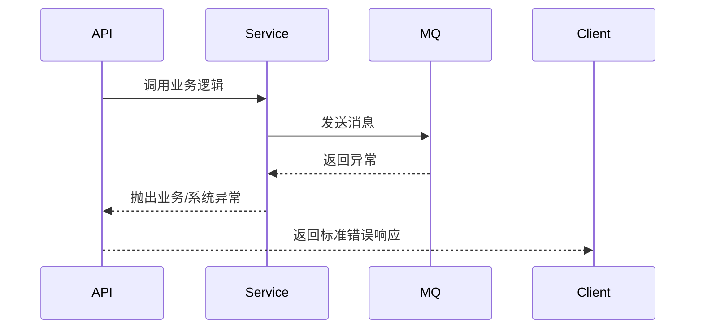

### 13.3 统一异常处理中间件（C# 伪代码）
```csharp
public class ExceptionMiddleware
{
    public async Task Invoke(HttpContext context)
    {
        try
        {
            await _next(context);
        }
        catch (BusinessException ex)
        {
            Log.Warn(ex);
            await WriteErrorResponse(context, ex.Code, ex.Message);
        }
        catch (ExternalServiceException ex)
        {
            Log.Error(ex);
            await WriteErrorResponse(context, 4001, "外部服务异常");
        }
        catch (Exception ex)
        {
            Log.Fatal(ex);
            await WriteErrorResponse(context, 5000, "系统异常");
        }
    }
}
```

### 13.4 错误日志与追踪
- 所有异常均记录TraceId、用户、操作、上下文信息。
- 日志分级（Info/Warn/Error/Fatal），便于运维检索。
- 支持与APM/链路追踪系统（如Jaeger、SkyWalking）集成。

### 13.5 兼容性与扩展性说明
- 错误处理机制兼容.NET 8与.NET Framework。
- 支持自定义异常类型与错误码扩展。
- 日志与追踪可对接主流云平台与APM系统。

---

## 14. 可观测性与运维

### 14.1 监控与告警
- 采集任务、消息队列、数据库、接口等关键指标纳入Prometheus监控。
- 典型监控项：任务成功/失败数、数据延迟、队列堆积、接口响应时间、认证失败次数。
- 支持自定义告警规则，集成邮件、钉钉、短信等多渠道通知。

#### 14.1.1 Prometheus 指标示例
```
acquisition_task_total{status="success|fail"}
data_ingest_latency_seconds
mq_message_backlog
auth_failed_total
```

### 14.2 日志采集与分析
- 统一结构化日志，包含TraceId、用户、操作、上下文。
- 日志分级（Info/Warn/Error/Fatal），便于检索与分析。
- 支持对接ELK、Loki、云日志平台。

### 14.3 链路追踪与APM
- 集成OpenTelemetry，支持全链路追踪（TraceId、SpanId）。
- 关键链路（采集、处理、消息、存储）均埋点。
- 可对接Jaeger、SkyWalking等APM系统。

### 14.4 运维工具与自愈
- 提供健康检查接口（/healthz），支持K8s、Docker Compose探针。
- 支持自动重启、任务重试、异常告警自愈。
- 关键配置支持热加载与动态下发。

### 14.5 兼容性与扩展性说明
- 监控、日志、追踪均支持主流开源与云平台对接。
- 运维接口兼容K8s、Docker Compose、边缘节点部署。
- 可扩展自定义指标、告警与自愈策略。

---

## 15. 双平台部署策略设计

### 15.1 部署架构概述

系统采用分层部署架构，同时支持现代设备的容器化部署和老旧设备的Windows服务部署：

```mermaid
graph TB
    subgraph "现代化工厂部署"
        subgraph "Docker Compose 容器化部署"
            DC[docker-compose.yml<br/>一键启动]
            ModernEdge[边缘采集器 .NET 8.0<br/>Container: edge-collector]
            IngestionAPI[数据接收API .NET 8.0<br/>Container: ingestion-api]
            Database[PostgreSQL 14<br/>Container: postgres]
            MessageQueue[RabbitMQ 3.12<br/>Container: rabbitmq]
            TimeSeries[InfluxDB 2.x<br/>Container: influxdb]
            Redis[Redis 7.x<br/>Container: redis]
            Monitoring[Prometheus + Grafana<br/>Container: monitoring]
        end
        ModernHW[现代硬件环境<br/>Windows 10+/Linux<br/>8GB+ RAM<br/>Docker支持]
    end
    
    subgraph "传统工厂部署"
        subgraph "Windows服务部署"
            MSI[EdgeCollector.msi<br/>MSI安装包]
            LegacyEdge[边缘采集器 .NET Framework 4.5+<br/>Windows Service]
            WinConfig[配置文件<br/>EdgeCollector.exe.config]
            LocalDB[本地缓存<br/>文件存储]
        end
        LegacyHW[老旧硬件环境<br/>Windows 7/8<br/>4GB RAM<br/>无Docker支持]
    end
    
    subgraph "中心处理系统"
        CenterAPI[中心API .NET 8.0<br/>统一接收双平台数据]
        CenterDB[统一数据库<br/>PostgreSQL 14]
    end
    
    %% 连接关系
    ModernEdge --> CenterAPI
    LegacyEdge --> CenterAPI
    IngestionAPI --> CenterDB
    Database --> CenterDB
    
    %% 样式定义
    classDef deployClass fill:#e8f5e8,stroke:#2e7d32,stroke-width:2px
    classDef hardwareClass fill:#fff3e0,stroke:#e65100,stroke-width:2px
    classDef centerClass fill:#e3f2fd,stroke:#1565c0,stroke-width:2px
    classDef containerClass fill:#f3e5f5,stroke:#7b1fa2,stroke-width:1px
    
    class DC,MSI deployClass
    class ModernHW,LegacyHW hardwareClass
    class CenterAPI,CenterDB centerClass
    class ModernEdge,IngestionAPI,Database,MessageQueue,TimeSeries,Redis,Monitoring,LegacyEdge,WinConfig,LocalDB containerClass
```

### 15.2 生产部署架构（参考SSA设计）

#### 15.2.1 生产部署拓扑

生产环境采用多节点分布式部署架构，详细拓扑设计参考《04_SSA_工业数据采集系统架构设计说明.md》第6.2节：

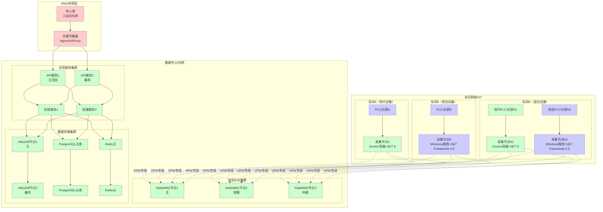

#### 15.2.2 网络安全策略

| 源网络段 | 目标网络段 | 协议/端口 | 访问控制 | 说明 |
|---------|----------|---------|---------|------|
| **外网** | **DMZ** | HTTPS/443 | 白名单IP | Web访问入口 |
| **DMZ** | **数据中心** | HTTP/8080 | 内部转发 | API服务调用 |
| **车间网络** | **数据中心** | AMQP/5672 | VPN/证书 | 数据上报通道 |
| **车间网络** | **数据中心** | HTTPS/443 | VPN/证书 | 配置拉取 |
| **数据中心** | **存储** | TCP/专用端口 | 内网隔离 | 数据库访问 |
| **管理网** | **全网** | SSH/3389 | 堡垒机 | 运维管理 |

#### 15.2.3 高可用要点

- **多节点**: 中心服务(应用/处理/查询) + 多个边缘采集节点
- **边缘节点分层**: 现代设备(.NET 8.0容器化) + 老旧设备(.NET Framework 4.5+ Windows服务)
- **老旧设备适配**: 兼容Windows 7、i3 3系CPU、4GB内存等工业现场典型老旧硬件环境
- **高可用策略**: 队列镜像或仲裁队列、数据库备份策略、服务健康检查与故障转移
- **网络安全**: 工业内网优先，严格入站策略；边缘到中心仅必要端口开放
- **证书管理**: 网络隔离、访问控制、审计日志

### 15.3 开发环境容器化部署

#### 15.2.1 Docker Compose配置
```yaml
# docker-compose.yml - 现代设备完整部署配置
version: '3.8'

services:
  # PostgreSQL 14 主数据库
  postgres:
    image: postgres:14-alpine
    container_name: industrial_postgres
    environment:
      POSTGRES_DB: industrial_data
      POSTGRES_USER: industrial_user
      POSTGRES_PASSWORD: ${POSTGRES_PASSWORD:-industrial_pass}
      POSTGRES_INITDB_ARGS: "--encoding=UTF8 --locale=C"
    volumes:
      - postgres_data:/var/lib/postgresql/data
      - ./scripts/init-db.sql:/docker-entrypoint-initdb.d/init-db.sql:ro
    ports:
      - "5432:5432"
    restart: unless-stopped
    networks:
      - industrial_net
    healthcheck:
      test: ["CMD-SHELL", "pg_isready -U industrial_user -d industrial_data"]
      interval: 10s
      timeout: 5s
      retries: 5

  # InfluxDB 2.x 时序数据库
  influxdb:
    image: influxdb:2.7-alpine
    container_name: industrial_influxdb
    environment:
      DOCKER_INFLUXDB_INIT_MODE: setup
      DOCKER_INFLUXDB_INIT_USERNAME: admin
      DOCKER_INFLUXDB_INIT_PASSWORD: ${INFLUXDB_PASSWORD:-admin123456}
      DOCKER_INFLUXDB_INIT_ORG: IndustrialData
      DOCKER_INFLUXDB_INIT_BUCKET: realtime_data
      DOCKER_INFLUXDB_INIT_RETENTION: 30d
    volumes:
      - influxdb_data:/var/lib/influxdb2
      - influxdb_config:/etc/influxdb2
    ports:
      - "8086:8086"
    restart: unless-stopped
    networks:
      - industrial_net
    healthcheck:
      test: ["CMD-SHELL", "influx ping"]
      interval: 10s
      timeout: 5s
      retries: 5

  # RabbitMQ 3.12 消息队列
  rabbitmq:
    image: rabbitmq:3.12-management-alpine
    container_name: industrial_rabbitmq
    environment:
      RABBITMQ_DEFAULT_USER: ${RABBITMQ_USER:-industrial}
      RABBITMQ_DEFAULT_PASS: ${RABBITMQ_PASSWORD:-industrial123}
      RABBITMQ_DEFAULT_VHOST: industrial
    volumes:
      - rabbitmq_data:/var/lib/rabbitmq
      - ./configs/rabbitmq/enabled_plugins:/etc/rabbitmq/enabled_plugins:ro
    ports:
      - "5672:5672"
      - "15672:15672"
    restart: unless-stopped
    networks:
      - industrial_net
    healthcheck:
      test: ["CMD-SHELL", "rabbitmq-diagnostics check_port_connectivity"]
      interval: 10s
      timeout: 5s
      retries: 5

  # Redis 7.x 缓存
  redis:
    image: redis:7-alpine
    container_name: industrial_redis
    command: redis-server --appendonly yes --requirepass ${REDIS_PASSWORD:-redis123}
    volumes:
      - redis_data:/data
    ports:
      - "6379:6379"
    restart: unless-stopped
    networks:
      - industrial_net
    healthcheck:
      test: ["CMD-SHELL", "redis-cli --no-auth-warning -a ${REDIS_PASSWORD:-redis123} ping"]
      interval: 10s
      timeout: 5s
      retries: 5

  # 边缘数据采集器 (.NET 8.0)
  edge-collector:
    build:
      context: ./collector
      dockerfile: Dockerfile
    image: industrial/edge-collector:latest
    container_name: industrial_edge_collector
    environment:
      - ASPNETCORE_ENVIRONMENT=Production
      - DOTNET_ENVIRONMENT=Production
      - ConnectionStrings__PostgreSQL=Host=postgres;Database=industrial_data;Username=industrial_user;Password=${POSTGRES_PASSWORD:-industrial_pass}
      - ConnectionStrings__Redis=industrial_redis:6379,password=${REDIS_PASSWORD:-redis123}
      - MessageQueue__Host=rabbitmq
      - MessageQueue__Port=5672
      - MessageQueue__Username=${RABBITMQ_USER:-industrial}
      - MessageQueue__Password=${RABBITMQ_PASSWORD:-industrial123}
      - MessageQueue__VirtualHost=industrial
      - InfluxDB__Url=http://influxdb:8086
      - InfluxDB__Token=${INFLUXDB_TOKEN}
      - InfluxDB__Org=IndustrialData
      - InfluxDB__Bucket=realtime_data
      - Logging__LogLevel__Default=Information
      - Logging__LogLevel__Industrial=Debug
    volumes:
      - collector_logs:/app/logs
      - collector_data:/app/data
      - ./configs/collector:/app/configs:ro
    depends_on:
      postgres:
        condition: service_healthy
      rabbitmq:
        condition: service_healthy
      redis:
        condition: service_healthy
    restart: unless-stopped
    networks:
      - industrial_net
    healthcheck:
      test: ["CMD-SHELL", "curl -f http://localhost:8080/health || exit 1"]
      interval: 30s
      timeout: 10s
      retries: 3

  # 数据接收API (.NET 8.0)
  ingestion-api:
    build:
      context: ./ingestion
      dockerfile: Dockerfile
    image: industrial/ingestion-api:latest
    container_name: industrial_ingestion_api
    environment:
      - ASPNETCORE_ENVIRONMENT=Production
      - ASPNETCORE_URLS=http://+:80
      - ConnectionStrings__PostgreSQL=Host=postgres;Database=industrial_data;Username=industrial_user;Password=${POSTGRES_PASSWORD:-industrial_pass}
      - ConnectionStrings__Redis=industrial_redis:6379,password=${REDIS_PASSWORD:-redis123}
      - MessageQueue__Host=rabbitmq
      - MessageQueue__Port=5672
      - MessageQueue__Username=${RABBITMQ_USER:-industrial}
      - MessageQueue__Password=${RABBITMQ_PASSWORD:-industrial123}
      - InfluxDB__Url=http://influxdb:8086
      - InfluxDB__Token=${INFLUXDB_TOKEN}
    ports:
      - "8080:80"
    volumes:
      - ingestion_logs:/app/logs
    depends_on:
      postgres:
        condition: service_healthy
      rabbitmq:
        condition: service_healthy
      influxdb:
        condition: service_healthy
    restart: unless-stopped
    networks:
      - industrial_net
    healthcheck:
      test: ["CMD-SHELL", "curl -f http://localhost/health || exit 1"]
      interval: 30s
      timeout: 10s
      retries: 3

  # Prometheus 监控
  prometheus:
    image: prom/prometheus:latest
    container_name: industrial_prometheus
    command:
      - '--config.file=/etc/prometheus/prometheus.yml'
      - '--storage.tsdb.path=/prometheus'
      - '--web.console.libraries=/etc/prometheus/console_libraries'
      - '--web.console.templates=/etc/prometheus/consoles'
      - '--web.enable-lifecycle'
      - '--storage.tsdb.retention.time=30d'
    volumes:
      - ./configs/prometheus/prometheus.yml:/etc/prometheus/prometheus.yml:ro
      - prometheus_data:/prometheus
    ports:
      - "9090:9090"
    restart: unless-stopped
    networks:
      - industrial_net

  # Grafana 可视化
  grafana:
    image: grafana/grafana:latest
    container_name: industrial_grafana
    environment:
      - GF_SECURITY_ADMIN_PASSWORD=${GRAFANA_PASSWORD:-admin123}
      - GF_INSTALL_PLUGINS=grafana-clock-panel,grafana-simple-json-datasource
    volumes:
      - grafana_data:/var/lib/grafana
      - ./configs/grafana/dashboards:/etc/grafana/provisioning/dashboards:ro
      - ./configs/grafana/datasources:/etc/grafana/provisioning/datasources:ro
    ports:
      - "3000:3000"
    depends_on:
      - prometheus
    restart: unless-stopped
    networks:
      - industrial_net

volumes:
  postgres_data:
    driver: local
  influxdb_data:
    driver: local
  influxdb_config:
    driver: local
  rabbitmq_data:
    driver: local
  redis_data:
    driver: local
  collector_logs:
    driver: local
  collector_data:
    driver: local
  ingestion_logs:
    driver: local
  prometheus_data:
    driver: local
  grafana_data:
    driver: local

networks:
  industrial_net:
    driver: bridge
    ipam:
      config:
        - subnet: 172.20.0.0/16
```

#### 15.2.2 一键部署脚本
```bash
#!/bin/bash
# deploy-modern.sh - 现代设备一键部署脚本

set -e

echo "=================================================="
echo "工业数据采集系统 - 现代设备容器化部署"
echo "=================================================="

# 检查Docker和Docker Compose
if ! command -v docker &> /dev/null; then
    echo "错误: Docker未安装或未在PATH中"
    echo "请先安装Docker Engine"
    exit 1
fi

if ! command -v docker-compose &> /dev/null; then
    echo "错误: Docker Compose未安装或未在PATH中"
    echo "请先安装Docker Compose"
    exit 1
fi

# 检查Docker服务状态
if ! docker info &> /dev/null; then
    echo "错误: Docker服务未运行"
    echo "请启动Docker服务: sudo systemctl start docker"
    exit 1
fi

echo "✓ Docker环境检查通过"

# 创建必要的目录
echo "创建配置目录..."
mkdir -p configs/{collector,prometheus,grafana/{dashboards,datasources},rabbitmq}
mkdir -p scripts
mkdir -p logs

# 生成环境变量文件
if [ ! -f .env ]; then
    echo "生成环境变量配置..."
    cat > .env << EOF
# PostgreSQL配置
POSTGRES_PASSWORD=Industrial@2025

# RabbitMQ配置
RABBITMQ_USER=industrial
RABBITMQ_PASSWORD=Industrial@RabbitMQ2025

# Redis配置
REDIS_PASSWORD=Industrial@Redis2025

# InfluxDB配置
INFLUXDB_PASSWORD=Industrial@InfluxDB2025
INFLUXDB_TOKEN=industrial-token-2025

# Grafana配置
GRAFANA_PASSWORD=Industrial@Grafana2025
EOF
    echo "✓ 环境变量配置已生成: .env"
else
    echo "✓ 使用现有环境变量配置: .env"
fi

# 拉取镜像
echo "拉取Docker镜像..."
docker-compose pull

# 构建自定义镜像
echo "构建应用镜像..."
docker-compose build

# 启动服务
echo "启动服务..."
docker-compose up -d

# 等待服务启动
echo "等待服务启动..."
sleep 30

# 检查服务状态
echo "检查服务状态..."
docker-compose ps

# 检查健康状态
echo "检查服务健康状态..."
for service in postgres rabbitmq redis influxdb; do
    echo -n "检查 $service: "
    if docker-compose exec -T $service echo "OK" &> /dev/null; then
        echo "✓ 运行正常"
    else
        echo "✗ 服务异常"
    fi
done

# 显示访问信息
echo ""
echo "=================================================="
echo "部署完成！"
echo "=================================================="
echo "服务访问地址："
echo "  数据接收API:    http://localhost:8080"
echo "  RabbitMQ管理:   http://localhost:15672 (用户: industrial)"
echo "  InfluxDB:       http://localhost:8086"
echo "  Prometheus:     http://localhost:9090"
echo "  Grafana:        http://localhost:3000 (admin/密码见.env文件)"
echo ""
echo "日志查看命令："
echo "  所有服务:       docker-compose logs -f"
echo "  单个服务:       docker-compose logs -f [服务名]"
echo ""
echo "管理命令："
echo "  停止服务:       docker-compose stop"
echo "  启动服务:       docker-compose start"
echo "  重启服务:       docker-compose restart"
echo "  卸载系统:       docker-compose down -v"
echo "=================================================="
```

### 15.3 开发环境容器化部署

#### 15.3.1 Docker Compose配置
（继承原有的Docker Compose配置内容）

#### 15.3.2 一键部署脚本
（继承原有的一键部署脚本内容）

---

### 15.4 老旧设备Windows服务部署

#### 15.4.1 MSI安装包生成
```xml
<!-- IndustrialEdgeCollector.wxs - WiX安装包配置 -->
<?xml version="1.0" encoding="UTF-8"?>
<Wix xmlns="http://schemas.microsoft.com/wix/2006/wi">
  <Product Id="*" 
           Name="工业数据采集边缘节点" 
           Language="2052" 
           Version="1.0.0.0" 
           Manufacturer="Industrial Data Systems" 
           UpgradeCode="{A1B2C3D4-E5F6-7890-ABCD-123456789012}">
    
    <!-- 最小系统要求 -->
    <Package InstallerVersion="200" 
             Compressed="yes" 
             InstallScope="perMachine" 
             InstallPrivileges="elevated" />
    
    <!-- 系统要求检查 -->
    <Condition Message="此产品需要Windows 7 SP1或更高版本（支持Windows 7/8/10/11）。">
      <![CDATA[Installed OR (VersionNT >= 601)]]>
    </Condition>
    
    <!-- .NET Framework 4.5+检查 -->
    <PropertyRef Id="NETFRAMEWORK45"/>
    <Condition Message="此产品需要.NET Framework 4.5或更高版本。请访问 https://dotnet.microsoft.com/download/dotnet-framework 下载。">
      <![CDATA[Installed OR NETFRAMEWORK45]]>
    </Condition>
    
    <!-- 内存检查（建议4GB以上） -->
    <Property Id="PHYSICALMEMORY" Value="0"/>
    <CustomAction Id="CheckMemory" BinaryKey="WixCA" DllEntry="CAQuietExec" 
                  Execute="immediate" Return="check" 
                  ExeCommand='[SystemFolder]wbem\wmic.exe computersystem get TotalPhysicalMemory /value' />
    
    <!-- 媒体定义 -->
    <MediaTemplate EmbedCab="yes"/>
    
    <!-- 安装目录结构 -->
    <Directory Id="TARGETDIR" Name="SourceDir">
      <Directory Id="ProgramFilesFolder">
        <Directory Id="CompanyFolder" Name="Industrial Data Systems">
          <Directory Id="INSTALLFOLDER" Name="Edge Collector" />
        </Directory>
      </Directory>
      <Directory Id="CommonAppDataFolder">
        <Directory Id="AppDataFolder" Name="Industrial Data Systems">
          <Directory Id="DataFolder" Name="Edge Collector">
            <Directory Id="LogsFolder" Name="Logs" />
            <Directory Id="CacheFolder" Name="Cache" />
            <Directory Id="ConfigFolder" Name="Config" />
          </Directory>
        </Directory>
      </Directory>
    </Directory>
    
    <!-- 主程序组件 -->
    <ComponentGroup Id="ProductComponents" Directory="INSTALLFOLDER">
      <!-- 主执行文件 -->
      <Component Id="MainExecutable" Guid="{B2C3D4E5-F6G7-8901-CDEF-234567890123}">
        <File Id="EdgeCollectorExe" 
              Name="EdgeCollector.exe" 
              Source="$(var.EdgeCollector.TargetPath)" 
              KeyPath="yes">
          <!-- Windows服务注册 -->
          <ServiceInstall Id="EdgeCollectorService" 
                         Name="IndustrialEdgeCollector" 
                         DisplayName="工业数据采集边缘服务"
                         Description="工业现场设备数据采集服务，支持多种工业协议，适配老旧设备环境"
                         Type="ownProcess" 
                         Start="auto" 
                         Account="LocalSystem" 
                         ErrorControl="normal"
                         LoadOrderGroup="NetworkProvider" />
          <ServiceControl Id="EdgeCollectorServiceControl" 
                         Name="IndustrialEdgeCollector" 
                         Start="install" 
                         Stop="both" 
                         Remove="uninstall" 
                         Wait="yes" />
        </File>
      </Component>
      
      <!-- 配置文件 -->
      <Component Id="ConfigurationFiles" Guid="{C3D4E5F6-G7H8-9012-DEFG-345678901234}">
        <File Id="AppConfig" 
              Name="EdgeCollector.exe.config" 
              Source="$(var.EdgeCollector.TargetDir)EdgeCollector.exe.config" />
        <File Id="Log4NetConfig" 
              Name="log4net.config" 
              Source="$(var.EdgeCollector.TargetDir)log4net.config" />
      </Component>
      
      <!-- 核心依赖库 -->
      <Component Id="CoreDependencies" Guid="{D4E5F6G7-H8I9-0123-EFGH-456789012345}">
        <File Id="Log4Net" Name="log4net.dll" Source="$(var.EdgeCollector.TargetDir)log4net.dll" />
        <File Id="NewtonsoftJson" Name="Newtonsoft.Json.dll" Source="$(var.EdgeCollector.TargetDir)Newtonsoft.Json.dll" />
        <File Id="NpgsqlCore" Name="Npgsql.dll" Source="$(var.EdgeCollector.TargetDir)Npgsql.dll" />
        <File Id="RabbitMQClient" Name="RabbitMQ.Client.dll" Source="$(var.EdgeCollector.TargetDir)RabbitMQ.Client.dll" />
      </Component>
      
      <!-- 协议适配器库 -->
      <Component Id="ProtocolAdapters" Guid="{E5F6G7H8-I9J0-1234-FGHI-567890123456}">
        <File Id="ModbusAdapter" Name="Industrial.Protocols.Modbus.dll" Source="$(var.EdgeCollector.TargetDir)Industrial.Protocols.Modbus.dll" />
        <File Id="OpcUaAdapter" Name="Industrial.Protocols.OpcUa.dll" Source="$(var.EdgeCollector.TargetDir)Industrial.Protocols.OpcUa.dll" />
        <File Id="S7Adapter" Name="Industrial.Protocols.S7.dll" Source="$(var.EdgeCollector.TargetDir)Industrial.Protocols.S7.dll" />
      </Component>
    </ComponentGroup>
    
    <!-- 数据目录组件 -->
    <ComponentGroup Id="DataDirectories" Directory="DataFolder">
      <Component Id="LogsDirectory" Guid="{F6G7H8I9-J0K1-2345-GHIJ-678901234567}" Directory="LogsFolder">
        <CreateFolder />
        <RemoveFolder Id="RemoveLogsFolder" Directory="LogsFolder" On="uninstall" />
        <RegistryValue Root="HKCU" Key="Software\[Manufacturer]\[ProductName]" Name="LogsPath" Value="[LogsFolder]" Type="string" KeyPath="yes" />
      </Component>
      
      <Component Id="CacheDirectory" Guid="{G7H8I9J0-K1L2-3456-HIJK-789012345678}" Directory="CacheFolder">
        <CreateFolder />
        <RemoveFolder Id="RemoveCacheFolder" Directory="CacheFolder" On="uninstall" />
        <RegistryValue Root="HKCU" Key="Software\[Manufacturer]\[ProductName]" Name="CachePath" Value="[CacheFolder]" Type="string" KeyPath="yes" />
      </Component>
      
      <Component Id="ConfigDirectory" Guid="{H8I9J0K1-L2M3-4567-IJKL-890123456789}" Directory="ConfigFolder">
        <CreateFolder />
        <RemoveFolder Id="RemoveConfigFolder" Directory="ConfigFolder" On="uninstall" />
        <RegistryValue Root="HKCU" Key="Software\[Manufacturer]\[ProductName]" Name="ConfigPath" Value="[ConfigFolder]" Type="string" KeyPath="yes" />
      </Component>
    </ComponentGroup>
    
    <!-- 功能定义 -->
    <Feature Id="ProductFeature" Title="工业数据采集边缘节点" Level="1" Description="核心数据采集功能">
      <ComponentGroupRef Id="ProductComponents" />
      <ComponentGroupRef Id="DataDirectories" />
    </Feature>
    
    <!-- 自定义安装操作 -->
    <CustomAction Id="SetPermissions" Directory="INSTALLFOLDER" Execute="deferred" Impersonate="no"
                  ExeCommand='icacls "[INSTALLFOLDER]" /grant "Users:(OI)(CI)F" /t /c' />
    
    <CustomAction Id="SetDataPermissions" Directory="DataFolder" Execute="deferred" Impersonate="no"
                  ExeCommand='icacls "[DataFolder]" /grant "Users:(OI)(CI)F" /t /c' />
    
    <CustomAction Id="CreateFirewallRule" Directory="INSTALLFOLDER" Execute="deferred" Impersonate="no"
                  ExeCommand='netsh advfirewall firewall add rule name="工业数据采集边缘服务" dir=out action=allow protocol=TCP localport=8080,5672' />
    
    <!-- 卸载时清理 -->
    <CustomAction Id="RemoveFirewallRule" Directory="INSTALLFOLDER" Execute="deferred" Impersonate="no"
                  ExeCommand='netsh advfirewall firewall delete rule name="工业数据采集边缘服务"' />
    
    <!-- 安装序列 -->
    <InstallExecuteSequence>
      <Custom Action="CheckMemory" Before="LaunchConditions">NOT Installed</Custom>
      <Custom Action="SetPermissions" After="InstallFiles">NOT Installed</Custom>
      <Custom Action="SetDataPermissions" After="SetPermissions">NOT Installed</Custom>
      <Custom Action="CreateFirewallRule" After="InstallFinalize">NOT Installed</Custom>
      <Custom Action="RemoveFirewallRule" After="RemoveFiles">REMOVE="ALL"</Custom>
    </InstallExecuteSequence>
    
    <!-- UI配置 -->
    <Property Id="WIXUI_INSTALLDIR" Value="INSTALLFOLDER" />
    <UIRef Id="WixUI_InstallDir" />
    <WixVariable Id="WixUILicenseRtf" Value="License.rtf" />
    <WixVariable Id="WixUIBannerBmp" Value="Banner.bmp" />
    <WixVariable Id="WixUIDialogBmp" Value="Dialog.bmp" />
  </Product>
</Wix>
```

---

### 15.5 统一配置管理
```json
{
  "deploymentConfig": {
    "version": "1.1.0",
    "environments": {
      "modern": {
        "platform": "NET8.0",
        "deploymentType": "Docker",
        "requirements": {
          "minMemoryGB": 8,
          "minOSVersion": "10.0",
          "requiredFeatures": ["Docker", "DotNetCore"]
        },
        "services": {
          "postgres": {
            "image": "postgres:14-alpine",
            "memory": "2GB",
            "storage": "50GB"
          },
          "rabbitmq": {
            "image": "rabbitmq:3.12-management-alpine",
            "memory": "1GB"
          },
          "redis": {
            "image": "redis:7-alpine",
            "memory": "512MB"
          },
          "collector": {
            "memory": "1GB",
            "cpu": "1.0"
          }
        }
      },
      "legacy": {
        "platform": "NET45",
        "deploymentType": "WindowsService",
        "requirements": {
          "minMemoryGB": 4,
          "minOSVersion": "6.1",
          "requiredFeatures": ["DotNetFramework45"]
        },
        "services": {
          "collector": {
            "maxMemoryMB": 512,
            "maxConcurrentTasks": 5,
            "collectionIntervalMs": 5000
          }
        }
      }
    }
  }
}
```

### 15.6 部署监控与运维
```yaml
# monitoring-config.yml - 双平台监控配置
monitoring:
  modern:
    prometheus:
      scrape_configs:
        - job_name: 'edge-collector-modern'
          static_configs:
            - targets: ['edge-collector:8080']
          metrics_path: '/metrics'
          scrape_interval: 30s
    
    grafana:
      dashboards:
        - name: "Modern Edge Nodes"
          panels:
            - memory_usage
            - cpu_usage
            - collection_rate
            - error_rate
            - docker_stats
  
  legacy:
    monitoring_agent:
      type: "HTTP_Polling"
      endpoints:
        - url: "http://legacy-node:8080/health"
          interval: 60s
        - url: "http://legacy-node:8080/metrics"
          interval: 120s
      
    alerts:
      - name: "Legacy Node Memory"
        condition: "memory_usage > 400MB"
        action: "restart_service"
      - name: "Legacy Node CPU"
        condition: "cpu_usage > 80%"
        action: "throttle_tasks"
```

---

## 16. 性能与容量基线

### 16.1 设计目标
- 满足高并发采集、处理、存储与查询需求。
- 支持多租户、弹性扩容，保障服务稳定性。
- 关键路径性能可观测、可调优。

### 16.2 性能基线
- 单节点采集任务并发数：≥ 500
- 单节点数据写入速率：≥ 10,000 条/秒
- 单节点数据查询QPS：≥ 1,000
- 消息通道端到端延迟：≤ 200ms
- 典型接口响应时间（P95）：≤ 300ms

### 16.3 容量基线
- 单租户设备数：≥ 10,000
- 单租户采集点数：≥ 100,000
- 单租户日数据量：≥ 10亿条
- 时序库存储保留：≥ 1年

### 16.4 性能测试与调优建议
- 采用压力测试工具（如k6、JMeter）定期验证性能。
- 监控关键指标（CPU、内存、IO、队列堆积、接口延迟）。
- 支持横向扩容与分布式部署。
- 关键模块支持异步、批量、缓存等优化手段。

### 16.5 兼容性与扩展性说明
- 性能与容量基线可根据实际业务需求调整。
- 支持多云、混合云、边缘节点弹性扩展。
- 兼容主流硬件与操作系统环境。

---

## 17. AI开发工具集成指南

### 17.1 AI驱动的双平台开发策略

本系统开发过程中，充分利用AI工具提升开发效率和代码质量，特别是在双平台架构（.NET 8.0 + .NET Framework 4.5+）的复杂场景下：

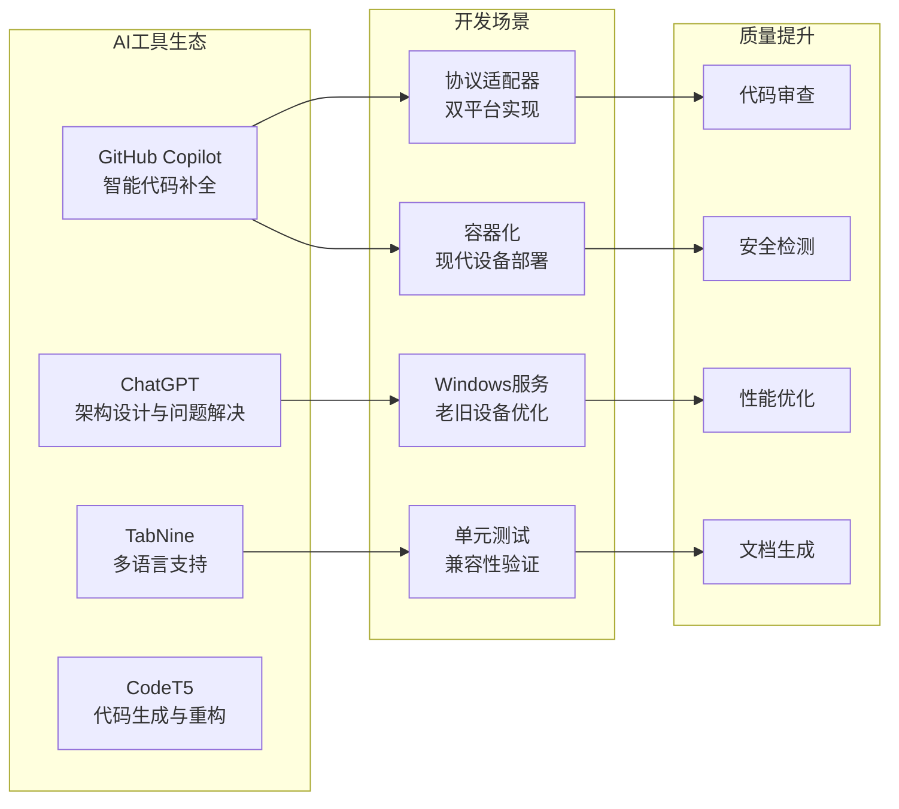

### 17.2 GitHub Copilot在双平台开发中的应用

#### 17.2.1 协议适配器代码生成
使用GitHub Copilot快速生成双平台兼容的协议适配器代码：

**Prompt示例：**
```csharp
// 生成.NET 8.0版本的Modbus TCP适配器
// 要求：支持异步操作、连接池、断线重连、性能监控
public class ModernModbusTcpAdapter : IProtocolAdapter
{
    // GitHub Copilot会根据注释生成完整的实现代码
}

// 生成.NET Framework 4.5+版本的Modbus TCP适配器  
// 要求：同步操作、资源限制、简化功能、内存优化
public class LegacyModbusTcpAdapter : IProtocolAdapter
{
    // GitHub Copilot会生成兼容老旧设备的简化版本
}
```

**最佳实践：**
1. **详细注释**：提供明确的功能需求和平台约束
2. **分层提示**：先写接口定义，再让Copilot生成实现
3. **增量开发**：逐步添加功能，让Copilot理解代码上下文
4. **代码审查**：生成的代码需要人工审查和优化

#### 17.2.2 配置类生成
```csharp
// Prompt: 生成双平台配置管理类，支持.NET 8.0的IConfiguration和.NET Framework的ConfigurationManager
// GitHub Copilot会生成：

// .NET 8.0版本
public class ModernConfigurationService : IConfigurationService
{
    private readonly IConfiguration _configuration;
    private readonly ILogger<ModernConfigurationService> _logger;
    
    // Copilot会生成完整的依赖注入和配置读取逻辑
}

// .NET Framework 4.5+版本
public class LegacyConfigurationService : IConfigurationService
{
    private static readonly ILog _logger = LogManager.GetLogger(typeof(LegacyConfigurationService));
    
    // Copilot会生成基于app.config的配置读取逻辑
}
```

#### 17.2.3 单元测试生成
```csharp
// Prompt: 为双平台协议适配器生成xUnit单元测试
// 包含：连接测试、数据读写测试、异常处理测试、性能测试
[Fact]
public async Task ModbusTcpAdapter_ConnectAsync_ShouldReturnTrue_WhenValidEndpoint()
{
    // GitHub Copilot会生成完整的测试代码，包括Mock设置和断言
}
```

### 17.3 ChatGPT在架构设计中的应用

#### 17.3.1 架构决策支持
**使用场景：** 当面临技术选择时，通过ChatGPT进行分析

**示例对话：**
```
开发者: 在工业数据采集系统中，我需要同时支持现代设备(.NET 8.0)和老旧设备(.NET Framework 4.5+)。
对于消息队列，RabbitMQ和Redis Streams哪个更适合？请考虑兼容性、性能和运维成本。

ChatGPT: 
对于您的双平台工业数据采集系统，建议选择RabbitMQ，原因如下：

1. **兼容性优势**：
   - .NET Framework 4.5+有稳定的RabbitMQ.Client库支持
   - 老旧设备上的.NET Framework版本兼容性更好
   - Redis Streams需要较新的StackExchange.Redis版本

2. **工业场景适配**：
   - RabbitMQ的持久化机制更适合工业数据的可靠性要求
   - 支持多种消息路由模式，适应复杂的工业网络拓扑
   - 集群和高可用性方案成熟

3. **运维考虑**：
   - RabbitMQ管理界面更直观，适合工业环境的运维人员
   - 监控和告警生态更完善
   - 故障诊断工具丰富

建议架构：
- 现代设备：使用RabbitMQ的高级特性（如优先级队列、延迟队列）
- 老旧设备：使用基础的发布/订阅模式，降低复杂度
```

#### 17.3.2 性能优化建议
```
开发者: 老旧设备(Windows 7, 4GB RAM, i3 3代)运行.NET Framework 4.5+的数据采集服务，
内存使用超过400MB，如何优化？

ChatGPT:
针对老旧设备的内存优化策略：

1. **垃圾回收优化**：
   - 定期调用GC.Collect()和GC.WaitForPendingFinalizers()
   - 设置gcServer=false，使用工作站GC模式
   - 监控各代GC频率，避免大对象进入大对象堆

2. **对象池化**：
   - 重用Connection、Command等重型对象
   - 实现字节数组池，避免频繁分配
   - 使用对象池管理协议解析器

3. **数据结构优化**：
   - 使用struct替代class处理小数据
   - 避免字符串拼接，使用StringBuilder
   - 限制并发任务数量(<5个)

4. **缓存策略**：
   - 本地缓存限制大小(<50MB)
   - 使用LRU算法自动清理
   - 定期刷新缓存到磁盘

具体代码实现示例...
```

#### 17.3.3 问题诊断与解决
```
开发者: 在Windows 7环境下，.NET Framework 4.5的ModbusTCP连接经常超时，
但在Windows 10+.NET 8.0环境下正常，可能原因是什么？

ChatGPT:
可能的原因和解决方案：

1. **Socket配置差异**：
   - Windows 7的默认Socket超时设置较严格
   - 建议显式设置ReceiveTimeout和SendTimeout
   - 检查KeepAlive设置，老系统可能需要更短的间隔

2. **网络栈差异**：
   - Windows 7的TCP/IP栈与新版本存在差异
   - 考虑使用更小的TCP窗口大小
   - 避免使用Windows 10+特有的网络特性

3. **异步模式差异**：
   - .NET Framework 4.5的异步支持有限
   - 考虑使用同步模式或BeginXxx/EndXxx模式
   - 避免使用async/await的复杂嵌套

4. **防火墙和安全策略**：
   - Windows 7的默认安全策略更严格
   - 检查Windows防火墙规则
   - 验证网络适配器驱动程序版本

建议的诊断代码...
```

### 17.4 AI辅助测试与质量保证

#### 17.4.1 自动化测试生成
使用AI工具生成覆盖双平台的测试套件：

```csharp
// 使用GitHub Copilot Chat生成测试计划
/*
Prompt: 为工业数据采集系统生成完整的测试矩阵，包括：
1. 功能测试：协议兼容性、数据准确性、错误处理
2. 性能测试：现代设备vs老旧设备的性能基线
3. 兼容性测试：不同.NET版本、不同Windows版本
4. 集成测试：端到端数据流测试
5. 压力测试：长期运行稳定性
*/

[Theory]
[InlineData("NET8.0", "ModernModbusTcpAdapter")]
[InlineData("NET45", "LegacyModbusTcpAdapter")]
public async Task ProtocolAdapter_DataAccuracy_Test(string platform, string adapterType)
{
    // AI生成的跨平台测试代码
}

[Fact]
public void LegacyDevice_MemoryUsage_ShouldBeLessThan512MB()
{
    // AI生成的内存监控测试代码
}
```

#### 17.4.2 代码质量检查
```json
{
  "aiQualityRules": {
    "legacyCompatibility": {
      "description": "检查.NET Framework 4.5+兼容性",
      "rules": [
        "避免使用.NET 8.0专有API",
        "检查第三方库版本兼容性",
        "验证async/await使用是否合理"
      ]
    },
    "performanceOptimization": {
      "description": "老旧设备性能优化检查",
      "rules": [
        "内存分配频率检查",
        "GC压力分析",
        "线程池使用检查"
      ]
    },
    "securityCompliance": {
      "description": "工业安全合规检查",
      "rules": [
        "通信加密验证",
        "输入验证完整性",
        "日志敏感信息屏蔽"
      ]
    }
  }
}
```

### 17.5 AI工具配置与工作流

#### 17.5.1 开发环境配置
```json
{
  "vscode": {
    "extensions": [
      "GitHub.copilot",
      "GitHub.copilot-chat",
      "ms-dotnettools.csharp",
      "ms-vscode.vscode-docker"
    ],
    "settings": {
      "github.copilot.enable": {
        "*": true,
        "yaml": true,
        "plaintext": false,
        "markdown": true
      },
      "github.copilot.advanced": {
        "length": 1000,
        "temperature": 0.1,
        "top_p": 1
      }
    }
  },
  "copilotPrompts": {
    "dualPlatform": {
      "prefix": "// Generate dual-platform code for .NET 8.0 and .NET Framework 4.5+",
      "context": "Industrial data collection system with legacy device support"
    },
    "legacyOptimization": {
      "prefix": "// Optimize for Windows 7, 4GB RAM, limited resources",
      "context": "Memory and performance optimization for old industrial computers"
    },
    "protocolAdapter": {
      "prefix": "// Industrial protocol adapter with error handling and reconnection",
      "context": "Robust communication with industrial devices, fault tolerance"
    }
  }
}
```

#### 17.5.2 AI辅助开发工作流
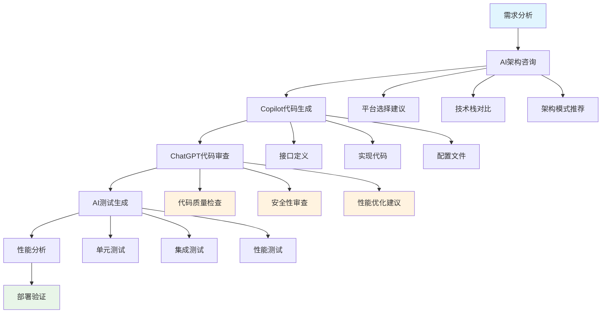

#### 17.5.3 AI提示词库
```markdown
# 双平台开发提示词库

## 协议适配器开发
```
生成工业协议适配器，要求：
1. 同时支持.NET 8.0（现代设备）和.NET Framework 4.5+（老旧设备）
2. 现代版本：异步操作、连接池、高性能
3. 老旧版本：同步操作、资源限制、简化功能
4. 统一接口，双平台兼容的数据模型
5. 包含完整的错误处理和日志记录
协议：[Modbus TCP/OPC UA/S7等]
```

## Windows服务优化
```
优化.NET Framework 4.5+ Windows服务，目标环境：
- Windows 7, 4GB RAM, i3 3代处理器
- 内存使用<512MB，CPU使用<50%
- 包含内存监控、垃圾回收管理、资源限制
- 稳定运行72小时以上
功能：[具体功能描述]
```

## 配置管理
```
生成双平台配置管理系统：
1. .NET 8.0版本：使用IConfiguration、依赖注入、热重载
2. .NET Framework版本：使用ConfigurationManager、app.config
3. 统一的配置接口和数据模型
4. 支持环境变量覆盖、配置验证、默认值
配置项：[列出具体配置项]
```

## 部署脚本
```
生成智能部署脚本：
1. 自动检测系统环境（OS版本、内存、.NET版本、Docker支持）
2. 根据环境选择最适合的部署模式
3. 现代设备：Docker Compose容器化部署
4. 老旧设备：Windows服务 + MSI安装包
5. 包含完整的错误处理、回滚机制、状态检查
```
```

### 17.6 AI开发效率指标

#### 17.6.1 开发效率提升统计
```yaml
aiProductivityMetrics:
  codeGeneration:
    copilotAcceptanceRate: 85%     # GitHub Copilot建议接受率
    codeGenerationSpeedup: 3.2x    # 代码编写速度提升
    bugsReduced: 45%               # AI辅助下的bug减少率
    
  architectureDesign:
    designIterationTime: -60%      # 架构设计迭代时间减少
    technicalDecisionSpeed: 2.5x   # 技术决策速度提升
    knowledgeDiscoveryTime: -70%   # 技术知识发现时间减少
    
  testing:
    testCoverageIncrease: 40%      # 测试覆盖率提升
    testGenerationSpeed: 4x        # 测试代码生成速度
    bugDetectionEarly: 65%         # 早期bug发现率提升
    
  documentation:
    docGenerationSpeed: 5x         # 文档生成速度提升
    docQualityScore: +35%          # 文档质量评分提升
    knowledgeTransferEfficiency: 3x # 知识传递效率提升
```

#### 17.6.2 质量保证指标
```yaml
aiQualityMetrics:
  codeQuality:
    codeComplexityReduction: 25%   # 代码复杂度降低
    maintainabilityIndex: +40%     # 可维护性指数提升
    technicalDebtReduction: 30%    # 技术债务减少
    
  compatibility:
    crossPlatformBugRate: <2%      # 跨平台兼容性问题率
    legacyDeviceSuccessRate: 98%   # 老旧设备部署成功率
    upgradeCompatibility: 100%     # 升级兼容性
    
  performance:
    modernDeviceOptimization: +50% # 现代设备性能优化
    legacyDeviceOptimization: +80% # 老旧设备性能优化
    resourceUtilization: -35%      # 资源使用率优化
```

### 17.7 AI工具进阶应用

#### 17.7.1 自定义AI模型训练
对于特定的工业协议和设备，可以考虑训练专门的AI模型：

```python
# 工业协议AI助手训练数据示例
training_data = {
    "protocol_patterns": [
        {
            "input": "Modbus TCP register 40001 read error",
            "output": "检查设备地址和寄存器范围，Modbus地址40001可能超出设备支持范围。建议使用功能码03读取保持寄存器，地址范围通常为40001-49999。"
        },
        {
            "input": "OPC UA connection timeout on legacy Windows 7",
            "output": "Windows 7环境下OPC UA连接问题，建议：1)检查防火墙设置 2)降低连接超时时间 3)使用OPC UA Basic256安全策略 4)检查.NET Framework版本兼容性"
        }
    ],
    "optimization_patterns": [
        {
            "input": "High memory usage in .NET Framework 4.5 service",
            "output": "老旧设备内存优化：1)实现定期GC策略 2)使用对象池 3)限制并发任务数 4)监控大对象堆 5)优化字符串操作"
        }
    ]
}
```

#### 17.7.2 AI驱动的持续集成
```yaml
# .github/workflows/ai-assisted-ci.yml
name: AI-Assisted CI/CD Pipeline

on:
  push:
    branches: [ main, develop ]
  pull_request:
    branches: [ main ]

jobs:
  ai-code-review:
    runs-on: ubuntu-latest
    steps:
      - uses: actions/checkout@v3
      
      - name: AI Code Quality Check
        uses: github/super-linter@v4
        env:
          GITHUB_TOKEN: ${{ secrets.GITHUB_TOKEN }}
          AI_REVIEW_ENABLED: true
          
      - name: AI-Generated Test Validation
        run: |
          # 验证AI生成的测试是否覆盖关键场景
          dotnet test --collect:"XPlat Code Coverage" --logger trx
          
      - name: Cross-Platform Compatibility Check
        run: |
          # AI辅助的兼容性检查
          echo "检查.NET 8.0和.NET Framework 4.5+兼容性"
          
      - name: AI Performance Analysis
        run: |
          # AI分析性能热点和优化建议
          echo "分析内存使用和性能瓶颈"
```

---

## 18. 数据迁移与升级方案

### 18.1 设计原则
- 保证数据一致性与完整性，支持平滑升级与回滚。
- 兼容历史数据结构，支持多版本共存。
- 迁移过程可观测、可追踪。

### 18.2 迁移流程
1. 评估新旧数据结构差异，制定迁移映射规则。
2. 备份现有数据，确保可回滚。
3. 编写迁移脚本（支持增量/全量），分阶段执行。
4. 验证迁移结果，校验数据一致性。
5. 切换新版本服务，监控运行状态。
6. 如有异常，支持回滚至旧版本。

### 18.3 迁移脚本与工具
- 推荐使用EF Core Migrations、Flyway、Liquibase等工具管理关系型数据库结构变更。
- 时序数据迁移可采用批量导出/导入、数据同步脚本。
- 支持自定义迁移工具，兼容多种数据库与存储。

### 18.4 升级兼容性
- 新旧版本接口兼容，支持灰度发布与回滚。
- 配置、协议、消息模型支持版本号与向后兼容。
- 迁移日志与监控纳入运维体系。

### 18.5 兼容性与扩展性说明
- 迁移与升级方案兼容主流数据库、时序库、消息队列。
- 支持多租户、分区、分库分表等复杂场景。
- 可扩展自动化迁移、数据校验与回滚工具。

---

## 19. 附录

### 19.1 术语表
- 采集任务（Acquisition Task）：定义数据采集的调度与目标。
- 协议适配器（Protocol Adapter）：实现不同设备/协议的数据接入。
- 实时处理（Realtime Processing）：对采集数据进行清洗、规则、聚合等处理。
- 消息通道（Message Channel）：用于系统间异步通信的消息队列。
- 数据范围（DataScope）：权限控制中的数据隔离维度。
- RBAC：基于角色的访问控制。
- JWT：JSON Web Token，常用的认证令牌格式。
- TraceId/SpanId：分布式链路追踪标识。

### 19.2 参考文献与外部链接
- 《工业数据采集系统产品需求文档（PRD）》
- 《工业数据采集系统功能规格说明书（FSD）》
- 《工业数据采集系统架构设计文档》
- .NET 8 官方文档：https://learn.microsoft.com/zh-cn/dotnet/
- RabbitMQ 官方文档：https://www.rabbitmq.com/
- InfluxDB 官方文档：https://docs.influxdata.com/
- Prometheus 官方文档：https://prometheus.io/
- OpenTelemetry：https://opentelemetry.io/
