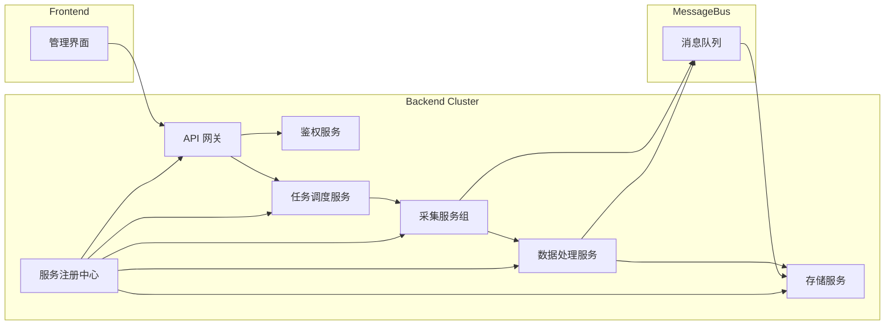

## 详细需求说明

### 1. 功能需求

1. **协议适配**：

   * 支持 OPC UA 客户端/订阅模式
   * 支持 Modbus TCP/RTU
   * 支持 MQTT 发布/订阅
   * 支持主流 PLC 驱动：西门子 S7 系列、Rockwell Allen-Bradley（ControlLogix/CompactLogix）、三菱 MELSEC、欧姆龙 Sysmac、施耐德 Modicon、松下 FP 系列 等
   * 支持自定义协议插件

2. **任务管理**：

   * 数据采集任务配置（采样周期、点位列表、过滤条件）
   * 任务启停、调度策略

3. **数据处理**：

   * 实时数据缓存与批量写入
   * 数据清洗与转化规则
   * 异常检测与告警

4. **存储层**：

   * 支持关系型数据库（MySQL、SQL Server、SQLite）
   * 支持时序数据库（InfluxDB）
   * 插件化驱动接口

5. **系统管理**：

   * 用户与角色管理
   * 权限控制（基于菜单、接口粒度）
   * 操作审计与日志查询

6. **监控与报表**：

   * 实时监控仪表盘
   * 任务状态与性能指标
   * 数据报表与导出

### 2. 非功能需求

* **性能**：支持单实例每秒 10,000 点数据采集，分布式可扩展。
* **可靠性**：支持重试、断点续采、持久化队列。
* **可用性**：系统可用率 ≥ 99.9%。
* **可维护性**：模块化设计，代码覆盖率 ≥ 80%。
* **安全性**：采用 HTTPS，支持 OAuth2/JWT。
* **可扩展性**：协议、数据库、业务逻辑插件化。

---

## 整体架构说明

