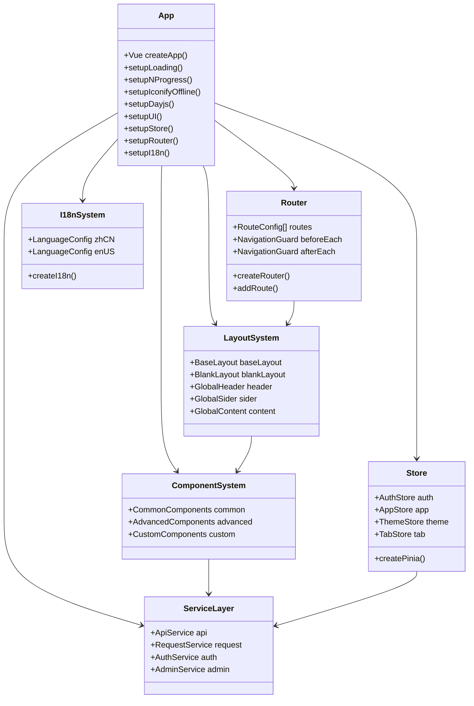
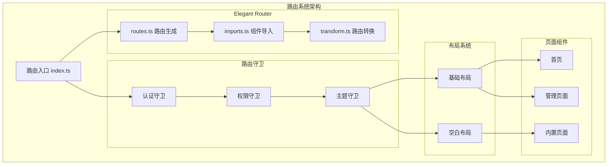
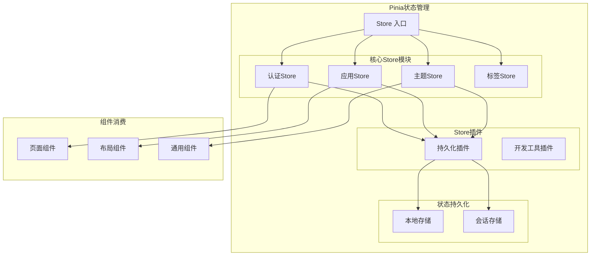
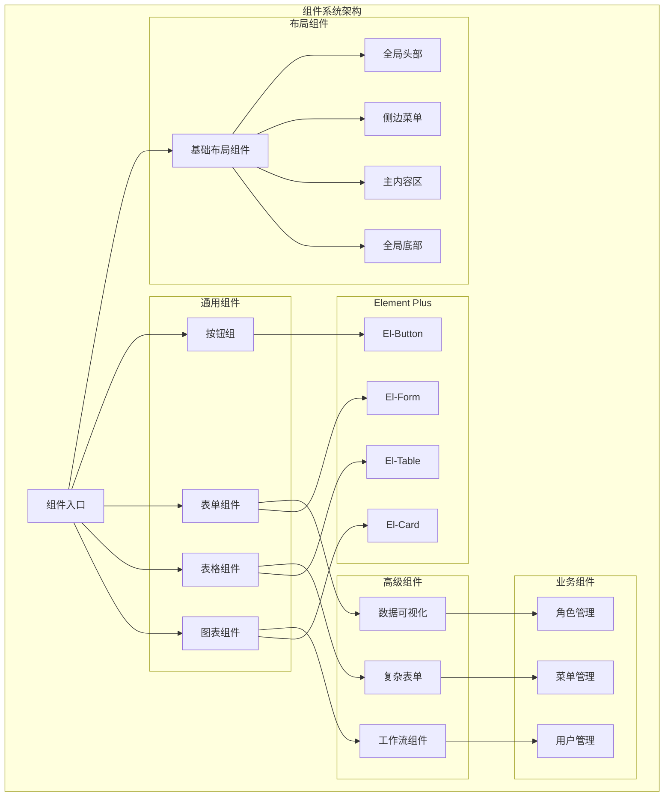
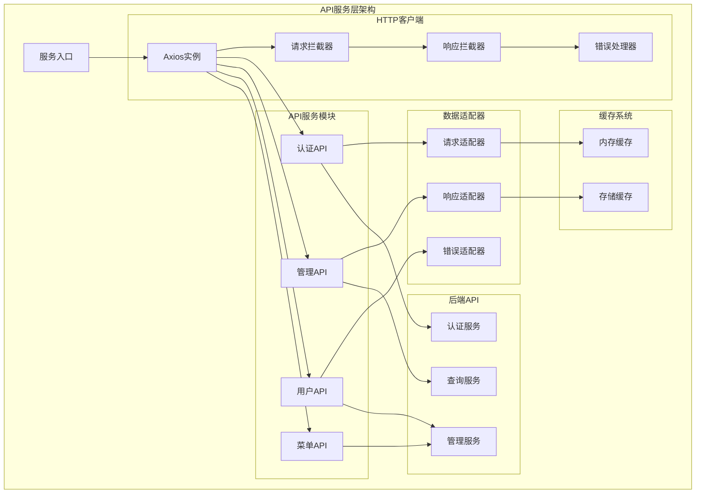
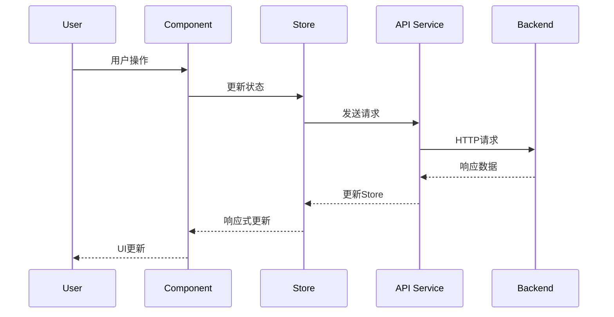
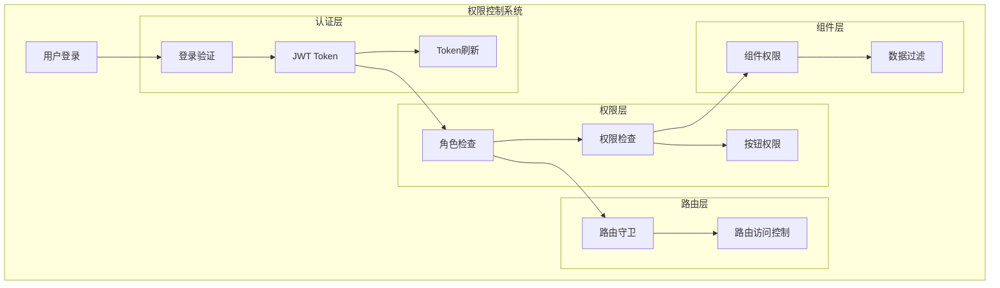
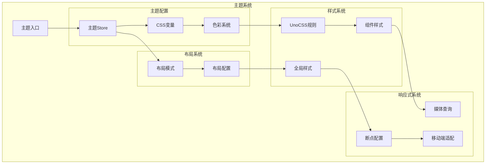
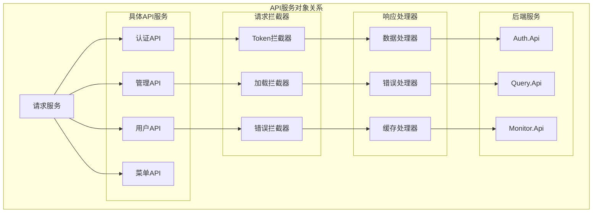
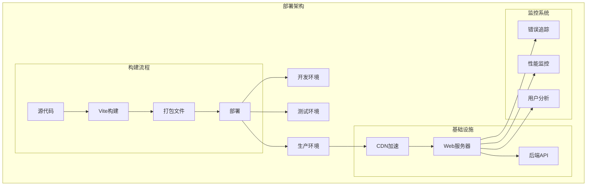

# 前端项目结构和文件说明

## 项目概述

本项目是基于 **Vue 3 + TypeScript + Element Plus + UnoCSS** 的现代化前端管理系统，专为工业数据采集系统设计。项目采用了 **soybean-admin** 框架作为基础架构，具有清新优雅的界面设计和完善的功能模块。

### 技术栈

- **框架**: Vue 3.5.20 + TypeScript 5.8.3
- **构建工具**: Vite 7.1.4
- **UI组件库**: Element Plus 2.11.1
- **CSS框架**: UnoCSS 66.5.0
- **路由**: Vue Router 4.5.1 + @elegant-router/vue 0.3.8
- **状态管理**: Pinia 3.0.3
- **国际化**: Vue I18n 11.1.11
- **图表库**: ECharts 6.0.0、@antv/g2 5.4.0、@visactor/vchart 2.0.4
- **工具库**: @vueuse/core、dayjs、lodash等

## 项目目录结构

```
frontend/
├── .editorconfig           # 编辑器配置
├── .env                   # 环境变量配置文件
├── .env.prod              # 生产环境配置
├── .env.test              # 测试环境配置
├── .gitignore             # Git忽略文件
├── .npmrc                 # NPM配置
├── eslint.config.js       # ESLint配置
├── package.json           # 项目依赖和脚本
├── pnpm-lock.yaml         # 依赖锁定文件
├── tsconfig.json          # TypeScript配置
├── uno.config.ts          # UnoCSS配置
├── vite.config.ts         # Vite构建配置
├── index.html             # HTML入口文件
├── build/                 # 构建脚本和配置
├── dist/                  # 构建输出目录
├── docs/                  # 项目文档
├── public/                # 静态资源目录
├── packages/              # 内部包目录
│   ├── axios/            # HTTP请求封装
│   ├── color/            # 颜色工具
│   ├── hooks/            # 组合式函数
│   ├── materials/        # 物料组件
│   └── utils/            # 工具函数
└── src/                   # 源代码目录
    ├── main.ts           # 应用入口
    ├── App.vue           # 根组件
    ├── assets/           # 静态资源
    ├── components/       # 全局组件
    ├── constants/        # 常量定义
    ├── enum/             # 枚举定义
    ├── hooks/            # 组合式函数
    ├── layouts/          # 布局组件
    ├── locales/          # 国际化
    ├── plugins/          # 插件配置
    ├── router/           # 路由配置
    ├── service/          # API服务
    ├── service-alova/    # Alova请求库封装
    ├── store/            # 状态管理
    ├── styles/           # 样式文件
    ├── theme/            # 主题配置
    ├── typings/          # 类型定义
    ├── utils/            # 工具函数
    └── views/            # 页面组件
```

## 详细目录说明

### 根目录配置文件

#### 构建和开发配置
- **`vite.config.ts`**: Vite构建工具的核心配置，包含插件配置、路径别名、代理设置等
- **`uno.config.ts`**: UnoCSS原子化CSS框架配置，定义自定义样式规则
- **`tsconfig.json`**: TypeScript编译配置，定义类型检查规则和编译选项

#### 代码质量和格式化
- **`eslint.config.js`**: ESLint代码检查配置，确保代码质量和风格一致性
- **`.editorconfig`**: 编辑器配置，统一不同编辑器的代码格式

#### 环境配置
- **`.env`**: 基础环境变量
- **`.env.test`**: 测试环境变量
- **`.env.prod`**: 生产环境变量

#### 包管理
- **`package.json`**: 项目元信息、依赖管理、脚本定义
- **`pnpm-lock.yaml`**: 依赖版本锁定，确保依赖版本一致性
- **`.npmrc`**: NPM/PNPM配置文件

### src/ 源代码目录详解

#### 应用入口 (`main.ts`)
```typescript
// 应用初始化流程
async function setupApp() {
  setupLoading();        // 加载动画
  setupNProgress();      // 进度条
  setupIconifyOffline(); // 图标系统
  setupDayjs();          // 日期处理
  
  const app = createApp(App);
  
  setupUI(app);          // UI组件库
  setupStore(app);       // 状态管理
  await setupRouter(app); // 路由系统
  setupI18n(app);        // 国际化
  
  app.mount('#app');
}
```

#### 路由系统 (`router/`)
- **`index.ts`**: 路由主入口，整合所有路由配置
- **`elegant/`**: 优雅路由系统
  - **`imports.ts`**: 自动导入的路由组件映射
  - **`routes.ts`**: 生成的路由配置
  - **`transform.ts`**: 路由转换逻辑
- **`guard/`**: 路由守卫，处理权限验证、登录检查等
- **`routes/`**: 路由定义文件

#### 状态管理 (`store/`)
- **`index.ts`**: Pinia store主入口
- **`modules/`**: 各功能模块的状态管理
  - **`auth/`**: 用户认证状态
  - **`app/`**: 应用全局状态
  - **`theme/`**: 主题配置状态
  - **`tab/`**: 标签页状态
- **`plugins/`**: Pinia插件配置

#### 布局系统 (`layouts/`)
- **`base-layout/`**: 基础布局组件
  - **`index.vue`**: 主布局容器
  - **`modules/`**: 布局模块组件
    - **`global-header/`**: 全局头部
    - **`global-sider/`**: 侧边栏
    - **`global-content/`**: 主内容区域
    - **`global-footer/`**: 全局底部
- **`blank-layout/`**: 空白布局（用于登录页等）

#### 页面组件 (`views/`)
- **`home/`**: 首页仪表板
- **`manage/`**: 系统管理模块
  - **`menu/`**: 菜单管理
  - **`role/`**: 角色管理  
  - **`user/`**: 用户管理
- **`_builtin/`**: 内置页面
  - **`login/`**: 登录页面
  - **`403/404/500`**: 错误页面
  - **`iframe-page/`**: 内嵌页面

#### API服务层 (`service/`)
- **`api/`**: API接口定义
  - **`admin.ts`**: 管理相关API
  - **`auth.ts`**: 认证相关API
- **`request/`**: HTTP请求封装
- **`adapter/`**: 适配器模式实现

#### 组件系统 (`components/`)
- **`common/`**: 通用组件
- **`advanced/`**: 高级组件
- **`custom/`**: 自定义业务组件

#### 样式系统 (`styles/`)
- **`css/`**: CSS样式文件
- **`scss/`**: SCSS样式文件
- **`reset.scss`**: 样式重置
- **`global.scss`**: 全局样式

#### 国际化 (`locales/`)
- **`index.ts`**: 国际化配置入口
- **`langs/`**: 语言包
  - **`zh-cn.ts`**: 中文语言包
  - **`en-us.ts`**: 英文语言包

#### 工具和配置
- **`utils/`**: 工具函数库
- **`hooks/`**: Vue 3组合式API封装
- **`constants/`**: 常量定义
- **`enum/`**: 枚举类型定义
- **`typings/`**: TypeScript类型定义
- **`plugins/`**: 插件配置和初始化
- **`theme/`**: 主题配置文件

## 系统架构图

### 整体架构类图



### 路由系统架构图



### 状态管理架构图



### 组件系统架构图



### 服务层架构图



## 核心功能模块

### 1. 认证与权限系统
- **JWT令牌管理**: 自动刷新、过期处理
- **角色权限控制**: RBAC模型实现
- **路由守卫**: 页面访问权限控制
- **按钮级权限**: 细粒度操作权限

### 2. 主题系统
- **多主题切换**: 亮色/暗色/自动跟随系统
- **自定义主题色**: 支持动态主题色配置
- **布局模式**: 多种布局模式可选
- **响应式设计**: 适配不同屏幕尺寸

### 3. 国际化系统
- **多语言支持**: 中文/英文切换
- **动态语言加载**: 按需加载语言包
- **类型安全**: TypeScript类型提示
- **自动翻译**: 支持翻译函数

### 4. 路由系统
- **文件系统路由**: 基于文件结构自动生成路由
- **路由懒加载**: 按需加载页面组件
- **嵌套路由**: 支持多层级路由结构
- **路由缓存**: KeepAlive页面状态保持

### 5. 状态管理
- **模块化Store**: 按功能模块组织状态
- **状态持久化**: 重要状态自动持久化
- **类型安全**: 完整的TypeScript支持
- **插件系统**: 可扩展的插件架构

## 开发工作流

### 1. 开发环境启动
```bash
# 安装依赖
pnpm install

# 启动开发服务器
pnpm dev

# 代码检查
pnpm lint

# 类型检查
pnpm typecheck
```

### 2. 构建部署
```bash
# 测试环境构建
pnpm build:test

# 生产环境构建
pnpm build

# 预览构建结果
pnpm preview
```

### 3. 代码规范
- **ESLint**: 代码质量检查
- **Prettier**: 代码格式化
- **TypeScript**: 类型检查
- **Git Hooks**: 提交前自动检查

## 扩展指南

### 1. 添加新页面
1. 在 `src/views/` 下创建页面组件
2. 路由会自动生成（基于文件结构）
3. 添加相应的多语言配置
4. 配置页面权限（如需要）

### 2. 添加新API
1. 在 `src/service/api/` 下定义API接口
2. 配置请求/响应类型
3. 添加错误处理逻辑
4. 编写API文档

### 3. 添加新组件
1. 在 `src/components/` 下创建组件
2. 编写组件文档和示例
3. 添加单元测试
4. 导出组件供使用

### 4. 主题定制
1. 修改 `src/theme/` 下的主题配置
2. 自定义CSS变量
3. 配置UnoCSS规则
4. 测试多主题兼容性

## 性能优化

### 1. 构建优化
- **代码分割**: 路由级别的代码分割
- **Tree Shaking**: 移除未使用代码
- **资源压缩**: Gzip/Brotli压缩
- **缓存策略**: 长期缓存配置

### 2. 运行时优化
- **虚拟滚动**: 大数据列表优化
- **图片懒加载**: 延迟加载图片资源
- **组件缓存**: KeepAlive缓存策略
- **内存管理**: 及时清理不需要的监听器

### 3. 用户体验优化
- **加载状态**: 优雅的加载动画
- **错误处理**: 友好的错误提示
- **离线支持**: PWA离线缓存
- **响应式设计**: 移动端适配

## 最佳实践

### 1. 代码组织
- **模块化**: 按功能模块组织代码
- **单一职责**: 每个模块职责清晰
- **依赖管理**: 合理管理模块依赖
- **文档完善**: 重要模块添加文档

### 2. 性能考虑
- **懒加载**: 非首屏组件懒加载
- **缓存策略**: 合理使用缓存
- **资源优化**: 图片和静态资源优化
- **Bundle分析**: 定期分析包体积

### 3. 维护性
- **类型安全**: 充分利用TypeScript
- **测试覆盖**: 关键功能添加测试
- **代码审查**: 代码提交前审查
- **版本管理**: 语义化版本控制

## 关键文件详细说明

### 已定制的业务文件

#### 路由相关文件（用户已修改）

**`src/router/elegant/imports.ts`**
```typescript
// 自动生成的路由组件导入映射
export const views: Record<LastLevelRouteKey, RouteComponent> = {
  // 系统管理模块
  manage_menu: () => import("@/views/manage/menu/index.vue"),
  manage_role: () => import("@/views/manage/role/index.vue"), 
  manage_user: () => import("@/views/manage/user/index.vue"),
  // ... 其他路由
};
```

**`src/router/elegant/routes.ts`**
- 定义了完整的路由树结构
- 包含权限控制 (`roles: ['R_ADMIN', 'R_SUPER']`)
- 支持国际化路由标题
- 配置了菜单图标和排序

**`src/router/elegant/transform.ts`**
- 路由转换逻辑，将文件系统路由转换为Vue Router配置
- 处理嵌套路由和动态路由
- 实现路由懒加载

#### 国际化配置（用户已修改）

**`src/locales/langs/zh-cn.ts`**
```typescript
const local: App.I18n.Schema = {
  system: {
    title: '工业数据采集系统', // 定制的系统标题
    // ... 其他系统配置
  },
  route: {
    manage: '系统管理',
    manage_user: '用户管理',
    manage_role: '角色管理', 
    manage_menu: '菜单管理'
    // ... 路由相关翻译
  }
  // ... 其他多语言配置
};
```

**`src/locales/langs/en-us.ts`**
- 对应的英文翻译配置
- 保持与中文配置结构一致

### 核心架构文件分析

#### 应用入口 (`src/main.ts`)
```typescript
async function setupApp() {
  // 1. 初始化基础功能
  setupLoading();        // 全局加载状态
  setupNProgress();      // 页面切换进度条
  setupIconifyOffline(); // 离线图标系统
  setupDayjs();          // 日期时间处理
  
  const app = createApp(App);
  
  // 2. 配置应用插件
  setupUI(app);          // Element Plus + 自定义组件
  setupStore(app);       // Pinia 状态管理
  await setupRouter(app); // Vue Router + 权限控制
  setupI18n(app);        // Vue I18n 国际化
  
  // 3. 挂载应用
  setupAppVersionNotification(); // 版本更新通知
  app.mount('#app');
}
```

#### 状态管理 (`src/store/modules/auth/index.ts`)
```typescript
export const useAuthStore = defineStore(SetupStoreId.Auth, () => {
  // 认证状态
  const token = ref(getToken());
  const userInfo = reactive({
    userId: '', userName: '', roles: [], buttons: []
  });
  
  // 计算属性
  const isLogin = computed(() => Boolean(token.value));
  const isStaticSuper = computed(() => {
    return userInfo.roles.includes(VITE_STATIC_SUPER_ROLE);
  });
  
  // 登录方法
  async function login(userName: string, password: string) {
    startLoading();
    const { data: loginToken, error } = await fetchLogin(userName, password);
    // ... 处理登录逻辑
  }
  
  // 退出登录
  async function logout() {
    await resetStore();
  }
});
```

#### 布局系统 (`src/layouts/base-layout/index.vue`)
```vue
<template>
  <AdminLayout
    :mode="layoutMode"
    :scroll-el-id="LAYOUT_SCROLL_EL_ID"
    :scroll-mode="themeStore.layout.scrollMode"
  >
    <!-- 头部区域 -->
    <template #header>
      <GlobalHeader v-bind="headerProps" />
    </template>
    
    <!-- 侧边栏 -->
    <template #sider="slotProps">
      <GlobalSider v-bind="slotProps" />
    </template>
    
    <!-- 标签页 -->
    <template #tab>
      <GlobalTab />
    </template>
    
    <!-- 主内容区 -->
    <template #content>
      <GlobalContent />
    </template>
    
    <!-- 底部 -->
    <template #footer>
      <GlobalFooter />
    </template>
  </AdminLayout>
</template>
```

### 业务组件架构

#### 菜单管理组件 (`src/views/manage/menu/index.vue`)
```vue
<script setup lang="ts">
// 组件采用 Composition API + TypeScript
defineOptions({ name: 'ManageMenu' });

// 响应式数据
const loading = ref(false);
const data = ref([...]); // 菜单数据
const pagination = ref({...}); // 分页配置
const columnChecks = ref([...]); // 列显示配置

// 业务方法
function handleAdd() { /* 新增逻辑 */ }
function handleEdit(item: any) { /* 编辑逻辑 */ }
function handleDelete(id: string) { /* 删除逻辑 */ }

// 标签渲染方法
function getMenuTypeTag(type: string) {
  const map = {
    '1': { type: 'info' as const, text: '目录' },
    '2': { type: 'primary' as const, text: '菜单' }
  };
  return map[type as keyof typeof map] || { type: 'info' as const, text: '未知' };
}
</script>

<template>
  <!-- ElCard 布局 -->
  <ElCard class="card-wrapper">
    <template #header>
      <!-- 操作按钮组 -->
      <div class="flex items-center justify-between">
        <p>菜单管理</p>
        <div class="flex items-center gap-2">
          <!-- 列设置、批量删除、新增、刷新按钮 -->
        </div>
      </div>
    </template>
    
    <!-- 数据表格 -->
    <ElTable :data="data" row-key="id">
      <!-- 表格列定义 -->
    </ElTable>
    
    <!-- 分页组件 -->
    <ElPagination v-model:current-page="pagination.currentPage" />
  </ElCard>
</template>
```

### 数据流架构图



### 权限控制架构图



### 主题系统架构图



### API服务对象图



## 技术特色和创新点

### 1. 优雅路由系统 (Elegant Router)
- **文件系统路由**: 基于文件结构自动生成路由配置
- **类型安全**: 完整的TypeScript类型推导
- **约定优于配置**: 减少样板代码，提升开发效率

### 2. 原子化CSS (UnoCSS)
- **按需生成**: 只生成实际使用的CSS规则
- **高性能**: 比传统CSS框架更小的包体积
- **灵活配置**: 支持自定义规则和变体

### 3. 组合式API架构
- **逻辑复用**: 通过Composables实现逻辑复用
- **类型安全**: 充分利用TypeScript类型系统
- **响应式**: Vue 3的响应式系统提供更好的性能

### 4. 插件化架构
- **模块化**: 每个功能模块独立，易于维护
- **可扩展**: 支持插件式扩展新功能
- **配置化**: 通过配置文件控制功能开关

## 部署架构图



## 总结

本前端项目采用了现代化的技术栈和工程化实践，具有良好的可维护性和扩展性。通过模块化的架构设计，清晰的目录结构，完善的类型系统，为工业数据采集系统提供了强大的前端支撑。

### 项目核心特点

1. **技术先进性**
   - Vue 3 + TypeScript + Vite等最新技术栈
   - 优雅路由系统实现文件系统路由
   - UnoCSS原子化CSS框架
   - Element Plus现代化UI组件库

2. **架构清晰性**
   - 分层架构，职责明确
   - 模块化设计，高内聚低耦合
   - 插件化架构，易于扩展
   - 组合式API，逻辑复用

3. **开发友好性**
   - 完善的开发工具链和调试支持
   - 类型安全的开发体验
   - 热重载和快速构建
   - 规范的代码质量控制

4. **用户体验优秀**
   - 现代化UI设计和交互体验
   - 多主题支持和国际化
   - 响应式设计，全平台适配
   - 性能优化，快速加载

5. **可维护性强**
   - 规范的代码结构和文档完善
   - 模块化状态管理
   - 完整的错误处理机制
   - 可扩展的组件体系

### 适用场景

本架构特别适合：
- **企业级管理系统**: 复杂的业务逻辑和权限控制
- **数据可视化平台**: 丰富的图表组件和实时更新
- **工业IoT系统**: 设备管理和数据监控
- **中后台应用**: 标准的CRUD操作和流程管理

通过这套完整的前端解决方案，能够快速构建功能丰富、性能优秀、易于维护的现代化Web应用。
